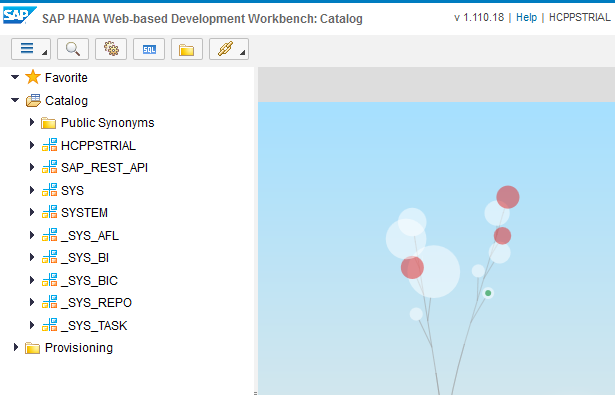

## Prerequisites
  - **Proficiency:** Beginner
  - **Tutorials:** [Setup a HANA user account](https://www.sap.com/developer/tutorials/hcpps-hana-create-user.html)

## Next Steps
- [Enable, deploy and configure the SAP Predictive services](https://www.sap.com/developer/tutorials/hcpps-ps-configure.html)

## Details

These datasets are part of the samples provided with the SAP Predictive Analytics software available as a 30 days trial: [SAP Predictive Analytics trial link](https://www.sap.com/trypredictive).

In order to ease the import, the raw data were transformed into SQL files with the relevant create and insert statement for SAP HANA.

These SQL files are available on the SAP Tutorial public [GitHub repository](https://github.com/SAPDocuments/Tutorials/tree/master/tutorials/hcpps-hana-dataset-import/sql).

Make sure you check the [LICENSE](https://github.com/SAPDocuments/Tutorials/blob/master/LICENSE.txt) before starting using its content.

### You will learn
  - How to import the scenarios datasets in your SAP Cloud Platform HANA MDC instance.

### Time to Complete
  **5 minutes**

[ACCORDION-BEGIN [Step 1: ](Import the table structure in SAP HANA)]

During this tutorial series, you will be able to address multiple services using different datasets.

We could have used the HANA Studio import feature, but this would assume that you have it installed.  

Due to restrictions related to the resources, format and size that can be made available on the tutorial platform, it was required to split some of the data into several chunks.  

But first we need to create the tables.

Open the ***SAP HANA Web-based Development Workbench*** on your trial HANA instance connected as **`PSTRIAL`**, click on **Catalog**.

Click on the **Open SQL Console**  icon or press CTRL+ALT+C.

Download the file from the following [`link`](https://raw.githubusercontent.com/SAPDocuments/Tutorials/master/tutorials/hcpps-hana-dataset-import/sql/demo.create.structure.sql).

Copy and paste the content of the files in the SQL console. You can alternatively open the file using the  icon in the menu bar.

Click on the **Run**  button or press F8.

Right click on **Catalog**, then click on **Refresh**.

A **`PSDEMO`** schema should appear in the list.

[ACCORDION-END]

[ACCORDION-BEGIN [Step 2: ](Import the dataset)]

Depending on your area of interest you can pick those of interest and download the files locally.

  - **Cash Flow**: contains historical cash flow data and date related indicators.
  This dataset is meant to be used by the **Forecast** service only.
    - [`link`](https://raw.githubusercontent.com/SAPDocuments/Tutorials/master/tutorials/hcpps-hana-dataset-import/sql/demo.insert.cashflow.sql)
  - **Census**: contains 14 characteristics of an individual extracted from a census dataset associated to an indicator equal to 1 when the individual earned more than fifty thousand dollars the previous year, else 0 (excerpt from the American Census Bureau database, completed in 1994 by Barry Becker, source: http://www.census.gov/)
  This dataset is meant to be used by the **Key Influencers**, **Outliers**, **Clustering**, **What-if** & **Scoring Equation** services.
    - [`link 1`](https://raw.githubusercontent.com/SAPDocuments/Tutorials/master/tutorials/hcpps-hana-dataset-import/sql/demo.insert.census.1.sql)
    - [`link 2`](https://raw.githubusercontent.com/SAPDocuments/Tutorials/master/tutorials/hcpps-hana-dataset-import/sql/demo.insert.census.2.sql)
    - [`link 3`](https://raw.githubusercontent.com/SAPDocuments/Tutorials/master/tutorials/hcpps-hana-dataset-import/sql/demo.insert.census.3.sql)
    - [`link 4`](https://raw.githubusercontent.com/SAPDocuments/Tutorials/master/tutorials/hcpps-hana-dataset-import/sql/demo.insert.census.4.sql)
    - [`link 5`](https://raw.githubusercontent.com/SAPDocuments/Tutorials/master/tutorials/hcpps-hana-dataset-import/sql/demo.insert.census.5.sql)
  - **E-Commerce**: contains a single day of Web traffic from an E-commerce site in December 1999.
  This dataset is meant to be used by the **Recommendation** service only.
    - [`link`](https://raw.githubusercontent.com/SAPDocuments/Tutorials/master/tutorials/hcpps-hana-dataset-import/sql/demo.insert.transaction.sql).

Open the ***SAP HANA Web-based Development Workbench*** on your trial HANA instance connected as **`PSTRIAL`**, click on **Catalog**.

Click on the **Open SQL Console**  icon or press CTRL+ALT+C.

Download the dataset files for the services you to try out.

Copy and paste the content of the files you want to import in the SQL console (and for those using chunks, please make sure you respect the name order/sequence).

You can alternatively open the file using the  icon in the menu bar.

Click on the **Run**  button or press F8.

> **Note**: Each files may take a few seconds to process (up to a minute each sometime), so if Google Chrome tells you that your page is "unresponsive", just ask him to wait.

[ACCORDION-END]

## Next Steps
- [Enable, deploy and configure the SAP Predictive services](https://www.sap.com/developer/tutorials/hcpps-ps-configure.html)
