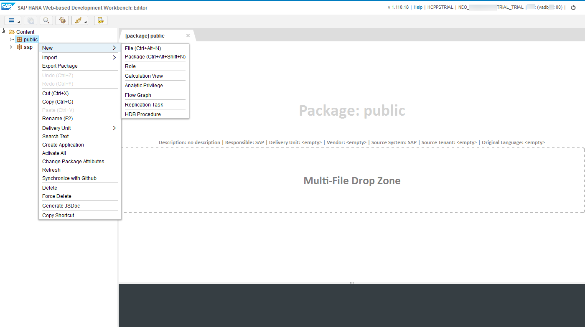
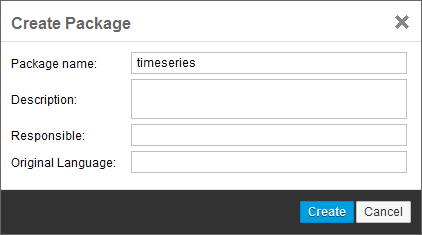
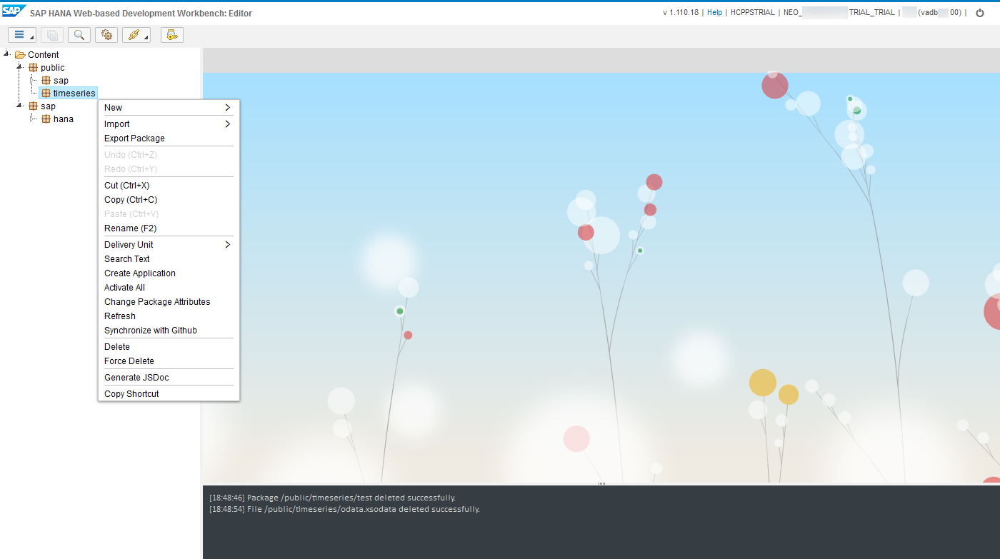
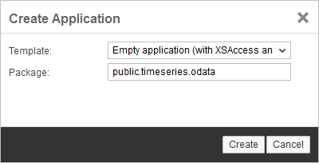
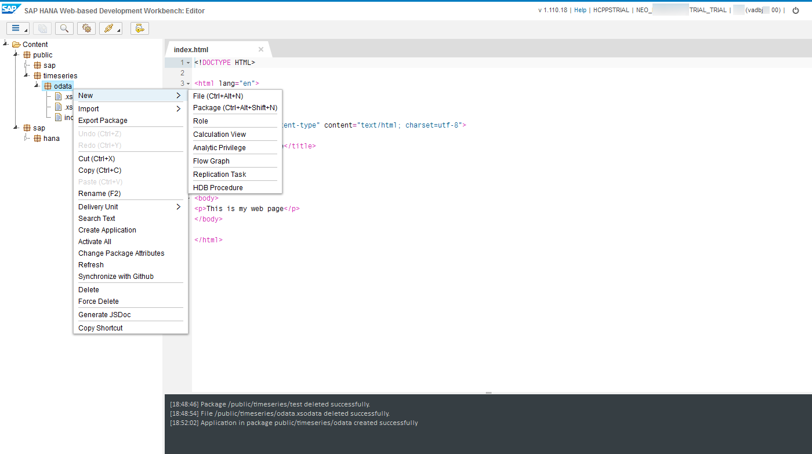
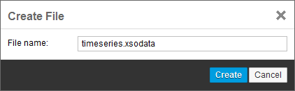
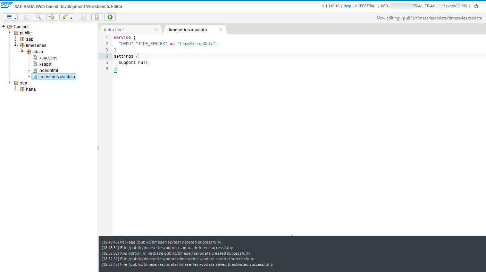
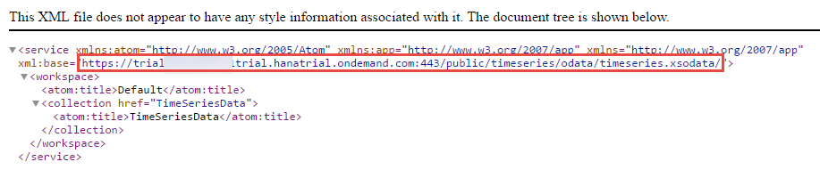

## Prerequisites
  - **Proficiency:** Beginner
  - **Tutorials:** [Import a predictive demo dataset in your SAP HANA](http://go.sap.com/developer/tutorials/hcpps-hana-dataset-import.html)

## Next Steps
  - [Enable, deploy and configure the SAP HCP predictive services](http://go.sap.com/developer/tutorials/hcpps-ps-configure.html)

## Details
### You will learn
  - How to use the create an ***OData*** service to expose a table stored in the HANA HCP instance

### Time to Complete
  **5 minutes**

---

1. Open the ***SAP HANA Web-based Development Workbench*** on your trial HANA instance connected `HANA User Account`, click on **Editor**.

    

1. Right click on **public**, then navigate the menu **New** > **Package**.

    

1. Complete the form following properties:

    - ***Package Name***: `timeseries`

    Click on **Create**

    

1. Right click on `timeseries`, then click on **Create Application**.

    

1. Complete the form following properties:

    - ***Package***: `public.timeseries.odata`

    Click on **Create**

    

1. Right click on `odata`, then navigate the menu **New** > **File**.

    

1. Complete the form following properties:

    - ***File Name***: `timeseries.xsodata`

    Click on **Create**

    

1. Enter the following code in the file:

    ```
    service {
      "DEMO"."TIME_SERIES" as "TimeSeriesData";
    }
    settings {
      support null;
    }
    ```

    This is the OData Service declaration for the `TIMESERIES` table located in the `DEMO` schema which we will now reference as `TimeSeriesData`

    Click on the  button in the top menu bar

    

1. You can now test your service by clicking on the  button in the top menu bar.

    This will list all the services defined in your `xsodata` file.

    

    Later, you will be using this OData service, so you should save the highlighted URL in a notepad as your ***OData Service URL***.

## Next Steps
  - [Enable, deploy and configure the SAP HCP predictive services](http://go.sap.com/developer/tutorials/hcpps-ps-configure.html)

