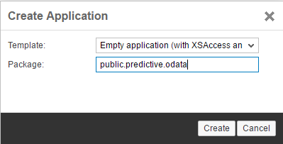
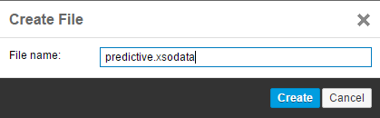
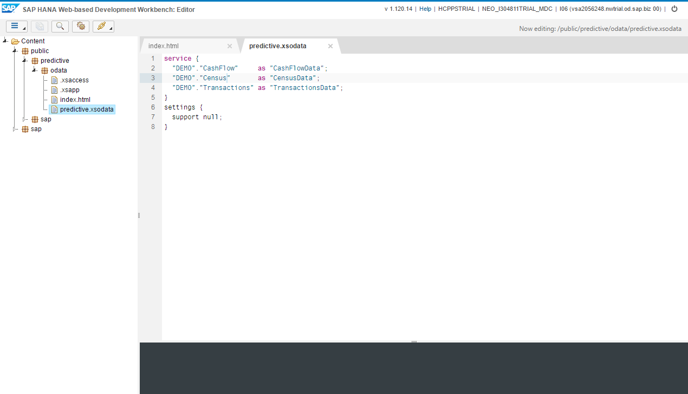
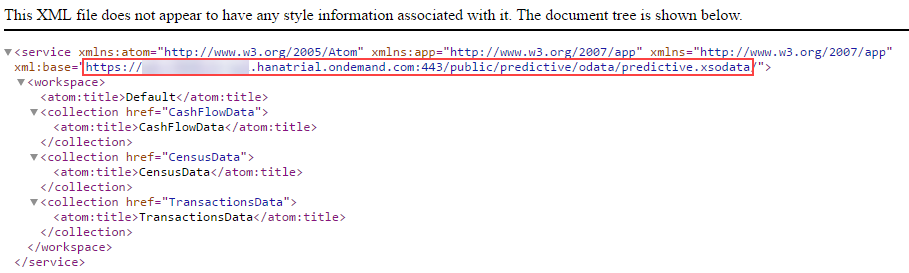

## Prerequisites
  - **Proficiency:** Beginner
  - **Tutorials:** [Import a predictive demo dataset in your SAP HANA](http://www.sap.com/developer/tutorials/hcpps-hana-dataset-import.html)

## Next Steps
  - [Enable, deploy and configure the SAP Cloud Platform predictive services](http://www.sap.com/developer/tutorials/hcpps-ps-configure.html)

## Details
### You will learn
  - How to create a HANA XS OData services to expose table data stored in a SAP Cloud Platform HANA MDC instance

>**Note:**
  - The HANA XS OData service will be used in a SAPUI5 application to render the data in a graph or a table, and is not used by the predictive services.
  - The predictive services only consumes data stored inside of your HANA instances.**

### Time to Complete
  **5 minutes**

[ACCORDION-BEGIN [Step 1: ](Open the Content Editor)]

Open the ***SAP HANA Web-based Development Workbench*** on your trial HANA instance connected **HANA User Account**, click on **Editor**.


[DONE]
[ACCORDION-END]

[ACCORDION-BEGIN [Step 2: ](Create an empty HANA application)]
Right click on **Content**, then click on **Create Application**.


Complete the form following properties:

  - ***Package***: `public.predictive.odata`

Click on **Create**



[DONE]
[ACCORDION-END]

[ACCORDION-BEGIN [Step 3: ](Create a HANA XS OData service)]
Expand the tree structure and reach the `public.predictive.odata` package.

Right click on `odata`, then navigate the menu **New** > **File**.

Complete the form following properties:

  - ***File Name***: `predictive.xsodata`

Click on **Create**



Enter the following code in the file:

```js
service {
  "DEMO"."CashFlow"     as "CashFlowData";
  "DEMO"."Census"       as "CensusData";
  "DEMO"."Transactions" as "TransactionsData";
}
settings {
  support null;
}
```

>**Note**: if you didn't import all the datasets provided in the previous step, then when saving the file, it will not get activated, and the console will show you an error message.

-

[DONE]
[ACCORDION-END]

[ACCORDION-BEGIN [Step 4: ](Test the HANA XS OData service)]
Click on the  button in the top menu bar



You can now test your service by clicking on the  button in the top menu bar.

This will list all the services defined in your `xsodata` file.

```
<service xmlns:atom="http://www.w3.org/2005/Atom" xmlns:app="http://www.w3.org/2007/app" xmlns="http://www.w3.org/2007/app" xml:base="https://mdcxxxxxxxxxtrial.hanatrial.ondemand.com:443/public/predictive/odata/predictive.xsodata/">
  <workspace>
    <atom:title>Default</atom:title>
    <collection href="CashFlowData">
      <atom:title>CashFlowData</atom:title>
    </collection>
    <collection href="CensusData">
      <atom:title>CensusData</atom:title>
    </collection>
    <collection href="TransactionsData">
      <atom:title>TransactionsData</atom:title>
    </collection>
  </workspace>
</service>
```



Later, you will be using this HANA XS OData service, so you should save the highlighted URL in a notepad as your ***HANA XS OData Service URL***.

[DONE]
[ACCORDION-END]

## Next Steps
  - [Enable, deploy and configure the SAP Cloud Platform predictive services](http://www.sap.com/developer/tutorials/hcpps-ps-configure.html)
