## Prerequisites
- **Proficiency:** Beginner
- **Tutorials:** [Expose your predictive demo dataset as HANA XS OData services](http://www.sap.com/developer/tutorials/hcpps-hana-dataset-odata.html)

## Next Steps
- If you are running on the SAP Cloud Platform trial edition, you should continue with:
  [How to update the database pool configuration of the SAP Cloud for predictive services](https://www.sap.com/developer/how-tos/2017/03/hcpps-ps-configure-dbpool.html)
- else with:
  [Install a REST client](http://www.sap.com/developer/tutorials/hcpps-rest-client-install.html)

## Details
### You will learn
- How to enable, deploy and configure the SAP Cloud for predictive services for your SAP Cloud Platform developer Account

### Time to Complete
  **10 minutes**

[ACCORDION-BEGIN [Step 1: ](Enable the Predictive Services)]
Let's go back to the [***SAP Cloud Platform Cockpit***](http://account.hanatrial.ondemand.com/cockpit) with your free trial account and access "Your Personal Developer Account".

Click on your ***SAP Cloud Platform Account name*** as highlighted on the below screenshot.

> If you are unclear with what is your SAP Cloud Platform account name, you can refer to the following blog entry: [SAP Cloud Platform login, user name, account id, name or display name: you are lost? Not anymore!](https://blogs.sap.com/2017/01/31/sap-hana-cloud-platform-trial-login-name-user-name-account-name-account-identifier-you-are-lost-not-anymore/)

-

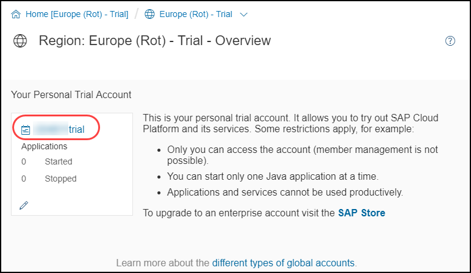

On the left side bar, click on **Services**.

Click on the **Predictive Services** tile

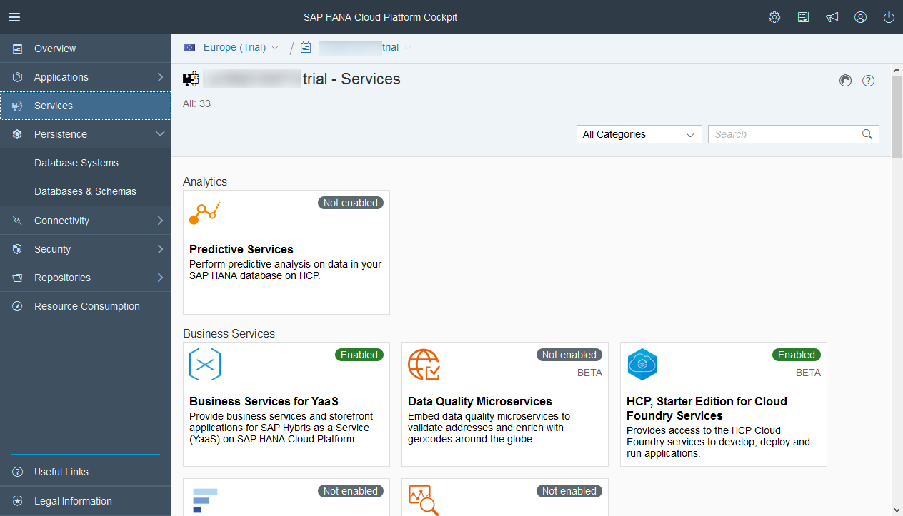

By default, the ***Predictive Services*** are not enabled.

Click on **Enable**

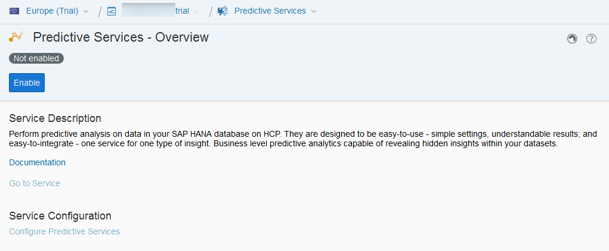

Once enable, you will need to deploy the ***Cloud for Predictive Analytics*** application.

[DONE]
[ACCORDION-END]

[ACCORDION-BEGIN [Step 2: ](Deploy the Cloud for Predictive Analytics application)]
Click on **Go To Service**

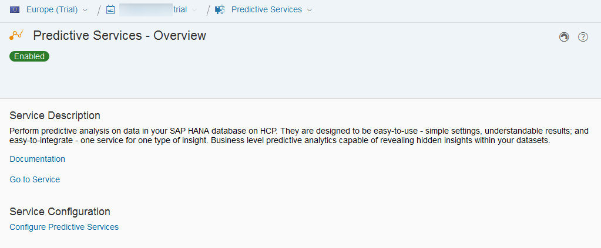

You might receive the following information message, just click on **OK**

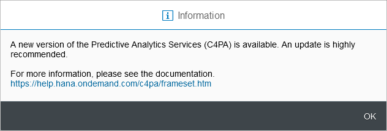

Next, you can deploy the ***Cloud for Predictive Analytics*** services application.

Click on the tile

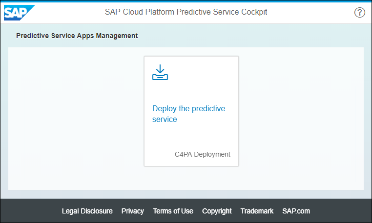

In order to deploy the ***Cloud for Predictive Analytics*** services application in your ***Your Personal Developer Account***, you  need to provide your ***SAP Cloud Platform Account Password*** as highlighted on the screenshot.

The other settings, like ***SAP Cloud Platform Account User Name***, will be filled with your current information.

Click on **Deploy**

Click on **OK** to confirm the deployment

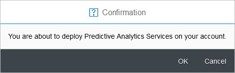

[DONE]
[ACCORDION-END]

[ACCORDION-BEGIN [Step 3: ](Configure the data source binding)]

Once deployed, you will be provided with the ***Application Dashboard*** URL.

Click on the highlighted link

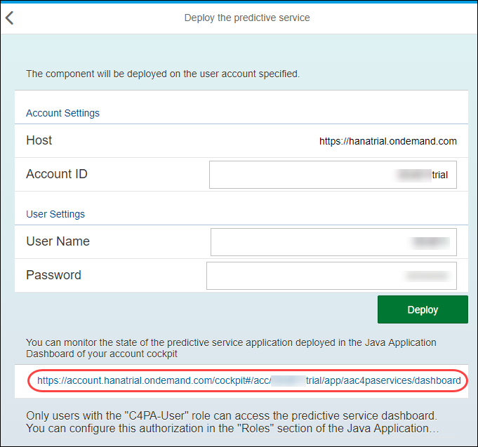

Now, you need to add you a data source binding to your trial HANA MDC instance.

On the left side bar, navigate in **Configuration**, then click on **Data Source Binding**

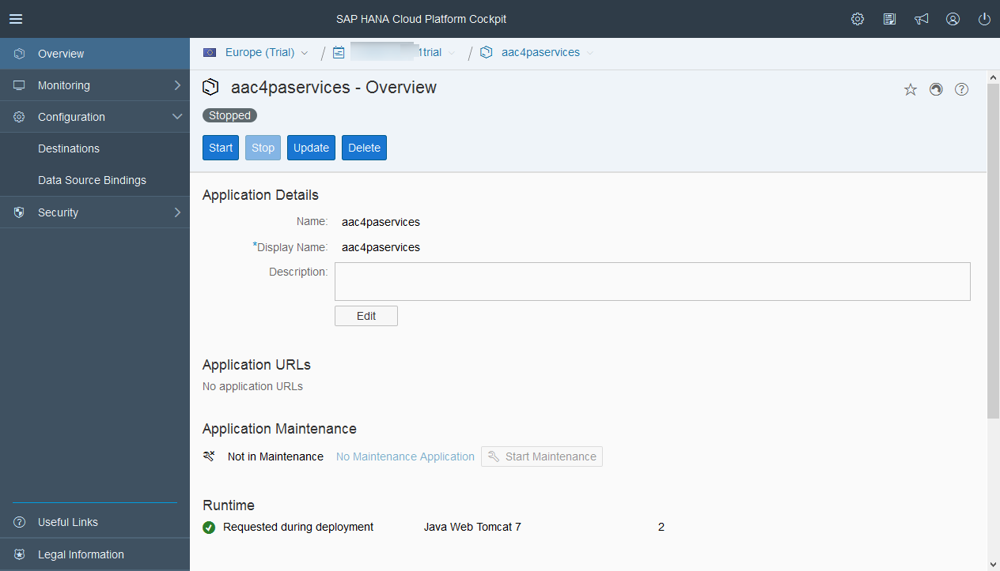

The data source binding will allow the ***Cloud for Predictive Analytics*** to locate the data to be consumed by the service and execute the ***SAP HANA Automated Predictive Library*** (`APL`) on it, but also to persist a set on internal tables.

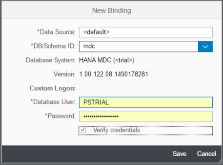

Click on **New Binding**

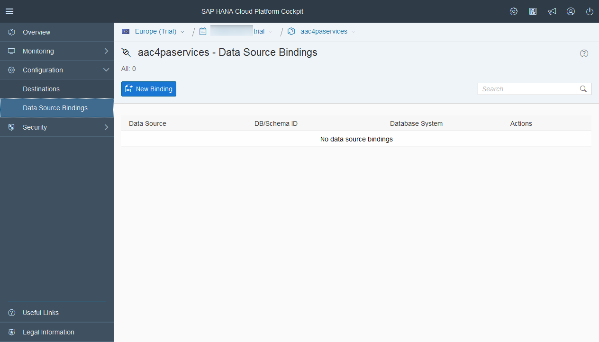

It should propose you by default your HANA MDC instance (named `mdc`) we just created.

Enter your ***HANA User Account*** login (`HCPPSTRIAL`) and password (`Welcome17Welcome17`).

Click on **Save**

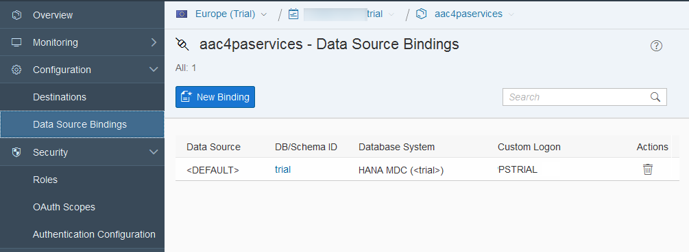

[DONE]
[ACCORDION-END]

[ACCORDION-BEGIN [Step 4: ](Assign the roles to your user)]
Now, you need to configure security settings for your ***SAP Cloud Platform Account***.

On the left side bar, navigate in **Security**, then click on **Roles**  

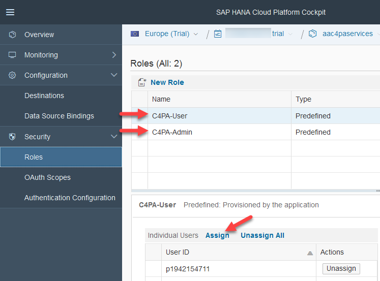

Assign the **`C4PA-User`** and **`C4PA-Admin`** roles using the **Assign** button to your SAP Cloud Platform Account User.

> If you are unclear with what is your SAP Cloud Platform account name, you can refer to the following blog entry: [SAP Cloud Platform login, user name, account id, name or display name: you are lost? Not anymore!](https://blogs.sap.com/2017/01/31/sap-hana-cloud-platform-trial-login-name-user-name-account-name-account-identifier-you-are-lost-not-anymore/)
>
> Your ***SAP Cloud Platform Account User Name*** was displayed during the ***Deploy*** step.
>
> And in case you are using a trial account, make sure you don't include the "trial" at the end.

-

The `C4PA-User` will enable your user to consume the services and the `C4PA-Admin` to administer the `C4PA` application.

[DONE]
[ACCORDION-END]

[ACCORDION-BEGIN [Step 5: ](Modify the Authentication scheme)]
Now, you need to modify the authentication schemes for the `C4PA` application.

This will simplify the way we will build a SAPUI5 application that consumes these services.

On the left side bar, navigate in **Security**, then click on **Authentication Configuration**

Click on **Activate Custom Configuration**.

Check **User name and password** and **Client certificate** for the ***FORM*** authentication scheme

Click on **Save**

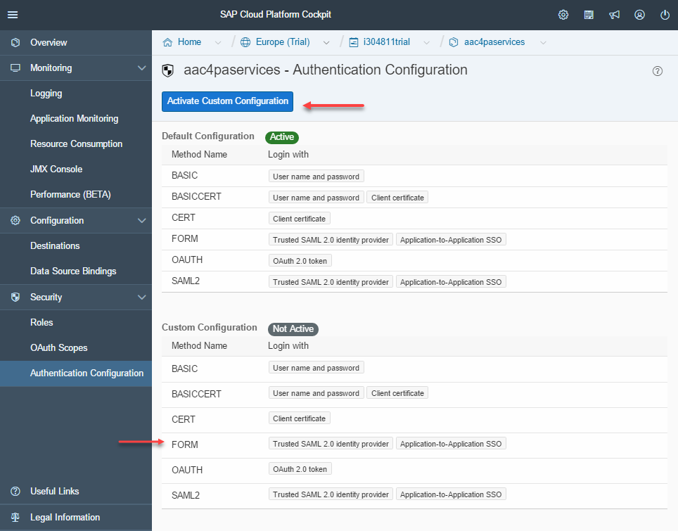

Next, you will receive next an alert regarding the fact that the changes will be applied on the next restart, which is what we will do next.

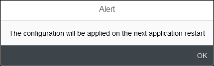

Go back to the ***Overview*** page (via the left menu bar).

Click on **Start**

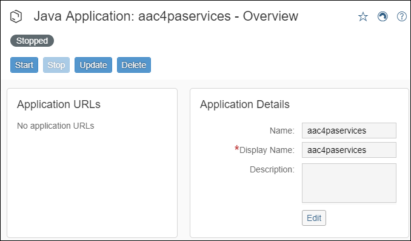

Once started, you will be provided with the **Application URLs** which will give us access to the online documentation and the administration panels.

Click on the ***Application URLs*** link

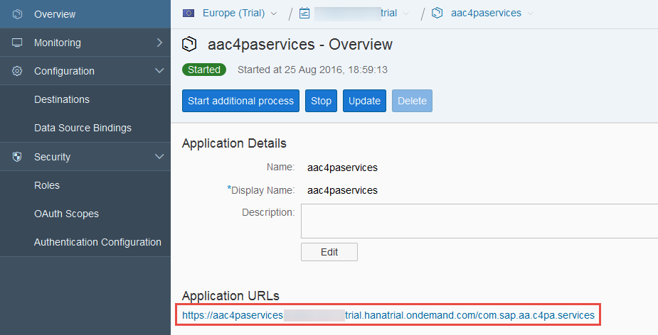

Later, you will be using the ***Application URLs***, so you should save the highlighted URL in a notepad as your ***C4PA Application URL***.

Click on the **Administration** tile

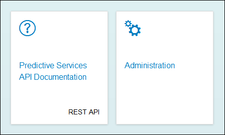

Status is green! Congrats, you have configured the SAP Cloud for predictive services on your SAP Cloud Platform account.

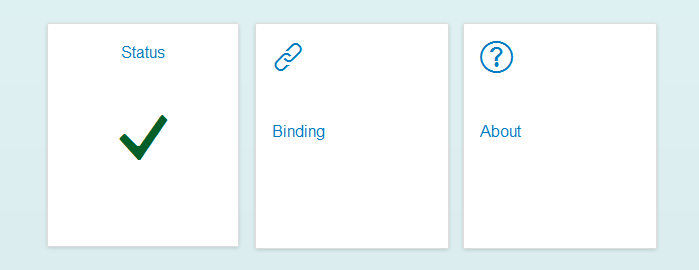   

[DONE]
[ACCORDION-END]

## Next Steps
- If you are running on the SAP Cloud Platform trial edition, you should continue with:
  [How to update the database pool configuration of the SAP Cloud for predictive services](https://www.sap.com/developer/how-tos/2017/03/hcpps-ps-configure-dbpool.html)
- else with:
  [Install a REST client](http://www.sap.com/developer/tutorials/hcpps-rest-client-install.html)
