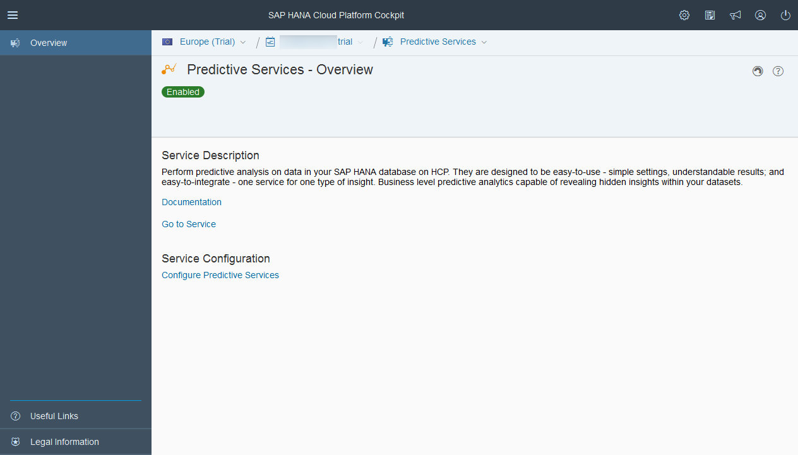
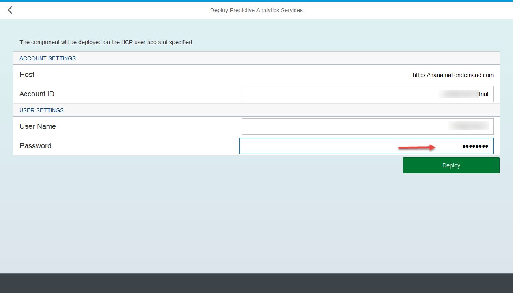

## Prerequisites
  - **Proficiency:** Beginner
  - **Tutorials:** [Expose your predictive demo dataset as an OData service](http://www.sap.com/developer/tutorials/hcpps-hana-dataset-odata.html)

## Next Steps
  - [Install a REST client to interact with the HCP predictive services](http://www.sap.com/developer/tutorials/hcpps-rest-client-install.html)

## Details
### You will learn
  - How to enable, deploy and configure the HCP predictive services for your HCP Developer Account

### Time to Complete
  **10 minutes**

---

1. Let's go back to the [***SAP HANA Cloud Platform Cockpit***](http://account.hanatrial.ondemand.com/cockpit) with your free trial account and access "Your Personal Developer Account".

    Click on your ***HCP Account*** identifier (which ends with *trial*) as highlighted on the below screenshot.

    

1. On the left side bar, click on **Services**.

    Click on the **Predictive Services** tile

    

1. By default, the ***Predictive Services*** are not enabled.

    Click on **Enable**

    

1. Once enable, you will need to deploy the ***Cloud for Predictive Analytics*** application.

    Click on **Go To Service**

    

1. You might receive the following information message that you may need to upgrade your ***Cloud for Predictive Analytics*** services application (***C4PA***) which we will do next.

    Click on **OK**

    

    Next, you can deploy the ***Cloud for Predictive Analytics*** services application.

    Click on the tile

    

1. In order to deploy the ***Cloud for Predictive Analytics*** services application in your ***Your Personal Developer Account***, you just need to provide your ***HCP Account Password*** as highlighted on the screenshot. The other settings, like ***HCP Account User Name***, will be filled with your current information.

    Click on **Deploy**

    

    Click on **OK** to confirm the deployment

    

1. Once deployed, you will be provided with the ***Application Dashboard*** URL.

    Click on the highlighted link

    

1. Now, you need to add you a data source binding to your trial HANA instance.

    On the left side bar, navigate in **Configuration**, then click on **Data Source Binding**

    

1. The data source binding will allow the ***Cloud for Predictive Analytics*** to locate the data to be consumed by the service and execute the ***SAP HANA Automated Predictive Library*** (`APL`) on it, but also to persist a set on internal tables.

    Click on **New Binding**

    

    Enter your ***HANA User Account*** login (`HCPPSTRIAL`) and password (`Welcome16`).

    Click on **Save**

      

1. Now, you need to configure security settings for your ***HCP Account***.

    On the left side bar, navigate in **Security**, then click on **Roles**  

    

1. Assign to the `C4PA-User` and `C4PA-Admin` role your ***HCP Account User Name*** (which was displayed during the ***Deploy*** step, should start with a lower case letter like "p", "s", "i", "c" or "d" depending on the type of SAP account you have) using the **Assign** button as highlighted on the screenshot.
    
	Make sure you don't include the "trial" at the end.

    

1. Now, you need to configure the authentication schemes for the application.

    On the left side bar, navigate in **Security**, then click on **Authentication Configuration**

    Enable the **Custom** mode

    Check **User name and password** and **Client certificate** for the ***FORM*** authentication scheme

    Click on **Save**

    

    You receive next an alert that the changes will be applied on the next restart, which is what we will do next.

    

1. Go back to the ***Overview*** page (via the left menu bar).

    Click on **Start**

    

1. Once started, you will be provided with the **Application URLs** which will give us access to the online documentation and the administration panels.

    Click on the ***Application URLs*** link

    

    Later, you will be using the ***Application URLs***, so you should save the highlighted URL in a notepad as your ***C4PA Application URL***.

    Click on the **Administration** tile

    

1. Status is green! Congrats, you have configured the HCP predictive services on your HCP trial account.

        

## Next Steps
  - [Install a REST client to interact with the HCP predictive services](http://www.sap.com/developer/tutorials/hcpps-rest-client-install.html)
