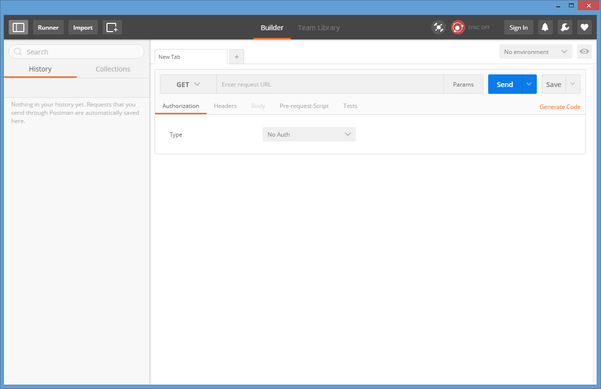

## Prerequisites
  - **Proficiency:** Beginner
  - **Tutorials:** [Enable, deploy and configure the SAP HCP predictive services](http://www.sap.com/developer/tutorials/hcpps-ps-configure.html)

## Next Steps
  - [Test the OData services using a REST client](http://www.sap.com/developer/tutorials/hcpps-rest-odata.html)

## Details
### You will learn
  - How to install the [Chrome Postman extension](http://chrome.google.com/webstore/detail/postman/fhbjgbiflinjbdggehcddcbncdddomop/).

### Time to Complete
  **1 minutes**.

---

1. If you haven’t done so yet, please start [Google Chrome](http://www.google.com/chrome/browser/desktop/) and install the [Chrome Postman extension](http://chrome.google.com/webstore/detail/postman/fhbjgbiflinjbdggehcddcbncdddomop/) now.

1. Open ***Google Chrome***.

    Click on **Apps**

    

    Click on the **Postman** icon

1. You will get access to all the ***Google Chrome*** installed extension.

    Click on **Postman**

    

1. You are all set to move to the next tutorial.

    

## Next Steps
  - [Test the OData services using a REST client](http://www.sap.com/developer/tutorials/hcpps-rest-odata.html)

