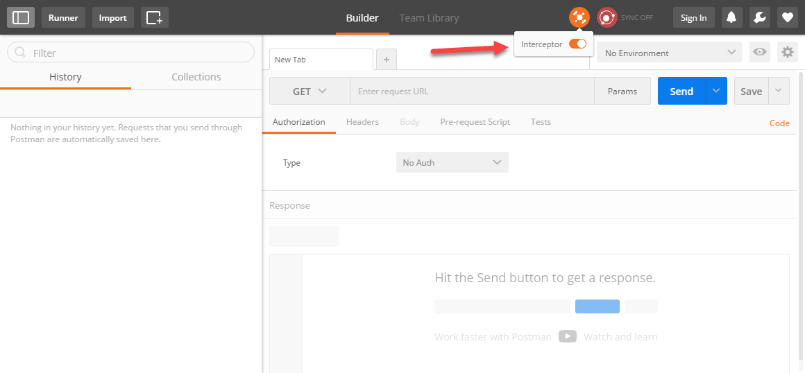

## Prerequisites
  - **Proficiency:** Beginner
  - **Tutorials:** [Enable, deploy and configure the SAP Predictive services](https://www.sap.com/developer/tutorials/hcpps-ps-configure.html)

## Next Steps
  - [Test the SAP Cloud Platform predictive services using a REST client](https://www.sap.com/developer/groups/ps-test-rest.html)

## Details
### You will learn
  - How to install the [Chrome Postman extension](http://chrome.google.com/webstore/detail/postman/fhbjgbiflinjbdggehcddcbncdddomop/).

### Time to Complete
  **2 minutes**.

[ACCORDION-BEGIN [Step 1: ](Install Google Chrome)]
If you haven't done so yet, please install [Google Chrome](http://www.google.com/chrome/browser/desktop/).

[ACCORDION-END]

[ACCORDION-BEGIN [Step 2: ](Install the Postman extension for Chrome)]
Open ***Google Chrome*** and install the [Chrome Postman extension](http://chrome.google.com/webstore/detail/postman/fhbjgbiflinjbdggehcddcbncdddomop/).

[ACCORDION-END]

[ACCORDION-BEGIN [Step 3: ](Install the Postman Interceptor extension for Chrome)]
Install the [Postman Interceptor extension](https://chrome.google.com/webstore/detail/postman-interceptor/aicmkgpgakddgnaphhhpliifpcfhicfo).

[ACCORDION-END]

[ACCORDION-BEGIN [Step 4: ](Configure Postman)]
Click on **Apps**

Click on the **Postman** icon

You will get access to all the ***Google Chrome*** installed extension.

Click on **Postman**

You are almost set to move to the next tutorial.

Enable the Interceptor by clicking on the Interceptor icon as highlighted.

Click on the "Tools" icon , then select "Settings" from the menu.

Enable the "Automatically follow redirects" option as highlighted.

Now, you can to move to the next tutorial.

[ACCORDION-END]

## Next Steps
- [Test the SAP Cloud Platform predictive services using a REST client](https://www.sap.com/developer/groups/ps-test-rest.html)
