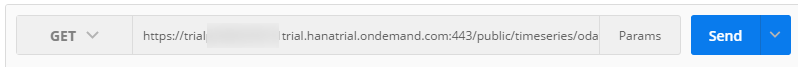

## Prerequisites
  - **Proficiency:** Beginner
  - **Tutorials:** [Install a REST client](http://go.sap.com/developer/tutorials/hcpps-rest-client-install.html)

## Next Steps
  - [Test the "Data Set" HCP predictive service from a REST client](http://go.sap.com/developer/tutorials/hcpps-rest-ps-dataset.html)

## Details
### You will learn
  - How to test an OData Service deployed on HCP using a REST Client

### Time to Complete
  **5 minutes**

---

In order to ease the readability of this tutorial, we have used tokens to replace long URLs.
Therefore you can replace any occurrence of the token by the value listed above.
Make sure you update the URL with your HCP Account identifier.

Token                                | Value
------------------------------------ | -------------
<code><b>&lt;HANA URL&gt;</b></code> | `http://trial<`<code><b>HCP Identifier</b></code>`>trial.hanatrial.ondemand.com`

---

1. Open ***Postman***.

    Fill in the following information:

    Field Name     | Value
    -------------- | -------------
    Request Type   | `GET`
    URL            | `<`<code><b>HANA URL</b></code>`>/public/timeseries/odata/timeseries.xsodata`

    

    Select the **Authorization** tab

    Field Name     | Value
    -------------- | --------------
    Type           | `Basic Auth`
    Username       | `HCPPSTRIAL` (your ***HANA User Account*** login)
    Password       | `Welcome16` (your ***HANA User Account*** password)

    

    Click on **Send**

1. It will now display the list of OData services registered in the `timeseries.xsodata`

    ```xml
    <?xml version="1.0" encoding="utf-8" standalone="yes"?>
      <service xmlns:atom="http:/www.w3.org/2005/Atom"
        xmlns:app="http:/www.w3.org/2007/app"
        xmlns="http:/www.w3.org/2007/app"
        xml:base="<HANA URL>/">
        <workspace>
          <atom:title>Default</atom:title>
          <collection href="TimeSeriesData">
            <atom:title>TimeSeriesData</atom:title>
          </collection>
       </workspace>
    </service>
    ```
1. Now append `$metadata` to the ***URL*** which should look like this:

    Field Name     | Value
    -------------- | -------------
    URL            | `<`<code><b>HANA URL</b></code>`>/public/timeseries/odata/timeseries.xsodata/$metadata`

    This will return the ***EDMX*** (***Entity Data Model*** XML) document that contains a complete description of the configured feeds.

    Click **Send**

    ```xml
    <?xml version="1.0" encoding="utf-8" standalone="yes" ?>
    <edmx:Edmx Version="1.0" xmlns:edmx="http:/schemas.microsoft.com/ado/2007/06/edmx">
      <edmx:DataServices xmlns:m="http:/schemas.microsoft.com/ado/2007/08/dataservices/metadata" m:DataServiceVersion="2.0">
        <Schema Namespace="public.timeseries.odata.timeseries"
          xmlns:d="http:/schemas.microsoft.com/ado/2007/08/dataservices"
          xmlns:m="http:/schemas.microsoft.com/ado/2007/08/dataservices/metadata"
          xmlns="http:/schemas.microsoft.com/ado/2008/09/edm">
          <EntityType Name="TimeSeriesDataType">
            <Key>
              <PropertyRef Name="Date" />
            </Key>
            <Property Name="Date" Type="Edm.DateTime" Nullable="false" />
            <Property Name="WorkingDaysIndices" Type="Edm.Int16" />
            <Property Name="ReverseWorkingDaysIndices" Type="Edm.Int16" />
            <Property Name="MondayMonthInd" Type="Edm.Int16" />
            <Property Name="TuesdayMonthInd" Type="Edm.Int16" />
            <Property Name="WednesdayMonthInd" Type="Edm.Int16" />
            <Property Name="ThursdayMonthInd" Type="Edm.Int16" />
            <Property Name="FridayMonthInd" Type="Edm.Int16" />
            <Property Name="BeforeLastMonday" Type="Edm.Int16" />
            <Property Name="LastMonday" Type="Edm.Int16" />
            <Property Name="BeforeLastTuesday" Type="Edm.Int16" />
            <Property Name="LastTuesday" Type="Edm.Int16" />
            <Property Name="BeforeLastWednesday" Type="Edm.Int16" />
            <Property Name="LastWednesday" Type="Edm.Int16" />
            <Property Name="BeforeLastThursday" Type="Edm.Int16" />
            <Property Name="LastThursday" Type="Edm.Int16" />
            <Property Name="BeforeLastFriday" Type="Edm.Int16" />
            <Property Name="LastFriday" Type="Edm.Int16" />
            <Property Name="Last5WDaysInd" Type="Edm.Int16" />
            <Property Name="Last5WDays" Type="Edm.Int16" />
            <Property Name="Last4WDaysInd" Type="Edm.Int16" />
            <Property Name="Last4WDays" Type="Edm.Int16" />
            <Property Name="LastWMonth" Type="Edm.Int16" />
            <Property Name="BeforeLastWMonth" Type="Edm.Int16" />
            <Property Name="Cash" Type="Edm.Decimal" Precision="17" Scale="6" />
          </EntityType>
          <EntityContainer Name="timeseries" m:IsDefaultEntityContainer="true">
            <EntitySet Name="TimeSeriesData" EntityType="public.timeseries.odata.timeseries.TimeSeriesDataType" />
          </EntityContainer>
        </Schema>
      </edmx:DataServices>
    </edmx:Edmx>
    ```

1. Let's have a look at the `TimeSeriesData` feed. Update the URL and replace `$metadata` by `TimeSeriesData` which should look like this:

    Field Name     | Value
    -------------- | -------------
    URL            | `<`<code><b>HANA URL</b></code>`>/public/timeseries/odata/timeseries.xsodata/TimeSeriesData`

    Click **Send**

    This will return the all table content in an ***Entity Data***  XML format which contains around 250 items.

1. In order to filter the data and only includes entities where the `Cash` property is not null, you can update the URL like this:

    Field Name     | Value
    -------------- | -------------
    URL            | `<`<code><b>HANA URL</b></code>`>/public/timeseries/odata/timeseries.xsodata/TimeSeriesData/?$filter=(Cash eq null)`

    Click **Send**

    This will return only 21 items.

### Optional
  - For more tutorials on OData, you can check [An Open Data Protocol (OData) primer for developers](http://go.sap.com/developer/tutorials/hcp-webide-odata-primer.html)

## Next Steps
  - [Test the "Data Set" HCP predictive service from a REST client](http://go.sap.com/developer/tutorials/hcpps-rest-ps-dataset.html)

