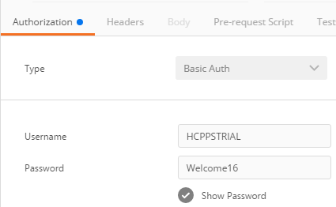

## Prerequisites
  - **Proficiency:** Beginner
  - **Tutorials:** [Install a REST client](http://www.sap.com/developer/tutorials/hcpps-rest-client-install.html)

## Next Steps
  - [Test the "Dataset" service](http://www.sap.com/developer/tutorials/hcpps-rest-ps-dataset.html)

## Details
### You will learn
  - What is the URL of a HANA XS OData Service deployed on your HANA SAP Cloud Platform instance using a REST Client
  - Get access to the service definition and the metadata of an HANA XS OData Service deployed on your HANA SAP Cloud Platform instance
  - Get access to the data of a HANA XS OData Service deployed on your HANA SAP Cloud Platform instance
  - Filter & sort the data from a HANA XS OData Service deployed on your HANA SAP Cloud Platform instance

  **Note:**
    - The OData version 2.0 URI convention is supported by HANA XS Classic, which is currently used on the SAP Cloud Platform
    http://www.odata.org/documentation/odata-version-2-0/uri-conventions/

### Time to Complete
  **5 minutes**

> In order to ease the readability of this tutorial, we have used tokens to replace long URLs.
Therefore you can replace any occurrence of the token by the value listed above.
>
> Token               | Value
------------------- | -------------
<code><b>&lt;Account name&gt;</b></code>  | your SAP Cloud Platform account name. On a developer trial account, it should end by `trial`
<code><b>&lt;HANA instance id&gt;</b></code>  | as created previously, should be `mdc`
<code><b>&lt;HANA URL&gt;</b></code> | `http://<`<code><b>HANA instance id</b></code>`><`<code><b>Account name</b></code>`>.hanatrial.ondemand.com`
>
> If you are unclear with what is your SAP Cloud Platform account name, you can refer to the following blog entry: [SAP Cloud Platform login, user name, account id, name or display name: you are lost? Not anymore!](https://blogs.sap.com/2017/01/31/sap-hana-cloud-platform-trial-login-name-user-name-account-name-account-identifier-you-are-lost-not-anymore/)

[ACCORDION-BEGIN [Step 1: ](Get the service definition)]
Open ***Postman***.

Fill in the following information:

Field Name     | Value
-------------- | -------------
Request Type   | `GET`
URL            | `<`<code><b>HANA URL</b></code>`>/public/predictive/odata/predictive.xsodata`


Select the **Authorization** tab and fill in the following information:

Field Name     | Value
-------------- | --------------
Type           | `Basic Auth`
Username       | `HCPPSTRIAL` (your ***HANA User Account*** login)
Password       | `Welcome17Welcome17` (your ***HANA User Account*** password)



Click on **Send**

It will now display the list of OData services registered in the `predictive.xsodata`

```
<?xml version="1.0" encoding="utf-8" standalone="yes"?>
<service xmlns:atom="http://www.w3.org/2005/Atom" xmlns:app="http://www.w3.org/2007/app" xmlns="http://www.w3.org/2007/app" xml:base="https://mdci304811trial.hanatrial.ondemand.com:443/public/predictive/odata/predictive.xsodata/">
    <workspace>
        <atom:title>Default</atom:title>
        <collection href="CashFlowData">
            <atom:title>CashFlowData</atom:title>
        </collection>
        <collection href="CensusData">
            <atom:title>CensusData</atom:title>
        </collection>
        <collection href="TransactionsData">
            <atom:title>TransactionsData</atom:title>
        </collection>
    </workspace>
</service>
```

[DONE]
[ACCORDION-END]

[ACCORDION-BEGIN [Step 2: ](Get the service metadata)]
Now append `$metadata` to the ***URL*** which should look like this:

Field Name     | Value
-------------- | -------------
URL            | `<`<code><b>HANA URL</b></code>`>/public/predictive/odata/predictive.xsodata/$metadata`

This will return the ***EDMX*** (***Entity Data Model*** XML) document that contains a complete description of the configured feeds.

Click **Send**

```
<?xml version="1.0" encoding="utf-8" standalone="yes" ?>
<edmx:Edmx Version="1.0" xmlns:edmx="http://schemas.microsoft.com/ado/2007/06/edmx">
    <edmx:DataServices xmlns:m="http://schemas.microsoft.com/ado/2007/08/dataservices/metadata" m:DataServiceVersion="2.0">
        <Schema Namespace="public.predictive.odata.predictive" xmlns:d="http://schemas.microsoft.com/ado/2007/08/dataservices" xmlns:m="http://schemas.microsoft.com/ado/2007/08/dataservices/metadata" xmlns="http://schemas.microsoft.com/ado/2008/09/edm">
            <EntityType Name="CashFlowDataType">
                <Key>
                    <PropertyRef Name="Date" />
                </Key>
                <Property Name="Date" Type="Edm.DateTime" Nullable="false" />
                <Property Name="WorkingDaysIndices" Type="Edm.Int16" />
                <Property Name="ReverseWorkingDaysIndices" Type="Edm.Int16" />
                <Property Name="MondayMonthInd" Type="Edm.Int16" />
                <Property Name="TuesdayMonthInd" Type="Edm.Int16" />
                <Property Name="WednesdayMonthInd" Type="Edm.Int16" />
                <Property Name="ThursdayMonthInd" Type="Edm.Int16" />
                <Property Name="FridayMonthInd" Type="Edm.Int16" />
                <Property Name="BeforeLastMonday" Type="Edm.Int16" />
                <Property Name="LastMonday" Type="Edm.Int16" />
                <Property Name="BeforeLastTuesday" Type="Edm.Int16" />
                <Property Name="LastTuesday" Type="Edm.Int16" />
                <Property Name="BeforeLastWednesday" Type="Edm.Int16" />
                <Property Name="LastWednesday" Type="Edm.Int16" />
                <Property Name="BeforeLastThursday" Type="Edm.Int16" />
                <Property Name="LastThursday" Type="Edm.Int16" />
                <Property Name="BeforeLastFriday" Type="Edm.Int16" />
                <Property Name="LastFriday" Type="Edm.Int16" />
                <Property Name="Last5WDaysInd" Type="Edm.Int16" />
                <Property Name="Last5WDays" Type="Edm.Int16" />
                <Property Name="Last4WDaysInd" Type="Edm.Int16" />
                <Property Name="Last4WDays" Type="Edm.Int16" />
                <Property Name="LastWMonth" Type="Edm.Int16" />
                <Property Name="BeforeLastWMonth" Type="Edm.Int16" />
                <Property Name="Cash" Type="Edm.Decimal" Precision="17" Scale="6" />
            </EntityType>
            <EntityType Name="CensusDataType">
                <Key>
                    <PropertyRef Name="id" />
                </Key>
                <Property Name="id" Type="Edm.Int64" Nullable="false" />
                <Property Name="age" Type="Edm.Byte" />
                <Property Name="workclass" Type="Edm.String" MaxLength="50" />
                <Property Name="fnlwgt" Type="Edm.Int32" />
                <Property Name="education" Type="Edm.String" MaxLength="50" />
                <Property Name="education_num" Type="Edm.Byte" />
                <Property Name="marital_status" Type="Edm.String" MaxLength="50" />
                <Property Name="occupation" Type="Edm.String" MaxLength="50" />
                <Property Name="relationship" Type="Edm.String" MaxLength="50" />
                <Property Name="race" Type="Edm.String" MaxLength="50" />
                <Property Name="sex" Type="Edm.String" MaxLength="10" />
                <Property Name="capital_gain" Type="Edm.Int64" />
                <Property Name="capital_loss" Type="Edm.Int64" />
                <Property Name="hours_per_week" Type="Edm.Byte" />
                <Property Name="native_country" Type="Edm.String" MaxLength="50" />
                <Property Name="class" Type="Edm.Int16" />
            </EntityType>
            <EntityType Name="TransactionsDataType">
                <Key>
                    <PropertyRef Name="TransactionID" />
                </Key>
                <Property Name="UserID" Type="Edm.Int16" Nullable="false" />
                <Property Name="ItemPurchased" Type="Edm.String" Nullable="false" MaxLength="50" />
                <Property Name="Date_PutInCaddy" Type="Edm.DateTime" Nullable="false" />
                <Property Name="Quantity" Type="Edm.Byte" />
                <Property Name="TransactionID" Type="Edm.Int16" Nullable="false" />
            </EntityType>
            <EntityContainer Name="predictive" m:IsDefaultEntityContainer="true">
                <EntitySet Name="CashFlowData" EntityType="public.predictive.odata.predictive.CashFlowDataType" />
                <EntitySet Name="CensusData" EntityType="public.predictive.odata.predictive.CensusDataType" />
                <EntitySet Name="TransactionsData" EntityType="public.predictive.odata.predictive.TransactionsDataType" />
            </EntityContainer>
        </Schema>
    </edmx:DataServices>
</edmx:Edmx>
```

[DONE]
[ACCORDION-END]

[ACCORDION-BEGIN [Step 3: ](Access the Cash Flow data)]
Let's have a look at the `CashFlowData` feed. Update the URL and replace `$metadata` by `CashFlowData` which should look like this:

Field Name     | Value
-------------- | -------------
URL            | `<`<code><b>HANA URL</b></code>`>/public/predictive/odata/predictive.xsodata/CashFlowData`

Click **Send**

This will return the all `CashFlow` table content in an ***Entity Data***  XML format which contains around 250 items. I just kept 2 entities in the bellow XML.

```
<?xml version="1.0" encoding="utf-8" standalone="yes"?>
<feed xml:base="https://mdci304811trial.hanatrial.ondemand.com:443/public/predictive/odata/predictive.xsodata/" xmlns:d="http://schemas.microsoft.com/ado/2007/08/dataservices" xmlns:m="http://schemas.microsoft.com/ado/2007/08/dataservices/metadata" xmlns="http://www.w3.org/2005/Atom">
    <title type="text">CashFlowData</title>
    <id>https://mdci304811trial.hanatrial.ondemand.com:443/public/predictive/odata/predictive.xsodata/CashFlowData</id>
    <author>
        <name />
    </author>
    <link rel="self" title="CashFlowData" href="CashFlowData" />
    <entry>
        <id>https://mdci304811trial.hanatrial.ondemand.com:443/public/predictive/odata/predictive.xsodata/CashFlowData(datetime'2001-01-02T00:00:00.0000000')</id>
        <title type="text"></title>
        <author>
            <name />
        </author>
        <link rel="edit" title="CashFlowData" href="CashFlowData(datetime'2001-01-02T00:00:00.0000000')"/>
        <category term="public.predictive.odata.predictive.CashFlowDataType" scheme="http://schemas.microsoft.com/ado/2007/08/dataservices/scheme" />
        <content type="application/xml">
            <m:properties>
                <d:Date m:type="Edm.DateTime">2001-01-02T00:00:00.0000000</d:Date>
                <d:WorkingDaysIndices m:type="Edm.Int16">0</d:WorkingDaysIndices>
                <d:ReverseWorkingDaysIndices m:type="Edm.Int16">21</d:ReverseWorkingDaysIndices>
                <d:MondayMonthInd m:type="Edm.Int16">0</d:MondayMonthInd>
                <d:TuesdayMonthInd m:type="Edm.Int16">1</d:TuesdayMonthInd>
                <d:WednesdayMonthInd m:type="Edm.Int16">0</d:WednesdayMonthInd>
                <d:ThursdayMonthInd m:type="Edm.Int16">0</d:ThursdayMonthInd>
                <d:FridayMonthInd m:type="Edm.Int16">0</d:FridayMonthInd>
                <d:BeforeLastMonday m:type="Edm.Int16">0</d:BeforeLastMonday>
                <d:LastMonday m:type="Edm.Int16">0</d:LastMonday>
                <d:BeforeLastTuesday m:type="Edm.Int16">0</d:BeforeLastTuesday>
                <d:LastTuesday m:type="Edm.Int16">0</d:LastTuesday>
                <d:BeforeLastWednesday m:type="Edm.Int16">0</d:BeforeLastWednesday>
                <d:LastWednesday m:type="Edm.Int16">0</d:LastWednesday>
                <d:BeforeLastThursday m:type="Edm.Int16">0</d:BeforeLastThursday>
                <d:LastThursday m:type="Edm.Int16">0</d:LastThursday>
                <d:BeforeLastFriday m:type="Edm.Int16">0</d:BeforeLastFriday>
                <d:LastFriday m:type="Edm.Int16">0</d:LastFriday>
                <d:Last5WDaysInd m:type="Edm.Int16">0</d:Last5WDaysInd>
                <d:Last5WDays m:type="Edm.Int16">0</d:Last5WDays>
                <d:Last4WDaysInd m:type="Edm.Int16">0</d:Last4WDaysInd>
                <d:Last4WDays m:type="Edm.Int16">0</d:Last4WDays>
                <d:LastWMonth m:type="Edm.Int16">0</d:LastWMonth>
                <d:BeforeLastWMonth m:type="Edm.Int16">0</d:BeforeLastWMonth>
                <d:Cash m:type="Edm.Decimal">4586.144145</d:Cash>
            </m:properties>
        </content>
    </entry>
    <entry>
        <id>https://mdci304811trial.hanatrial.ondemand.com:443/public/predictive/odata/predictive.xsodata/CashFlowData(datetime'2001-01-03T00:00:00.0000000')</id>
        <title type="text"></title>
        <author>
            <name />
        </author>
        <link rel="edit" title="CashFlowData" href="CashFlowData(datetime'2001-01-03T00:00:00.0000000')"/>
        <category term="public.predictive.odata.predictive.CashFlowDataType" scheme="http://schemas.microsoft.com/ado/2007/08/dataservices/scheme" />
        <content type="application/xml">
            <m:properties>
                <d:Date m:type="Edm.DateTime">2001-01-03T00:00:00.0000000</d:Date>
                <d:WorkingDaysIndices m:type="Edm.Int16">1</d:WorkingDaysIndices>
                <d:ReverseWorkingDaysIndices m:type="Edm.Int16">20</d:ReverseWorkingDaysIndices>
                <d:MondayMonthInd m:type="Edm.Int16">0</d:MondayMonthInd>
                <d:TuesdayMonthInd m:type="Edm.Int16">0</d:TuesdayMonthInd>
                <d:WednesdayMonthInd m:type="Edm.Int16">1</d:WednesdayMonthInd>
                <d:ThursdayMonthInd m:type="Edm.Int16">0</d:ThursdayMonthInd>
                <d:FridayMonthInd m:type="Edm.Int16">0</d:FridayMonthInd>
                <d:BeforeLastMonday m:type="Edm.Int16">0</d:BeforeLastMonday>
                <d:LastMonday m:type="Edm.Int16">0</d:LastMonday>
                <d:BeforeLastTuesday m:type="Edm.Int16">0</d:BeforeLastTuesday>
                <d:LastTuesday m:type="Edm.Int16">0</d:LastTuesday>
                <d:BeforeLastWednesday m:type="Edm.Int16">0</d:BeforeLastWednesday>
                <d:LastWednesday m:type="Edm.Int16">0</d:LastWednesday>
                <d:BeforeLastThursday m:type="Edm.Int16">0</d:BeforeLastThursday>
                <d:LastThursday m:type="Edm.Int16">0</d:LastThursday>
                <d:BeforeLastFriday m:type="Edm.Int16">0</d:BeforeLastFriday>
                <d:LastFriday m:type="Edm.Int16">0</d:LastFriday>
                <d:Last5WDaysInd m:type="Edm.Int16">0</d:Last5WDaysInd>
                <d:Last5WDays m:type="Edm.Int16">0</d:Last5WDays>
                <d:Last4WDaysInd m:type="Edm.Int16">0</d:Last4WDaysInd>
                <d:Last4WDays m:type="Edm.Int16">0</d:Last4WDays>
                <d:LastWMonth m:type="Edm.Int16">0</d:LastWMonth>
                <d:BeforeLastWMonth m:type="Edm.Int16">0</d:BeforeLastWMonth>
                <d:Cash m:type="Edm.Decimal">3750.2201</d:Cash>
            </m:properties>
        </content>
    </entry>
</feed>
```

You can try to use the JSON format instead of XML with the following URL:

Field Name     | Value
-------------- | -------------
URL            | `<`<code><b>HANA URL</b></code>`>/public/predictive/odata/predictive.xsodata/CashFlowData?$format=json`

[DONE]
[ACCORDION-END]

[ACCORDION-BEGIN [Step 3: ](Filter the Cash Flow data)]

In order to filter the data and only includes entities where the `Cash` property is not null, you can update the URL like this:

Field Name     | Value
-------------- | -------------
URL            | `<`<code><b>HANA URL</b></code>`>/public/predictive/odata/predictive.xsodata/CashFlowData?$filter=(Cash eq null)`

Click **Send**

This will return only 21 items.

[DONE]
[ACCORDION-END]

[ACCORDION-BEGIN [Step 4: ](Sort the Cash Flow data)]

In order to sort the data by descending Date, you can update the URL like this:

Field Name     | Value
-------------- | -------------
URL            | `<`<code><b>HANA URL</b></code>`>/public/predictive/odata/predictive.xsodata/CashFlowData?$orderby=Date desc`

Click **Send**

[DONE]
[ACCORDION-END]

### Optional
  - For more tutorials on OData, you can check [An Open Data Protocol (OData) primer for developers](http://www.sap.com/developer/tutorials/hcp-webide-odata-primer.html)

## Next Steps
  - [Test the "Dataset" service](http://www.sap.com/developer/tutorials/hcpps-rest-ps-dataset.html)
