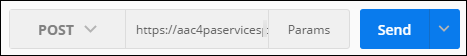
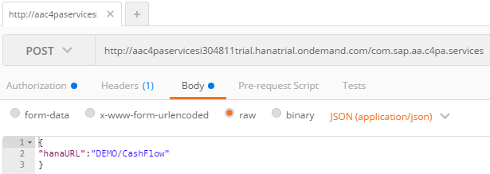

## Prerequisites
  - **Proficiency:** Beginner
  - **Tutorials:** [Configure the SAP Cloud Platform predictive services](https://www.sap.com/developer/groups/ps-configure.html)

## Next Steps
- [Test the SAP Cloud Platform predictive services using a REST client](https://www.sap.com/developer/groups/ps-test-rest.html)

## Details
### You will learn
  - How to "Register" your data set with the SAP Predictive services using a REST Client.


### Time to Complete
  **10 minutes**

> In order to ease the readability of this tutorial, we have used tokens to replace long URLs.
> Therefore you can replace any occurrence of the token by the value listed above:
>
> - <code><b>C4PAURL</b></code> : represents the predictive services **Application URL** displayed on the overview page and should look like this (XYZ is your SAP Cloud Platform account name):
>     
```
     https://aac4paservicesXYZ.hanatrial.ondemand.com/com.sap.aa.c4pa.services
```
>      
>
> If you are unclear with what is your SAP Cloud Platform account name, you can refer to the following blog entry: [SAP Cloud Platform login, user name, account id, name or display name: you are lost? Not anymore!](https://blogs.sap.com/2017/01/31/sap-hana-cloud-platform-trial-login-name-user-name-account-name-account-identifier-you-are-lost-not-anymore/)

&nbsp;

> **Note**: if you are running into some issue, you can check the [SAP Cloud Platform Predictive Services Troubleshooting guide](https://www.sap.com/developer/how-tos/2017/08/hcpps-troubleshoot.html) to diagnose the most common ones.

[ACCORDION-BEGIN [Info:](A short description of the Dataset service)]

In order to use any of the SAP Predictive services, you will need a registered dataset.

When registering a dataset, you will define and store the structure of the dataset which will be used by the other services.

We upload 3 datasets in one of the previous steps, but we will be using the `CashFlow` dataset as an example here. You can replicate the steps for the other 2 datasets.

This service:

 - Analyze the database object DDL to return you the name and the data type of each columns
 - Analyze a few hundreds rows to determine the value type of the column (continuous, nominal or ordinal)
 - Get the number of rows and columns

Once registered, you will be able to use the dataset "ID" to call the other services.

[ACCORDION-END]

[ACCORDION-BEGIN [Step 1: ](Register a dataset)]
Open a new tab in ***Postman***.

> If you don't have ***Postman*** installed yet, you can refer to the following how-to guide: [Install Postman extension for Google Chrome as a REST client](https://www.sap.com/developer/how-tos/2017/07/api-tools-postman-install.html)

&nbsp;

Fill in the following information:

Field Name     | Value
:------------- | :--------------
Request Type   | <code><b>POST</b></code>
URL            | <code><b>C4PAURL</b></code>`/api/analytics/dataset/sync`



Select the **Authorization** tab and fill in the following information:

Field Name     | Value
:------------- | :-------------
Type           | **`Basic Auth`**
Username       | your ***SAP Cloud Platform Account*** login*
Password*      | your ***SAP Cloud Platform Account*** password

>**Note:**
Your SAP Cloud Platform Account login is usually the email address used to register your ***SAP Cloud Platform*** account.

&nbsp;


Select the **Body** tab.

Enable the **raw** mode.

Pick **`JSON (application/json)`** in the drop down (instead of Text).



Add the following content in the text area as displayed above:

```json
{
  "location": {
    "schema" : "PSDEMO",
    "table" : "CashFlow"
  }
}
```

Click on **Send**

It will now display the data set registration identifier, the number of rows and the variable descriptions.

Now, we can use the <code><b>ID</b></code> value to reference the registered dataset with other SAP Predictive services calls.

The below extract was shortened to ease the reading.
```
{
  "ID": 1,
  "name": "CashFlow",
  "numberOfColumns": 25,
  "numberOfRows": 272,
  "variables": [
    {
      "name": "Date",
      "position": 0,
      "storage": "date",
      "value": "continuous"
    },
    {
      "name": "WorkingDaysIndices",
      "position": 1,
      "storage": "integer",
      "value": "continuous"
    },
    ....
  ]
}
```

Click on **Send** an additional 2 or 3 times, so you will have multiple dataset registered to play with.

[ACCORDION-END]

[ACCORDION-BEGIN [Step 2: ](Retrieve the registration details for one dataset)]
Open a new tab in ***Postman***.

Fill in the following information:

Field Name     | Value
:------------- | :-------------
Request Type   | <code><b>GET</b></code>
URL            | <code><b>C4PAURL</b></code>`/api/analytics/dataset/`<code><b>ID</b></code>

> Make sure you replace the <code><b>ID</b></code> token in the URL with the one returned by the dataset <code><b>ID</b></code> return in the previous service call.

&nbsp;

Select the **Authorization** tab and fill in the same details as in the previous call.

Click on **Send**

You should receive the same description as from the previous call.

If you try with an unknown <code><b>ID</b></code>, you should receive an error message.

[ACCORDION-END]

[ACCORDION-BEGIN [Step 3: ](Retrieve the registration details for one variable)]
Open a new tab in ***Postman***.

Fill in the following information

Field Name     | Value
:------------- | :-------------
Request Type   | <code><b>GET</b></code>
URL            | <code><b>C4PAURL</b></code>`/api/analytics/dataset/`<code><b>ID</b></code>`/variable/1`

> Make sure you replace the <code><b>ID</b></code> token in the URL with the one returned by the dataset <code><b>ID</b></code> return in the first service call.

&nbsp;

Select the **Authorization** tab and fill in the same details as in the previous call.

Click on **Send**

You should receive the description of the first variable from your data set.

[ACCORDION-END]

[ACCORDION-BEGIN [Step 4: ](Modify registered variable details)]

> **Note:**
>This service is available since version 1.7, please make sure you have upgraded the C4PA application, else you will receive a 404 error.
>
>To check which version you are currently using, please go to the following URL and check the `X-Maven-Project-Version` property:
>  - <code><b>C4PAURL</b></code>`/adminUI/index.html#/about`

&nbsp;

By default, the variable storage and value type (nominal, continuous,  ordinal) properties returned by the registration service are "guessed" from the data, which may sometime be inaccurate.

For example, with variable 4 (`MondayMonthInd`), it is guessed as a continuous integer, but should rather be an ordinal integer.

Let's see how we can fix that.

Open a new tab in ***Postman***.

Fill in the following information:

Field Name     | Value
:------------- | :--------------
Request Type   | <code><b>POST</b></code>
URL            | <code><b>C4PAURL</b></code>`/api/analytics/dataset/`<code><b>ID</b></code>`/variables/update`

> Make sure you replace the <code><b>ID</b></code> token in the URL with the one returned by the dataset <code><b>ID</b></code> return in the first service call.

&nbsp;

Select the **Authorization** tab and fill in the same details as in the previous call.

Select the **Body** tab, enable the **raw** mode and select `JSON (application/json)` in the drop down, then add the following entries

```json
[
    {
     "name": "MondayMonthInd",
     "value": "ordinal"
    }
]
```

[ACCORDION-END]

[ACCORDION-BEGIN [Step 5: ](Delete a dataset registration details)]

Open a new tab in ***Postman***.

Fill in the following information

Field Name     | Value
:------------- | :-------------
Request Type   | <code><b>DELETE</b></code>
URL            | <code><b>C4PAURL</b></code>`/api/analytics/dataset/`<code><b>ID</b></code>

> Make sure you replace the <code><b>ID</b></code> token in the URL with the one returned by the dataset <code><b>ID</b></code> return in the first service call.

&nbsp;

Select the **Authorization** tab and fill in the same details as in the previous call.

Click on **Send**

You have now deleted the second data set we have registered.

You can try to retrieve the registration details as in step 2 for dataset 2, and you should receive an error message.

[ACCORDION-END]

[ACCORDION-BEGIN [Step 6: ](List all registered datasets)]

Open a new tab in ***Postman***.

Fill in the following information

Field Name     | Value
:------------- | :-------------
Request Type   | <code><b>GET</b></code>
URL            | <code><b>C4PAURL</b></code>`/api/analytics/dataset/`

Select the **Authorization** tab and fill in the same details as in the previous call.

Click on **Send**

You have now listed all the data set registered in your environment.

[ACCORDION-END]

### Optional

For more details on the SAP Predictive services, you can check the following the [`Dataset APIs`](https://help.sap.com/viewer/20cd1b0396db4826a9b76b4ce869f00a/Cloud/en-US/ac9dc4ed145646a0b76b4729210fd067.html) documentation.

## Next Steps
- [Test the SAP Cloud Platform predictive services using a REST client](https://www.sap.com/developer/groups/ps-test-rest.html)
