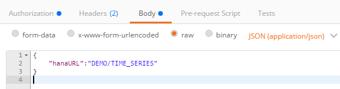

## Prerequisites
  - **Proficiency:** Beginner
  - **Tutorials:** [Access your predictive demo data set using an OData services from a REST client](http://go.sap.com/developer/tutorials/hcpps-rest-odata.html)

## Next Steps
  - [Test the "Forecast" HCP predictive service from a REST client](http://go.sap.com/developer/tutorials/hcpps-rest-ps-forecast.html)

## Details
### You will learn
  - How to "Register" your data set with the HCP predictive services using a REST Client

### Time to Complete
  **10 minutes**

---

In order to ease the readability of this tutorial, we have used tokens to replace long URLs.
Therefore you can replace any occurrence of the token by the value listed above.
Make sure you update the URL with your HCP identifier.

Token                               | Value
----------------------------------- | -------------
<code><b>&lt;C4PA URL&gt;</b></code> | `http://aac4paservices<`<code><b>HCP Identifier</b></code>`>trial.hanatrial.ondemand.com/com.sap.aa.c4pa.services`

  ---

1. Open a new tab in ***Postman***.

    Fill in the following information

    Field Name     | Value
    -------------- | --------------
    Request Type   | `POST`
    URL            | `<`<code><b>C4PA URL</b></code>`>/api/analytics/dataset/sync`

    

    Select the **Authorization** tab

    Field Name     | Value
    -------------- | -------------
    Type           | `Basic Auth`
    Username       | your ***HCP Account*** login (usually the email address used to register your ***HCP*** account)
    Password*      | your ***HCP Account*** password

    

    Select the **Body** tab, enable the **raw** mode and select `JSON (application/json)` in the drop down, then add the following entries

    ```JSON
    {
      "hanaURL":"DEMO/TIME_SERIES"
    }
    ```

    

    Click on **Send**

    Click on **Send** an additional 2 or 3 times, so you will have multiple dataset registered.

1. It will now display the data set registration identifier, the number of rows and the variable descriptions.

    Now, we can use the `ID` value to reference the registered dataset with other HCP predictive services calls.

    ```JSON
    {
      "ID": 1,
      "name": "TIME_SERIES",
      "numberOfColumns": 25,
      "numberOfRows": 272,
      "variables": [
         {
           "name": "Date",
           "position": 0,
           "storage": "date",
           "value": "continuous"
         },
         {

         }
      ]  
    }
    ```

1. Open a new tab in ***Postman***.

    Fill in the following information

    Field Name     | Value
    :------------- | :-------------
    Request Type   | `GET`
    URL            | `<`<code><b>C4PA URL</b></code>`>/api/analytics/dataset/1`

    Select the **Authorization** tab and fill in the same details as in the previous call.

    Click on **Send**

    You should receive the same description as from the previous call. If you try with an unknown `ID`, you should receive an error message.

1. Open a new tab in ***Postman***.

    Fill in the following information

    Field Name     | Value
    :------------- | :-------------
    Request Type   | `GET`
    URL            | `<`<code><b>C4PA URL</b></code>`>/api/analytics/dataset/1/variable/1`

    Select the **Authorization** tab and fill in the same details as in the previous call.

    Click on **Send**

    You should receive the description of the first variable from your data set.

1. Open a new tab in ***Postman***.

    Fill in the following information

    Field Name     | Value
    :------------- | :-------------
    Request Type   | `DELETE`
    URL            | `<`<code><b>C4PA URL</b></code>`>/api/analytics/dataset/2`

    Select the **Authorization** tab and fill in the same details as in the previous call.

    Click on **Send**

    You have now deleted the second data set we have registered.

1. Open a new tab in ***Postman***.

    Fill in the following information

    Field Name     | Value
    :------------- | :-------------
    Request Type   | `GET`
    URL            | `<`<code><b>C4PA URL</b></code>`>/api/analytics/dataset/`

    Select the **Authorization** tab and fill in the same details as in the previous call.

    Click on **Send**

    You have now listed all the data set registered in your environment.

### Optional
For more details on the HCP predictive services, you can check the following URL:
  - `<`<code><b>C4PA URL</b></code>`>/raml/index.html?raml=../aa-cloud-services.raml`

## Next Steps
  - [Test the "Forecast" HCP predictive service from a REST client](http://go.sap.com/developer/tutorials/hcpps-rest-ps-forecast.html)

