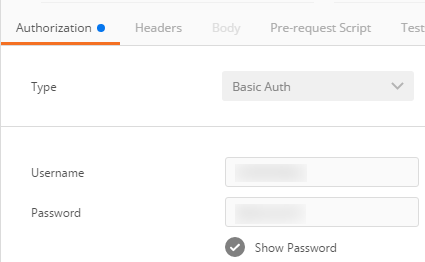

## Prerequisites
  - **Proficiency:** Beginner
  - **Tutorials:** [Test the "Dataset" services](http://www.sap.com/developer/tutorials/hcpps-rest-ps-dataset.html)

## Next Steps
  - [Test the "Key Influencer" services](http://www.sap.com/developer/tutorials/hcpps-rest-ps-keyinfluencer.html)

## Details
### You will learn
 - How to use the "Forecast" SAP Cloud for predictive services from a REST Client in both synchronous and asynchronous mode.
 The asynchronous mode will create a job with a status that you can check the status for completion.

### Time to Complete
  **10 minutes**

> In order to ease the readability of this tutorial, we have used tokens to replace long URLs.
Therefore you can replace any occurrence of the token by the value listed above.
>
> Token               | Value
------------------- | -------------
<code><b>&lt;Account name&gt;</b></code>  | your SAP Cloud Platform account name. On a developer trial account, it should end by `trial`
<code><b>&lt;C4PA URL&gt;</b></code> | `https://aac4paservices<`<code><b>Account name</b></code>`>.hanatrial.ondemand.com/com.sap.aa.c4pa.services`
>
> If you are unclear with what is your SAP Cloud Platform account name, you can refer to the following blog entry: [SAP Cloud Platform login, user name, account id, name or display name: you are lost? Not anymore!](https://blogs.sap.com/2017/01/31/sap-hana-cloud-platform-trial-login-name-user-name-account-name-account-identifier-you-are-lost-not-anymore/)

[ACCORDION-BEGIN [Info:](A short description of the Forecast service)]
The Forecasts service analyzes a dataset containing the successive values of a target indicator over time to predict the next values.

This service:

 - Analyzes a time series and generates forecasts based on identified patterns
 - Returns forecast and real values for past data of the time series
 - Provides confidence intervals computed for each forecast
 - Provides the trend, cycles, and fluctuations of the time series
 - Provides indicators on the reliability of the results

The predictive model combines the trend, cycles, and fluctuations found in the time series to generate forecasts. The prediction also depends on information provided through extra-predictive variables if any.

The granularity of the prediction is the same as the granularity used in the dataset. For example, if the dataset contains daily observations of a time series, the service computes the values of the series in the next days. See the Time Series Scenarios on the SAP Help Portal for a description of the time series components.

> **Note:**
> If you use extra-predictive variables, which are variables other than date and target indicator, their values must be known for each date of the forecasts.
> The service may return forecasts without error bars beyond the maximum confident horizon.

-

To summarize, in order to execute the forecast service, you will need a dataset with:

 - a date variable
 - a variable to predict (usually a continuous number variable), the target variable
 - optionally a set of "extra" predictors which can be used to better predict the forecast variable

The parameters required to run the service are:

 - a dataset identifier (registered with the Dataset service)
 - the name of the date and the target variable
 - a number of forecast to be computed

Optionally, you can define the following parameters to enhance your analysis:

 - the reference date (date after which the entries are call predictions), if none is specified then the last date will be used
 - number of past values in the output: the number of past data to return with the forecasts (default value is 0)
 - skipped variables: a list of variables to skip from the analysis
 - variable description: a more details description of the dataset

[DONE]
[ACCORDION-END]

[ACCORDION-BEGIN [Info:](A short description of the Cash Flow dataset)]

The dataset will be using during this tutorial is extracted from the sample dataset available with SAP BusinessObjects Predictive Analytics.

The file presents daily measures of cash flows from January 2, 1998 to September, 30 1998. Each observation is characterized by 25 data items. The data or variables are described in the following table.

Variable | Description | Example of values
--------------|--------------|--------------
Date | Day, month and year of the readings | A date in the format `yyyy-mm-dd` such as 1998-01-02
Cash | Cash flow | A numerical value with n decimals
`BeforeLastMonday` <br/> `LastMonday` <br/> `BeforeLastTuesday` <br/> `LastTuesday` <br/> `BeforeLastWednesday` <br/> `LastWednesday` <br/> `BeforeLastThursday` <br/> `LastThursday` <br/> `BeforeLastFriday` <br/> `LastFriday` | Boolean variables that indicate if the information is true or false | 1 if the information is true.
`Last5WDays` <br/> `Last4WDays` | Boolean variables that indicate if the date is in the 5 or 4 last working days of the month | 1 if the information is true.
`LastWMonth` <br/> `BeforeLastWMonth` | Boolean variables that indicate if the information is true or false | 1 if the information is true.
`WorkingDaysIndices` <br/> `ReverseWorkingDaysIndices` | Indices or reverse indices of the working days | An integer value
`MondayMonthInd` <br/> `TuesdayMonthInd` <br/> `WednesdayMonthInd` <br/> `ThursdayMonthInd` <br/> `FridayMonthInd` | Indices of the week days in the month | An integer value
`Last5WDaysInd` <br/> `Last4WDaysInd` | Indices of the 5 or 4 last working days of the month | An integer value

[DONE]
[ACCORDION-END]

[ACCORDION-BEGIN [Step 1: ](Register the Cash Flow dataset)]

First we need to register the dataset we will be using during this tutorial.

Additionally, we will adjust the variables description which will help improve the quality of our model.

As described in the **Step 1: Register a dataset** from the previous tutorial, register the Cash Flow dataset using the following elements:

Field Name     | Value
-------------- | --------------
Request Type   | `POST`
URL            | `<`<code><b>C4PA URL</b></code>`>/api/analytics/dataset/sync`

```json
{
  "hanaURL":"DEMO/CashFlow"
}
```

**Take note of the returned dataset identifier.**

Now as described in the **Step 4: Modify registered variable details**,

Field Name     | Value
-------------- | --------------
Request Type   | `POST`
URL            | `<`<code><b>C4PA URL</b></code>`>/api/analytics/dataset/<`ID`>/variables/update`

> Make sure you replace the `ID` token in the URL with the one returned by the previous service call.

```json
[
  {"name":"Date", "value":"continuous"},
  {"name":"WorkingDaysIndices", "value":"continuous"},
  {"name":"ReverseWorkingDaysIndices", "value":"continuous"},
  {"name":"MondayMonthInd", "value":"ordinal"},
  {"name":"TuesdayMonthInd", "value":"ordinal"},
  {"name":"WednesdayMonthInd", "value":"ordinal"},
  {"name":"ThursdayMonthInd", "value":"ordinal"},
  {"name":"FridayMonthInd", "value":"ordinal"},
  {"name":"BeforeLastMonday", "value":"nominal"},
  {"name":"LastMonday", "value":"nominal"},
  {"name":"BeforeLastTuesday", "value":"nominal"},
  {"name":"LastTuesday", "value":"nominal"},
  {"name":"BeforeLastWednesday", "value":"nominal"},
  {"name":"LastWednesday", "value":"nominal"},
  {"name":"BeforeLastThursday", "value":"nominal"},
  {"name":"LastThursday", "value":"nominal"},
  {"name":"BeforeLastFriday", "value":"nominal"},
  {"name":"LastFriday", "value":"nominal"},
  {"name":"Last5WDaysInd", "value":"ordinal"},
  {"name":"Last5WDays", "value":"nominal"},
  {"name":"Last4WDaysInd", "value":"ordinal"},
  {"name":"Last4WDays", "value":"nominal"},
  {"name":"LastWMonth", "value":"nominal"},
  {"name":"BeforeLastWMonth", "value":"nominal"},
  {"name":"Cash", "value":"continuous"}
]
```

[DONE]
[ACCORDION-END]    

[ACCORDION-BEGIN [Step 2: ](Run the Forecast service in synchronous mode)]

With the synchronous mode, the SAP Cloud Platform predictive service will be waiting until the operation completes to return the response.

Open a new tab in ***Postman***.

Fill in the following information:

Field Name     | Value
-------------- | --------------
Request Type   | `POST`
URL            | `<`<code><b>C4PA URL</b></code>`>/api/analytics/forecast/sync`


Select the **Authorization** tab and fill in the following information:

Field Name     | Value
:------------- | :-------------
Type           | `Basic Auth`
Username       | your ***SAP Cloud Platform Account*** login (usually the email address used to register your ***SAP Cloud Platform*** account)
Password*      | your ***SAP Cloud Platform Account*** password



Select the **Body** tab, enable the **raw** mode and select `JSON (application/json)` in the drop down, then add the following content:

```json
{
  "datasetID": 3,
  "targetColumn": "Cash",
  "dateColumn": "Date",
  "numberOfForecasts": 5,  
  "referenceDate" : "2001-12-01"
}
```

> Make sure the `datasetID` (here the value 3) is correct. To get the list of valid identifier, you can run ***Step 6: List all registered datasets*** from the previous tutorial.

-

With these settings, we will forecast the next 5 values of the Cash variable after the 1st of December 2001.

Click on **Send**

Congratulations! You have just run the forecast service on the `Cash` variable and requested the next 5 values after the reference date (2001-12-01).

In the output you will get the following information:

  - `forecastValue`: the forecast values
  - `realValue`: the current values in case you have provided a reference date where you already have the target value, and your goal is more to confirm that the real value follows a trend or is between boundaries
  - `errorBarHigherBound` & `errorBarLowerBound`: the upper and lower limit of the confidence interval for the forecast value (+/-5%)
  - model information: the structure of the forecast model
  - model performance: the accuracy indicators

Here is the result:

```
{
  "forecasts": [
    {
      "date": "2001-12-03",
      "errorBarHigherBound": 8368.082583543392,
      "errorBarLowerBound": 3731.612160769046,
      "forecastValue": 6049.847372156219,
      "realValue": 5875.405945
    },
    {
      "date": "2001-12-04",
      "errorBarHigherBound": 7673.46858390381,
      "errorBarLowerBound": 3036.9981611294656,
      "forecastValue": 5355.233372516638,
      "realValue": 6149.558087
    },
    {
      "date": "2001-12-05",
      "errorBarHigherBound": 7721.2511136319645,
      "errorBarLowerBound": 3084.78069085762,
      "forecastValue": 5403.015902244792,
      "realValue": 7619.516212
    },
    {
      "date": "2001-12-06",
      "errorBarHigherBound": 8078.661659901269,
      "errorBarLowerBound": 3442.191237126924,
      "forecastValue": 5760.426448514097,
      "realValue": 6626.840307
    },
    {
      "date": "2001-12-07",
      "errorBarHigherBound": 7951.473498531126,
      "errorBarLowerBound": 3315.0030757567806,
      "forecastValue": 5633.238287143953,
      "realValue": 7542.092
    }
  ],
  "modelInformation": {
    "cycles": "11(NotSmoothed)",
    "fluctuations": "",
    "trend": "Polynom( Date, ExtrasPredictables )"
  },
  "modelPerformance": {
    "mape": 0.1759788247031858,
    "maximumConfidentHorizon": 5,
    "qualityRating": 5
  },
  "parameters": {
    "datasetID": 9,
    "dateColumn": "Date",
    "numberOfForecasts": 5,
    "referenceDate": "2001-12-01",
    "targetColumn": "Cash"
  }
}
```

You can try to run the model with the following date "2002-01-01", where there is no more real value for the `Cash` column.

[DONE]
[ACCORDION-END]    

[ACCORDION-BEGIN [Step 3: ](Run the Forecast service in asynchronous mode)]

With the asynchronous mode, the process is split across 3 service calls, where the first will post the request, the second will be used to check the status and the third will get the response.

Open a new tab in ***Postman***.

Fill in the following information

Field Name     | Value
-------------- | --------------
Request Type   | `POST`
URL            | `<`<code><b>C4PA URL</b></code>`>/api/analytics/forecast`

As you can notice the only difference here, is that we don't use the "sync" keyword in the URL.

Select the **Authorization** tab and fill in the same details as in the previous call.

Select the **Body** tab, enable the **raw** mode and select `JSON (application/json)` in the drop down, then add the following content:

```json
{
  "datasetID": 3,
  "targetColumn": "Cash",
  "dateColumn": "Date",
  "numberOfForecasts": 5,  
  "referenceDate" : "2001-12-01"
}
```
> Make sure the `datasetID` (here the value 3) is correct. To get the list of valid identifier, you can run ***Step 6: List all registered datasets*** from the previous tutorial.

-

Click on **Send**

Here is the result:

```
{
  "ID": 1,
  "status": "NEW",
  "type": "forecasts",
  "input": "{\"datasetID\":3,\"dateColumn\":\"Date\",\"numberOfForecasts\":5,\"referenceDate\":\"2001-12-01\",\"targetColumn\":\"Cash\"}"
}
```

Now, you can use the `ID` value representing the forecast job identifier to get its status.

Open a new tab in ***Postman***.

Fill in the following information

Field Name     | Value
-------------- | --------------
Request Type   | `GET`
URL            | `<`<code><b>C4PA URL</b></code>`>/api/analytics/forecast/1/status`

Select the **Authorization** tab and fill in the same details as in the previous call.

Click on **Send**

Here is the result:

```
{
  "ID": 1,
  "status": "SUCCESSFUL",
  "type": "forecasts"
}
```

The forecasting call was successful, now let's get the result:

Open a new tab in ***Postman***.

Fill in the following information:

Field Name     | Value
-------------- | --------------
Request Type   | `GET`
URL            | `<`<code><b>C4PA URL</b></code>`>/api/analytics/forecast/1`

Select the **Authorization** tab and fill in the same details as in the previous call.

Click on **Send**

You should obtain the same output as with the Synchronous mode.

Ultimately, you can delete the job and its content using a the following details:

Field Name     | Value
-------------- | --------------
Request Type   | `DELETE`
URL            | `<`<code><b>C4PA URL</b></code>`>/api/analytics/forecast/1`

[DONE]
[ACCORDION-END]

### Optional
For more details on the SAP Cloud for predictive services, you can check the following URL:
  - `<`<code><b>C4PA URL</b></code>`>/raml/console/index.html?raml=../api/aa-cloud-services.raml`

## Next Steps
  - [Test the "Key Influencer" services](http://www.sap.com/developer/tutorials/hcpps-rest-ps-keyinfluencer.html)
