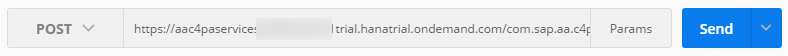
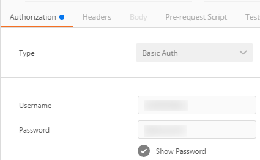

## Prerequisites
  - **Proficiency:** Beginner
  - **Tutorials:** [Test the "Key Influencer" services](http://www.sap.com/developer/tutorials/hcpps-rest-ps-keyinfluencer.html)

## Next Steps
  - [Configure a SAPUI5 application from a project template](http://www.sap.com/developer/tutorials/hcpps-sapui5-configure-application.html)

## Details

### You will learn
 - How to use the "Outliers" SAP Cloud for predictive services from a REST Client.

Only the synchronous mode will be tested here but you can mimic what was done in the [Test the "Forecast" SAP Cloud for predictive services using a REST client](http://www.sap.com/developer/tutorials/hcpps-rest-ps-forecast.html) tutorial for the asynchronous mode.

### Time to Complete
  **10 minutes**

> In order to ease the readability of this tutorial, we have used tokens to replace long URLs.
Therefore you can replace any occurrence of the token by the value listed above.
>
> Token               | Value
------------------- | -------------
<code><b>&lt;Account name&gt;</b></code>  | your SAP Cloud Platform account name. On a developer trial account, it should end by `trial`
<code><b>&lt;C4PA URL&gt;</b></code> | `https://aac4paservices<`<code><b>Account name</b></code>`>.hanatrial.ondemand.com/com.sap.aa.c4pa.services`
>
> If you are unclear with what is your SAP Cloud Platform account name, you can refer to the following blog entry: [SAP Cloud Platform login, user name, account id, name or display name: you are lost? Not anymore!](https://blogs.sap.com/2017/01/31/sap-hana-cloud-platform-trial-login-name-user-name-account-name-account-identifier-you-are-lost-not-anymore/)

[ACCORDION-BEGIN [Info:](A short description of the Outliers service)]
The Outliers service identifies the odd profiles of a dataset whose target indicator is significantly different from what is expected.

This service:

  - Identifies outliers contained in a dataset with regard to a target indicator
  - Ranks the outliers to get the oddest on top
  - Provides the reasons why an identified outlier is odd

In general, an outlier can either result from a data quality issue to correct or represent a suspicious case to investigate.

An observation is considered an outlier if the difference between its "predicted value" and its "real value" exceeds the value of the error bar where the error bar is a deviation measure of the values around the predicted score.

Reasons will list the variables whose values have the most influence in the score. For each variables, the contribution corresponding to the score is compared to its contribution for the whole population. The variables for which the contribution is the most differential are selected as the most important reason.

**Note:** The target of the dataset must be either binary or continuous. Multinomial targets are not supported.

To summarize, in order to execute the outliers service, you need a dataset with:

  - a target variable
  - a set of variables that will be analyzed

Optionally, you can define the following parameters to enhance your analysis:

  - number of outliers : number of outliers to return
  - number of reasons : number of reasons to return for each outlier
  - weight variable: column to be used to increase the importance of a row
  - skipped variables: a list of variables to skip from the analysis
  - variable description: a more details description of the dataset

[DONE]
[ACCORDION-END]

[ACCORDION-BEGIN [Info:](A short description of the Census dataset)]

The dataset will be using during this tutorial is extracted from the sample dataset available with SAP BusinessObjects Predictive Analytics.

The Census sample data file that you will use to follow the scenarios for Regression/Classification and Segmentation/Clustering is an excerpt from the American Census Bureau database, completed in 1994 by Barry Becker.

> **Note:** For more information about the American Census Bureau, see http://www.census.govInformation published on non-SAP site.

-

This file presents the data on 48,842 individual Americans, of at least 17 years of age. Each individual is characterized by 15 data items. These data, or variables, are described in the following table.

Variable | Description | Example of Values
-------------- | -------------- | --------------
`age` | Age of individuals | Any numerical value greater than 17
`workclass` | Employer category of individuals | Private, Self-employed-not-inc, ...
`fnlwgt` | Weight variable, allowing each individual to represent a certain percentage of the population | Any numerical value, such as 0, 2341 or 205019
`education` | Level of study, represented by a schooling level, or by the title of the degree earned | 11th, Bachelors
`education-num` | Number of years of study, represented by a numerical value | A numerical value between 1 and 16
`marital-status` | Marital status | Divorced, Never-married, ...
`occupation` | Job classification | Sales, Handlers-cleaners, ...
`relationship` | Position in family | Husband, Wife, ...
`race` | Ethnicity |
`sex` | Gender | Male, Female, ...
`capital-gain` | Annual capital gains | Any numerical value
`capital-loss` | Annual capital losses | Any numerical value
`native country` | Country of origin| United States, France, ...
`class` | Variable indicating whether or not the salary of the individual is greater or less than $50,000| "1" if the individual has a salary of greater than $50,000 & "0" if the individual has a salary of less than $50,000

[DONE]
[ACCORDION-END]  

[ACCORDION-BEGIN [Step 1: ](Register the Census dataset)]

First we need to register the dataset.

As described in the **Step 1: Register a dataset** from the [Test the "Data Set" SAP Cloud for predictive services using a REST client](http://www.sap.com/developer/tutorials/hcpps-rest-ps-dataset.html) tutorial, register the Census dataset using the following elements:

Field Name     | Value
-------------- | --------------
Request Type   | `POST`
URL            | `<`<code><b>C4PA URL</b></code>`>/api/analytics/dataset/sync`

```json
{
"hanaURL":"DEMO/Census"
}
```

**Take note of the returned dataset identifier.**

[DONE]
[ACCORDION-END]    

[ACCORDION-BEGIN [Step 2: ](Run the Outliers service)]

Open a new tab in ***Postman***.

Fill in the following information:

Field Name     | Value
-------------- | --------------
Request Type   | `POST`
URL            | `<`<code><b>C4PA URL</b></code>`>/api/analytics/outliers/sync`



Select the **Authorization** tab and fill in the following information:

Field Name     | Value
:------------- | :-------------
Type           | `Basic Auth`
Username       | your ***SAP Cloud Platform Account*** login (usually the email address used to register your ***SAP Cloud Platform*** account)
Password*      | your ***SAP Cloud Platform Account*** password



Select the **Body** tab, enable the **raw** mode and select `JSON (application/json)` in the drop down, then add the following content:

```json
{
  "datasetID": 3,
  "targetColumn": "age",
  "skippedVariables" : ["id", "class", "sex", "race"],
  "variableDescription" : [
  	{"position" : "1", "variable" : "id", "storage" : "number" , "value" : "nominal" ,  "key" : "1"},
  	{"position" : "2", "variable" : "age", "storage" : "number" , "value" : "continuous"},
  	{"position" : "3", "variable" : "workclass", "storage" : "string" , "value" : "nominal" ,  "missing" : "?"},
  	{"position" : "4", "variable" : "fnlwgt", "storage" : "number" , "value" : "continuous"},
  	{"position" : "5", "variable" : "education", "storage" : "string" , "value" : "nominal"},
  	{"position" : "6", "variable" : "education_num", "storage" : "number" , "value" : "ordinal"},
  	{"position" : "7", "variable" : "marital_status", "storage" : "string" , "value" : "nominal"},
  	{"position" : "8", "variable" : "occupation", "storage" : "string" , "value" : "nominal" ,  "missing" : "?"},
  	{"position" : "9", "variable" : "relationship", "storage" : "string" , "value" : "nominal"},
  	{"position" : "10", "variable" : "race", "storage" : "string" , "value" : "nominal"},
  	{"position" : "11", "variable" : "sex", "storage" : "string" , "value" : "nominal"},
  	{"position" : "12", "variable" : "capital_gain", "storage" : "number" , "value" : "continuous" ,  "missing" : "99999"},
  	{"position" : "13", "variable" : "capital_loss", "storage" : "number" , "value" : "continuous"},
  	{"position" : "14", "variable" : "hours_per_week", "storage" : "number" , "value" : "continuous"},
  	{"position" : "15", "variable" : "native_country", "storage" : "string" , "value" : "nominal" ,  "missing" : "?"},
  	{"position" : "16", "variable" : "class", "storage" : "number" , "value" : "nominal"}
  ]  
}
```
> Make sure the `datasetID` (here the value 3) is correct. To get the list of valid identifier, you can run ***Step 6: List all registered datasets*** from the [Test the "Data Set" SAP Cloud for predictive services using a REST client](http://www.sap.com/developer/tutorials/hcpps-rest-ps-dataset.html) tutorial.

-

With these settings, we will get a scoring equation as SQL for HANA to predict the probability of the class variable to be a 1, excluding the "id", "sex", "race" variables from the analysis. It will also adjust the dataset description with proper settings.

Click on **Send**

Congratulations! You have just run the outliers service on the Census dataset.

Here is the result:

```
{
  "modelPerformance": {
    "confidenceIndicator": 1,
    "predictionConfidence": 0.9925,
    "predictivePower": 0.8196,
    "qualityRating": 5
  },
  "numberOfOutliers": 356,
  "outliers": [
    {
      "dataPoint": {
        "id": 43706,
        "age": 28,
        "workclass": "Private",
        "fnlwgt": 103432,
        "education": "HS-grad",
        "education_num": 9,
        "marital_status": "Never-married",
        "occupation": "Transport-moving",
        "relationship": "Own-child",
        "race": "White",
        "sex": "Male",
        "capital_gain": 0,
        "capital_loss": 0,
        "hours_per_week": 45,
        "native_country": "Portugal",
        "class": 1
      },
      "errorBar": 0.07390104953508236,
      "predictedValue": -0.19959287909119922,
      "realValue": "1",
      "reasons": [
        {
          "value": "Never-married",
          "variable": "marital_status"
        },
        {
          "value": "Own-child",
          "variable": "relationship"
        },
        {
          "value": "28",
          "variable": "age"
        }
      ]
    },
    ...
  ],
  "parameters": {
    "datasetID": 3,
    "skippedVariables": [
      "id"
    ],
    "targetColumn": "class",
    "variableDescription": [
      {
        "key": 1,
        "position": 1,
        "storage": "integer",
        "value": "nominal",
        "variable": "id"
      },
      ...
    ]
  }
}
```

We can see that 356 records out of the 48842 are marked as outliers, where the difference between the "predicted value" and the "real value" exceeds the value of the error bar. The list is sorted by descending order to give first the records with the highest difference.

You can also play with the following parameters and check the differences:
- number of outliers : ask for 10, 50 and 100
- number of reasons" : ask for 1,5 and 10
- skipped variables: exclude "`marital_status`"
- variable description: for example as an ordinal variable

[DONE]
[ACCORDION-END]    

### Optional
For more details on the SAP Cloud for predictive services, you can check the following URL:
  - `<`<code><b>C4PA URL</b></code>`>/raml/console/index.html?raml=../api/aa-cloud-services.raml`

## Next Steps
  - [Configure a SAPUI5 application from a project template](http://www.sap.com/developer/tutorials/hcpps-sapui5-configure-application.html)
