## Prerequisites
  - **Proficiency:** Intermediate
  - **Tutorials:** [Test the "Forecast" HCP predictive service from a REST client](http://go.sap.com/developer/tutorials/hcpps-rest-ps-forecast.html)

## Next Steps
  - [Visualize your predictive demo data set in a SAPUI5 application using an  OData service](http://go.sap.com/developer/tutorials/hcpps-sapui5-odata.html)

## Details
### You will learn
  - How to add a Destination which will enable the use of an OData Service and the HCP predictive services deployed on HCP
  - How to create a SAPUI5 application from a template

### Time to Complete
  **10 minutes**

---

1. Log into the [***SAP HANA Cloud Platform Cockpit***](http://account.hanatrial.ondemand.com/cockpit) with your free trial account and access "Your Personal Developer Account".

    Click on your ***HCP Account*** identifier (which ends with *trial*) as highlighted on the below screenshot.

    

1. On the left side bar, you can navigate in **Connectivity** > **Destinations**.

    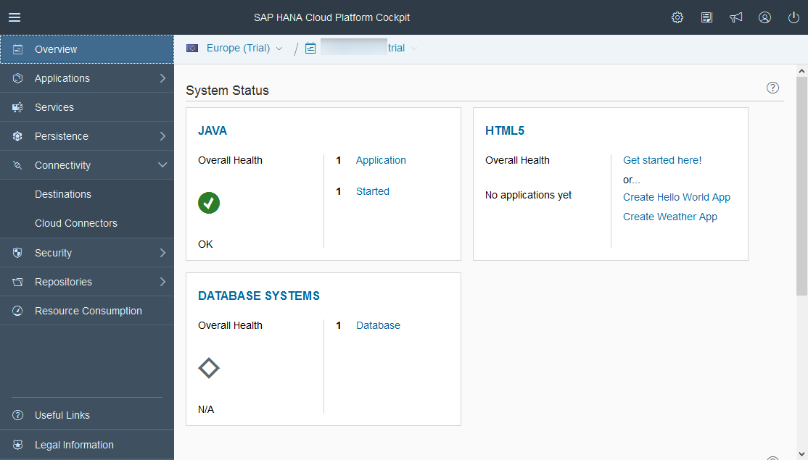

1. On the ***Destinations*** overview page, click on **New Destination**

    

    Enter the following information:

    Field Name           | Value
    -------------------- | --------------
    Name                 | `HCPOData`
    Type                 | `HTTP`
    Description          | `OData Service Destination to access the Time Series Data`
    URL                  | `https://trial<`<code><b>HCP Identifier</b></code>`>trial.hanatrial.ondemand.com`
    Proxy Type           | `Internet`
    Authentication       | `Basic Authentication`
    User                 | `HCPPSTRIAL` (your ***HANA Account*** login)
    Password             | `Welcome16` (your ***HANA Account*** password)

    > Make sure you update the URL with your HCP Account identifier.

    Property Name          | Value
    ---------------------- | --------------
    `WebIDEUsage`          | `odata_xs`
    `WebIDEEnabled`        | `true`
    `WebIDESystem`         | `HCPOData`

    Click on **Save**

    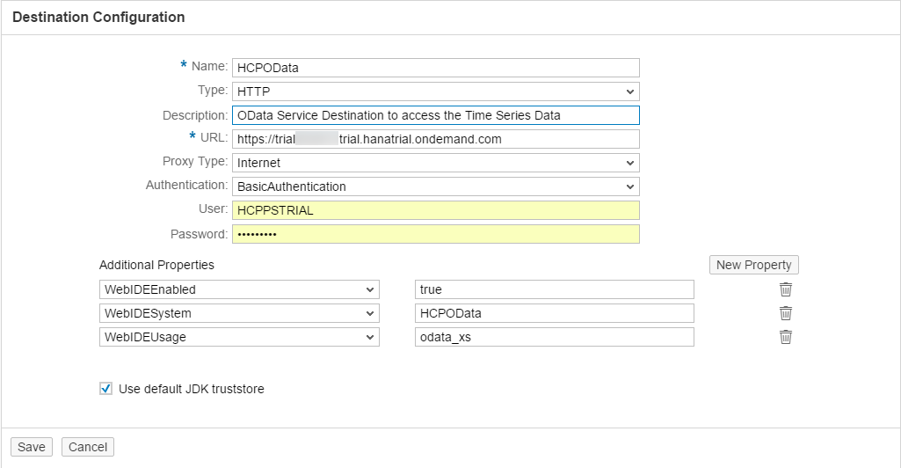

    Click on **New Destination**

    Enter the following information:

    Field Name           | Value
    -------------------- | --------------
    Name                 | `HCPps`
    Type                 | `HTTP`
    Description          | `HCP predictive service Destination`
    URL                  | `https://aac4paservices<`<code><b>HCP Identifier</b></code>`>trial.hanatrial.ondemand.com/com.sap.aa.c4pa.services`
    Proxy Type           | `Internet`
    Authentication       | `AppToAppSSO`
    
    > Make sure you update the URL with your HCP Account identifier.

    Property Name          | Value
    ---------------------- | --------------
    `WebIDEEnabled`        | `true`
    `WebIDESystem`         | `HCPps`

    Click on **Save**

    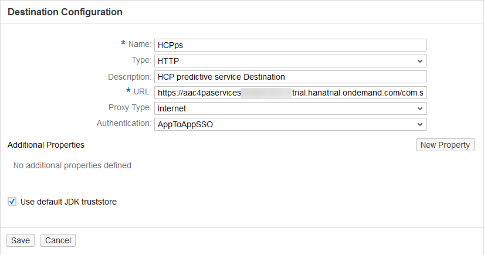

    You can use the **Test Connectivity** button 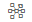 next to each **Destination** to validate our configuration.

1. On the left side bar, you can navigate in **Applications** > **HTML5 Applications**.

    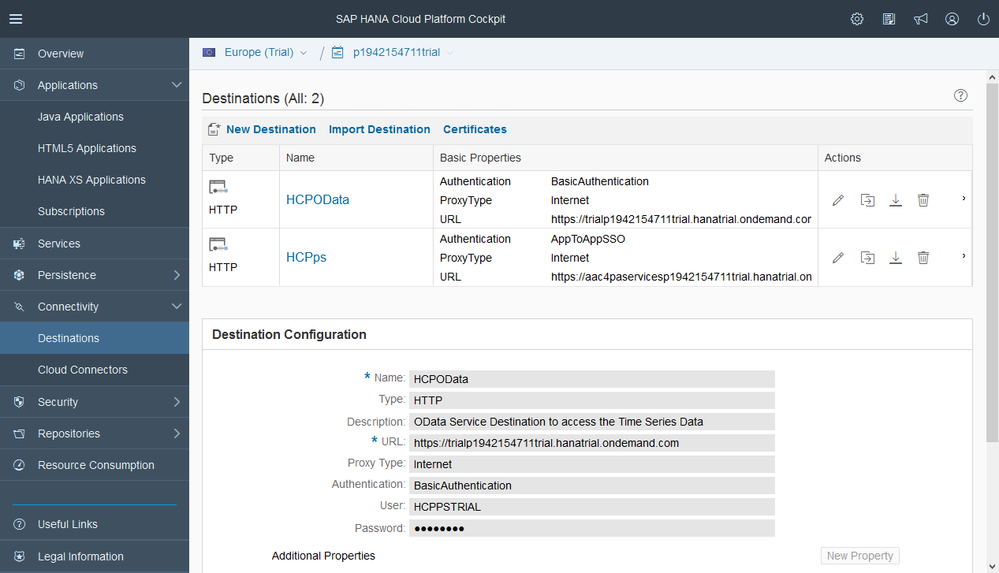

1. Click on **New Application**.

    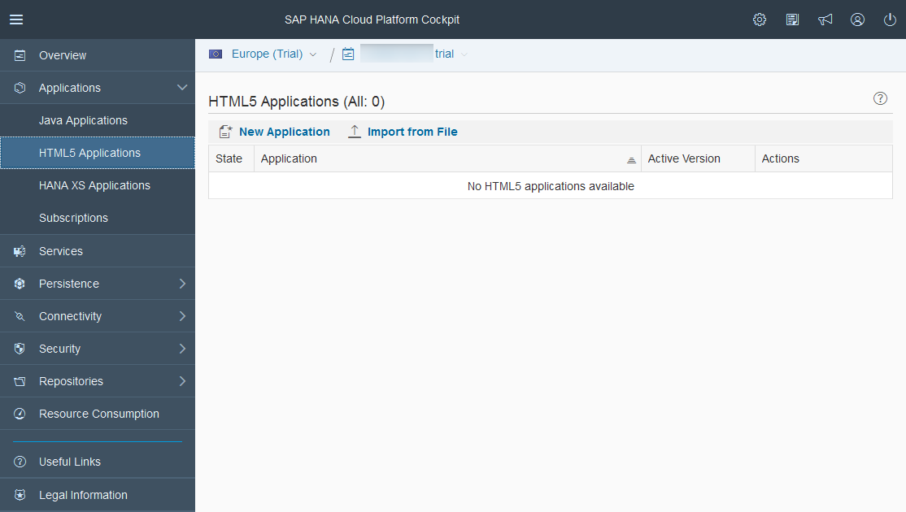

    Enter the following information:

    Field Name           | Value
    -------------------- | --------------
    Application Name     | `hcppredictiveservicesdemo`

    Click on **Save**

    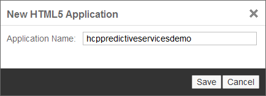

1. Click on the **Edit Application** button  next to the `hcppredictiveservicesdemo`

    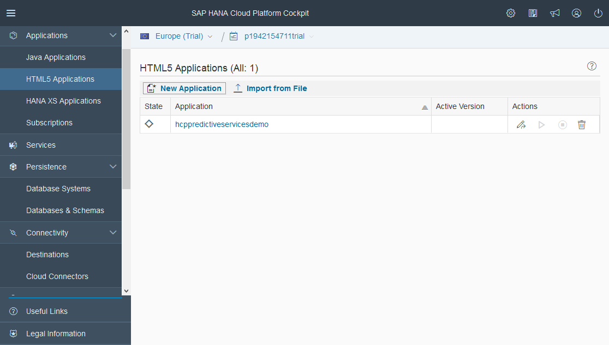

1. Then you will get prompted to ***Clone Repository***. Enter your HCP credentials, as your HCP account entitles you to use a Git repository.

    Check the **Remember Me** box

    Click on **OK**

    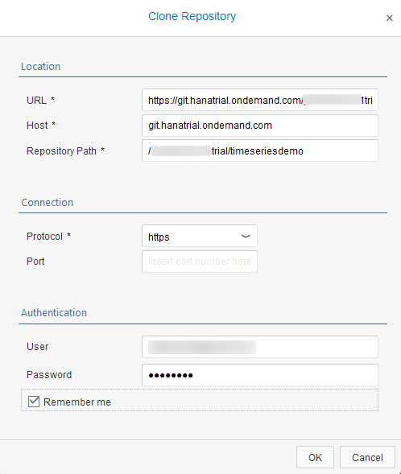

    Click on **Do It Later**

    

1. Once done, you will get access to the ***SAP Web IDE***

    Click on **New Project from Template** in the ***Create Project*** section

    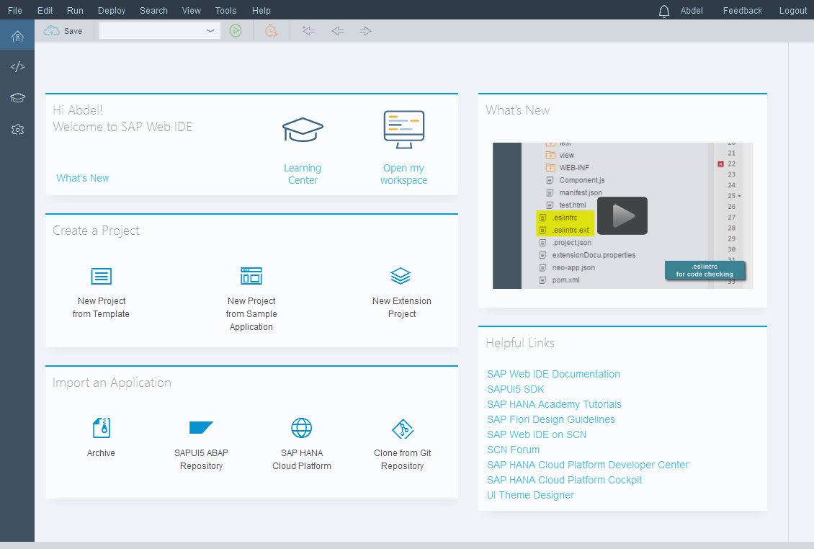

    Select the **SAPUI5 Application** tile, then click on **Next**

    

    Enter the following information, then click on **Next**

    Field Name           | Value
    -------------------- | --------------
    Project Name         | `hcppredictiveservicesdemo`
    Namespace            | `demo`

    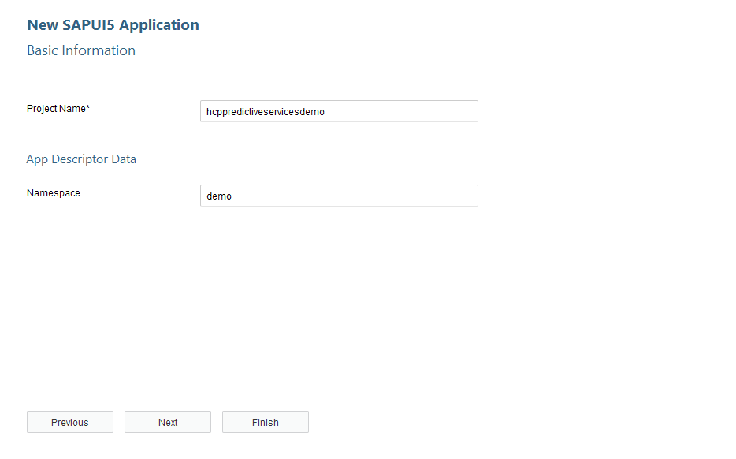

    Enter the following information, then click on **Finish**

    Field Name           | Value
    -------------------- | --------------
    View Type            | `XML`
    View Name            | `demo`

    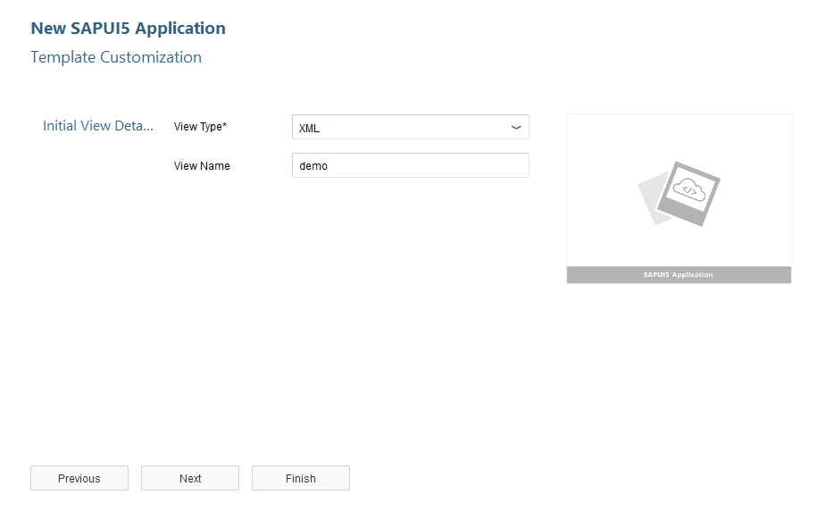

1. Your template project is created! Let's continue. and add the "Destinations" we have created previously.

    Open the `neo-app.json` file and update the file like this:

    ```JSON
    {
      "welcomeFile": "/webapp/index.html",
      "routes": [
        {
          "path": "/resources",
          "target": {
            "type": "service",
            "name": "sapui5",
            "entryPath": "/resources"
          },
          "description": "SAPUI5 Resources"
        },
        {
          "path": "/test-resources",
          "target": {
            "type": "service",
            "name": "sapui5",
            "entryPath": "/test-resources"
          },
          "description": "SAPUI5 Test Resources"
       },
       {
          "path": "/HCPOData",
          "target": {
            "type": "destination",
            "name": "HCPOData"
          },
          "description": "HCPOData destination"
       },
       {
          "path": "/HCPps",
          "target": {
            "type": "destination",
            "name": "HCPps"
          },
          "description": "HCPps destination"
        }
      ],
      "sendWelcomeFileRedirect": true
    }
    ```

    Click on the  button (or press CTRL+S)

1. Open the `index.html` file in the `hcppredictiveservicesdemo\webapp` directory and add the following `routes` to the existing list.

    Replace the following line of code

    ```js
    sap.ui.getCore().attachInit(function() {
      new sap.m.Shell({
        app: new sap.ui.core.ComponentContainer({
          height : "100%",
          name : "demo"
        })
      }).placeAt("content");
    });    
    ```
    by

    ```js
    sap.ui.getCore().attachInit(function() {
      sap.ui.getCore().setModel(new sap.ui.model.json.JSONModel());
      new sap.m.Shell({
        app: new sap.ui.view({
          height : "100%",
          viewName: "demo.view.demo",
          type: sap.ui.core.mvc.ViewType.XML
        })
      }).placeAt("content");
    });
    ```

    Click on the  button (or press CTRL+S)

1. From the menu bar, select **Run** > **Run As** > **Web Application**  or use the  **Run** button. This will create the `.user.project.json` (hidden by default) and open an empty web page.

    

1. Now, let's commit our application. Click on the **Git** button on the right side bar.

    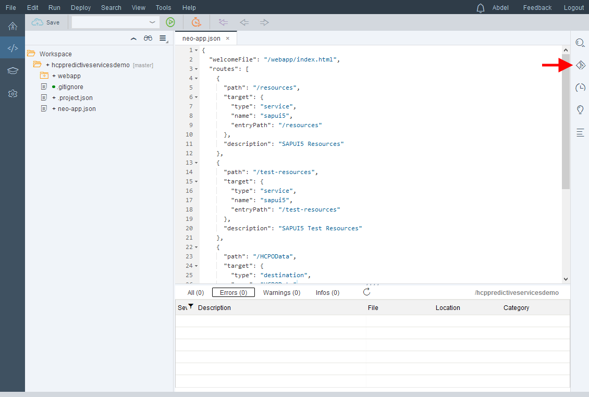

1. Check the **Stage All** and **Amend Change** box, then click on **Commit and Push** > **origin\master**.

    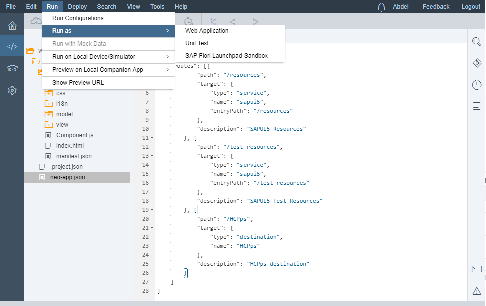

## Next Steps
  - [Visualize your predictive demo data set in a SAPUI5 application using an  OData service](http://go.sap.com/developer/tutorials/hcpps-sapui5-odata.html)
