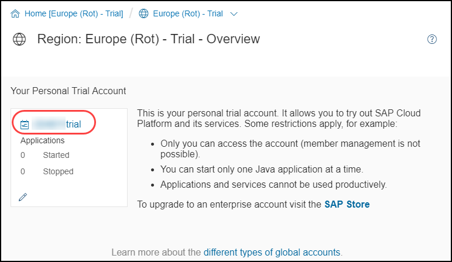
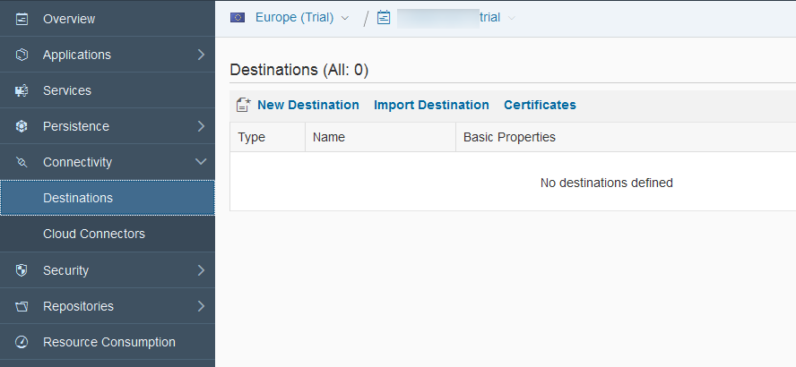
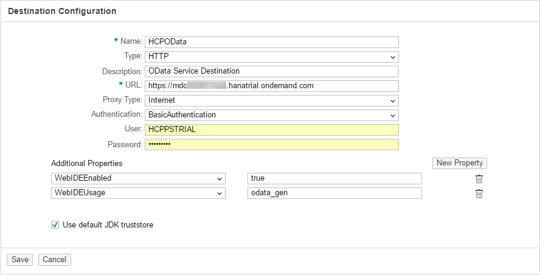
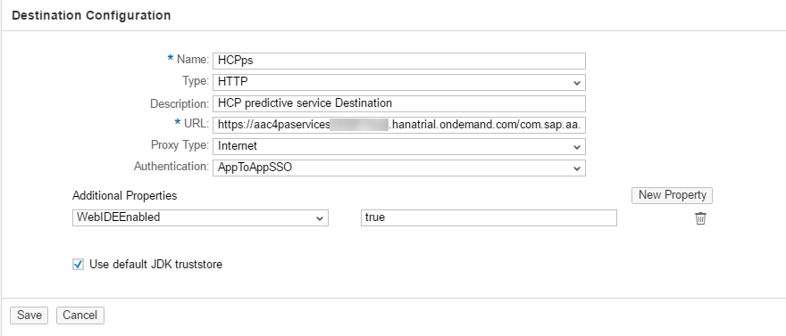
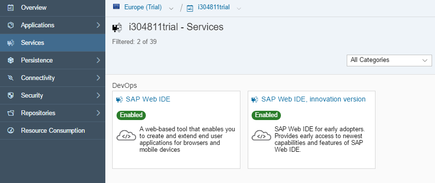
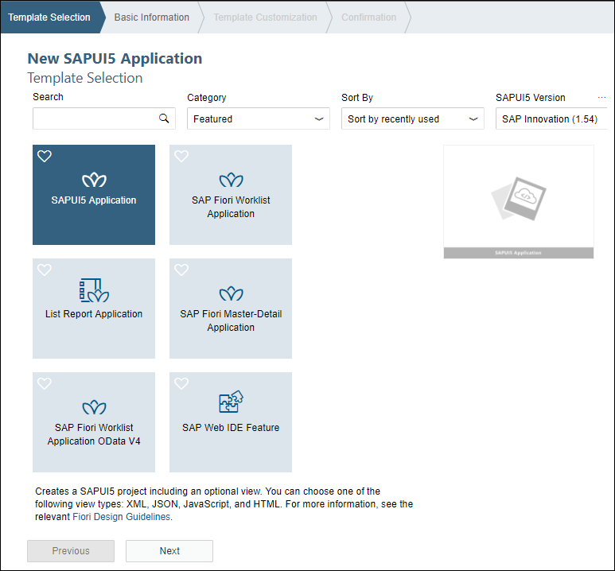
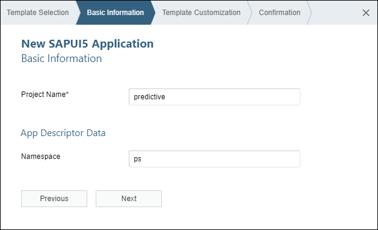
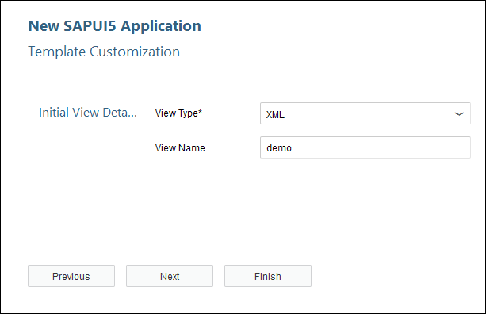
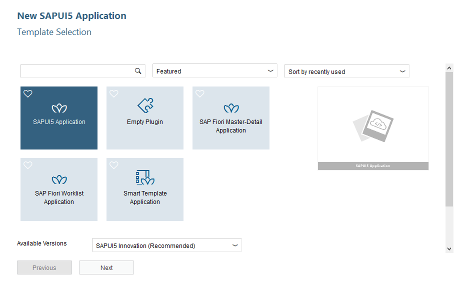

## Prerequisites
  - **Proficiency:** Intermediate
  - **Tutorials:** [Configure the SAP Predictive services](https://www.sap.com/developer/groups/ps-configure.html)

## Next Steps
- [Build an SAPUI5 application to interact with the SAP Predictive services](https://www.sap.com/developer/groups/ps-sapui5.html)

## Details
### You will learn

  - How to add a destination to your SAP Cloud Platform account
  - How to create a SAPUI5 application from a template using the SAP Web IDE
  - How to add a destination to your SAPUI5 application
  - Run your SAPUI5 application
  &nbsp;

> ### **Note:** The intent of the following tutorials is not to focus on SAPUI5 but to use it as mean to execute the SAP Predictive services.
>
>For more content on SAPUI5, you can check the dedicated SAPUI5 tutorials or the online SAPUI5 documentation available here:
> <https://ui5.sap.com/>

### Time to Complete
  **10 minutes**

[ACCORDION-BEGIN [Info: ](Application URL)]

In order to ease the readability of this tutorial, we have used the **C4PAURL** token to replace the predictive services **Application URL** displayed on the overview page.

Therefore you can replace any occurrence of the token by your value listed.

The **Application URL** should look like this (where XYZ is your SAP Cloud Platform account name):

 - `https://aac4paservicesXYZ.hanatrial.ondemand.com/com.sap.aa.c4pa.services`

If you are unclear with what is your SAP Cloud Platform account name, you can refer to the following blog entry: [SAP Cloud Platform login, user name, account id, name or display name: you are lost? Not anymore!](https://blogs.sap.com/2017/01/31/sap-hana-cloud-platform-trial-login-name-user-name-account-name-account-identifier-you-are-lost-not-anymore/)

[DONE]
[ACCORDION-END]

[ACCORDION-BEGIN [Step 1: ](Create your destination)]
Log into the [***SAP Cloud Platform Cockpit Neo Trial***](https://account.hanatrial.ondemand.com/cockpit#/region/neo-eu1-trial/overview) with your free trial account on **Europe (Rot) - Trial** and access "Your Personal Developer Account".

Click on your ***SAP Cloud Platform Account*** identifier (which ends with *trial*) as highlighted on the below screenshot.



On the left side bar, you can navigate in **Connectivity** > **Destinations**.


On the ***Destinations*** overview page, click on **New Destination**

Enter the following information:

Field Name           | Value
:------------------- | :--------------
Name                 | `psapi`
Type                 | `HTTP`
Description          | `SAP Predictive services Destination`
URL                  | the C4PA URL as described at the beginning
Proxy Type           | `Internet`
Authentication       | `AppToAppSSO`

> Make sure you update the URL with your SAP Cloud Platform Account identifier.

Then you will need to add the following properties to the destination:

Property Name          | Value
:--------------------- | :--------------
`WebIDEEnabled`        | `true`
`ClientReadTimeout`    | 300000



Click on **Save**

Click on the **Test Connectivity** button  next to the `psapi` **Destination** to validate your configuration.

Provide an answer to the question below then click on **Validate**.

[VALIDATE_1]
[ACCORDION-END]

[ACCORDION-BEGIN [Step 2: ](Open the Web IDE)]

On the left side bar, you can navigate in **Services**, then using the search box enter `Web IDE`.



Click on the tile, then click on **Go to Service**.



You will get access to the **SAP Web IDE** main page:



[DONE]
[ACCORDION-END]

[ACCORDION-BEGIN [Step 3: ](Create your application using the SAPUI5 template)]

Click on **New Project from Template** in the ***Create Project*** section


Select the **SAPUI5 Application** tile, then click on **Next**



Enter the following information, then click on **Next**

Field Name           | Value
:------------------- | :--------------
Project Name         | `predictive`
Namespace            | `ps`



Enter the following information, then click on **Finish**

Field Name           | Value
:------------------- | :--------------
View Type            | `XML`
View Name            | `demo`



[DONE]
[ACCORDION-END]

[ACCORDION-BEGIN [Step 4: ](Add the destinations to your application)]

Your template project is created! Let's continue, and add the "destinations" previously created in the SAP Cloud Platform cockpit.

Open the `neo-app.json` file and update the file like this:

```json
{
	"welcomeFile": "/webapp/index.html",
	"routes": [{
		"path": "/resources",
		"target": {
			"type": "service",
			"name": "sapui5",
			"entryPath": "/resources"
		},
		"description": "SAPUI5 Resources"
	}, {
		"path": "/test-resources",
		"target": {
			"type": "service",
			"name": "sapui5",
			"entryPath": "/test-resources"
		},
		"description": "SAPUI5 Test Resources"
	}, {
		"path": "/ps",
		"target": {
			"type": "destination",
			"name": "psapi"
		},
		"description": "SAP Cloud Platform Predictive destination"
	}],
	"sendWelcomeFileRedirect": true
}
```

Click on the  button (or press CTRL+S)

> **Note:**  there are multiple ways to add your destinations in a SAPUI5 application depending on the type of destinations. Here, we will simply add them manually in the `neo-app.json` file.

[DONE]
[ACCORDION-END]

[ACCORDION-BEGIN [Step 5: ](Update the default view : demo.view.xml)]

The default view created is located in `webapp/view/demo.view.xml`. We will update the view to prepare for the next steps.

Open the `webapp/view/demo.view.xml` file and replace the existing code with the following code:

```xml
<mvc:View controllerName="pspredictive.controller.demo" xmlns:html="http://www.w3.org/2000/xhtml" xmlns:mvc="sap.ui.core.mvc"
	displayBlock="true" xmlns="sap.m" xmlns:custom="http://schemas.sap.com/sapui5/extension/sap.ui.core.CustomData/1">
	<SplitApp id="SplitAppDemo" initialMaster="master" initialDetail="detail">
		<masterPages>
			<Page id="master" title="Domains">
				<content>
					<List itemPress="onMasterListItemPress">
						<items>
							<StandardListItem title="Dataset Services" type="Navigation" custom:to="sub_master_dataset"/>
							<StandardListItem title="Forecast Services" type="Navigation" custom:to="sub_master_forecast"/>
						</items>
					</List>
				</content>
			</Page>
			<Page id="sub_master_dataset" title="Dataset Services" showNavButton="true" navButtonPress="onPressMasterBack">
				<content>
					<List itemPress="onDetailListItemPress">
						<items>
							<StandardListItem title="Register" type="Active" custom:to="detail_dataset_register"/>
							<StandardListItem title="Manage" type="Active" custom:to="detail_dataset_manage"/>
						</items>
					</List>
				</content>
			</Page>
			<Page id="sub_master_forecast" title="Forecast Services" showNavButton="true" navButtonPress="onPressMasterBack">
				<content>
					<List itemPress="onDetailListItemPress">
						<items>
							<StandardListItem title="Synchronous" type="Active" custom:to="detail_forecast_synchronous"/>
							<StandardListItem title="Asynchronous" type="Active" custom:to="detail_forecast_asynchronous"/>
						</items>
					</List>
				</content>
			</Page>
		</masterPages>
		<detailPages>
			<Page id="detail" title="Test the SAP Predictive Service in a SAPUI5 application">
				<content></content>
			</Page>
			<Page id="detail_dataset_register" title="Register your Dataset with the SAP Predictive services">
				<content>
					<!--<mvc:XMLView viewName="pspredictive.view.dataset.register"/>-->
				</content>
			</Page>
			<Page id="detail_dataset_manage" title="Manage your Data Set with the SAP Predictive services">
				<content>
					<!--<mvc:XMLView viewName="pspredictive.view.dataset.manage"/>-->
				</content>
			</Page>
			<Page id="detail_forecast_synchronous" title="Forecast with the SAP Predictive services (Synchronous Mode)">
				<content>
					<!--<mvc:XMLView viewName="pspredictive.view.forecast.synchronous"/>-->
				</content>
			</Page>
			<Page id="detail_forecast_asynchronous" title="Forecast with the SAP Predictive services (Asynchronous Mode)">
				<content>
					<!--<mvc:XMLView viewName="pspredictive.view.forecast.asynchronous"/>-->
				</content>
			</Page>
		</detailPages>
	</SplitApp>
</mvc:View>
```

Click on the  button (or press CTRL+S).

[DONE]
[ACCORDION-END]

[ACCORDION-BEGIN [Step 6: ](Update the default controller : demo.controller.js)]

The default controller is located in `webapp/controller/demo.controller.js`. We will update the view to prepare for the next steps.

Open the `webapp/controller/demo.controller.js` file and replace the existing code with the following code:

```js
sap.ui.define([
	"sap/ui/core/mvc/Controller",
	"sap/m/MessageToast"
], function(Controller, MessageToast) {
	"use strict";

	return Controller.extend("pspredictive.controller.demo", {
		onInit: function() {
			if (typeof sap.ui.getCore().getModel() === 'undefined') {
				sap.ui.getCore().setModel(new sap.ui.model.json.JSONModel());
			}
		},
		getSplitAppObj: function() {
			var result = sap.ui.getCore().byId(this.createId("SplitAppDemo"));
			if (!result) {
				MessageToast.show("SplitApp object can't be found", {
					duration: 5000
				});
			}
			return result;
		},
		onMasterListItemPress: function(oEvent) {
			var sToPageId = oEvent.getParameter("listItem").getCustomData()[0].getValue();
			this.getSplitAppObj().toMaster(this.createId(sToPageId));
		},
		onPressMasterBack: function() {
			this.getSplitAppObj().backMaster();
		},
		onDetailListItemPress: function(oEvent) {
			var sToPageId = oEvent.getParameter("listItem").getCustomData()[0].getValue();
			this.getSplitAppObj().toDetail(this.createId(sToPageId));
		}
	});
});
```

Click on the  button (or press CTRL+S)

[DONE]
[ACCORDION-END]

[ACCORDION-BEGIN [Step 7: ](Run the application)]

From the menu bar, select **Run** > **Run As** > **Web Application**  or use the  **Run** button.



This will open a web page with the following content:


[DONE]
[ACCORDION-END]

[ACCORDION-BEGIN [Solution: ](Created and modified files)]

In case you are having problems when running the application, please find bellow the created and modified files:

  - [`neo-app.json`](https://raw.githubusercontent.com/SAPDocuments/Tutorials/master/tutorials/hcpps-sapui5-configure-application/predictive/neo-app.json)
  - [`webapp/controller/demo.controller.js`](https://raw.githubusercontent.com/SAPDocuments/Tutorials/master/tutorials/hcpps-sapui5-configure-application/predictive/webapp/controller/demo.controller.js)
  - [`webapp/view/demo.view.xml`](https://raw.githubusercontent.com/SAPDocuments/Tutorials/master/tutorials/hcpps-sapui5-configure-application/predictive/webapp/view/demo.view.xml)

The complete project can be found on SAP Tutorial public [GitHub repository](https://github.com/SAPDocuments/Tutorials/tree/master/tutorials/hcpps-sapui5-configure-application/predictive).

However, you won't be able to clone the repository and directly run the code from the current directory structure. You have to copy the `predictive` directory content into your existing project directory.

Make sure you check the [LICENSE](https://github.com/SAPDocuments/Tutorials/blob/master/LICENSE.txt) before starting using its content.

[DONE]
[ACCORDION-END]

## Next Steps
- [Build an SAPUI5 application to interact with the SAP Predictive services](https://www.sap.com/developer/groups/ps-sapui5.html)
