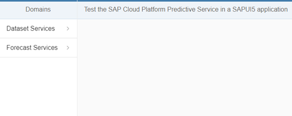

## Prerequisites
  - **Proficiency:** Intermediate
  - **Tutorials:** [Test the "Outliers" SAP Cloud Platform predictive service from a REST client](http://www.sap.com/developer/tutorials/hcpps-rest-ps-outliers.html)

## Next Steps
  - [Visualize your predictive demo datasets in a SAPUI5 application using an HANA XS OData service](http://www.sap.com/developer/tutorials/hcpps-sapui5-odata.html)

## Details
### You will learn
  - How to add a destination to your SAP Cloud Platform account
  - How to create a SAPUI5 application from a template using the SAP Web IDE
  - How to add a destination to your SAPUI5 application
  - Run your SAPUI5 application

> **Note:**
The intent of the following tutorials is not to focus on SAPUI5 but to use it as mean to execute the SAP Cloud Platform predictive services.
For more content on SAPUI5, you can check the dedicated SAPUI5 tutorials or the online SAPUI5 documentation available here: https://sapui5.hana.ondemand.com

### Time to Complete
  **10 minutes**

> In order to ease the readability of this tutorial, we have used tokens to replace long URLs.
Therefore you can replace any occurrence of the token by the value listed above.
>
> Token               | Value
------------------- | -------------
<code><b>&lt;HCP account name&gt;</b></code>  | on a developer trial account, it should end by `trial`
<code><b>&lt;C4PA URL&gt;</b></code> | `https://aac4paservices<`<code><b>HCP account name</b></code>`>.hanatrial.ondemand.com/com.sap.aa.c4pa.services`
<code><b>&lt;HANA instance id&gt;</b></code>  | as created previously, should be `mdc`
<code><b>&lt;HANA URL&gt;</b></code> | `https://<`<code><b>HANA instance id</b></code>`><`<code><b>HCP account name</b></code>`>.hanatrial.ondemand.com`
<code><b>&lt;HANA User&gt;</b></code> | `HCPPSTRIAL`
<code><b>&lt;HANA Password&gt;</b></code> | `Welcome16`
>
> If you are unclear with what is your SAP Cloud Platform account name, you can refer to the following blog entry: [SAP HANA Cloud Platform login, user name, account id, name or display name: you are lost? Not anymore!](https://blogs.sap.com/2017/01/31/sap-hana-cloud-platform-trial-login-name-user-name-account-name-account-identifier-you-are-lost-not-anymore/)

[ACCORDION-BEGIN [Step 1: ](Create your destination)]
Log into the [***SAP HANA Cloud Platform Cockpit***](http://account.hanatrial.ondemand.com/cockpit) with your free trial account and access "Your Personal Developer Account".

Click on your ***HCP Account*** identifier (which ends with *trial*) as highlighted on the below screenshot.


On the left side bar, you can navigate in **Connectivity** > **Destinations**.


On the ***Destinations*** overview page, click on **New Destination**


Enter the following information:

Field Name           | Value
-------------------- | --------------
Name                 | `HCPOData`
Type                 | `HTTP`
Description          | `OData Service Destination`
URL                  | `<HANA URL>`
Proxy Type           | `Internet`
Authentication       | `Basic Authentication`
User                 | `<HANA User>`
Password             | `<HANA Password>`

Then you will need to add the following properties to the destination:

Property Name          | Value
---------------------- | --------------
`WebIDEUsage`          | `odata_gen`
`WebIDEEnabled`        | `true`

Click on **Save**


Click on **New Destination**

Enter the following information:

Field Name           | Value
-------------------- | --------------
Name                 | `HCPps`
Type                 | `HTTP`
Description          | `HCP predictive service Destination`
URL                  | `<C4PA URL>`
Proxy Type           | `Internet`
Authentication       | `AppToAppSSO`

> Make sure you update the URL with your HCP Account identifier.

Then you will need to add the following properties to the destination:

Property Name          | Value
---------------------- | --------------
`WebIDEEnabled`        | `true`

Click on **Save**


You can use the **Test Connectivity** button  next to each **Destination** to validate our configuration.

[DONE]
[ACCORDION-END]

[ACCORDION-BEGIN [Step 2: ](Open the Web IDE)]

On the left side bar, you can navigate in **Services**, then using the search box enter `Web IDE`.


Click on the tile, then click on **Open SAP Web IDE**.


You will get access to the **SAP Web IDE** main page:


[DONE]
[ACCORDION-END]

[ACCORDION-BEGIN [Step 3: ](Create your application using the SAPUI5 template)]

Click on **New Project from Template** in the ***Create Project*** section


Select the **SAPUI5 Application** tile, then click on **Next**


Enter the following information, then click on **Next**

Field Name           | Value
-------------------- | --------------
Project Name         | `hcppredictiveservicesdemo`
Namespace            | `demo`


Enter the following information, then click on **Finish**

Field Name           | Value
-------------------- | --------------
View Type            | `XML`
View Name            | `demo`


[DONE]
[ACCORDION-END]

[ACCORDION-BEGIN [Step 4: ](Add the destinations to your application)]

Your template project is created! Let's continue, and add the "destinations" previously created in the SAP Cloud Platform cockpit.

> **Note:**  there are multiple ways to add your destinations in a SAPUI5 application depending on the type of destinations. Here, we will simply add them manually in the `neo-app.json` file.

Open the `neo-app.json` file and update the file like this:

```json
{
	"welcomeFile": "index.html",
	"routes": [{
			"path": "/resources",
			"target": {
				"type": "service",
				"name": "sapui5",
				"entryPath": "/resources"
			},
			"description": "SAPUI5 Resources"
		}, {
			"path": "/test-resources",
			"target": {
				"type": "service",
				"name": "sapui5",
				"entryPath": "/test-resources"
			},
			"description": "SAPUI5 Test Resources"
		}, {
			"path": "/HCPOData",
			"target": {
				"type": "destination",
				"name": "HCPOData"
			},
			"description": "HCPOData destination"
		}, {
			"path": "/HCPps",
			"target": {
				"type": "destination",
				"name": "HCPps"
			},
			"description": "HCPps destination"
		}
	]
}
```

Click on the  button (or press CTRL+S)

[DONE]
[ACCORDION-END]

[ACCORDION-BEGIN [Step 5: ](Update the namespace definition)]

Due to recent updates in the SAPUI5 template in the Web IDE, the namespace that you have set in the wizards might not be properly reflected in the created application.

To avoid any problem with the tutorials code, we will manually add a new namespace that we will use.

Open the `index.html` file in the `hcppredictiveservicesdemo\webapp` directory and add the following `resourceroots` to the existing list.

Replace the following line of code

```js
data-sap-ui-resourceroots='{"xxxxx": ""}'
```
by

```javascript
data-sap-ui-resourceroots='{"xxxxx": "", "sapui5demo": ""}'
```

The `xxxxx` is the namespace generated by the template wizard.

Click on the  button (or press CTRL+S)

[DONE]
[ACCORDION-END]

[ACCORDION-BEGIN [Step 6: ](Update the default view : `demo.view.xml`)]

The default view created is located in `webapp\view\demo.view.xml`. We will update the view to prepare for the next steps.

Open the `webapp\view\demo.view.xml` file and replace the existing code with the following code:

```xml
<mvc:View controllerName="xxxxx.controller.demo" xmlns:html="http://www.w3.org/1999/xhtml" xmlns:mvc="sap.ui.core.mvc"
  xmlns:mvc="sap.ui.core.mvc" displayBlock="true" xmlns="sap.m"
	xmlns:custom="http://schemas.sap.com/sapui5/extension/sap.ui.core.CustomData/1">
	<SplitApp id="SplitAppDemo" initialMaster="master" initialDetail="detail">
		<masterPages>
			<Page id="master" title="Domains">
				<content>
					<List itemPress="onMasterListItemPress">
						<items>
							<StandardListItem title="HANA XS OData" type="Navigation" custom:to="sub_master_odata"/>
							<StandardListItem title="Dataset Services" type="Navigation" custom:to="sub_master_dataset"/>
							<StandardListItem title="Forecast Services" type="Navigation" custom:to="sub_master_forecast"/>
						</items>
					</List>
				</content>
			</Page>
			<Page id="sub_master_odata" title="HANA XS OData" showNavButton="true" navButtonPress="onPressMasterBack">
				<content>
					<List itemPress="onDetailListItemPress">
						<items>
							<StandardListItem title="Cash Flow" type="Active" custom:to="detail_odata_cashflow"/>
							<StandardListItem title="Census" type="Active" custom:to="detail_odata_census"/>
							<StandardListItem title="E-Commerce Transaction" type="Active" custom:to="detail_odata_transaction"/>
						</items>
					</List>
				</content>
			</Page>
			<Page id="sub_master_dataset" title="Dataset Services" showNavButton="true" navButtonPress="onPressMasterBack">
				<content>
					<List itemPress="onDetailListItemPress">
						<items>
							<StandardListItem title="Register" type="Active" custom:to="detail_dataset_register"/>
							<StandardListItem title="Manage" type="Active" custom:to="detail_dataset_manage"/>
						</items>
					</List>
				</content>
			</Page>
			<Page id="sub_master_forecast" title="Forecast Services" showNavButton="true" navButtonPress="onPressMasterBack">
				<content>
					<List itemPress="onDetailListItemPress">
						<items>
							<StandardListItem title="Synchronous" type="Active" custom:to="detail_forecast_synchronous"/>
							<StandardListItem title="Asynchronous" type="Active" custom:to="detail_forecast_asynchronous"/>
						</items>
					</List>
				</content>
			</Page>
		</masterPages>
		<detailPages>
			<Page id="detail" title="Test the HCP Predictive Service in a SAPUI5 application">
				<content></content>
			</Page>
		</detailPages>
	</SplitApp>
</mvc:View>
```

> **Note**: make sure you keep the initial `xxxxx` namespace in the first line

Click on the  button (or press CTRL+S).

[DONE]
[ACCORDION-END]

[ACCORDION-BEGIN [Step 7: ](Update the default controller : `demo.controller.js`)]

The default controller is located in `webapp\controller\demo.controller.js`. We will update the view to prepare for the next steps.

Open the `webapp\controller\demo.controller.js` file and replace the existing code with the following code:

```js
sap.ui.define([
	"sap/ui/core/mvc/Controller",
	"sap/m/MessageToast"
], function(Controller, MessageToast) {
	"use strict";

	return Controller.extend("xxxxx.controller.demo", {
		onInit: function() {
			if (typeof sap.ui.getCore().getModel() === 'undefined') {
				sap.ui.getCore().setModel(new sap.ui.model.json.JSONModel());
				// MessageToast.show("onInit JSONModel", {
				// 	duration: 5000
				// });
			}
		},	    
		getSplitAppObj: function() {
			var result = sap.ui.getCore().byId(this.createId("SplitAppDemo"));
			if (!result) {
				MessageToast.show("SplitApp object can't be found", {
					duration: 5000
				});
			}
			return result;
		},
		onMasterListItemPress: function(oEvent) {
			var sToPageId = oEvent.getParameter("listItem").getCustomData()[0].getValue();
			this.getSplitAppObj().toMaster(this.createId(sToPageId));
		},
		onPressMasterBack: function() {
			this.getSplitAppObj().backMaster();
		},
		onDetailListItemPress: function(oEvent) {
			var sToPageId = oEvent.getParameter("listItem").getCustomData()[0].getValue();
			this.getSplitAppObj().toDetail(this.createId(sToPageId));
		}
	});
});
```
> **Note**: make sure you keep the initial `xxxxx` namespace in the 7th line

Click on the  button (or press CTRL+S)

[DONE]
[ACCORDION-END]

[ACCORDION-BEGIN [Step 8: ](Run the application)]

From the menu bar, select **Run** > **Run As** > **Web Application**  or use the  **Run** button.


This will open a web page with the following content:



[DONE]
[ACCORDION-END]

[ACCORDION-BEGIN [Solution: ](Created and modified files)]

In case you are having problems when running the application, please find bellow the created and modified files:

  - [`neo-app.json`](solution-neo-app.json.txt)
  - [`webapp\controller\demo.controller.js`](solution-controller-demo.controller.js.txt)
  - [`webapp\view\demo.view.xml`](solution-view-demo.view.xml.txt)

[DONE]
[ACCORDION-END]

## Next Steps
  - [Visualize your predictive demo datasets in a SAPUI5 application using an HANA XS OData service](http://www.sap.com/developer/tutorials/hcpps-sapui5-odata.html)
