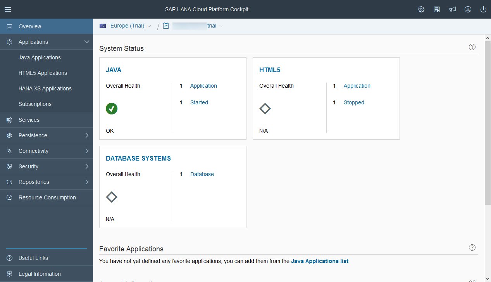
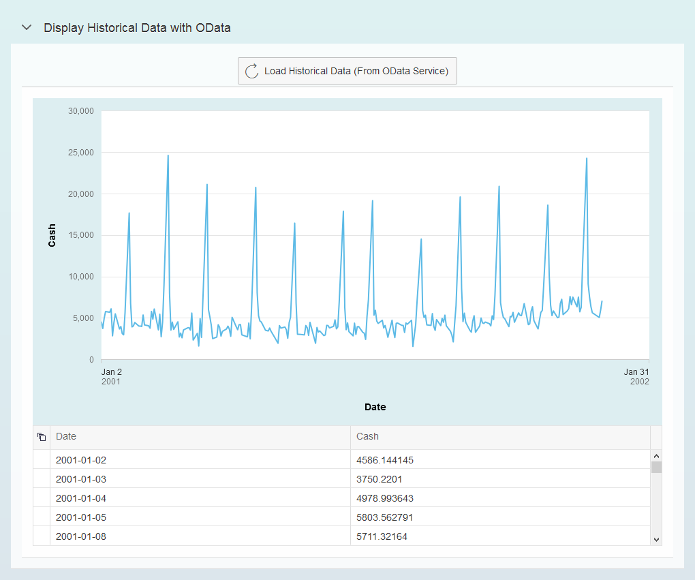

## Prerequisites
  - **Proficiency:** Intermediate
  - **Tutorials:** [Configure a SAPUI5 application to interact with the HCP predictive](http://go.sap.com/developer/tutorials/hcpps-sapui5-configure-application.html)

## Next Steps
  - [Register a "Data Set" HCP predictive service from a SAPUI5 application](http://go.sap.com/developer/tutorials/hcpps-sapui5-ps-dataset-register.html)

## Details
### You will learn
  - How to display in a grid and a chart the result of an OData service

### Time to Complete
  **10 minutes**

---

1. Log into the [***SAP HANA Cloud Platform Cockpit***](http://account.hanatrial.ondemand.com/cockpit) with your free trial account and access "Your Personal Developer Account".

    Click on your ***HCP Account*** identifier (which ends with *trial*) as highlighted on the below screenshot.

    

1. On the left side bar, you can navigate in **Applications** > **HTML5 Applications**.

    

1. Click on the **Edit Application**  icon for the `hcppredictiveservicesdemo` application.

    

1. This will open the ***SAP Web IDE*** where you have previously created the `hcppredictiveservicesdemo` application using the project template.

    

1. Create a new file called `ODataDisplay.view.xml` in the `hcppredictiveservicesdemo\webapp\view\odata` and add the following content.

    The view defines:
    - a tool bar with a refresh button that will trigger the `onLoadData` controller function from the controller
    - a grid table that will display the data return by the OData service called in the `onLoadData` controller function
    - a `VizFrame` that will display a line chart with the same data

    ```xml
    <mvc:View controllerName="demo.controller.odata.ODataDisplay"
      xmlns:html="http://www.w3.org/1999/xhtml"
      xmlns:mvc="sap.ui.core.mvc"
      xmlns="sap.m"
      xmlns:controls="sap.viz.ui5.controls"
      xmlns:feeds="sap.viz.ui5.controls.common.feeds"
      xmlns:data="sap.viz.ui5.data"
      xmlns:table="sap.ui.table">
      <Panel expandable="true" expanded="false" headerText="Display Historical Data with OData" width="auto" class="sapUiResponsiveMargin">
        <content>
          <Toolbar>
            <ToolbarSpacer/>
            <Button icon="sap-icon://refresh" text="Load Historical Data (From OData Service)" tooltip="Reinitialize Model" press="onLoadData"/>
            <ToolbarSpacer/>
          </Toolbar>
          <Panel expandable="false" expanded="true" visible="{= typeof ${/historicalData} !== 'undefined'}">
            <!-- A Viz frame to display the data in a 'time series' chart-->
            <controls:VizFrame id="idHistoricalDataVizFrame" uiConfig="{applicationSet:'fiori'}" vizType='timeseries_line'
              vizProperties="{title:{visible:false,text:'Historical Data'},general:{background:{color:'#DDEEF1'}},legend:{visible:false},plotArea:{adjustScale:true},timeAxis:{label:{showFirstLastDataOnly:true}},interaction:{selectability:{mode:'exclusive'}}}"
              renderComplete="onRenderCompleteHistoricalDataVizFrame" width="100%">
              <controls:dataset>
                <data:FlattenedDataset data="{/historicalData}">
                  <data:dimensions>
                    <data:DimensionDefinition name="Date" value="{DateString}" dataType='Date'/>
                  </data:dimensions>
                  <data:measures>
                    <data:MeasureDefinition name='Cash' value='{Cash}'/>
                  </data:measures>
                </data:FlattenedDataset>
              </controls:dataset>
              <controls:feeds>
                <feeds:FeedItem uid="valueAxis" type="Measure" values="Cash"/>
                <feeds:FeedItem uid="timeAxis" type="Dimension" values="Date"/>
              </controls:feeds>
            </controls:VizFrame>
            <controls:Popover id="idHistoricalDataPopover"></controls:Popover>
            <!-- A table with the historical data. It will be populated when the button is pressed-->
            <table:Table rows="{/historicalData}" enableBusyIndicator="true" visibleRowCount="5" width="100%">
              <table:columns>
                <table:Column sortProperty="DateString" filterProperty="DateString">
                  <Label text="Date"/>
                  <table:template>
                    <Text text="{DateString}"/>
                  </table:template>
                </table:Column>
                <table:Column sortProperty="Cash" filterProperty="Cash">
                  <Label text="Cash"/>
                  <table:template>
                    <Text text="{Cash}"/>
                  </table:template>
                </table:Column>
              </table:columns>
            </table:Table>
          </Panel>
        </content>
      </Panel>
    </mvc:View>
    ```

1. Create a file named the `ODataDisplay.controller.js` file in the `hcppredictiveservicesdemo\webapp\controller\odata` directory and add the following code.

    The controller includes the functions used to process the 'Press' events on the controls added in the view and process the `AJAX` calls to the OData services.

    ```javascript
    sap.ui.define([
      "sap/ui/core/mvc/Controller",
      "sap/m/MessageToast"
    ], function(Controller, MessageToast) {
      "use strict";

      return Controller.extend("demo.controller.odata.ODataDisplay", {
        onLoadData: function() {
          // set the busy indicator to avoid multi clicks
          var oBusyIndicator = new sap.m.BusyDialog();
          oBusyIndicator.open();

          //Get historical data from OData Service
          $.ajax({
            headers: {
              'Accept': 'application/json',
              'Content-Type': 'application/json'
            },
            url: "/HCPOData/public/timeseries/odata/timeseries.xsodata/TimeSeriesData/?&orderby=Date desc",
            type: "GET",
            async: false,
            success: function(data) {
              try {
                var oHistoricalData = data.d.results;
                // We need to format the date using a formatter
                var dateFormat = sap.ui.core.format.DateFormat.getDateInstance({
                  pattern: "yyyy-MM-dd"
                });
                // timezoneOffset is in hours convert to milliseconds  
                var TZOffsetMs = new Date(0).getTimezoneOffset() * 60 * 1000;
                // we need to parse the date provided bay the odata service as an int to consume it in the VizFrame
                for (var i = 0; i < oHistoricalData.length; i++) {
                  oHistoricalData[i].DateDimension = parseInt(oHistoricalData[i].Date.replace(/[^0-9\.]/g, ''), 10);
                  oHistoricalData[i].DateString = dateFormat.format(new Date(oHistoricalData[i].DateDimension + TZOffsetMs));
                }
                //Save historical data in the model
                sap.ui.getCore().getModel().setProperty("/historicalData", oHistoricalData);
              } catch (err) {
                MessageToast.show("Caught - onLoadData[ajax success] :" + err.message);
              }
              oBusyIndicator.close();
            },
            error: function(request, status, error) {
              MessageToast.show("Caught - onLoadData[ajax error] :" + request.responseText);
              oBusyIndicator.close();
            }
          });
        },
        onRenderCompleteHistoricalDataVizFrame: function(oEvent) {
          // this will connect the VizFrame with the PopOver so we can sse the value when selected
          var oPopover = this.getView().byId("idHistoricalDataPopover");
          var oVizFrame = this.getView().byId("idHistoricalDataVizFrame");
          oPopover.connect(oVizFrame.getVizUid());
        }
      });
    });
    ```

    You just added the following functions:
    - `onLoadData`: call the OData service and populate the model, linked to the ***Load Historical Data (From OData Service)*** button)
    - `onRenderCompleteHistoricalDataVizFrame`: connect the `VizFrame` and the `PopOver` so that you will get a message box when you click on the graph

1. Edit the `demo.view.xml` file located in the `hcppredictiveservicesdemo\webapp\view` and replace the existing code by the following one:

    Here we simply extend the main view.

    ```xml
    <mvc:View controllerName="demo.controller.demo"
      xmlns:html="http://www.w3.org/1999/xhtml"
      xmlns:mvc="sap.ui.core.mvc"
      xmlns="sap.m">
      <App>
        <pages>
          <Page title="Developing with HCPps and SAPUI5">
            <content>
              <mvc:XMLView viewName="demo.view.odata.ODataDisplay"/>
            </content>
          </Page>
        </pages>
      </App>
    </mvc:View>
    ```

1. You can save all modified files by pressing `CTRL+SHIFT+S`. Then, click on the **Run** icon  or press `ALT+F5`.

    Click on **Load Historical Data (From OData Service)**

    Et voilà!

    

## Next Steps
  - [Register a "Data Set" HCP predictive service from a SAPUI5 application](http://go.sap.com/developer/tutorials/hcpps-sapui5-ps-dataset-register.html)

