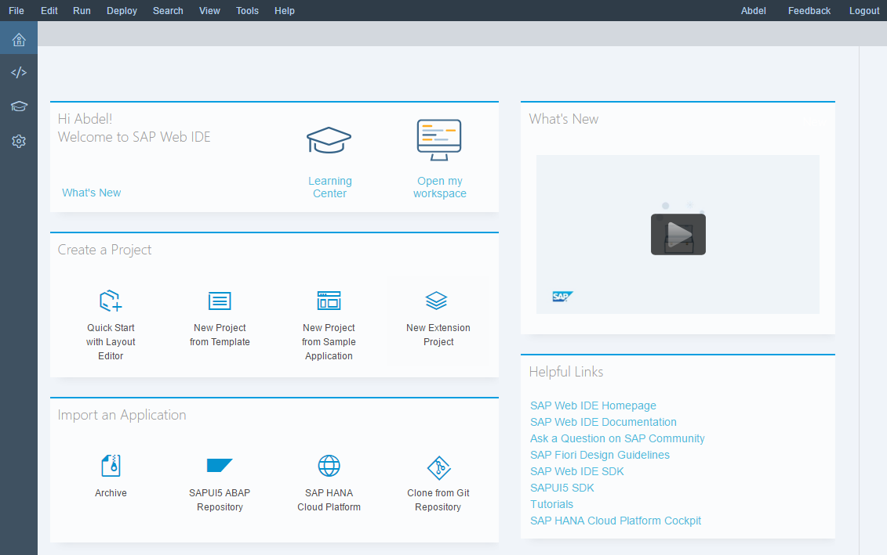
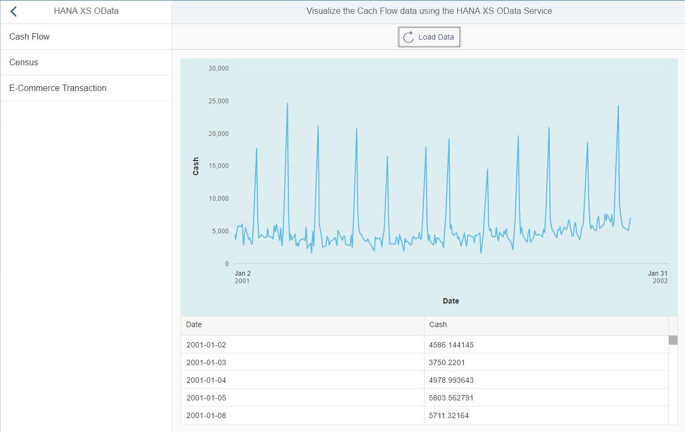

## Prerequisites
  - **Proficiency:** Intermediate
  - **Tutorials:** [Configure a SAPUI5 application from the project template](http://www.sap.com/developer/tutorials/hcpps-sapui5-configure-application.html)

## Next Steps
  - [Implement the "Register Dataset" service](http://www.sap.com/developer/tutorials/hcpps-sapui5-ps-dataset-register.html)

## Details
### You will learn
  - How to add a SAPUI5 controller to interact with a HANA XS OData service
  - How to add a SAPUI5 view to display the output of a HANA XS OData service call
  - How to extend the default view and the newly created view

### Time to Complete
  **10 minutes**

[ACCORDION-BEGIN [Step 1: ](Open SAP Web IDE)]

Log into the [***SAP HANA Cloud Platform Cockpit***](http://account.hanatrial.ondemand.com/cockpit) with your free trial account and access "Your Personal Developer Account".

Click on your ***SAP Cloud Platform Account Name*** as highlighted on the below screenshot.


On the left side bar, you can navigate in **Services**, then using the search box enter `Web IDE`.


Click on the tile, then click on **Open SAP Web IDE**.


You will get access to the **SAP Web IDE** main page:



This will open the ***SAP Web IDE*** where you have previously created the `hcppredictiveservicesdemo` application using the project template.


[DONE]
[ACCORDION-END]

[ACCORDION-BEGIN [Step 2: ](Create the Cash Flow data controller)]

Create a new directory structure for **`webapp\controller\odata\cashflow`** either using the "File" menu or using the right click menu.

Create a new file **`display.controller.js`** in `webapp\controller\odata\cashflow` either using the "File" menu or using the right click menu.

Our goals are here to add a function where:

  - we call the HANA XS OData service and populate a JSON model with the retrieved data (`onLoadData`)
  - we connect the `VizFrame` and the `PopOver` so that you will get a message box when you click on the graph (`onRenderCompleteHistoricalDataVizFrame`)

Add the following content:

```javascript
sap.ui.define([
	"sap/ui/core/mvc/Controller",
	"sap/m/MessageToast"
], function(Controller, MessageToast) {
	"use strict";

	return Controller.extend("sapui5demo.controller.odata.cashflow.display", {
		onInit: function() {
			if (typeof sap.ui.getCore().getModel() === 'undefined') {
				this.getView().setModel(new sap.ui.model.json.JSONModel(), "cashflow");
			}
		},
		onLoadData: function() {
			// set the busy indicator to avoid multi clicks
			var oBusyIndicator = new sap.m.BusyDialog();
			oBusyIndicator.open();

            // get the current view
            var oView = this.getView();

			//Get historical data from OData Service
			$.ajax({
				headers: {
					'Accept': 'application/json',
					'Content-Type': 'application/json'
				},
				url: "/HCPOData/public/predictive/odata/predictive.xsodata/CashFlowData/?&orderby=Date desc",
				type: "GET",
				async: false,
				success: function(data) {
					try {
						var oData = data.d.results;
						// We need to format the date using a formatter
						var dateFormat = sap.ui.core.format.DateFormat.getDateInstance({
							pattern: "yyyy-MM-dd"
						});
						// timezoneOffset is in hours convert to milliseconds  
						var TZOffsetMs = new Date(0).getTimezoneOffset() * 60 * 1000;
						// we need to parse the date provided bay the odata service as an int to consume it in the VizFrame
						for (var i = 0; i < oData.length; i++) {
							oData[i].DateDimension = parseInt(oData[i].Date.replace(/[^0-9\.]/g, ''), 10);
							oData[i].DateString = dateFormat.format(new Date(oData[i].DateDimension + TZOffsetMs));
						}
						//Save historical data in the model
						oView.getModel("cashflow").setProperty("/data", oData);
					} catch (err) {
						MessageToast.show("Caught - onLoadData[ajax success] :" + err.message);
					}
					oBusyIndicator.close();
				},
				error: function(request, status, error) {
					MessageToast.show("Caught - onLoadData[ajax error] :" + request.responseText);
					oBusyIndicator.close();
				}
			});
		},
		onRenderCompleteHistoricalDataVizFrame: function(oEvent) {
			// this will connect the VizFrame with the PopOver so we can sse the value when selected
			var oPopover = this.getView().byId("idHistoricalDataPopover");
			var oVizFrame = this.getView().byId("idHistoricalDataVizFrame");
			oPopover.connect(oVizFrame.getVizUid());
		}
	});
});
```
Click on the  button (or press CTRL+S)

[DONE]
[ACCORDION-END]

[ACCORDION-BEGIN [Step 3: ](Create the Cash Flow data view)]

Create a new directory structure for **`webapp\view\odata\cashflow`** either using the "File" menu or using the right click menu.

Create a new file **`display.view.xml`** in `webapp\view\odata\cashflow` either using the "File" menu or using the right click menu.

The view will contain:

  - a button that will trigger the HANA XS OData service and load the data
  - a `VizFrame` to display the Cash Flow data as a time series line
  - a `PopOver` that will appear when you click on one of the data point in the `VizFrame`
  - a table with the values

Add the following content:

```xml
<mvc:View controllerName="sapui5demo.controller.odata.cashflow.display" xmlns:html="http://www.w3.org/2000/xhtml" xmlns:mvc="sap.ui.core.mvc"
	xmlns="sap.m" xmlns:controls="sap.viz.ui5.controls" xmlns:feeds="sap.viz.ui5.controls.common.feeds" xmlns:data="sap.viz.ui5.data"
	xmlns:table="sap.ui.table">
	<Toolbar>
		<ToolbarSpacer/>
		<Button icon="sap-icon://refresh" text="Load Data" tooltip="Reinitialize Model" press="onLoadData"/>
		<ToolbarSpacer/>
	</Toolbar>
	<Panel expandable="false" expanded="true" visible="{= typeof ${cashflow>/data} !== 'undefined'}">
		<!-- A Viz frame to display the data in a 'time series' chart-->
		<controls:VizFrame id="idHistoricalDataVizFrame" uiConfig="{applicationSet:'fiori'}" vizType='timeseries_line'
			vizProperties="{title:{visible:false,text:'Historical Data'},general:{background:{color:'#DDEEF1'}},legend:{visible:false},plotArea:{adjustScale:true},timeAxis:{label:{showFirstLastDataOnly:true}},interaction:{selectability:{mode:'exclusive'}}}"
			renderComplete="onRenderCompleteHistoricalDataVizFrame" width="100%">
			<controls:dataset>
				<data:FlattenedDataset data="{cashflow>/data}">
					<data:dimensions>
						<data:DimensionDefinition name="Date" value="{DateString}" dataType='Date'/>
					</data:dimensions>
					<data:measures>
						<data:MeasureDefinition name='Cash' value='{Cash}'/>
					</data:measures>
				</data:FlattenedDataset>
			</controls:dataset>
			<controls:feeds>
				<feeds:FeedItem uid="valueAxis" type="Measure" values="Cash"/>
				<feeds:FeedItem uid="timeAxis" type="Dimension" values="Date"/>
			</controls:feeds>
		</controls:VizFrame>
		<controls:Popover id="idHistoricalDataPopover"></controls:Popover>
		<!-- A table with the historical data. It will be populated when the button is pressed-->
		<table:Table rows="{cashflow>/data}" enableBusyIndicator="true" visibleRowCount="5" width="100%" selectionMode="None">
			<table:columns>
				<table:Column sortProperty="DateString" filterProperty="DateString">
					<Label text="Date"/>
					<table:template>
						<Text text="{cashflow>DateString}"/>
					</table:template>
				</table:Column>
				<table:Column sortProperty="Cash" filterProperty="Cash">
					<Label text="Cash"/>
					<table:template>
						<Text text="{cashflow>Cash}"/>
					</table:template>
				</table:Column>
			</table:columns>
		</table:Table>
	</Panel>
</mvc:View>
```
Click on the  button (or press CTRL+S)

[DONE]
[ACCORDION-END]

[ACCORDION-BEGIN [Step 4: ](Create Census data controller)]

Create a new directory structure for **`webapp\controller\odata\census`** either using the "File" menu or using the right click menu.

Create a new file **`display.controller.js`** in `webapp\controller\odata\census` either using the "File" menu or using the right click menu.

Our goals are here to add a function where:

  - we call the HANA XS OData service and populate a JSON model with the retrieved data (`onLoadData`)

Add the following content:

```javascript
sap.ui.define([
	"sap/ui/core/mvc/Controller",
	"sap/m/MessageToast"
], function(Controller, MessageToast) {
	"use strict";

	return Controller.extend("sapui5demo.controller.odata.census.display", {
		onInit: function() {
			if (typeof sap.ui.getCore().getModel() === 'undefined') {
				this.getView().setModel(new sap.ui.model.json.JSONModel(), "census");
			}
		},
		onLoadData: function() {
			// set the busy indicator to avoid multi clicks
			var oBusyIndicator = new sap.m.BusyDialog();
			oBusyIndicator.open();

            // get the current view
            var oView = this.getView();

            //Get historical data from OData Service
			$.ajax({
				headers: {
					'Accept': 'application/json',
					'Content-Type': 'application/json'
				},
				url: "/HCPOData/public/predictive/odata/predictive.xsodata/CensusData",
				type: "GET",
				async: false,
				success: function(data) {
					try {
						//Save the data in the model
						oView.getModel("census").setProperty("/data", data.d.results);
					} catch (err) {
						MessageToast.show("Caught - onLoadData[ajax success] :" + err.message);
					}
					oBusyIndicator.close();
				},
				error: function(request, status, error) {
					MessageToast.show("Caught - onLoadData[ajax error] :" + request.responseText);
					oBusyIndicator.close();
				}
			});
		}
	});
});
```

Click on the  button (or press CTRL+S)

[DONE]
[ACCORDION-END]

[ACCORDION-BEGIN [Step 5: ](Create Census data view)]

Create a new directory structure for **`webapp\view\odata\census`** either using the "File" menu or using the right click menu.

Create a new file **`display.view.xml`** in `webapp\view\odata\census` either using the "File" menu or using the right click menu.

The view will contain:

  - a button that will trigger the HANA XS OData service and load the data
  - a table with the values

Add the following content:

```xml
<mvc:View controllerName="sapui5demo.controller.odata.census.display" xmlns:html="http://www.w3.org/2000/xhtml" xmlns:mvc="sap.ui.core.mvc"
	xmlns="sap.m" xmlns:controls="sap.viz.ui5.controls" xmlns:feeds="sap.viz.ui5.controls.common.feeds" xmlns:data="sap.viz.ui5.data"
	xmlns:table="sap.ui.table">
	<Toolbar>
		<ToolbarSpacer/>
		<Button icon="sap-icon://refresh" text="Load Data" tooltip="Reinitialize Model" press="onLoadData"/>
		<ToolbarSpacer/>
	</Toolbar>
	<Panel expandable="false" expanded="true" visible="{= typeof ${census>/data} !== 'undefined'}">
		<!-- A table with the census data. It will be populated when the button is pressed-->
		<table:Table rows="{census>/data}" enableBusyIndicator="true" visibleRowCount="5" width="100%" selectionMode="None">
			<table:columns>
				<table:Column sortProperty="age" filterProperty="age" filterType="sap.ui.model.type.Integer">
					<Label text="Age"/>
					<table:template>
						<Text text="{census>age}"/>
					</table:template>
				</table:Column>
				<table:Column sortProperty="workclass" filterProperty="workclass">
					<Label text="Workclass"/>
					<table:template>
						<Text text="{census>workclass}"/>
					</table:template>
				</table:Column>
				<table:Column sortProperty="fnlwgt" filterProperty="fnlwgt">
					<Label text="Financial Weight"/>
					<table:template>
						<Text text="{census>fnlwgt}"/>
					</table:template>
				</table:Column>
				<table:Column sortProperty="education" filterProperty="education">
					<Label text="Education"/>
					<table:template>
						<Text text="{census>education}"/>
					</table:template>
				</table:Column>
				<table:Column sortProperty="education_num" filterProperty="education_num" filterType="sap.ui.model.type.Integer">
					<Label text="Years of education"/>
					<table:template>
						<Text text="{census>education_num}"/>
					</table:template>
				</table:Column>
				<table:Column sortProperty="marital_status" filterProperty="marital_status">
					<Label text="Marital Status"/>
					<table:template>
						<Text text="{census>marital_status}"/>
					</table:template>
				</table:Column>
				<table:Column sortProperty="occupation" filterProperty="occupation">
					<Label text="Occupation"/>
					<table:template>
						<Text text="{census>occupation}"/>
					</table:template>
				</table:Column>
				<table:Column sortProperty="relationship" filterProperty="relationship">
					<Label text="Relationship"/>
					<table:template>
						<Text text="{census>relationship}"/>
					</table:template>
				</table:Column>
				<table:Column sortProperty="race" filterProperty="race">
					<Label text="Race"/>
					<table:template>
						<Text text="{census>race}"/>
					</table:template>
				</table:Column>
				<table:Column sortProperty="sex" filterProperty="sex">
					<Label text="Sex"/>
					<table:template>
						<Text text="{census>sex}"/>
					</table:template>
				</table:Column>
				<table:Column sortProperty="capital_gain" filterProperty="capital_gain" filterType="sap.ui.model.type.Integer">
					<Label text="Captial Gain"/>
					<table:template>
						<Text text="{census>capital_gain}"/>
					</table:template>
				</table:Column>
				<table:Column sortProperty="capital_loss" filterProperty="capital_loss" filterType="sap.ui.model.type.Integer">
					<Label text="Capital Loss"/>
					<table:template>
						<Text text="{census>capital_loss}"/>
					</table:template>
				</table:Column>
				<table:Column sortProperty="native_country" filterProperty="native_country">
					<Label text="Native Country"/>
					<table:template>
						<Text text="{census>native_country}"/>
					</table:template>
				</table:Column>
				<table:Column sortProperty="class" filterProperty="class" filterType="sap.ui.model.type.Integer">
					<Label text="Class"/>
					<table:template>
						<Text text="{census>class}" id="class"/>
					</table:template>
				</table:Column>
			</table:columns>
		</table:Table>
	</Panel>
</mvc:View>
```
Click on the  button (or press CTRL+S)

[DONE]
[ACCORDION-END]

[ACCORDION-BEGIN [Step 6: ](Create the E-Commerce data controller)]

Create a new directory structure for **`webapp\controller\odata\transaction`** either using the "File" menu or using the right click menu.

Create a new file **`display.controller.js`** in `webapp\controller\odata\transaction` either using the "File" menu or using the right click menu.

Our goals are here to add a function where:

  - we call the HANA XS OData service and populate a JSON model with the retrieved data (`onLoadData`)

Add the following content:

```javascript
sap.ui.define([
	"sap/ui/core/mvc/Controller",
	"sap/m/MessageToast"
], function(Controller, MessageToast) {
	"use strict";

	return Controller.extend("sapui5demo.controller.odata.transaction.display", {
		onInit: function() {
			if (typeof sap.ui.getCore().getModel() === 'undefined') {
				this.getView().setModel(new sap.ui.model.json.JSONModel(), "transaction");
			}
		},
		onLoadData: function() {
			// set the busy indicator to avoid multi clicks
			var oBusyIndicator = new sap.m.BusyDialog();
			oBusyIndicator.open();

			// get the current view
			var oView = this.getView();

			//Get historical data from OData Service
			$.ajax({
				headers: {
					'Accept': 'application/json',
					'Content-Type': 'application/json'
				},
				url: "/HCPOData/public/predictive/odata/predictive.xsodata/TransactionsData",
				type: "GET",
				async: false,
				success: function(data) {
					try {
						var oData = data.d.results;
						// timezoneOffset is in hours convert to milliseconds  
						var dateFormat = sap.ui.core.format.DateFormat.getDateInstance({
							pattern: "yyyy-MM-dd"
						});
						var TZOffsetMs = new Date(0).getTimezoneOffset() * 60 * 1000;
						// we need to parse the date provided bay the odata service as an int to consume it in the VizFrame
						for (var i = 0; i < oData.length; i++) {
							oData[i].Date_PutInCaddyDimension = parseInt(oData[i].Date_PutInCaddy.replace(/[^0-9\.]/g, ''), 10);
							oData[i].Date_PutInCaddyString = dateFormat.format(new Date(oData[i].Date_PutInCaddyDimension +
								TZOffsetMs));
						}
						//Save historical data in the model
						oView.getModel("transaction").setProperty("/data", oData);
					} catch (err) {
						MessageToast.show("Caught - onLoadData[ajax success] :" + err.message);
					}
					oBusyIndicator.close();
				},
				error: function(request, status, error) {
					MessageToast.show("Caught - onLoadData[ajax error] :" + request.responseText);
					oBusyIndicator.close();
				}
			});
		}
	});
});
```

Click on the  button (or press CTRL+S)

[DONE]
[ACCORDION-END]

[ACCORDION-BEGIN [Step 7: ](Create the E-Commerce data view)]

Create a new directory structure for **`webapp\view\odata\transaction`** either using the "File" menu or using the right click menu.

Create a new file **`display.view.xml`** in `webapp\view\odata\transaction` either using the "File" menu or using the right click menu.

The view will contain:

  - a button that will trigger the OData service and load the data
  - a table with the values

Add the following content:

```xml
<mvc:View controllerName="sapui5demo.controller.odata.transaction.display" xmlns:html="http://www.w3.org/2000/xhtml" xmlns:mvc="sap.ui.core.mvc"
	xmlns="sap.m" xmlns:controls="sap.viz.ui5.controls" xmlns:feeds="sap.viz.ui5.controls.common.feeds" xmlns:data="sap.viz.ui5.data"
	xmlns:table="sap.ui.table">
	<Toolbar>
		<ToolbarSpacer/>
		<Button icon="sap-icon://refresh" text="Load Data" tooltip="Reinitialize Model" press="onLoadData"/>
		<ToolbarSpacer/>
	</Toolbar>
	<Panel expandable="false" expanded="true" visible="{= typeof ${transaction>/data} !== 'undefined'}">
		<!-- A table with the transaction data. It will be populated when the button is pressed-->
		<table:Table rows="{transaction>/data}" enableBusyIndicator="true" visibleRowCount="5" width="100%" selectionMode="None">
			<table:columns>
				<table:Column sortProperty="UserID" filterProperty="UserID" filterType="sap.ui.model.type.Integer">
					<Label text="User ID"/>
					<table:template>
						<Text text="{transaction>UserID}"/>
					</table:template>
				</table:Column>
				<table:Column sortProperty="ItemPurchased" filterProperty="ItemPurchased">
					<Label text="Item Purchased"/>
					<table:template>
						<Text text="{transaction>ItemPurchased}"/>
					</table:template>
				</table:Column>
				<table:Column sortProperty="Date_PutInCaddyString" filterProperty="Date_PutInCaddyString">
					<Label text="Date Put In Caddy"/>
					<table:template>
						<Text text="{transaction>Date_PutInCaddyString}"/>
					</table:template>
				</table:Column>
				<table:Column sortProperty="TransactionID" filterProperty="TransactionID" filterType="sap.ui.model.type.Integer">
					<Label text="Transaction ID"/>
					<table:template>
						<Text text="{transaction>TransactionID}"/>
					</table:template>
				</table:Column>
			</table:columns>
		</table:Table>
	</Panel>
</mvc:View>
```
Click on the  button (or press CTRL+S)

[DONE]
[ACCORDION-END]

[ACCORDION-BEGIN [Step 8: ](Edit the default view)]

Edit the `demo.view.xml` file located in the `webapp\view`.

Inside the `<detailPages>` element add the following elements:

```xml
<Page id="detail_odata_cashflow" title="Visualize the Cach Flow data using the HANA XS OData Service">
  <content>
    <mvc:XMLView viewName="sapui5demo.view.odata.cashflow.display"/>
  </content>
</Page>
<Page id="detail_odata_census" title="Visualize the Census data using the HANA XS OData Service">
  <content>
    <mvc:XMLView viewName="sapui5demo.view.odata.census.display"/>
  </content>
</Page>
<Page id="detail_odata_transaction" title="Visualize the E-Commerce Transaction data using the HANA XS OData Service">
  <content>
    <mvc:XMLView viewName="sapui5demo.view.odata.transaction.display"/>
  </content>
</Page>
```

Click on the  button (or press CTRL+S)

[DONE]
[ACCORDION-END]

[ACCORDION-BEGIN [Step 9: ](Run the application)]

Click on the **Run** icon  or press `ALT+F5`.

On the left panel, you should see an item labeled `HANA XS OData`, click on it.

Select the dataset you want to display, then press the `Load Data` button.

Et voilà!



[DONE]
[ACCORDION-END]

[ACCORDION-BEGIN [Solution: ](Created and modified files)]

In case you are having problems when running the application, please find bellow the created and modified files:

  - [`webapp\controller\odata\cashflow\display.controller.js`](https://raw.githubusercontent.com/SAPDocuments/Tutorials/master/tutorials/hcpps-sapui5-odata/solution-controller-odata-cashflow-display.controller.js.txt)
  - [`webapp\controller\odata\census\display.controller.js`](https://raw.githubusercontent.com/SAPDocuments/Tutorials/master/tutorials/hcpps-sapui5-odata/solution-controller-odata-census-display.controller.js.txt)
  - [`webapp\controller\odata\transaction\display.controller.js`](https://raw.githubusercontent.com/SAPDocuments/Tutorials/master/tutorials/hcpps-sapui5-odata/solution-controller-odata-transaction-display.controller.js.txt)
  - [`webapp\view\odata\cashflow\display.view.xml`](https://raw.githubusercontent.com/SAPDocuments/Tutorials/master/tutorials/hcpps-sapui5-odata/solution-view-odata-cashflow-display.view.xml.txt)
  - [`webapp\view\odata\census\display.view.xml`](https://raw.githubusercontent.com/SAPDocuments/Tutorials/master/tutorials/hcpps-sapui5-odata/solution-view-odata-census-display.view.xml.txt)
  - [`webapp\view\odata\transaction\display.view.xml`](https://raw.githubusercontent.com/SAPDocuments/Tutorials/master/tutorials/hcpps-sapui5-odata/solution-view-odata-transaction-display.view.xml.txt)
  - [`webapp\view\demo.view.xml`](https://raw.githubusercontent.com/SAPDocuments/Tutorials/master/tutorials/hcpps-sapui5-odata/solution-view-demo.view.xml.txt)

[DONE]
[ACCORDION-END]

### Optional
 - Play with the `ajax` URL in the controllers to filter the retrieved data from the HANA XS OData service

## Next Steps
  - [Implement the "Register Dataset" service](http://www.sap.com/developer/tutorials/hcpps-sapui5-ps-dataset-register.html)
