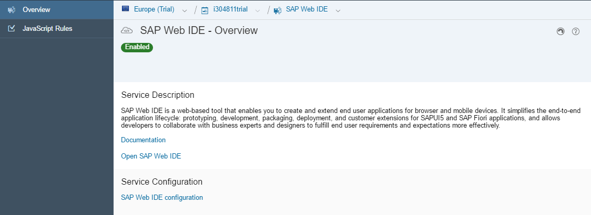
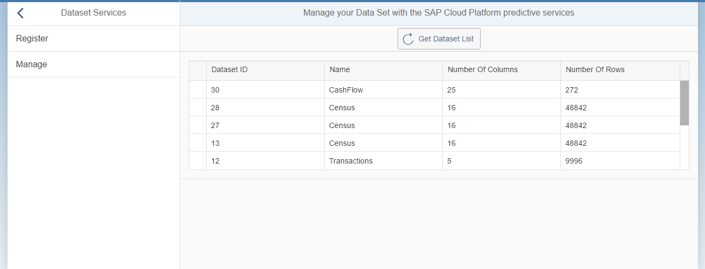
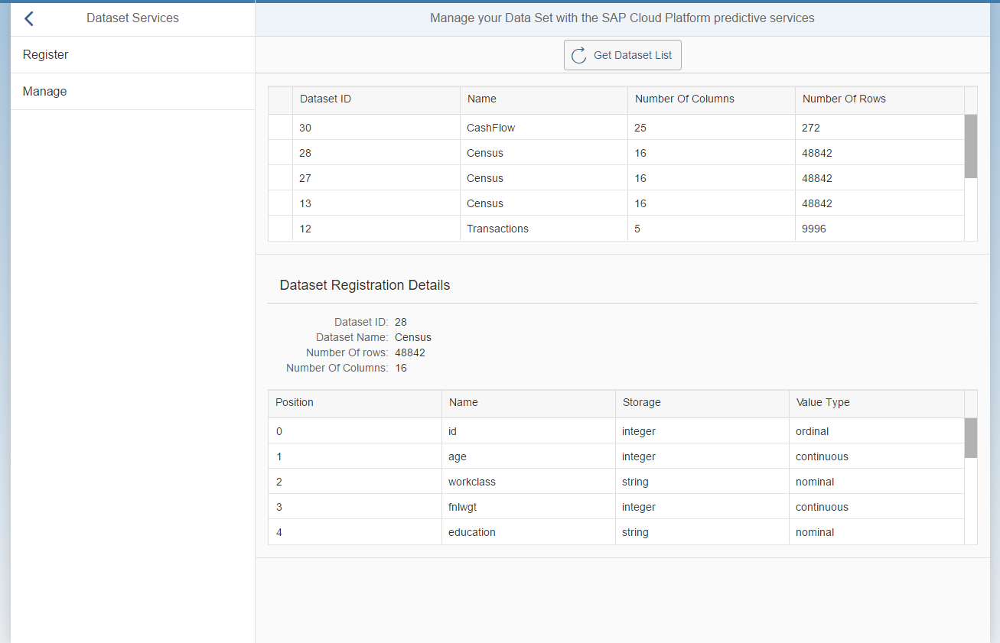
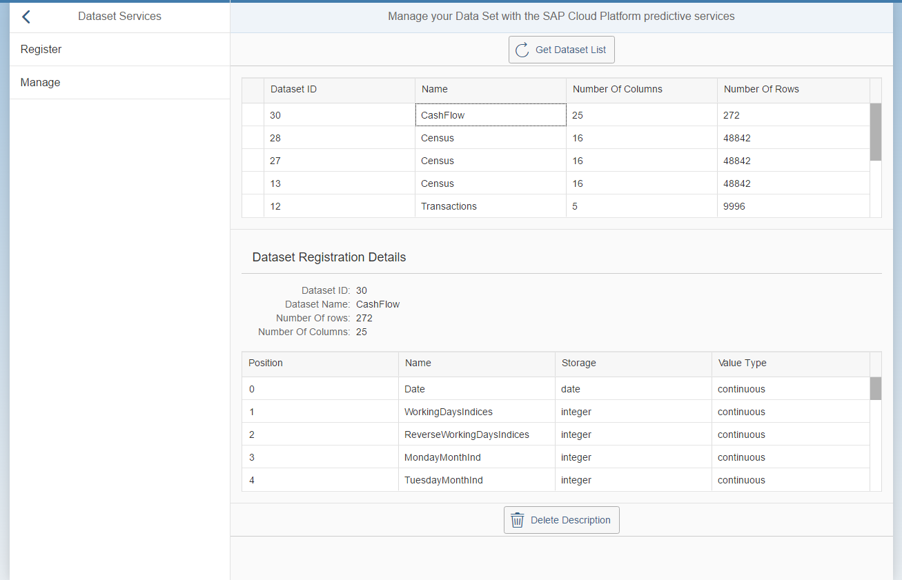
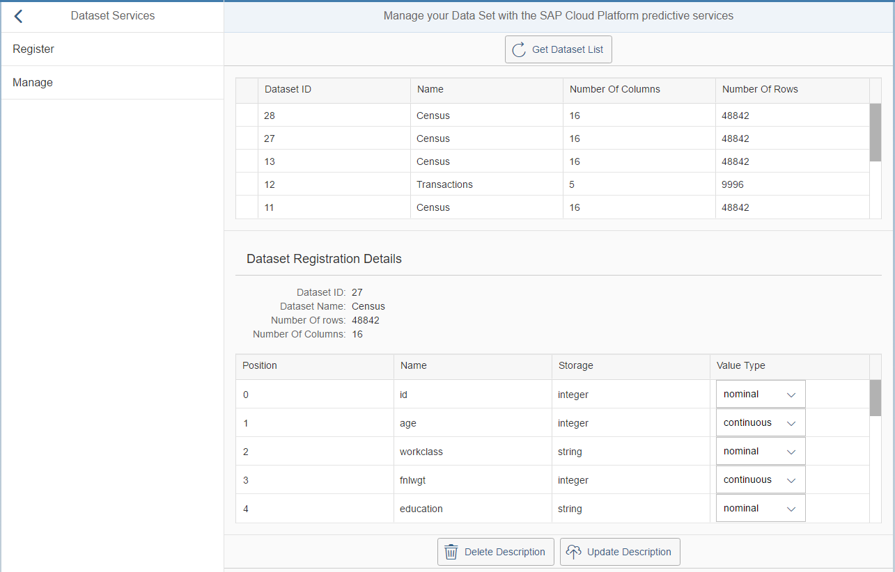

## Prerequisites
  - **Proficiency:** Intermediate
  - **Tutorials:** [Implement the "Register Dataset" service](http://www.sap.com/developer/tutorials/hcpps-sapui5-ps-dataset-register.html)

## Next Steps
  - [Implement the "Forecast" service using the synchronous mode](http://www.sap.com/developer/tutorials/hcpps-sapui5-ps-forecast-synchronous.html)

## Details
### You will learn
  - How to use the other "Dataset" SAP Cloud Platform predictive service in your SAPUI5 application in order to:
    - list registered datasets
    - view a dataset fields description
    - delete a dataset registration
    - update a dataset description

> **Note:** our goal here is to mimic what was done using the REST Client around the "Dataset" services

### Time to Complete
  **10 minutes**

[ACCORDION-BEGIN [Step 1: ](Open SAP Web IDE)]

Log into the [***SAP HANA Cloud Platform Cockpit***](http://account.hanatrial.ondemand.com/cockpit) with your free trial account and access "Your Personal Developer Account".

Click on your ***SAP Cloud Platform Account Name*** as highlighted on the below screenshot.


On the left side bar, you can navigate in **Services**, then using the search box enter `Web IDE`.


Click on the tile, then click on **Open SAP Web IDE**.



You will get access to the **SAP Web IDE** main page:


This will open the ***SAP Web IDE*** where you have previously created the `hcppredictiveservicesdemo` application using the project template.


[DONE]
[ACCORDION-END]

[ACCORDION-BEGIN [Step 2: ](Create a new controller)]

Create a new directory structure for **`webapp\controller\dataset`** either using the "File" menu or using the right click menu.

Create a new file **`manage.controller.js`** in `webapp\controller\dataset` either using the "File" menu or using the right click menu.

Open the `webapp\controller\dataset\manage.controller.js` file and add the following code:

```js
sap.ui.define([
	"sap/ui/core/mvc/Controller",
	"sap/m/MessageToast"
], function(Controller, MessageToast) {
	"use strict";

	return Controller.extend("sapui5demo.controller.dataset.manage", {
    onInit: function() {
			if (typeof sap.ui.getCore().getModel() === 'undefined') {
				this.getView().setModel(new sap.ui.model.json.JSONModel(), "dataset_manage");
			}
		}
	});
});
```

Click on the  button (or press CTRL+S)

[DONE]
[ACCORDION-END]

[ACCORDION-BEGIN [Step 3: ](Create a new view)]

Create a new directory structure for **`webapp\view\dataset`** either using the "File" menu or using the right click menu.

Create a new file **`register.view.xml`** in `webapp\view\dataset` either using the "File" menu or using the right click menu.

Open the `webapp\view\dataset\manage.view.xml` file and add the following code:

```xml
<mvc:View controllerName="sapui5demo.controller.dataset.manage" xmlns:html="http://www.w3.org/2000/xhtml" xmlns:mvc="sap.ui.core.mvc"
	xmlns="sap.m" xmlns:form="sap.ui.layout.form" xmlns:table="sap.ui.table" xmlns:core="sap.ui.core"
	xmlns:app="http://schemas.sap.com/sapui5/extension/sap.ui.core.CustomData/1">

</mvc:View>
```

Click on the  button (or press CTRL+S)

[DONE]
[ACCORDION-END]

[ACCORDION-BEGIN [Step 4: ](Extend the default view)]

Edit the `demo.view.xml` file located in the `webapp\view`.

Inside the `<detailPages>` element add the following element:

```xml
<Page id="detail_dataset_manage" title="Manage your Data Set with the SAP Cloud for predictive services">
  <content>
    <mvc:XMLView viewName="sapui5demo.view.dataset.manage"/>
  </content>
</Page>
```

Click on the  button (or press CTRL+S)

[DONE]
[ACCORDION-END]

[ACCORDION-BEGIN [Step 5: ](List registered datasets)]

The controller will contain a function where:

  - we process the call to the "Dataset List" SAP Cloud for predictive services and return the list of registered dataset.

The view will contain:

  - a button that will trigger the "Get Dataset List" service
  - a table with the list of registered datasets

Open the `webapp\controller\dataset\manage.controller.js` file and add the following code right after the `onInit` function (don't forget to use a comma to separate them):

```js
getDatasetList: function() {
  // set the busy indicator to avoid multi clicks
  var oBusyIndicator = new sap.m.BusyDialog();
  oBusyIndicator.open();

  // get the current view
  var oView = this.getView();

  // get the model
  var oModel = oView.getModel("dataset_manage");

  // call the service and define call back methods
  $.ajax({
    headers: {
      'Accept': 'application/json',
      'Content-Type': 'application/json'
    },
    url: "/HCPps/api/analytics/dataset",
    type: "GET",
    async: false,
    success: function(data) {
      try {
        //Save data set description data in the model
        oModel.setProperty("/datasets", data);
      } catch (err) {
        MessageToast.show("Caught - dataset manage get list [ajax success] :" + err.message);
      }
      oBusyIndicator.close();
    },
    error: function(request, status, error) {
      MessageToast.show("Caught - dataset manage get list [ajax error] :" + request.responseText);
      oBusyIndicator.close();
    }
  });
}
```

Click on the  button (or press CTRL+S)

Open the `webapp\view\dataset\manage.view.xml` file and add the following code inside the `mvc:View` element:

```xml
<Toolbar>
  <ToolbarSpacer/>
  <Button icon="sap-icon://refresh" text="Get Dataset List" press="getDatasetList"/>
  <ToolbarSpacer/>
</Toolbar>
<Panel expandable="false" expanded="true" visible="{= typeof ${dataset_manage>/datasets} !== 'undefined'}">
  <table:Table rows="{dataset_manage>/datasets}" enableBusyIndicator="true" selectionMode="Single" visibleRowCount="5"
    rowSelectionChange="getDatasetDescription" cellClick="getDatasetDescription">
    <table:columns>
      <table:Column>
        <Label text="Dataset ID"/>
        <table:template>
          <Text text="{dataset_manage>ID}"/>
        </table:template>
      </table:Column>
      <table:Column>
        <Label text="Name"/>
        <table:template>
          <Text text="{dataset_manage>name}"/>
        </table:template>
      </table:Column>
      <table:Column>
        <Label text="Number Of Columns"/>
        <table:template>
          <Text text="{dataset_manage>numberOfColumns}"/>
        </table:template>
      </table:Column>
      <table:Column>
        <Label text="Number Of Rows"/>
        <table:template>
          <Text text="{dataset_manage>numberOfRows}"/>
        </table:template>
      </table:Column>
    </table:columns>
  </table:Table>
</Panel>
```

Click on the  button (or press CTRL+S)

Click on the **Run** icon  or press `ALT+F5`.

On the left panel, you should see an item labeled `Dataset Services`, click on it. Then click on `Manage`, and finally on `Get Dataset List`

Et voilà!


[DONE]
[ACCORDION-END]

[ACCORDION-BEGIN [Step 6: ](Get dataset fields description)]

You will add to the controller a function where:

  - we process the call to the "Dataset Description" SAP Cloud for predictive services and return the dataset detailed description.
  - this function will be triggered either on a click or row change event on the table added previously

You will add to the view:

  - a table with the dataset variables detailed description

Open the `webapp\controller\dataset\manage.controller.js` file and add the following code right after the last function (don't forget to use a comma to separate them):

```js
getDatasetDescription: function(oControlEvent) {
	// set the busy indicator to avoid multi clicks
	var oBusyIndicator = new sap.m.BusyDialog();
	oBusyIndicator.open();

	// get the current view
	var oView = this.getView();

	// get the model
	var oModel = oView.getModel("dataset_manage");

	if (oModel.getProperty("/datasets") !== undefined && oModel.getProperty(
			"/datasets")[oControlEvent.getParameter("rowIndex")] !== undefined) {
		oBusyIndicator.open();
		var dataSetId = oModel.getProperty("/datasets")[oControlEvent.getParameter("rowIndex")].ID;
		// call the service and define call back methods
		$.ajax({
			headers: {
				'Accept': 'application/json',
				'Content-Type': 'application/json'
			},
			url: "/HCPps/api/analytics/dataset/" + dataSetId,
			type: "GET",
			async: false,
			success: function(data) {
				try {
					//Save data set description data in the model
					oModel.setProperty("/dataset", data);
				} catch (err) {
					MessageToast.show("Caught - dataset manage get dataset description [ajax success] :" + err.message);
				}
				oBusyIndicator.close();
			},
			error: function(request, status, error) {
				MessageToast.show("Caught - dataset manage get dataset description [ajax error] :" + request.responseText);
				oBusyIndicator.close();
			}
		});
	}
}
```

Click on the  button (or press CTRL+S)

Open the `webapp\view\dataset\manage.view.xml` file and add the following code inside the `mvc:View` element after the previous code:

```xml
<Panel expandable="false" expanded="true" visible="{= typeof ${dataset_manage>/dataset} !== 'undefined'}">
  <form:Form editable="false" class="isReadonly">
    <form:title>
      <core:Title text="Dataset Registration Details"/>
    </form:title>
    <form:layout>
      <form:ResponsiveGridLayout columnsL="1" columnsM="1"/>
    </form:layout>
    <form:formContainers>
      <form:FormContainer>
        <form:formElements>
          <form:FormElement label="Dataset ID">
            <form:fields>
              <Text text="{dataset_manage>/dataset/ID}"/>
            </form:fields>
          </form:FormElement>
          <form:FormElement label="Dataset Name">
            <form:fields>
              <Text text="{dataset_manage>/dataset/name}"/>
            </form:fields>
          </form:FormElement>
          <form:FormElement label="Number Of rows">
            <form:fields>
              <Text text="{dataset_manage>/dataset/numberOfRows}"/>
            </form:fields>
          </form:FormElement>
          <form:FormElement label="Number Of Columns">
            <form:fields>
              <Text text="{dataset_manage>/dataset/numberOfColumns}"/>
            </form:fields>
          </form:FormElement>
        </form:formElements>
      </form:FormContainer>
    </form:formContainers>
  </form:Form>
  <table:Table rows="{dataset_manage>/dataset/variables}" enableBusyIndicator="true" selectionMode="None" visibleRowCount="5" width="100%">
    <table:columns>
      <table:Column>
        <Label text="Position"/>
        <table:template>
          <Text text="{dataset_manage>position}"/>
        </table:template>
      </table:Column>
      <table:Column>
        <Label text="Name"/>
        <table:template>
          <Text text="{dataset_manage>name}"/>
        </table:template>
      </table:Column>
      <table:Column>
        <Label text="Storage"/>
        <table:template>
          <Text text="{dataset_manage>storage}"/>
        </table:template>
      </table:Column>
      <table:Column>
        <Label text="Value Type"/>
        <table:template>
          <Text text="{dataset_manage>value}"/>
        </table:template>
      </table:Column>
    </table:columns>
  </table:Table>
</Panel>
```

Click on the  button (or press CTRL+S)

Click on the **Run** icon  or press `ALT+F5`.

On the left panel, you should see an item labeled `Dataset Services`, click on it.

Click on `Manage`, then on `Get Dataset List`, and finally select any of the registered dataset.

Et voilà!


[DONE]
[ACCORDION-END]

[ACCORDION-BEGIN [Step 7: ](Delete a dataset registration)]

You will add to the controller a function where:

  - we process the call to the "Delete Dataset" SAP Cloud for predictive services.

You will add to the view:

  - a button that will trigger the "Delete Dataset" service

Open the `webapp\controller\dataset\manage.controller.js` file and add the following code right after the last function (don't forget to use a comma to separate them):

```js
deleteDataset: function(event) {
	// set the busy indicator to avoid multi clicks
	var oBusyIndicator = new sap.m.BusyDialog();
	oBusyIndicator.open();

	// get the current controller
	var oController = this;

	// get the current view
	var oView = this.getView();

	// get the model
	var oModel = oView.getModel("dataset_manage");

	// call the service and define call back methods
	$.ajax({
		headers: {
			'Accept': 'application/json',
			'Content-Type': 'application/json'
		},
		url: "/HCPps/api/analytics/dataset/" + event.getSource().data("datasetId"),
		type: "DELETE",
		async: false,
		success: function() {
			try {
				// remove the previous data
				oModel.setProperty(event.getSource().data("bindingProperty"), undefined);
				// refresh the dataset list
				oController.getDatasetList();
			} catch (err) {
				MessageToast.show("Caught - dataset manage delete dataset description [ajax success] :" + err.message);
			}
			oBusyIndicator.close();
		},
		error: function(request, status, error) {
			MessageToast.show("Caught - dataset manage delete dataset description [ajax error] :" + request.responseText);
			oBusyIndicator.close();
		}
	});
}
```

Click on the  button (or press CTRL+S)

Open the `webapp\view\dataset\manage.view.xml` file and add the following code inside the `mvc:View` element after the previous code:

```xml
<Toolbar visible="{= typeof ${dataset_manage>/dataset} !== 'undefined'}">
  <ToolbarSpacer/>
  <Button icon="sap-icon://delete" text="Delete Description" app:datasetId="{dataset_manage>/dataset/ID}" app:bindingProperty="/dataset" press="deleteDataset"/>
  <ToolbarSpacer/>
</Toolbar>
```

Click on the  button (or press CTRL+S)

Click on the **Run** icon  or press `ALT+F5`.

On the left panel, you should see an item labeled `Dataset Services`, click on it.

Click on `Manage`, then on `Get Dataset List`, and finally select any of the registered dataset.

You can now click on `Delete Description`, the registered dataset list should be refreshed and the selected item will be removed.

Et voilà!


[DONE]
[ACCORDION-END]

[ACCORDION-BEGIN [Step 8: ](Update the dataset variable description)]

You will add to the controller a function where:

  - we process the call to the "Update Dataset Variables" SAP Cloud for predictive services.

You will add to the view:

  - a button that will trigger the "Update Dataset Variables" service

Open the `webapp\controller\dataset\manage.controller.js` file and add the following code right after the last function (don't forget to use a comma to separate them):

```js
updateDataset: function(event) {
	// set the busy indicator to avoid multi clicks
	var oBusyIndicator = new sap.m.BusyDialog();
	oBusyIndicator.open();

	// get the current controller
	var oController = this;

	// get the current view
	var oView = this.getView();

	// get the model
	var oModel = oView.getModel("dataset_manage");

	var variables = oModel.getProperty("/dataset").variables;
	var param = [];
	for (var i = 0; i < variables.length; i++) {
		param[i] = {
			"name": variables[i].name,
			"value": variables[i].value
		};
	}

	// call the service and define call back methods
	$.ajax({
		headers: {
			'Accept': 'application/json',
			'Content-Type': 'application/json'
		},
		url: "/HCPps/api/analytics/dataset/" + event.getSource().data("datasetId") + "/variables/update",
		type: "POST",
		data: JSON.stringify(param),
		dataType: "json",
		async: false,
		success: function() {
			oBusyIndicator.close();
		},
		error: function(request, status, error) {
			MessageToast.show("Caught - dataset manage update dataset description [ajax error] :" + request.responseText);
			oBusyIndicator.close();
		}
	});
}
```

Click on the  button (or press CTRL+S)

Open the `webapp\view\dataset\manage.view.xml` file and replace the following element which replace the text control for `value` attribute by an action select control:

```xml
<Text text="{dataset_manage>value}"/>
```

by:

```xml
<ActionSelect id="select" selectedKey="{dataset_manage>value}">
  <items>
    <core:Item key="continuous" text="continuous"/>
    <core:Item key="nominal" text="nominal"/>
    <core:Item key="ordinal" text="ordinal"/>
  </items>
</ActionSelect>
```

Then, add the `Update Description` in the toolbar along with the `Delete Description` button like this:

```xml
<Toolbar visible="{= typeof ${dataset_manage>/dataset} !== 'undefined'}">
  <ToolbarSpacer/>
  <Button icon="sap-icon://delete" text="Delete Description" app:datasetId="{dataset_manage>/dataset/ID}" app:bindingProperty="/dataset" press="deleteDataset"/>
  <Button icon="sap-icon://upload-to-cloud" text="Update Description" app:datasetId="{dataset_manage>/dataset/ID}" app:bindingProperty="/dataset" press="updateDataset"/>
  <ToolbarSpacer/>
</Toolbar>
```

Click on the  button (or press CTRL+S)

Click on the **Run** icon  or press `ALT+F5`.

On the left panel, you should see an item labeled `Dataset Services`, click on it.

Click on `Manage`, then on `Get Dataset List`, and select any of the registered dataset. Pick a new **Value Type** for any of the variables.

You can now click on `Update Description`. You can switch to another dataset and come back, the change will be retrieved.

Et voilà!


[DONE]
[ACCORDION-END]

[ACCORDION-BEGIN [Solution: ](Created and modified files)]

In case you are having problems when running the application, please find bellow the created and modified files:

  - [`webapp\controller\dataset\manage.controller.js`](https://raw.githubusercontent.com/SAPDocuments/Tutorials/master/tutorials/hcpps-sapui5-ps-dataset-manage/solution-controller-dataset-manage.controller.js.txt)
  - [`webapp\view\dataset\manage.view.xml`](https://raw.githubusercontent.com/SAPDocuments/Tutorials/master/tutorials/hcpps-sapui5-ps-dataset-manage/solution-view-dataset-manage.view.xml.txt)
  - [`webapp\view\demo.view.xml`](https://raw.githubusercontent.com/SAPDocuments/Tutorials/master/tutorials/hcpps-sapui5-ps-dataset-manage/solution-view-demo.view.xml.txt)

[DONE]
[ACCORDION-END]

## Next Steps
  - [Implement the "Forecast" service using the synchronous mode](http://www.sap.com/developer/tutorials/hcpps-sapui5-ps-forecast-synchronous.html)
