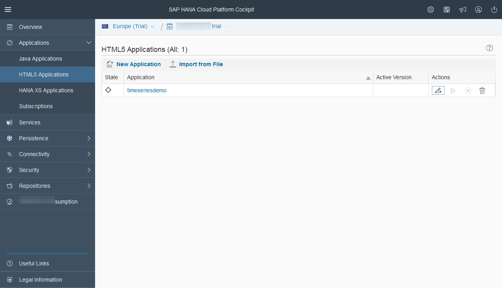
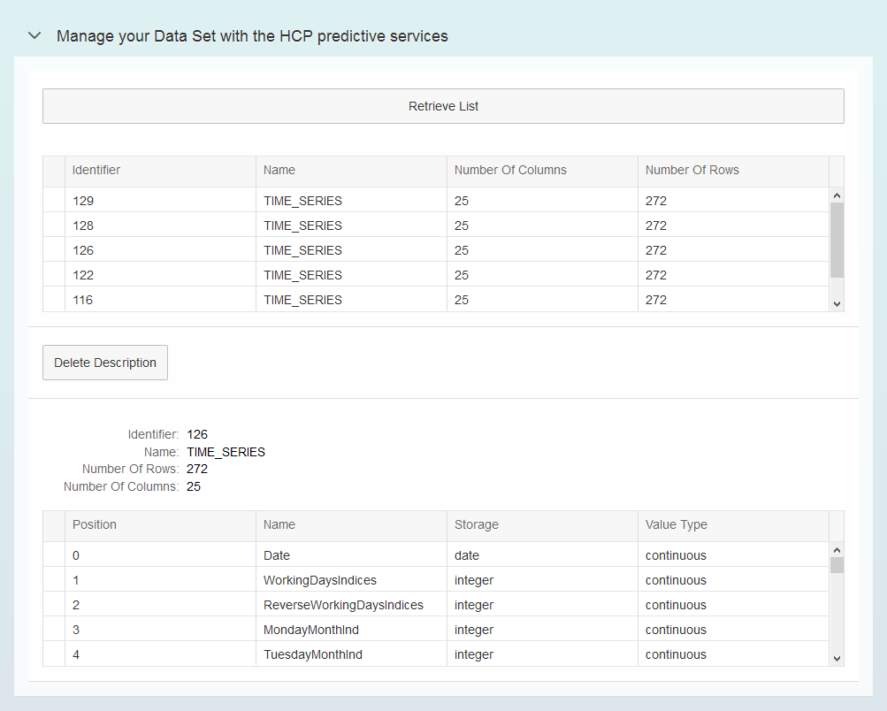

## Prerequisites
  - **Proficiency:** Intermediate
  - **Tutorials:** [Register a "Data Set" HCP predictive service from a SAPUI5 application](http://go.sap.com/developer/tutorials/hcpps-sapui5-ps-dataset-register.html)

## Next Steps
  - [Use the synchronous Forecast HCP predictive service from a SAPUI5 application](http://go.sap.com/developer/tutorials/hcpps-sapui5-ps-forecast-synchronous.html)

## Details
### You will learn
  - How to implement the "Data Set" HCP predictive service in a SAPUI5 application

### Time to Complete
  **10 minutes**

---

1. Log into the [***SAP HANA Cloud Platform Cockpit***](http://account.hanatrial.ondemand.com/cockpit) with your free trial account and access "Your Personal Developer Account".

    Click on your ***HCP Account*** identifier (which ends with *trial*) as highlighted on the below screenshot.

    

1. On the left side bar, you can navigate in **Applications** > **HTML5 Applications**.

    

1. Click on the **Edit Application**  icon for the `hcppredictiveservicesdemo` application.

    

1. This will open the ***SAP Web IDE*** where you have previously created the `hcppredictiveservicesdemo` application using the project template.

    

1. Create a new file called `DatasetList.fragment.xml` in the `hcppredictiveservicesdemo\webapp\fragment\dataset` and add the following content.

    This fragment (which will be reused later) displays the list of registered dataset.

    ```xml
    <core:FragmentDefinition xmlns:core="sap.ui.core"
      xmlns="sap.m"
      xmlns:table="sap.ui.table">
      <table:Table
        rows="{/dataSetListData}"
        enableBusyIndicator="true"
        selectionMode="Single"
        visibleRowCount="5"
        width="100%"
        rowSelectionChange="onDataSetListSelectionChanged"
        cellClick="onDataSetListSelectionChanged">
        <table:columns>
          <table:Column>
            <Label text="Identifier"/>
            <table:template>
              <Text text="{ID}"/>
            </table:template>
          </table:Column>
          <table:Column>
            <Label text="Name"/>
            <table:template>
              <Text text="{name}"/>
            </table:template>
          </table:Column>
          <table:Column>
            <Label text="Number Of Columns"/>
            <table:template>
              <Text text="{numberOfColumns}"/>
            </table:template>
          </table:Column>
          <table:Column>
            <Label text="Number Of Rows"/>
            <table:template>
              <Text text="{numberOfRows}"/>
            </table:template>
          </table:Column>
        </table:columns>
      </table:Table>
    </core:FragmentDefinition>
    ```

1. Create a new file called `DatasetManage.view.xml` in the `hcppredictiveservicesdemo\webapp\view\dataset` and add the following content.

    The view defines a "Retrieve" button and a list where all registered datasets is displayed after the services is called.
    When you select an entry, you will get the associated dataset description displayed.
    You will also be able to delete the registered dataset description.

    ```xml
    <mvc:View controllerName="demo.controller.dataset.DatasetManage"
      xmlns:html="http://www.w3.org/1999/xhtml"
      xmlns:mvc="sap.ui.core.mvc"
      xmlns="sap.m"
      xmlns:form="sap.ui.layout.form"
      xmlns:table="sap.ui.table"
      xmlns:core="sap.ui.core"
      xmlns:app="http://schemas.sap.com/sapui5/extension/sap.ui.core.CustomData/1">
      <Panel expandable="true" expanded="false" headerText="Manage your Data Set with the HCP predictive services" class="sapUiResponsiveMargin"
        width="auto">
        <form:SimpleForm editable="true" layout="ResponsiveGridLayout" class="editableForm">
          <form:content>
            <Button text="Retrieve List" type="Default" press="onDataSetGetList"/>
          </form:content>
        </form:SimpleForm>
        <Panel expandable="false" expanded="true" visible="{= ${/function} === 'DatasetManage'}">
          <Panel expandable="false" expanded="true" visible="{= typeof ${/dataSetListData} !== 'undefined'}">
            <core:Fragment fragmentName='demo.fragment.dataset.DatasetList' type='XML'/>
          </Panel>
          <Panel expandable="false" expanded="true" visible="{= typeof ${/dataSetData} !== 'undefined'}">
            <Button text="Delete Description" type="Default" app:datasetId="{/dataSetData/ID}" app:binding="/dataSetData"
              press="onDataSetDescriptionDelete"/>
            <form:SimpleForm editable="false" layout="ResponsiveGridLayout" class="editableForm">
              <form:content>
                <Label text="Identifier"></Label>
                <Text text="{/dataSetData/ID}"/>
                <Label text="Name"></Label>
                <Text text="{/dataSetData/name}"/>
                <Label text="Number Of Rows"></Label>
                <Text text="{/dataSetData/numberOfRows}"/>
                <Label text="Number Of Columns"></Label>
                <Text text="{/dataSetData/numberOfColumns}"/>
              </form:content>
            </form:SimpleForm>
            <table:Table rows="{/dataSetData/variables}" enableBusyIndicator="true" selectionMode="Single" visibleRowCount="5" width="100%">
              <table:columns>
                <table:Column>
                  <Label text="Position"/>
                  <table:template>
                    <Text text="{position}"/>
                  </table:template>
                </table:Column>
                <table:Column>
                  <Label text="Name"/>
                  <table:template>
                    <Text text="{name}"/>
                  </table:template>
                </table:Column>
                <table:Column>
                  <Label text="Storage"/>
                  <table:template>
                    <Text text="{storage}"/>
                  </table:template>
                </table:Column>
                <table:Column>
                  <Label text="Value Type"/>
                  <table:template>
                    <Text text="{value}"/>
                  </table:template>
                </table:Column>
              </table:columns>
            </table:Table>
          </Panel>
        </Panel>
      </Panel>
    </mvc:View>
    ```

1. Create a file named the `DatasetList.js` file in the `hcppredictiveservicesdemo\webapp\fragment\dataset` directory and add the following code.

    This JavaScript file will be used and extended whenever the `DatasetList` fragment is used. It includes the functions used to process the 'Press' events on the controls.
    
    ```javascript
    sap.ui.define([
      "sap/ui/core/mvc/Controller",
      "sap/m/MessageToast"
    ], function(Controller, MessageToast) {
      "use strict";

      return Controller.extend("demo.fragment.dataset.DatasetList", {
        onDataSetGetList: function() {
          // set the busy indicator to avoid multi clicks
          var oBusyIndicator = new sap.m.BusyDialog();
          oBusyIndicator.open();

          // call the service and define call back methods
          $.ajax({
            headers: {
              'Accept': 'application/json',
              'Content-Type': 'application/json'
            },
            url: "/HCPps/api/analytics/dataset",
            type: "GET",
            async: false,
            success: function(data) {
              try {
                //Save data set description data in the model
                sap.ui.getCore().getModel().setProperty("/dataSetListData", data);
              } catch (err) {
                MessageToast.show("Caught - onDataSetGetList[ajax success] :" + err.message);
              }
              oBusyIndicator.close();
            },
            error: function(request, status, error) {
              MessageToast.show("Caught - onDataSetGetList[ajax error] :" + request.responseText);
              oBusyIndicator.close();
            }
          });
        },
        onDataSetListSelectionChanged: function(oControlEvent) {
          // set the busy indicator to avoid multi clicks
          var oBusyIndicator = new sap.m.BusyDialog();

          if (sap.ui.getCore().getModel().getProperty("/dataSetListData") !== undefined && sap.ui.getCore().getModel().getProperty(
              "/dataSetListData")[oControlEvent.getParameter("rowIndex")] !== undefined) {
            oBusyIndicator.open();
            var dataSetId = sap.ui.getCore().getModel().getProperty("/dataSetListData")[oControlEvent.getParameter("rowIndex")].ID;
            // call the service and define call back methods
            $.ajax({
              headers: {
                'Accept': 'application/json',
                'Content-Type': 'application/json'
              },
              url: "/HCPps/api/analytics/dataset/" + dataSetId,
              type: "GET",
              async: false,
              success: function(data) {
                try {
                  var oManagedDataSetDescriptionData = data;
                  //add the reference date and nb of forecast, ideally we would retrieve that from the database or the service
                  oManagedDataSetDescriptionData.referenceDate = "2001-12-28";
                  oManagedDataSetDescriptionData.numberOfForecasts = 21;
                  //Save data set description data in the model
                  sap.ui.getCore().getModel().setProperty("/dataSetData", oManagedDataSetDescriptionData);
                } catch (err) {
                  MessageToast.show("Caught - onDataSetListSelectionChanged[ajax success] :" + err.message);
                }
                oBusyIndicator.close();
              },
              error: function(request, status, error) {
                MessageToast.show("Caught - onDataSetListSelectionChanged[ajax error] :" + request.responseText);
                oBusyIndicator.close();
              }
            });
          }
        }
      });
    });
    ```

1. Create a file named the `DatasetManage.controller.js` file in the `hcppredictiveservicesdemo\webapp\controller\dataset` directory and add the following code.

    The controller includes the functions used to process the 'Press' events on the controls added in the view and process the `AJAX` calls to the HCP predictive services.
   It 'extends' the `DataSetList` JavaScript file created earlier as our view uses the `DatasetList` fragment.

    ```javascript
    sap.ui.define([
        "sap/ui/core/mvc/Controller",
        "sap/m/MessageToast",
        "demo/fragment/dataset/DatasetList"
    ], function(Controller, MessageToast, DatasetList) {
        "use strict";

        jQuery.sap.require("demo.fragment.dataset.DatasetList");

        return Controller.extend("demo.controller.dataset.DatasetManage", {
          onDataSetGetList: function() {
            DatasetList.prototype.onDataSetGetList.apply(this, arguments);
            sap.ui.getCore().getModel().setProperty("/function", "DatasetManage");
          },
          onDataSetListSelectionChanged: function(oControlEvent) {
            DatasetList.prototype.onDataSetListSelectionChanged.apply(this, arguments);
            sap.ui.getCore().getModel().setProperty("/function", "DatasetManage");
          },
          onDataSetDelete: function(event) {
            // set the busy indicator to avoid multi clicks
            var oBusyIndicator = new sap.m.BusyDialog();
            oBusyIndicator.open();

            var dataSetId = event.getSource().data("datasetId");
            var binding = event.getSource().data("binding");

            // call the service and define call back methods
            $.ajax({
              headers: {
                'Accept': 'application/json',
                'Content-Type': 'application/json'
              },
              url: "/HCPps/api/analytics/dataset/" + dataSetId,
              type: "DELETE",
              async: false,
              success: function() {
                try {
                  // remove the previous data
                  sap.ui.getCore().getModel().setProperty(binding, undefined);
                  sap.ui.getCore().getModel().setProperty("/function", undefined);
                } catch (err) {
                  MessageToast.show("Caught - onDataSetDelete[ajax success] :" + err.message);
                }
                oBusyIndicator.close();
              },
              error: function(request, status, error) {
                MessageToast.show("Caught - onDataSetDelete[ajax error] :" + request.responseText);
                oBusyIndicator.close();
              }
            });
          },
          onDataSetDescriptionDelete: function(event) {
            this.onDataSetDelete(event);
            this.onDataSetGetList();
          }
        });
    });
    ```

    Here you can notice that we have embedded the "Dataset" controller functions.

1. Edit the `demo.view.xml` file located in the `hcppredictiveservicesdemo\webapp\view` and replace the existing code by the following one:

    Here we simply extend the main view.

    ```xml
    <mvc:View controllerName="demo.controller.demo"
      xmlns:html="http://www.w3.org/1999/xhtml"
      xmlns:mvc="sap.ui.core.mvc"
      xmlns="sap.m">
      <App>
        <pages>
          <Page title="Developing with HCPps and SAPUI5">
            <content>
              <mvc:XMLView viewName="demo.view.dataset.DatasetManage"/>
              <mvc:XMLView viewName="demo.view.dataset.DatasetRegister"/>
              <mvc:XMLView viewName="demo.view.odata.ODataDisplay"/>
            </content>
          </Page>
        </pages>
      </App>
    </mvc:View>
    ```

1. You can save all modified files by pressing `CTRL+SHIFT+S`. Then, click on the **Run** icon  or press `ALT+F5`.

    Click on **Retrieve List**, select an entry in the table. Then, click on **Delete Description**.

    Et voilà!

    

## Next Steps
  - [Use the synchronous Forecast HCP predictive service from a SAPUI5 application](http://go.sap.com/developer/tutorials/hcpps-sapui5-ps-forecast-synchronous.html)

