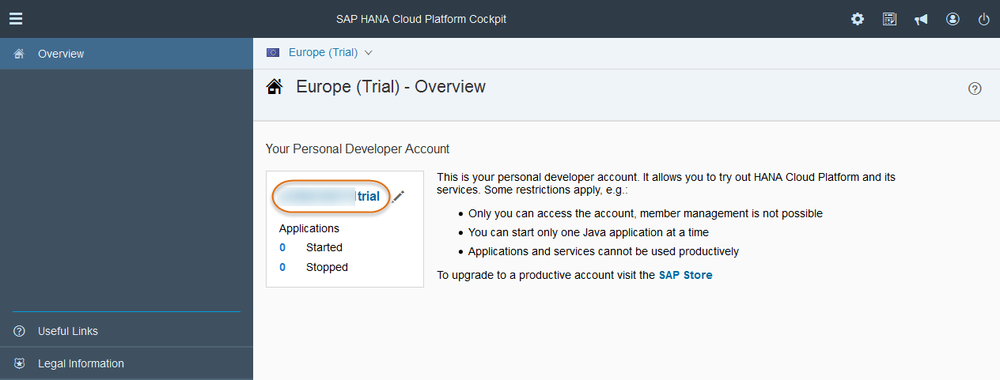
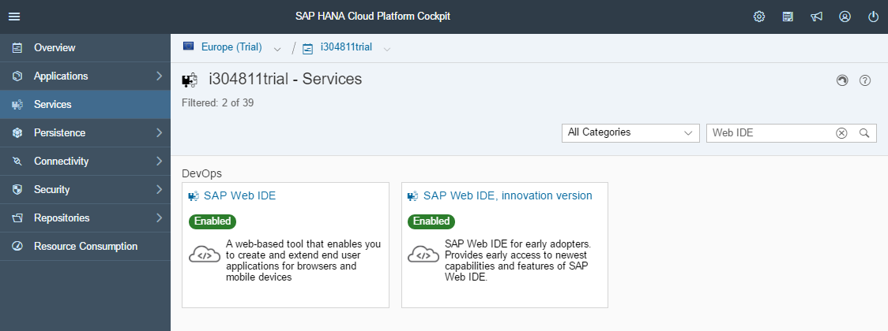
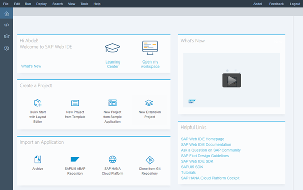
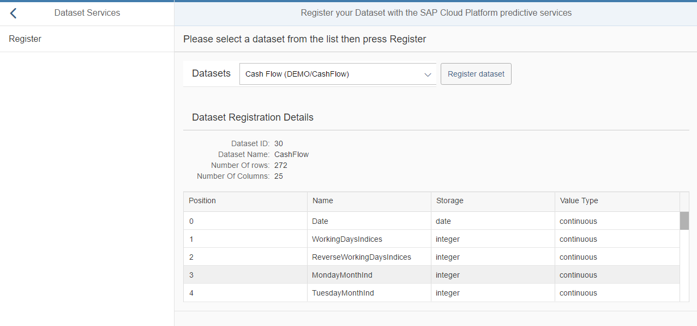

## Prerequisites
  - **Proficiency:** Intermediate
  - **Tutorials:** [Visualize your predictive demo datasets in a SAPUI5 application using an HANA XS OData service](http://www.sap.com/developer/tutorials/hcpps-sapui5-odata.html)

## Next Steps
  - [Manage the registered "Dataset"](http://www.sap.com/developer/tutorials/hcpps-sapui5-ps-dataset-manage.html)

## Details
### You will learn
  - How to add a SAPUI5 controller to interact with the "Register Dataset" SAP Cloud Platform predictive service in your SAPUI5 application
  - How to add a SAPUI5 view to display the output of the "Register Dataset" SAP Cloud Platform predictive service call
  - How to extend the default view and the newly created view

### Time to Complete
  **10 minutes**

[ACCORDION-BEGIN [Step 1: ](Open SAP Web IDE)]

Log into the [***SAP HANA Cloud Platform Cockpit***](http://account.hanatrial.ondemand.com/cockpit) with your free trial account and access "Your Personal Developer Account".

Click on your ***SAP Cloud Platform Account Name*** as highlighted on the below screenshot.



On the left side bar, you can navigate in **Services**, then using the search box enter `Web IDE`.



Click on the tile, then click on **Open SAP Web IDE**.


You will get access to the **SAP Web IDE** main page:



This will open the ***SAP Web IDE*** where you have previously created the `hcppredictiveservicesdemo` application using the project template.


[DONE]
[ACCORDION-END]

[ACCORDION-BEGIN [Step 2: ](Create a new controller)]

The controller will contain a function where:

  - we process the call to the "Register Dataset" SAP Cloud for predictive services and return the dataset identifier along with the dataset description.

Create a new directory structure for **`webapp\controller\dataset`** either using the "File" menu or using the right click menu.

Create a new file **`register.controller.js`** in `webapp\controller\dataset` either using the "File" menu or using the right click menu.

Open the `webapp\controller\dataset\register.controller.js` file and add the following code:

```js
sap.ui.define([
	"sap/ui/core/mvc/Controller",
	"sap/m/MessageToast"
], function(Controller, MessageToast) {
	"use strict";

	return Controller.extend("sapui5demo.controller.dataset.register", {
		onInit: function() {
			if (typeof sap.ui.getCore().getModel() === 'undefined') {
				this.getView().setModel(new sap.ui.model.json.JSONModel(), "dataset_register");
			}
		},
		register: function(oEvent) {
			// set the busy indicator to avoid multi clicks
			var oBusyIndicator = new sap.m.BusyDialog();
			oBusyIndicator.open();

			var oList = this.getView().byId(oEvent.getSource().getCustomData()[0].getValue());
			// define the service parameters
			var param = {
				hanaURL: oList.getSelectedItem().getKey()
			};

			// get the current view
			var oView = this.getView();

			// get the model
			var oModel = oView.getModel("dataset_register");

			// call the service and define call back methods
			$.ajax({
				headers: {
					'Accept': 'application/json',
					'Content-Type': 'application/json'
				},
				url: "/HCPps/api/analytics/dataset/sync",
				type: "POST",
				data: JSON.stringify(param),
				dataType: "json",
				async: false,
				success: function(data) {
					try {
						//Save data set description data in the model
						oModel.setProperty("/dataset", data);
						oBusyIndicator.close();
					} catch (err) {
						MessageToast.show("Caught - dataset register[ajax success] :" + err.message);
					}
					oBusyIndicator.close();
				},
				error: function(request, status, error) {
					MessageToast.show("Caught - dataset register[ajax error] :" + request.responseText);
					oBusyIndicator.close();
				}
			});
		}
	});
});
```

Click on the  button (or press CTRL+S)

[DONE]
[ACCORDION-END]

[ACCORDION-BEGIN [Step 3: ](Create a new view)]

The view will contain:

  - a select list with the list of dataset (built manually)
  - a button that will trigger the "Register Dataset" service
  - a table with the returned data

> **Note:** the reason we use here a static select list is to avoid user errors.
This list can be dynamically generated using an additional HANA XS OData service, that will select the proper tables from the HANA database.

-

Create a new directory structure for **`webapp\view\dataset`** either using the "File" menu or using the right click menu.

Create a new file **`register.view.xml`** in `webapp\view\dataset` either using the "File" menu or using the right click menu.

Open the `webapp\view\dataset\register.view.xml` file and add the following code:

```xml
<mvc:View controllerName="sapui5demo.controller.dataset.register" xmlns:html="http://www.w3.org/2000/xhtml" xmlns:mvc="sap.ui.core.mvc"
	xmlns:core="sap.ui.core" xmlns="sap.m" xmlns:form="sap.ui.layout.form" xmlns:table="sap.ui.table"
	xmlns:custom="http://schemas.sap.com/sapui5/extension/sap.ui.core.CustomData/1">
	<form:SimpleForm title="Please select a dataset from the list then press Register">
		<FlexBox>
			<InputListItem label="Datasets">
				<Select id="idSelectDataset">
					<core:Item key="DEMO/CashFlow" text="Cash Flow (DEMO/CashFlow)"/>
					<core:Item key="DEMO/Census" text="Census (DEMO/Census)"/>
					<core:Item key="DEMO/Transactions" text="E-Commerce transactions (DEMO/Transactions)"/>
				</Select>
			</InputListItem>
		</FlexBox>
		<FlexBox><Button text="Register dataset" type="Default" press="register" custom:input="idSelectDataset"/></FlexBox>
	</form:SimpleForm>
	<Panel expandable="false" expanded="true" visible="{= typeof ${dataset_register>/dataset} !== 'undefined'}">
		<form:Form editable="false" class="isReadonly">
			<form:title>
				<core:Title text="Dataset Registration Details"/>
			</form:title>
			<form:layout>
				<form:ResponsiveGridLayout columnsL="1" columnsM="1"/>
			</form:layout>
			<form:formContainers>
				<form:FormContainer>
					<form:formElements>
						<form:FormElement label="Dataset ID">
							<form:fields>
								<Text text="{dataset_register>/dataset/ID}"/>
							</form:fields>
						</form:FormElement>
						<form:FormElement label="Dataset Name">
							<form:fields>
								<Text text="{dataset_register>/dataset/name}"/>
							</form:fields>
						</form:FormElement>
						<form:FormElement label="Number Of rows">
							<form:fields>
								<Text text="{dataset_register>/dataset/numberOfRows}"/>
							</form:fields>
						</form:FormElement>
						<form:FormElement label="Number Of Columns">
							<form:fields>
								<Text text="{dataset_register>/dataset/numberOfColumns}"/>
							</form:fields>
						</form:FormElement>
					</form:formElements>
				</form:FormContainer>
			</form:formContainers>
		</form:Form>
		<table:Table rows="{dataset_register>/dataset/variables}" enableBusyIndicator="true" selectionMode="None" visibleRowCount="5" width="100%">
			<table:columns>
				<table:Column>
					<Label text="Position"/>
					<table:template>
						<Text text="{dataset_register>position}"/>
					</table:template>
				</table:Column>
				<table:Column>
					<Label text="Name"/>
					<table:template>
						<Text text="{dataset_register>name}"/>
					</table:template>
				</table:Column>
				<table:Column>
					<Label text="Storage"/>
					<table:template>
						<Text text="{dataset_register>storage}"/>
					</table:template>
				</table:Column>
				<table:Column>
					<Label text="Value Type"/>
					<table:template>
						<Text text="{dataset_register>value}"/>
					</table:template>
				</table:Column>
			</table:columns>
		</table:Table>
	</Panel>
</mvc:View>
```

Click on the  button (or press CTRL+S)

[DONE]
[ACCORDION-END]

[ACCORDION-BEGIN [Step 4: ](Extend the default view)]

Edit the `demo.view.xml` file located in the `webapp\view`.

Inside the `<detailPages>` element add the following element:

```xml
<Page id="detail_dataset_register" title="Register your Dataset with the SAP Cloud for predictive services">
  <content>
    <mvc:XMLView viewName="sapui5demo.view.dataset.register"/>
  </content>
</Page>
```

Click on the  button (or press CTRL+S)

[DONE]
[ACCORDION-END]

[ACCORDION-BEGIN [Step 5: ](Run the application)]

Then, click on the **Run** icon  or press `ALT+F5`.

On the left panel, you should see an item labeled `Dataset Services`, click on it. Then click on `Register`

Select the dataset you want to register from the list, then press the `Register Dataset` button.

Et voilà!


[DONE]
[ACCORDION-END]

[ACCORDION-BEGIN [Solution: ](Created and modified files)]

In case you are having problems when running the application, please find bellow the created and modified files:

  - [`webapp\controller\dataset\register.controller.js`](https://raw.githubusercontent.com/SAPDocuments/Tutorials/master/tutorials/hcpps-sapui5-ps-dataset-register/solution-controller-dataset-register.controller.js.txt)
  - [`webapp\view\dataset\register.view.xml`](https://raw.githubusercontent.com/SAPDocuments/Tutorials/master/tutorials/hcpps-sapui5-ps-dataset-register/solution-view-dataset-register.view.xml.txt)
  - [`webapp\view\demo.view.xml`](https://raw.githubusercontent.com/SAPDocuments/Tutorials/master/tutorials/hcpps-sapui5-ps-dataset-register/solution-view-demo.view.xml.txt)

[DONE]
[ACCORDION-END]

## Next Steps
  - [Manage your "Data Set" in the SAP Cloud Platform predictive service from a SAPUI5 application](http://www.sap.com/developer/tutorials/hcpps-sapui5-ps-dataset-manage.html)
