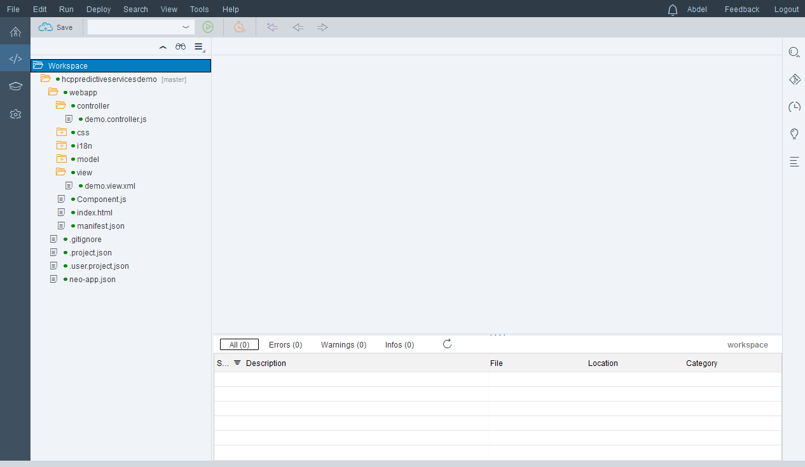
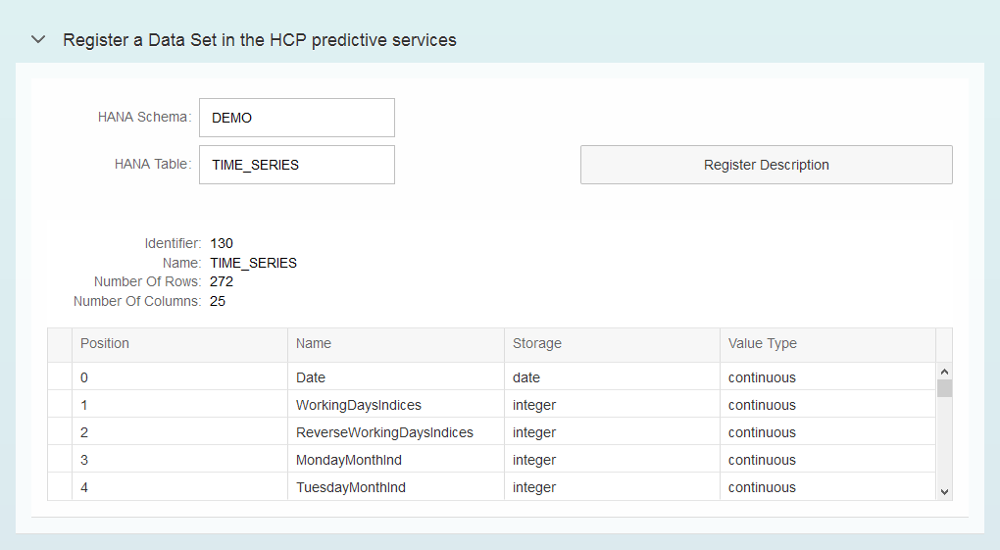

## Prerequisites
  - **Proficiency:** Intermediate
  - **Tutorials:** [Visualize your predictive demo data set in a SAPUI5 application using an  OData service](http://go.sap.com/developer/tutorials/hcpps-sapui5-odata.html)

## Next Steps
  - [Manage your "Data Set" in the HCP predictive service from a SAPUI5 application](http://go.sap.com/developer/tutorials/hcpps-sapui5-ps-dataset-manage.html)

## Details
### You will learn
  - How to implement the  "Data Set" HCP predictive service in a SAPUI5 application

### Time to Complete
  **10 minutes**

---

1. Log into the [***SAP HANA Cloud Platform Cockpit***](http://account.hanatrial.ondemand.com/cockpit) with your free trial account and access "Your Personal Developer Account".

    Click on your ***HCP Account*** identifier (which ends with *trial*) as highlighted on the below screenshot.

    

1. On the left side bar, you can navigate in **Applications** > **HTML5 Applications**.

    

1. Click on the **Edit Application**  icon for the `hcppredictiveservicesdemo` application.

    

1. This will open the ***SAP Web IDE*** where you have previously created the `hcppredictiveservicesdemo` application using the project template.

    

1. Create a new file called `DatasetRegister.view.xml` in the `hcppredictiveservicesdemo\webapp\view\dataset` and add the following content.

    The view displays a form where the user can select the HANA schema and table to be used to register the dataset.
    Once registered, it will display the dataset description.

    ```xml
    <mvc:View controllerName="demo.controller.dataset.DatasetRegister"
      xmlns:html="http://www.w3.org/1999/xhtml"
      xmlns:mvc="sap.ui.core.mvc"
      xmlns="sap.m"
      xmlns:form="sap.ui.layout.form"
      xmlns:table="sap.ui.table"
      xmlns:app="http://schemas.sap.com/sapui5/extension/sap.ui.core.CustomData/1">
      <Panel expandable="true" expanded="false" headerText="Register a Data Set in the HCP predictive services" width="auto"
        class="sapUiResponsiveMargin">
        <form:SimpleForm editable="true" layout="ResponsiveGridLayout" class="editableForm">
          <form:content>
            <Label text="HANA Schema" labelFor="idInputHANASchema"/>
            <Input id="idInputHANASchema" width="200px" value="DEMO"/>
            <Label text="HANA Table" labelFor="idInputHANATable"/>
            <Input id="idInputHANATable" width="200px" value="TIME_SERIES"/>
            <Button text="Register Description" type="Default" press="onDataSetRegister"/>
          </form:content>
        </form:SimpleForm>
        <Panel expandable="false" expanded="true" visible="{= typeof ${/dataSetData} !== 'undefined' &amp;&amp; ${/function} === 'DatasetRegister'}">
          <form:SimpleForm editable="false" layout="ResponsiveGridLayout" class="editableForm">
            <form:content>
              <Label text="Identifier"></Label>
              <Text text="{/dataSetData/ID}"/>
              <Label text="Name"></Label>
              <Text text="{/dataSetData/name}"/>
              <Label text="Number Of Rows"></Label>
              <Text text="{/dataSetData/numberOfRows}"/>
              <Label text="Number Of Columns"></Label>
              <Text text="{/dataSetData/numberOfColumns}"/>
            </form:content>
          </form:SimpleForm>
          <table:Table rows="{/dataSetData/variables}" enableBusyIndicator="true" selectionMode="Single" visibleRowCount="5" width="100%">
            <table:columns>
              <table:Column>
                <Label text="Position"/>
                <table:template>
                  <Text text="{position}"/>
                </table:template>
              </table:Column>
              <table:Column>
                <Label text="Name"/>
                <table:template>
                  <Text text="{name}"/>
                </table:template>
              </table:Column>
              <table:Column>
                <Label text="Storage"/>
                <table:template>
                  <Text text="{storage}"/>
                </table:template>
              </table:Column>
              <table:Column>
                <Label text="Value Type"/>
                <table:template>
                  <Text text="{value}"/>
                </table:template>
              </table:Column>
            </table:columns>
          </table:Table>
        </Panel>
      </Panel>
    </mvc:View>
    ```

    The view defines a form where the user can enter the name of the HANA schema and table to be used in the HCP predictive service data set registration process. It also define a table where the result is displayed.

1. Create a file named the `DatasetRegister.controller.js` file in the `hcppredictiveservicesdemo\webapp\controller\dataset` directory and add the following code.

    The controller includes the functions used to process the 'Press' events on the controls added in the view and process the `AJAX` calls to the HCP predictive services.

    ```javascript
    sap.ui.define([
      "sap/ui/core/mvc/Controller",
      "sap/m/MessageToast"
    ], function(Controller, MessageToast) {
      "use strict";

      return Controller.extend("demo.controller.dataset.DatasetRegister", {
        onDataSetRegister: function() {
          // set the busy indicator to avoid multi clicks
          var oBusyIndicator = new sap.m.BusyDialog();
          oBusyIndicator.open();

          // get the service parameters value
          var sHANASchema = this.getView().byId("idInputHANASchema").getValue();
          var sHANATable = this.getView().byId("idInputHANATable").getValue();
          // define the service parameters
          var param = {
            hanaURL: sHANASchema + "/" + sHANATable
          };
          // call the service and define call back methods
          $.ajax({
            headers: {
              'Accept': 'application/json',
              'Content-Type': 'application/json'
            },
            url: "/HCPps/api/analytics/dataset/sync",
            type: "POST",
            data: JSON.stringify(param),
            dataType: "json",
            async: false,
            success: function(data) {
              try {
                //Save data set description data in the model
                sap.ui.getCore().getModel().setProperty("/dataSetData", data);
                sap.ui.getCore().getModel().setProperty("/function", "DatasetRegister");
                oBusyIndicator.close();
              } catch (err) {
                MessageToast.show("Caught - onDataSetRegister[ajax success] :" + err.message);
              }
              oBusyIndicator.close();
            },
            error: function(request, status, error) {
              MessageToast.show("Caught - onDataSetRegister[ajax error] :" + request.responseText);
              oBusyIndicator.close();
            }
          });
        }
      });
    });
    ```

1. Edit the `demo.view.xml` file located in the `hcppredictiveservicesdemo\webapp\view` and replace the existing code by the following one:

    Here we simply extend the main view.

    ```xml
    <mvc:View controllerName="demo.controller.demo"
      xmlns:html="http://www.w3.org/1999/xhtml"
      xmlns:mvc="sap.ui.core.mvc"
      xmlns="sap.m">
      <App>
        <pages>
          <Page title="Developing with HCPps and SAPUI5">
            <content>
              <mvc:XMLView viewName="demo.view.dataset.DatasetRegister"/>
              <mvc:XMLView viewName="demo.view.odata.ODataDisplay"/>
            </content>
          </Page>
        </pages>
      </App>
    </mvc:View>
    ```

1. You can save all modified files by pressing `CTRL+SHIFT+S`. Then, click on the **Run** icon  or press `ALT+F5`.

    Click on **Register Description**

    Et voilà!

    

## Next Steps
  - [Manage your "Data Set" in the HCP predictive service from a SAPUI5 application](http://go.sap.com/developer/tutorials/hcpps-sapui5-ps-dataset-manage.html)

