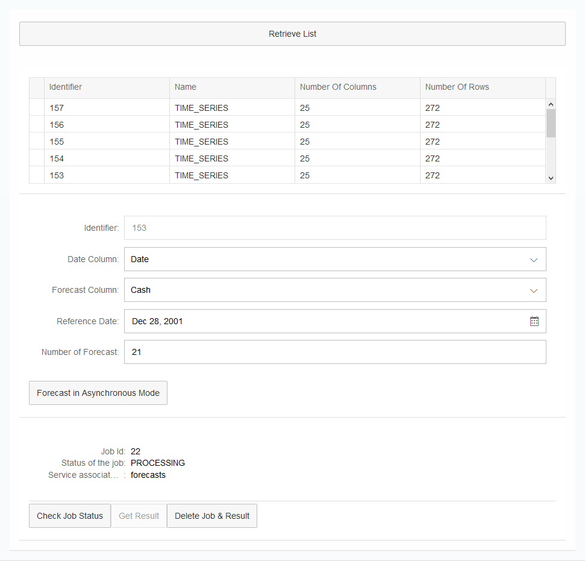
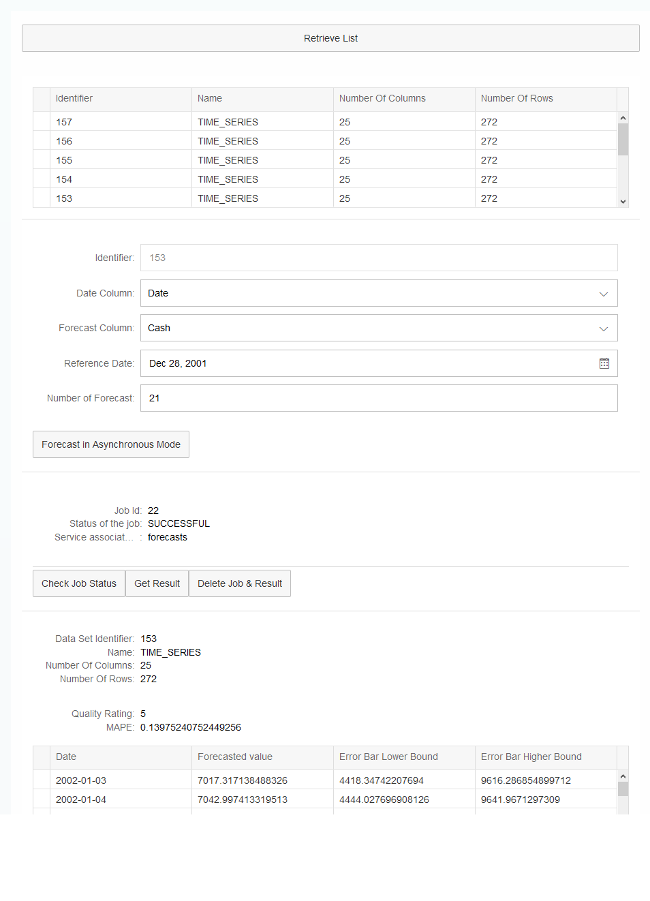

## Prerequisites
  - **Proficiency:** Intermediate
  - **Tutorials:** [Use the synchronous Forecast HCP predictive service from a SAPUI5 application](http://go.sap.com/developer/tutorials/hcpps-sapui5-ps-forecast-synchronous.html)

## Next Steps
  - This was the end of the tutorial series. Select a tutorial from the [Tutorial Navigator](http://go.sap.com/developer/tutorial-navigator.html) or the [Tutorial Catalog](http://go.sap.com/developer/tutorials.html)

## Details
### You will learn
  - How to implement the  "Data Set" HCP predictive service in a SAPUI5 application

### Time to Complete
  **10 minutes**

---

1. Log into the [***SAP HANA Cloud Platform Cockpit***](http://account.hanatrial.ondemand.com/cockpit) with your free trial account and access "Your Personal Developer Account".

    Click on your ***HCP Account*** identifier (which ends with *trial*) as highlighted on the below screenshot.

    

1. On the left side bar, you can navigate in **Applications** > **HTML5 Applications**.

    

1. Click on the **Edit Application**  icon for the `hcppredictiveservicesdemo` application.

    

1. This will open the ***SAP Web IDE*** where you have previously created the `hcppredictiveservicesdemo` application using the project template.

    

1. Create a new file called `ForecastCheckJob.fragment.xml` in the `hcppredictiveservicesdemo\webapp\fragment\forecast` and add the following content.

    This fragment will be used to display the "Forecast" services status.

    ```XML
    <core:FragmentDefinition xmlns:core="sap.ui.core" xmlns="sap.m" xmlns:form="sap.ui.layout.form">
      <Panel expandable="false" expanded="true" visible="{= typeof ${/forecastJobData} !== 'undefined'}">
        <!-- A table with the Data set details. It will be populated when the button is pressed-->
        <form:SimpleForm editable="false" layout="ResponsiveGridLayout" class="editableForm">
          <form:content>
            <Label text="Job Id"></Label>
            <Text text="{/forecastJobData/ID}"/>
            <Label text="Status of the job"></Label>
            <Text text="{/forecastJobData/status}"/>
            <Label text="Service associated with the job"></Label>
            <Text text="{/forecastJobData/type}"/>
          </form:content>
        </form:SimpleForm>
      </Panel>
    </core:FragmentDefinition>
    ```

1. Create a new file called `ForecastAsynchronous.view.xml` in the `hcppredictiveservicesdemo\webapp\view\forecast` and add the following content.

    The view embeds the fragment created previously to display a form where the user can select the dataset to be used for the forecast call and additional service parameters.
    It also includes a "Check status" and "Get Result" button compared to the synchronous mode.

    ```XML
    <mvc:View controllerName="demo.controller.forecast.ForecastAsynchronous" xmlns:html="http://www.w3.org/1999/xhtml"
      xmlns:mvc="sap.ui.core.mvc" xmlns="sap.m" xmlns:core="sap.ui.core" xmlns:form="sap.ui.layout.form">
      <Panel expandable="true" expanded="false" headerText="Forecast with the HCP predictive services (Asynchronous)"
        class="sapUiResponsiveMargin" width="auto" height="auto">
        <form:SimpleForm editable="true" layout="ResponsiveGridLayout" class="editableForm">
          <form:content>
            <Button text="Retrieve List" type="Default" press="onDataSetGetList"/>
          </form:content>
        </form:SimpleForm>
        <Panel expandable="false" expanded="true" visible="{= ${/function} === 'ForecastAsynchronous'}">
          <Panel expandable="false" expanded="true" visible="{= typeof ${/dataSetListData} !== 'undefined'}">
            <core:Fragment fragmentName='demo.fragment.dataset.DatasetList' type='XML'/>
          </Panel>
          <Panel expandable="false" expanded="true" visible="{= typeof ${/dataSetData} !== 'undefined'}">
            <core:Fragment fragmentName='demo.fragment.forecast.ForecastForm' type='XML'/>
            <Button text="Forecast in Asynchronous Mode" type="Default" press="onForecastAsynchronous"/>
          </Panel>
          <Panel expandable="false" expanded="true" visible="{= typeof ${/forecastJobData} !== 'undefined'}">
            <core:Fragment fragmentName='demo.fragment.forecast.ForecastCheckJob' type='XML'/>
            <Button text="Check Job Status" type="Default" press="onForecastAsynchronousCheckStatus"/>
            <Button text="Get Result" type="Default" press="onForecastAsynchronousGetResult"  enabled="{= typeof ${/forecastJobData} !== 'undefined' &amp;&amp; ${/forecastJobData/status} === 'SUCCESSFUL'}"/>
            <Button text="Delete Job &amp; Result" type="Default" press="onForecastAsynchronousDeleteResult"/>
          </Panel>
          <Panel expandable="false" expanded="true" visible="{= typeof ${/forecastResultData} !== 'undefined'}">
            <core:Fragment fragmentName='demo.fragment.forecast.ForecastResult' type='XML'/>
          </Panel>
        </Panel>
      </Panel>
    </mvc:View>
    ```

1. Open the `ForecastAsynchronous.controller.js` file in the `hcppredictiveservicesdemo\webapp\controller\forecast` directory and add the following after the last function (make sure you include a comma between each functions) .

    The controller includes the functions used to process the 'Press' events on the controls added in the view and process the `AJAX` calls to the HCP predictive services.
    It 'extends' the `DataSetList` JavaScript file created earlier as our view uses the `DatasetList` fragment.

    ```JavaScript
    sap.ui.define([
      "sap/ui/core/mvc/Controller",
      "sap/m/MessageToast",
      "demo/fragment/dataset/DatasetList"
    ], function(Controller, MessageToast, DatasetList) {
      "use strict";

      jQuery.sap.require("demo.fragment.dataset.DatasetList");

      return Controller.extend("demo.controller.forecast.ForecastAsynchronous", {
        onDataSetGetList: function() {
          DatasetList.prototype.onDataSetGetList.apply(this, arguments);
          sap.ui.getCore().getModel().setProperty("/function", "ForecastAsynchronous");
        },
        onDataSetListSelectionChanged: function(oControlEvent) {
          DatasetList.prototype.onDataSetListSelectionChanged.apply(this, arguments);
          sap.ui.getCore().getModel().setProperty("/function", "ForecastAsynchronous");
        },
        onForecastAsynchronous: function() {
          // set the busy indicator to avoid multi clicks
          var oBusyIndicator = new sap.m.BusyDialog();
          oBusyIndicator.open();

          // get the service parameters value
          var sDatasetID = this.getView().byId("idInputForecastDatasetID").getValue();
          var sTargetColumn = this.getView().byId("idInputForecastTargetColumn").getSelectedKey();
          var sDateColumn = this.getView().byId("idInputForecastDateColumn").getSelectedKey();
          var sNumberOfForecasts = this.getView().byId("idInputForecastNumberOfForecasts").getValue();
          var sReferenceDate = this.getView().byId("idInputForecastReferenceDate").getValue();
          // define the service parameters
          var param = {
            datasetID: sDatasetID,
            targetColumn: sTargetColumn,
            dateColumn: sDateColumn,
            numberOfForecasts: sNumberOfForecasts,
            referenceDate: sReferenceDate
          };

          // call the service and define call back methods
          $.ajax({
            headers: {
              'Accept': 'application/json',
              'Content-Type': 'application/json'
            },
            url: "/HCPps/api/analytics/forecast",
            type: "POST",
            data: JSON.stringify(param),
            dataType: "json",
            async: false,
            success: function(data) {
              try {
                //Save data set description data in the model
                sap.ui.getCore().getModel().setProperty("/forecastResultData", undefined);
                sap.ui.getCore().getModel().setProperty("/forecastJobData", undefined);
                sap.ui.getCore().getModel().setProperty("/forecastJobData", data);
                sap.ui.getCore().getModel().setProperty("/function", "ForecastAsynchronous");
                oBusyIndicator.close();
              } catch (err) {
                MessageToast.show("Caught - onHCPpsForecastSynchyronous[ajax success] :" + err.message);
              }
              oBusyIndicator.close();
            },
            error: function(request, status, error) {
              MessageToast.show("Caught - onHCPpsForecastSynchyronous[ajax error] :" + request.responseText);
              oBusyIndicator.close();
            }
          });
        },
        onForecastAsynchronousCheckStatus: function() {
          // set the busy indicator to avoid multi clicks
          var oBusyIndicator = new sap.m.BusyDialog();
          oBusyIndicator.open();

          // get the service parameters value
          var jobId = sap.ui.getCore().getModel().getProperty("/forecastJobData/ID");

          // call the service and define call back methods
          $.ajax({
            headers: {
              'Accept': 'application/json',
              'Content-Type': 'application/json'
            },
            url: "/HCPps/api/analytics/forecast/" + jobId + "/status",
            type: "GET",
            async: false,
            success: function(data) {
              try {
                //Save data set description data in the model
                sap.ui.getCore().getModel().setProperty("/forecastJobData", data);
                oBusyIndicator.close();
              } catch (err) {
                MessageToast.show("Caught - onHCPpsForecastSynchyronous[ajax success] :" + err.message);
              }
              oBusyIndicator.close();
            },
            error: function(request, status, error) {
              MessageToast.show("Caught - onHCPpsForecastSynchyronous[ajax error] :" + request.responseText);
              oBusyIndicator.close();
            }
          });
        },
        onForecastAsynchronousGetResult: function() {
          // set the busy indicator to avoid multi clicks
          var oBusyIndicator = new sap.m.BusyDialog();
          oBusyIndicator.open();

          // get the service parameters value
          var jobId = sap.ui.getCore().getModel().getProperty("/forecastJobData/ID");

          // call the service and define call back methods
          $.ajax({
            headers: {
              'Accept': 'application/json',
              'Content-Type': 'application/json'
            },
            url: "/HCPps/api/analytics/forecast/" + jobId,
            type: "GET",
            async: false,
            success: function(data) {
              try {
                //Save data set description data in the model
                sap.ui.getCore().getModel().setProperty("/forecastResultData", data);
                oBusyIndicator.close();
              } catch (err) {
                MessageToast.show("Caught - onHCPpsForecastASynchronousResult[ajax success] :" + err.message);
              }
              oBusyIndicator.close();
            },
            error: function(request, status, error) {
              MessageToast.show("Caught - onHCPpsForecastASynchronousResult[ajax error] :" + request.responseText);
              oBusyIndicator.close();
            }
          });
        },
        onForecastAsynchronousDeleteResult: function() {
          // set the busy indicator to avoid multi clicks
          var oBusyIndicator = new sap.m.BusyDialog();
          oBusyIndicator.open();

          // get the service parameters value
          var jobId = sap.ui.getCore().getModel().getProperty("/forecastJobData/ID");

          // call the service and define call back methods
          $.ajax({
            headers: {
              'Accept': 'application/json',
              'Content-Type': 'application/json'
            },
            url: "/HCPps/api/analytics/forecast/" + jobId,
            type: "DELETE",
            async: false,
            success: function(data) {
              try {
                //Save data set description data in the model
                sap.ui.getCore().getModel().setProperty("/forecastJobData", undefined);
                sap.ui.getCore().getModel().setProperty("/forecastResultData", undefined);
                oBusyIndicator.close();
              } catch (err) {
                MessageToast.show("Caught - onHCPpsForecastASynchronousDelete[ajax success] :" + err.message);
              }
              oBusyIndicator.close();
            },
            error: function(request, status, error) {
              MessageToast.show("Caught - onHCPpsForecastASynchronousDelete[ajax error] :" + request.responseText);
              oBusyIndicator.close();
            }
          });
        }
      });
    });
    ```

1. Edit the `demo.view.xml` file located in the `hcppredictiveservicesdemo\webapp\view` and replace the existing code by the following one:

    Here we simply extend the main view.

    ```XML
    <mvc:View controllerName="demo.controller.demo"
      xmlns:html="http://www.w3.org/1999/xhtml"
      xmlns:mvc="sap.ui.core.mvc"
      xmlns="sap.m">
      <App>
        <pages>
          <Page title="Developing with HCPps and SAPUI5">
            <content>
              <mvc:XMLView viewName="demo.view.forecast.ForecastAsynchronous"/>
              <mvc:XMLView viewName="demo.view.forecast.ForecastSynchronous"/>
              <mvc:XMLView viewName="demo.view.dataset.DatasetManage"/>
              <mvc:XMLView viewName="demo.view.dataset.DatasetRegister"/>
              <mvc:XMLView viewName="demo.view.odata.ODataDisplay"/>
            </content>
          </Page>
        </pages>
      </App>
    </mvc:View>
    ```

1. You can save all modified files by pressing `CTRL+SHIFT+S`. Then, click on the **Run** icon  or press `ALT+F5`.

    Click on **Retrieve List**, select an entry in the table, then click on **Forecast in Asynchronous Mode**.

    

    Click on **Check Job Status**

    When the status becomes **SUCCESSFUL**, then you can click on **Get Result**.

    

    Et voilà!

## Next Steps
  - Select a tutorial from the [Tutorial Navigator](http://go.sap.com/developer/tutorial-navigator.html) or the [Tutorial Catalog](http://go.sap.com/developer/tutorials.html)

