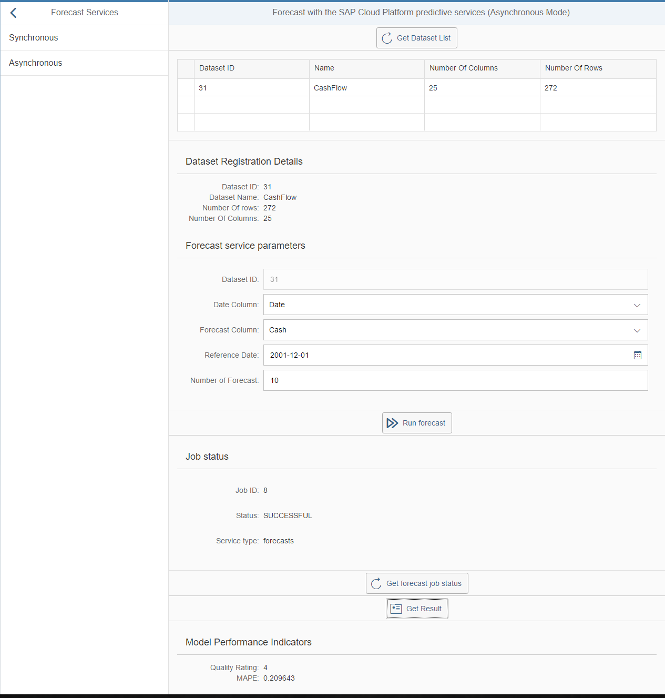

## Prerequisites
  - **Proficiency:** Intermediate
  - **Tutorials:** [Implement the "Forecast" service asynchronous mode](http://www.sap.com/developer/tutorials/hcpps-sapui5-ps-forecast-synchronous.html)

## Next Steps
  - This was the end of the tutorial series. Select a tutorial from the [Tutorial Navigator](http://www.sap.com/developer/tutorial-navigator.html) or the [Tutorial Catalog](http://www.sap.com/developer/tutorials.html)

## Details
### You will learn
  - How to add a SAPUI5 controller to interact with the "Forecast" SAP Cloud Platform predictive service in your SAPUI5 application with the asynchronous mode

> **Note:** our goal here is to mimic what was done using the REST Client around the "Forecast" services

### Time to Complete
  **10 minutes**

[ACCORDION-BEGIN [Step 1: ](Open SAP Web IDE)]

Log into the [***SAP HANA Cloud Platform Cockpit***](http://account.hanatrial.ondemand.com/cockpit) with your free trial account and access "Your Personal Developer Account".

Click on your ***SAP Cloud Platform Account Name*** as highlighted on the below screenshot.


On the left side bar, you can navigate in **Services**, then using the search box enter `Web IDE`.


Click on the tile, then click on **Open SAP Web IDE**.


You will get access to the **SAP Web IDE** main page:


This will open the ***SAP Web IDE*** where you have previously created the `hcppredictiveservicesdemo` application using the project template.


[DONE]
[ACCORDION-END]

[ACCORDION-BEGIN [Step 2: ](Create a new controller)]

For the moment we will just add the "Get Dataset List" functions and the "Forecast" similar to what we did in the previous tutorial.

Create a new file **`asynchronous.controller.js`** in `webapp\controller\forecast` either using the "File" menu or using the right click menu.

Open the `webapp\controller\forecast\asynchronous.controller.js` file and add the following code:

```js
sap.ui.define([
	"sap/ui/core/mvc/Controller",
	"sap/m/MessageToast",
	"sapui5demo/fragment/dataset/DatasetList"
], function(Controller, MessageToast, DatasetList) {
	"use strict";

	jQuery.sap.require("sapui5demo.fragment.dataset.DatasetList");

	return Controller.extend("sapui5demo.controller.forecast.asynchronous", {
		onInit: function() {
			if (typeof sap.ui.getCore().getModel() === 'undefined') {
				this.getView().setModel(new sap.ui.model.json.JSONModel(), "dataset_fragment");
				this.getView().setModel(new sap.ui.model.json.JSONModel(), "forecast_fragment");
				this.getView().setModel(new sap.ui.model.json.JSONModel(), "job_fragment");
			}
		},
		getDatasetList: function() {
			DatasetList.prototype.getDatasetList.apply(this, arguments);
		},
		getDatasetDescription: function(event) {
			DatasetList.prototype.getDatasetDescription.apply(this, arguments);
		},
		forecast: function(event) {
    	// set the busy indicator to avoid multi clicks
    	var oBusyIndicator = new sap.m.BusyDialog();
    	oBusyIndicator.open();

    	// get the current view
    	var oView = this.getView();

    	// get the model
    	var oModelJob = oView.getModel("job_fragment");

    	// get the service parameters value
    	var datasetId = this.getView().byId(event.getSource().data("eDatasetID")).getValue();
    	var targetColumn = this.getView().byId(event.getSource().data("eTargetColumn")).getSelectedKey();
    	var dateColumn = this.getView().byId(event.getSource().data("eDateColumn")).getSelectedKey();
    	var numberOfForecasts = this.getView().byId(event.getSource().data("eNumberOfForecasts")).getValue();
    	var referenceDate = this.getView().byId(event.getSource().data("eReferenceDate")).getValue();

    	// define the service parameters
    	var param = {
    		datasetID: datasetId,
    		targetColumn: targetColumn,
    		dateColumn: dateColumn,
    		numberOfForecasts: numberOfForecasts,
    		referenceDate: referenceDate
    	};

    	// call the service and define call back methods
    	$.ajax({
    		headers: {
    			'Accept': 'application/json',
    			'Content-Type': 'application/json'
    		},
    		url: "/HCPps/api/analytics/forecast",
    		type: "POST",
    		data: JSON.stringify(param),
    		dataType: "json",
    		async: false,
    		success: function(data) {
    			try {
    				//Save data set description data in the model
    				oModelJob.setProperty("/job", data);
    				oBusyIndicator.close();
    			} catch (err) {
    				MessageToast.show("Caught - forecast [ajax success] :" + err.message);
    			}
    			oBusyIndicator.close();
    		},
    		error: function(request, status, error) {
    			MessageToast.show("Caught - forecast [ajax error] :" + request.responseText);
    			oBusyIndicator.close();
    		}
    	});
    }
  });
});    
```

You can notice that the service call is almost the same (minor change in the URL), but the returned payload is not the model but the job details.

Click on the  button (or press CTRL+S)

[DONE]
[ACCORDION-END]

[ACCORDION-BEGIN [Step 3: ](Create a new view)]

The view will contain:

  - a button that will trigger the "Get Dataset List" service
  - use the fragments previously created to display:
    - the list of registered datasets
    - the selected dataset header description
    - the service parameters form

Create a new file **`asynchronous.view.xml`** in `webapp\view\forecast` either using the "File" menu or using the right click menu.

Open the `webapp\view\forecast\asynchronous.view.xml` file and add the following code:

```xml
<mvc:View controllerName="sapui5demo.controller.forecast.asynchronous" xmlns:html="http://www.w3.org/2000/xhtml" xmlns:mvc="sap.ui.core.mvc"
	xmlns="sap.m" xmlns:core="sap.ui.core" xmlns:form="sap.ui.layout.form"
	xmlns:custom="http://schemas.sap.com/sapui5/extension/sap.ui.core.CustomData/1">
	<Toolbar>
		<ToolbarSpacer/>
		<Button icon="sap-icon://refresh" text="Get Dataset List" press="getDatasetList"/>
		<ToolbarSpacer/>
	</Toolbar>
	<Panel expandable="false" visible="{= typeof ${dataset_fragment>/datasets} !== 'undefined'}">
		<core:Fragment fragmentName='sapui5demo.fragment.dataset.DatasetList' type='XML'/>
	</Panel>
	<Panel expandable="false" visible="{= typeof ${dataset_fragment>/dataset} !== 'undefined'}">
		<core:Fragment fragmentName='sapui5demo.fragment.dataset.DatasetHeader' type='XML'/>
		<core:Fragment fragmentName='sapui5demo.fragment.forecast.ServiceForm' type='XML'/>
		<!--<core:Fragment fragmentName='sapui5demo.fragment.forecast.DatasetDescription' type='XML'/>-->
	</Panel>
	<Toolbar visible="{= typeof ${dataset_fragment>/dataset} !== 'undefined'}">
		<ToolbarSpacer/>
		<Button icon="sap-icon://begin" text="Run forecast" custom:eDatasetID="idFormDatasetID" custom:eDateColumn="idFormDateColumn"
			custom:eTargetColumn="idFormTargetColumn" custom:eReferenceDate="idFormReferenceDate" custom:eNumberOfForecasts="idFormNumberOfForecasts"
			press="forecast"/>
		<ToolbarSpacer/>
	</Toolbar>
</mvc:View>
```

Click on the  button (or press CTRL+S)

[DONE]
[ACCORDION-END]

[ACCORDION-BEGIN [Step 5: ](Job status fragment)]

The fragment will contain:

  - the current status of a job

Create a new file **`JobStatus.fragment.xml`** in `webapp\fragment\job` either using the "File" menu or using the right click menu.

Open the `webapp\controller\fragment\job\JobStatus.fragment.xml` file and add the following code:

```xml
<core:FragmentDefinition xmlns:core="sap.ui.core" xmlns="sap.m" xmlns:form="sap.ui.layout.form">
	<form:Form editable="true" >
		<form:title>
			<core:Title text="Job status"/>
		</form:title>
		<form:layout>
			<form:ResponsiveGridLayout/>
		</form:layout>
		<form:formContainers>
			<form:FormContainer>
				<form:formElements>
					<form:FormElement label="Job ID">
						<form:fields>
							<Text text="{job_fragment>/job/ID}"/>
						</form:fields>
					</form:FormElement>
					<form:FormElement label="Status">
						<form:fields>
							<Text text="{job_fragment>/job/status}"/>
						</form:fields>
					</form:FormElement>
					<form:FormElement label="Service type">
						<form:fields>
							<Text text="{job_fragment>/job/type}"/>
						</form:fields>
					</form:FormElement>
				</form:formElements>
			</form:FormContainer>
		</form:formContainers>
	</form:Form>
</core:FragmentDefinition>
```

Click on the  button (or press CTRL+S)

[DONE]
[ACCORDION-END]

[ACCORDION-BEGIN [Step 6: ](Add the "check job status" function)]

Open the `webapp\controller\forecast\asynchronous.controller.js` file and add the following code right after the last function (don't forget to use a comma to separate them):

```js
checkStatus: function() {
	// set the busy indicator to avoid multi clicks
	var oBusyIndicator = new sap.m.BusyDialog();
	oBusyIndicator.open();

	// get the current view
	var oView = this.getView();

	// get the model
	var oModelJob = oView.getModel("job_fragment");

	// get the service parameters value
	var jobId = oModelJob.getProperty("/job/ID");

	// call the service and define call back methods
	$.ajax({
		headers: {
			'Accept': 'application/json',
			'Content-Type': 'application/json'
		},
		url: "/HCPps/api/analytics/forecast/" + jobId + "/status",
		type: "GET",
		async: false,
		success: function(data) {
			try {
				//Save data set description data in the model
				oModelJob.setProperty("/job", data);
				oBusyIndicator.close();
			} catch (err) {
				MessageToast.show("Caught - forecast check status [ajax success] :" + err.message);
			}
			oBusyIndicator.close();
		},
		error: function(request, status, error) {
			MessageToast.show("Caught - forecast check status [ajax error] :" + request.responseText);
			oBusyIndicator.close();
		}
	});
}
```

Click on the  button (or press CTRL+S)

Open the `webapp\view\forecast\asynchronous.view.xml` file and add the following code at the end of the view after the last `Toolbar` element:

```xml
<Panel expandable="false" visible="{= typeof ${job_fragment>/job} !== 'undefined'}">
  <core:Fragment fragmentName='sapui5demo.fragment.job.JobStatus' type='XML'/>
</Panel>
<Toolbar visible="{= typeof ${job_fragment>/job} !== 'undefined'}">
  <ToolbarSpacer/>
  <Button icon="sap-icon://refresh" text="Get forecast job status" press="checkStatus"/>
  <ToolbarSpacer/>
</Toolbar>
```

Click on the  button (or press CTRL+S)

[DONE]
[ACCORDION-END]

[ACCORDION-BEGIN [Step 7: ](Add the "get job result" function)]

Open the `webapp\controller\forecast\asynchronous.controller.js` file and add the following code right after the last function (don't forget to use a comma to separate them):

```js
getResults: function() {
	// set the busy indicator to avoid multi clicks
	var oBusyIndicator = new sap.m.BusyDialog();
	oBusyIndicator.open();

	// get the current view
	var oView = this.getView();

	// get the model
	var oModelJob = oView.getModel("job_fragment");
	var oModelForecast = oView.getModel("forecast_fragment");

	// get the service parameters value
	var jobId = oModelJob.getProperty("/job/ID");

	// call the service and define call back methods
	$.ajax({
		headers: {
			'Accept': 'application/json',
			'Content-Type': 'application/json'
		},
		url: "/HCPps/api/analytics/forecast/" + jobId,
		type: "GET",
		async: false,
		success: function(data) {
			try {
				//Save data set description data in the model
				oModelForecast.setProperty("/model", data);
				oBusyIndicator.close();
			} catch (err) {
				MessageToast.show("Caught - forecast get results [ajax success] :" + err.message);
			}
			oBusyIndicator.close();
		},
		error: function(request, status, error) {
			MessageToast.show("Caught - forecast get results [ajax error] :" + request.responseText);
			oBusyIndicator.close();
		}
	});
}
```

Click on the  button (or press CTRL+S)

Open the `webapp\view\forecast\asynchronous.view.xml` file and add the following code at the end of the view after the last `Toolbar` element:

```xml
<Toolbar visible="{= typeof ${job_fragment>/job} !== 'undefined'}">
  <ToolbarSpacer/>
  <Button icon="sap-icon://folder" text="Get Result" press="getResults"
    enabled="{= typeof ${job_fragment>/job} !== 'undefined' &amp;&amp; ${job_fragment>/job/status} === 'SUCCESSFUL'}"/>
  <ToolbarSpacer/>
</Toolbar>
<Panel expandable="false" visible="{= typeof ${forecast_fragment>/model} !== 'undefined'}">
  <core:Fragment fragmentName='sapui5demo.fragment.forecast.ServiceResult' type='XML'/>
</Panel>
```

[DONE]
[ACCORDION-END]

[ACCORDION-BEGIN [Step 8: ](Add the "delete job result")]

Open the `webapp\controller\forecast\asynchronous.controller.js` file and add the following code right after the last function (don't forget to use a comma to separate them):

```js
deleteResults: function() {
	// set the busy indicator to avoid multi clicks
	var oBusyIndicator = new sap.m.BusyDialog();
	oBusyIndicator.open();

	// get the current view
	var oView = this.getView();

	// get the model
	var oModelJob = oView.getModel("job_fragment");
	var oModelForecast = oView.getModel("forecast_fragment");

	// get the service parameters value
	var jobId = oModelJob.getProperty("/job/ID");

	// call the service and define call back methods
	$.ajax({
		headers: {
			'Accept': 'application/json',
			'Content-Type': 'application/json'
		},
		url: "/HCPps/api/analytics/forecast/" + jobId,
		type: "DELETE",
		async: false,
		success: function(data) {
			try {
				//Save data set description data in the model
				oModelJob.setProperty("/job", undefined);
				oModelForecast.setProperty("/model", undefined);
				oBusyIndicator.close();
			} catch (err) {
				MessageToast.show("Caught - forecast delete results [ajax success] :" + err.message);
			}
			oBusyIndicator.close();
		},
		error: function(request, status, error) {
			MessageToast.show("Caught - forecast delete results [ajax error] :" + request.responseText);
			oBusyIndicator.close();
		}
	});
}
```

Click on the  button (or press CTRL+S)

Open the `webapp\view\forecast\asynchronous.view.xml` file and add the following code at the end of the view after the last `Toolbar` element:

```xml
<Toolbar visible="{= typeof ${forecast_fragment>/model} !== 'undefined'}">
  <ToolbarSpacer/>
  <Button icon="sap-icon://folder" text="Delete Results" press="deleteResults"/>
  <ToolbarSpacer/>
</Toolbar>
```

[DONE]
[ACCORDION-END]

[ACCORDION-BEGIN [Step 9: ](Extend the default view)]

Edit the `demo.view.xml` file located in the `webapp\view`.

Inside the `<detailPages>` element add the following element:

```xml
<Page id="detail_forecast_asynchronous" title="Forecast with the SAP Cloud for predictive services (Asynchronous Mode)">
  <content>
    <mvc:XMLView viewName="sapui5demo.view.forecast.asynchronous"/>
  </content>
</Page>
```

Click on the  button (or press CTRL+S)

[DONE]
[ACCORDION-END]

[ACCORDION-BEGIN [Step 10: ](Run the application)]

Then, click on the **Run** icon  or press `ALT+F5`.

On the left panel, you should see an item labeled `Forecast Services`, click on it. Then click on `Asynchronous`

Select the dataset you want to use from the list (Cash Flow is the one!), update the service parameters if needed, then press the `Run forecast` button.

The job status fragment will appear, click on "Get forecast job status" until the status becomes "SUCCESSFUL", then hit "Get Result".

Et voilà!


[DONE]
[ACCORDION-END]

[ACCORDION-BEGIN [Solution: ](Created and modified files)]

In case you are having problems when running the application, please find bellow the created and modified files:

  - [`webapp\fragment\job\JobStatus.fragment.xml`](https://raw.githubusercontent.com/SAPDocuments/Tutorials/master/tutorials/hcpps-sapui5-ps-forecast-asynchronous/solution-controller-job-JobStatus.fragment.xml.txt)
  - [`webapp\controller\forecast\asynchronous.controller.js`](https://raw.githubusercontent.com/SAPDocuments/Tutorials/master/tutorials/hcpps-sapui5-ps-forecast-asynchronous/solution-controller-forecast-asynchronous.controller.js.txt)
  - [`webapp\view\forecast\asynchronous.view.xml`](https://raw.githubusercontent.com/SAPDocuments/Tutorials/master/tutorials/hcpps-sapui5-ps-forecast-asynchronous/solution-view-forecast-asynchronous.view.xml.txt)
  - [`webapp\view\demo.view.xml`](https://raw.githubusercontent.com/SAPDocuments/Tutorials/master/tutorials/hcpps-sapui5-ps-forecast-asynchronous/solution-view-demo.view.xml.txt)

[DONE]
[ACCORDION-END]

## Next Steps
  - Select a tutorial from the [Tutorial Navigator](http://www.sap.com/developer/tutorial-navigator.html) or the [Tutorial Catalog](http://www.sap.com/developer/tutorials.html)
