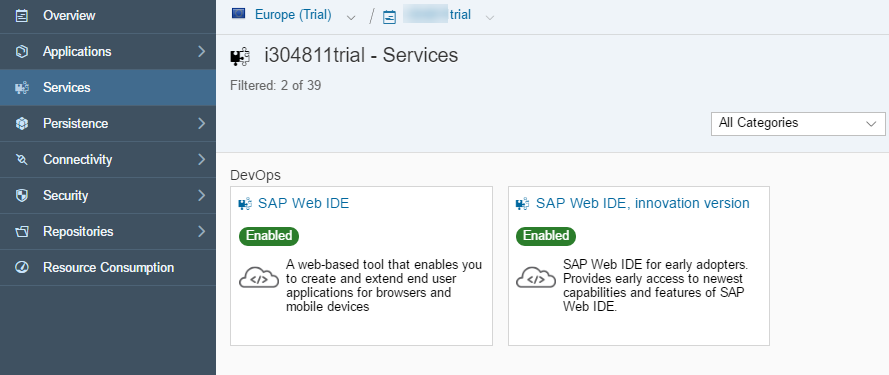
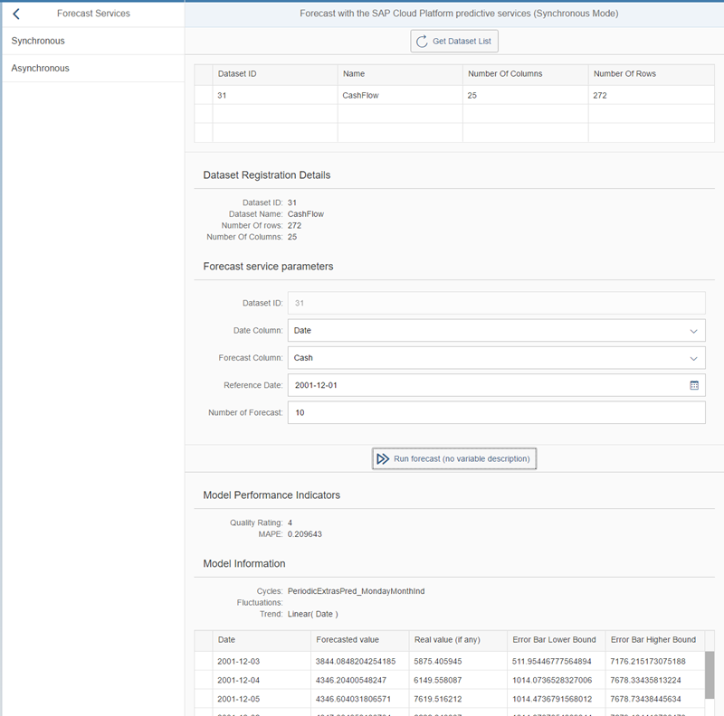

## Prerequisites
  - **Proficiency:** Intermediate
  - **Tutorials:** [Manage registered predictive "datasets"](http://www.sap.com/developer/tutorials/hcpps-sapui5-ps-dataset-manage.html)

## Next Steps
  - [Implement the "Forecast" service asynchronous mode](http://www.sap.com/developer/tutorials/hcpps-sapui5-ps-forecast-asynchronous.html)

## Details
### You will learn
  - How to add a SAPUI5 controller to interact with the "Forecast" SAP Cloud Platform predictive service in your SAPUI5 application
  - How to add a SAPUI5 view to display the output of the "Forecast" SAP Cloud Platform predictive service call
  - How to extend the default view and the newly created view
  - How to create reusable fragments and function libraries

> **Note:** our goal here is to mimic what was done using the REST Client around the "Forecast" services

### Time to Complete
  **10 minutes**

[ACCORDION-BEGIN [Step 1: ](Open SAP Web IDE)]

Log into the [***SAP HANA Cloud Platform Cockpit***](http://account.hanatrial.ondemand.com/cockpit) with your free trial account and access "Your Personal Developer Account".

Click on your ***SAP Cloud Platform Account Name*** as highlighted on the below screenshot.


On the left side bar, you can navigate in **Services**, then using the search box enter `Web IDE`.



Click on the tile, then click on **Open SAP Web IDE**.


You will get access to the **SAP Web IDE** main page:


This will open the ***SAP Web IDE*** where you have previously created the `hcppredictiveservicesdemo` application using the project template.


[DONE]
[ACCORDION-END]

[ACCORDION-BEGIN [Step 2: ](Registered dataset list fragment)]

The fragment will reuse some of the code that was used in the [Manage your registered "Datasets"](http://www.sap.com/developer/tutorials/hcpps-sapui5-ps-dataset-manage.html) tutorial.

The fragment will contain:

  - a table with the list of registered datasets details

For more details on fragment, please refer to the [XML Templating documentation](https://sapui5.hana.ondemand.com/#docs/guide/5ee619fc1370463ea674ee04b65ed83b.html).

Create a new directory structure for **`webapp\fragment\dataset`** either using the "File" menu or using the right click menu.

Create a new file **`DatasetList.fragment.xml`** in `webapp\fragment\dataset` either using the "File" menu or using the right click menu.

Open the `webapp\controller\fragment\dataset\DatasetList.fragment.xml` file and add the following code:

```xml
<core:FragmentDefinition xmlns:core="sap.ui.core" xmlns="sap.m" xmlns:table="sap.ui.table">
	<table:Table rows="{dataset_fragment>/datasets}" enableBusyIndicator="true" selectionMode="Single" visibleRowCount="3"
		rowSelectionChange="getDatasetDescription" cellClick="getDatasetDescription">
		<table:columns>
			<table:Column>
				<Label text="Dataset ID"/>
				<table:template>
					<Text text="{dataset_fragment>ID}"/>
				</table:template>
			</table:Column>
			<table:Column>
				<Label text="Name"/>
				<table:template>
					<Text text="{dataset_fragment>name}"/>
				</table:template>
			</table:Column>
			<table:Column>
				<Label text="Number Of Columns"/>
				<table:template>
					<Text text="{dataset_fragment>numberOfColumns}"/>
				</table:template>
			</table:Column>
			<table:Column>
				<Label text="Number Of Rows"/>
				<table:template>
					<Text text="{dataset_fragment>numberOfRows}"/>
				</table:template>
			</table:Column>
		</table:columns>
	</table:Table>
</core:FragmentDefinition>
```

Click on the  button (or press CTRL+S)

[DONE]
[ACCORDION-END]

[ACCORDION-BEGIN [Step 3: ](Registered dataset header description)]

The fragment will contain:

  - a form displaying the dataset "header" description (ID, name number of rows & columns)

Create a new file **`DatasetHeader.fragment.xml`** in `webapp\fragment\dataset` either using the "File" menu or using the right click menu.

Open the `webapp\controller\fragment\dataset\DatasetHeader.fragment.xml` file and add the following code:

```xml
<core:FragmentDefinition xmlns:core="sap.ui.core" xmlns="sap.m" xmlns:form="sap.ui.layout.form" xmlns:table="sap.ui.table">
	<form:Form editable="false" class="isReadonly">
		<form:title>
			<core:Title text="Dataset Registration Details"/>
		</form:title>
		<form:layout>
			<form:ResponsiveGridLayout columnsL="1" columnsM="1"/>
		</form:layout>
		<form:formContainers>
			<form:FormContainer>
				<form:formElements>
					<form:FormElement label="Dataset ID">
						<form:fields>
							<Text id="idDatasetID" text="{dataset_fragment>/dataset/ID}"/>
						</form:fields>
					</form:FormElement>
					<form:FormElement label="Dataset Name">
						<form:fields>
							<Text text="{dataset_fragment>/dataset/name}"/>
						</form:fields>
					</form:FormElement>
					<form:FormElement label="Number Of rows">
						<form:fields>
							<Text text="{dataset_fragment>/dataset/numberOfRows}"/>
						</form:fields>
					</form:FormElement>
					<form:FormElement label="Number Of Columns">
						<form:fields>
							<Text text="{dataset_fragment>/dataset/numberOfColumns}"/>
						</form:fields>
					</form:FormElement>
				</form:formElements>
			</form:FormContainer>
		</form:formContainers>
	</form:Form>
</core:FragmentDefinition>
```

Click on the  button (or press CTRL+S)

[DONE]
[ACCORDION-END]

[ACCORDION-BEGIN [Step 4: ](Forecast service parameters fragment)]

The fragment will contain:

  - a form displaying the input fields for the Forecast service parameters

Create a new directory structure for **`webapp\fragment\forecast`** either using the "File" menu or using the right click menu.

Create a new file **`ServiceForm.fragment.xml`** in `webapp\fragment\forecast` either using the "File" menu or using the right click menu.

Open the `webapp\controller\fragment\forecast\ServiceForm.fragment.xml` file and add the following code:

```xml
<core:FragmentDefinition xmlns:core="sap.ui.core" xmlns="sap.m" xmlns:form="sap.ui.layout.form">
	<form:Form editable="true" >
		<form:title>
			<core:Title text="Forecast service parameters"/>
		</form:title>
		<form:layout>
			<form:ResponsiveGridLayout/>
		</form:layout>
		<form:formContainers>
			<form:FormContainer>
				<form:formElements>
					<form:FormElement label="Dataset ID">
						<form:fields>
							<Input id="idFormDatasetID" value="{dataset_fragment>/dataset/ID}" enabled="false"/>
						</form:fields>
					</form:FormElement>
					<form:FormElement label="Date Column">
						<form:fields>
							<Select id="idFormDateColumn" forceSelection="true"
								items="{ path: 'dataset_fragment>/dataset/variables', sorter: { path: 'name' }, filters: [{path: 'storage', operator: 'EQ', value1: 'date'}]}">
								<core:Item key="{dataset_fragment>name}" text="{dataset_fragment>name}"/>
							</Select>
						</form:fields>
					</form:FormElement>
					<form:FormElement label="Forecast Column">
						<form:fields>
							<Select id="idFormTargetColumn" forceSelection="true"
								items="{ path: 'dataset_fragment>/dataset/variables', sorter: { path: 'name' }, filters: [{path: 'value', operator: 'EQ', value1: 'continuous'}, {path: 'storage', operator: 'EQ', value1: 'number'}]}">
								<core:Item key="{dataset_fragment>name}" text="{dataset_fragment>name}"/>
							</Select>
						</form:fields>
					</form:FormElement>
					<form:FormElement label="Reference Date">
						<form:fields>
							<DatePicker id="idFormReferenceDate" value="2001-12-01" displayFormat="yyyy-MM-dd" valueFormat="yyyy-MM-dd"/>
						</form:fields>
					</form:FormElement>
					<form:FormElement label="Number of Forecast">
						<form:fields>
							<Input id="idFormNumberOfForecasts" value="10"/>
						</form:fields>
					</form:FormElement>
				</form:formElements>
			</form:FormContainer>
		</form:formContainers>
	</form:Form>
</core:FragmentDefinition>
```

Click on the  button (or press CTRL+S)

[DONE]
[ACCORDION-END]

[ACCORDION-BEGIN [Step 5: ](Forecast service results fragment)]

The fragment will contain:

  - a form displaying the Forecast service results

Create a new directory structure for **`webapp\fragment\forecast`** either using the "File" menu or using the right click menu.

Create a new file **`ServiceResult.fragment.xml`** in `webapp\fragment\forecast` either using the "File" menu or using the right click menu.

Open the `webapp\controller\fragment\forecast\ServiceResult.fragment.xml` file and add the following code:

```xml
<core:FragmentDefinition xmlns:core="sap.ui.core" xmlns="sap.m" xmlns:form="sap.ui.layout.form" xmlns:table="sap.ui.table">
	<form:Form editable="false" class="isReadonly">
		<form:title>
			<core:Title text="Model Performance Indicators"/>
		</form:title>
		<form:layout>
			<form:ResponsiveGridLayout columnsL="1" columnsM="1"/>
		</form:layout>
		<form:formContainers>
			<form:FormContainer>
				<form:formElements>
					<form:FormElement label="Quality Rating">
						<form:fields>
							<Text text="{forecast_fragment>/model/modelPerformance/qualityRating}"/>
						</form:fields>
					</form:FormElement>
					<form:FormElement label="MAPE">
						<form:fields>
							<Text text="{forecast_fragment>/model/modelPerformance/mape}"/>
						</form:fields>
					</form:FormElement>
				</form:formElements>
			</form:FormContainer>
		</form:formContainers>
	</form:Form>
	<form:Form editable="false" class="isReadonly">
		<form:title>
			<core:Title text="Model Information"/>
		</form:title>
		<form:layout>
			<form:ResponsiveGridLayout columnsL="1" columnsM="1"/>
		</form:layout>
		<form:formContainers>
			<form:FormContainer>
				<form:formElements>
					<form:FormElement label="Cycles">
						<form:fields>
							<Text text="{forecast_fragment>/model/modelInformation/cycles}"/>
						</form:fields>
					</form:FormElement>
					<form:FormElement label="Fluctuations">
						<form:fields>
							<Text text="{forecast_fragment>/model/modelInformation/fluctuations}"/>
						</form:fields>
					</form:FormElement>
					<form:FormElement label="Trend">
						<form:fields>
							<Text text="{forecast_fragment>/model/modelInformation/trend}"/>
						</form:fields>
					</form:FormElement>
				</form:formElements>
			</form:FormContainer>
		</form:formContainers>
	</form:Form>
	<!-- A table with the forecasted data. It will be populated when the button is pressed-->
	<table:Table rows="{forecast_fragment>/model/forecasts}" enableBusyIndicator="true" selectionMode="Single" visibleRowCount="5" width="100%">
		<table:columns>
			<table:Column sortProperty="date" filterProperty="date">
				<Label text="Date"/>
				<table:template>
					<Text text="{forecast_fragment>date}"/>
				</table:template>
			</table:Column>
			<table:Column sortProperty="forecastValue" filterProperty="forecastValue">
				<Label text="Forecasted value"/>
				<table:template>
					<Text text="{forecast_fragment>forecastValue}"/>
				</table:template>
			</table:Column>
			<table:Column sortProperty="realValue" filterProperty="realValue">
				<Label text="Real value (if any)"/>
				<table:template>
					<Text text="{forecast_fragment>realValue}"/>
				</table:template>
			</table:Column>
			<table:Column>
				<Label text="Error Bar Lower Bound"/>
				<table:template>
					<Text text="{forecast_fragment>errorBarLowerBound}"/>
				</table:template>
			</table:Column>
			<table:Column>
				<Label text="Error Bar Higher Bound"/>
				<table:template>
					<Text text="{forecast_fragment>errorBarHigherBound}"/>
				</table:template>
			</table:Column>
		</table:columns>
	</table:Table>
</core:FragmentDefinition>
```

Click on the  button (or press CTRL+S)

[DONE]
[ACCORDION-END]

[ACCORDION-BEGIN [Step 6: ](Create a new JavaScript library for the fragment)]

The library will contain a function where:

  - we process the call to the "Dataset List" SAP Cloud for predictive services and return the list of registered dataset.
  - we process the call to the "Dataset Description" SAP Cloud for predictive services and return the dataset detailed description.

These functions will be triggered either on a click or row change event on the table added previously from the main controller.

Create a new file **`DatasetList.js`** in `webapp\fragment\dataset` either using the "File" menu or using the right click menu.

Open the `webapp\fragment\dataset\DatasetList.js` file and add the following code:

```js
sap.ui.define([
	"sap/ui/core/mvc/Controller",
	"sap/m/MessageToast"
], function(Controller, MessageToast) {
	"use strict";

	return Controller.extend("sapui5demo.fragment.dataset.DatasetList", {
		getDatasetList: function() {
			// set the busy indicator to avoid multi clicks
			var oBusyIndicator = new sap.m.BusyDialog();
			oBusyIndicator.open();

			// get the current view
			var oView = this.getView();

			// get the model
			var oModel = oView.getModel("dataset_fragment");

			// call the service and define call back methods
			$.ajax({
				headers: {
					'Accept': 'application/json',
					'Content-Type': 'application/json'
				},
				url: "/HCPps/api/analytics/dataset",
				type: "GET",
				async: false,
				success: function(data) {
					try {
						//Save data set description data in the model
						oModel.setProperty("/datasets", data);
					} catch (err) {
						MessageToast.show("Caught - dataset fragment get list [ajax success] :" + err.message);
					}
					oBusyIndicator.close();
				},
				error: function(request, status, error) {
					MessageToast.show("Caught - dataset fragment get list [ajax error] :" + request.responseText);
					oBusyIndicator.close();
				}
			});
		},
		getDatasetDescription: function(oControlEvent) {
			// set the busy indicator to avoid multi clicks
			var oBusyIndicator = new sap.m.BusyDialog();
			oBusyIndicator.open();

			// get the current view
			var oView = this.getView();

			// get the model
			var oModel = oView.getModel("dataset_fragment");

			if (oModel.getProperty("/datasets") !== undefined && oModel.getProperty(
					"/datasets")[oControlEvent.getParameter("rowIndex")] !== undefined) {
				oBusyIndicator.open();
				var dataSetId = oModel.getProperty("/datasets")[oControlEvent.getParameter("rowIndex")].ID;
				// call the service and define call back methods
				$.ajax({
					headers: {
						'Accept': 'application/json',
						'Content-Type': 'application/json'
					},
					url: "/HCPps/api/analytics/dataset/" + dataSetId,
					type: "GET",
					async: false,
					success: function(data) {
						try {
							//Save data set description data in the model
							oModel.setProperty("/dataset", data);
						} catch (err) {
							MessageToast.show("Caught - dataset fragment get dataset description [ajax success] :" + err.message);
						}
						oBusyIndicator.close();
					},
					error: function(request, status, error) {
						MessageToast.show("Caught - dataset fragment get dataset description [ajax error] :" + request.responseText);
						oBusyIndicator.close();
					}
				});
			}
		}
	});
});
```

Click on the  button (or press CTRL+S)

[DONE]
[ACCORDION-END]

[ACCORDION-BEGIN [Step 7: ](Create a new controller)]

Create a new directory structure for **`webapp\controller\forecast`** either using the "File" menu or using the right click menu.

Create a new file **`synchronous.controller.js`** in `webapp\controller\forecast` either using the "File" menu or using the right click menu.

Open the `webapp\controller\forecast\synchronous.controller.js` file and add the following code:

```js
sap.ui.define([
	"sap/ui/core/mvc/Controller",
	"sap/m/MessageToast",
	"sapui5demo/fragment/dataset/DatasetList"
], function(Controller, MessageToast, DatasetList) {
	"use strict";

	jQuery.sap.require("sapui5demo.fragment.dataset.DatasetList");

	return Controller.extend("sapui5demo.controller.forecast.synchronous", {
		onInit: function() {
			if (typeof sap.ui.getCore().getModel() === 'undefined') {
				this.getView().setModel(new sap.ui.model.json.JSONModel(), "dataset_fragment");
				this.getView().setModel(new sap.ui.model.json.JSONModel(), "forecast_fragment");
			}
		},
		getDatasetList: function() {
			DatasetList.prototype.getDatasetList.apply(this, arguments);
		},
		getDatasetDescription: function(event) {
			DatasetList.prototype.getDatasetDescription.apply(this, arguments);
		},
		forecast: function(event) {
			// set the busy indicator to avoid multi clicks
			var oBusyIndicator = new sap.m.BusyDialog();
			oBusyIndicator.open();

			// get the current view
			var oView = this.getView();

			// get the model
			var oModelForecast = oView.getModel("forecast_fragment");

			// get the service parameters value
			var datasetId = this.getView().byId(event.getSource().data("eDatasetID")).getValue();
			var targetColumn = this.getView().byId(event.getSource().data("eTargetColumn")).getSelectedKey();
			var dateColumn = this.getView().byId(event.getSource().data("eDateColumn")).getSelectedKey();
			var numberOfForecasts = this.getView().byId(event.getSource().data("eNumberOfForecasts")).getValue();
			var referenceDate = this.getView().byId(event.getSource().data("eReferenceDate")).getValue();

			// define the service parameters
			var param = {
				datasetID: datasetId,
				targetColumn: targetColumn,
				dateColumn: dateColumn,
				numberOfForecasts: numberOfForecasts,
				referenceDate: referenceDate
			};

			// call the service and define call back methods
			$.ajax({
				headers: {
					'Accept': 'application/json',
					'Content-Type': 'application/json'
				},
				url: "/HCPps/api/analytics/forecast/sync",
				type: "POST",
				data: JSON.stringify(param),
				dataType: "json",
				async: false,
				success: function(data) {
					try {
						//Save data set description data in the model
						oModelForecast.setProperty("/model", data);
						oBusyIndicator.close();
					} catch (err) {
						MessageToast.show("Caught - forecast [ajax success] :" + err.message);
					}
					oBusyIndicator.close();
				},
				error: function(request, status, error) {
					MessageToast.show("Caught - forecast [ajax error] :" + request.responseText);
					oBusyIndicator.close();
				}
			});
		}
	});
});
```

Click on the  button (or press CTRL+S)

[DONE]
[ACCORDION-END]

[ACCORDION-BEGIN [Step 8: ](Create a new view)]

The view will contain:

  - a button that will trigger the "Get Dataset List" service
  - use the fragments previously created to display:
    - the list of registered datasets
    - the selected dataset header description
    - the service parameters form
  - a button that will trigger the "Forecast" service in synchronous mode

Create a new directory structure for **`webapp\view\forecast`** either using the "File" menu or using the right click menu.

Create a new file **`synchronous.view.xml`** in `webapp\view\forecast` either using the "File" menu or using the right click menu.

Open the `webapp\view\forecast\synchronous.view.xml` file and add the following code:

```xml
<mvc:View controllerName="sapui5demo.controller.forecast.synchronous" xmlns:html="http://www.w3.org/2000/xhtml" xmlns:mvc="sap.ui.core.mvc"
	xmlns="sap.m" xmlns:core="sap.ui.core" xmlns:form="sap.ui.layout.form"
	xmlns:custom="http://schemas.sap.com/sapui5/extension/sap.ui.core.CustomData/1">
	<Toolbar>
		<ToolbarSpacer/>
		<Button icon="sap-icon://refresh" text="Get Dataset List" press="getDatasetList"/>
		<ToolbarSpacer/>
	</Toolbar>
	<Panel expandable="false" visible="{= typeof ${dataset_fragment>/datasets} !== 'undefined'}">
		<core:Fragment fragmentName='sapui5demo.fragment.dataset.DatasetList' type='XML'/>
	</Panel>
	<Panel expandable="false" visible="{= typeof ${dataset_fragment>/dataset} !== 'undefined'}">
		<core:Fragment fragmentName='sapui5demo.fragment.dataset.DatasetHeader' type='XML'/>
		<core:Fragment fragmentName='sapui5demo.fragment.forecast.ServiceForm' type='XML'/>
	</Panel>
	<Toolbar visible="{= typeof ${dataset_fragment>/dataset} !== 'undefined'}">
		<ToolbarSpacer/>
		<Button icon="sap-icon://begin" text="Run forecast" custom:eDatasetID="idFormDatasetID"
			custom:eDateColumn="idFormDateColumn" custom:eTargetColumn="idFormTargetColumn" custom:eReferenceDate="idFormReferenceDate"
			custom:eNumberOfForecasts="idFormNumberOfForecasts" press="forecast"/>
		<ToolbarSpacer/>
	</Toolbar>
	<Panel expandable="false" visible="{= typeof ${forecast_fragment>/model} !== 'undefined'}">
		<core:Fragment fragmentName='sapui5demo.fragment.forecast.ServiceResult' type='XML'/>
	</Panel>
</mvc:View>
```

Click on the  button (or press CTRL+S)

[DONE]
[ACCORDION-END]

[ACCORDION-BEGIN [Step 9: ](Extend the default view)]

Edit the `demo.view.xml` file located in the `webapp\view`.

Inside the `<detailPages>` element add the following element:

```xml
<Page id="detail_forecast_synchronous" title="Forecast with the SAP Cloud for predictive services (Synchronous Mode)">
  <content>
    <mvc:XMLView viewName="sapui5demo.view.forecast.synchronous"/>
  </content>
</Page>
```

Click on the  button (or press CTRL+S)

[DONE]
[ACCORDION-END]

[ACCORDION-BEGIN [Step 10: ](Run the application)]

Then, click on the **Run** icon  or press `ALT+F5`.

On the left panel, you should see an item labeled `Forecast Services`, click on it. Then click on `Synchronous`

Select the dataset you want to use from the list (Cash Flow is the one!), update the service parameters if needed, then press the `Run forecast` button.

Et voilà!


[DONE]
[ACCORDION-END]

[ACCORDION-BEGIN [Solution: ](Created and modified files)]

In case you are having problems when running the application, please find bellow the created and modified files:

  - [`webapp\fragment\dataset\DatasetHeader.fragment.xml`](https://raw.githubusercontent.com/SAPDocuments/Tutorials/master/tutorials/hcpps-sapui5-ps-forecast-synchronous/solution-fragment-dataset-DatasetHeader.fragment.xml.txt)
  - [`webapp\fragment\dataset\DatasetList.fragment.xml`](https://raw.githubusercontent.com/SAPDocuments/Tutorials/master/tutorials/hcpps-sapui5-ps-forecast-synchronous/solution-fragment-dataset-DatasetList.fragment.xml.txt)
  - [`webapp\fragment\dataset\DatasetList.js`](https://raw.githubusercontent.com/SAPDocuments/Tutorials/master/tutorials/hcpps-sapui5-ps-forecast-synchronous/solution-fragment-dataset-DatasetList.js.txt)
  - [`webapp\fragment\forecast\ServiceForm.fragment.xml`](https://raw.githubusercontent.com/SAPDocuments/Tutorials/master/tutorials/hcpps-sapui5-ps-forecast-synchronous/solution-controller-forecast-ServiceForm.fragment.xml.txt)
  - [`webapp\fragment\forecast\ServiceResult.fragment.xml`](https://raw.githubusercontent.com/SAPDocuments/Tutorials/master/tutorials/hcpps-sapui5-ps-forecast-synchronous/solution-controller-forecast-ServiceResult.fragment.xml.txt)
  - [`webapp\controller\forecast\synchronous.controller.js`](https://raw.githubusercontent.com/SAPDocuments/Tutorials/master/tutorials/hcpps-sapui5-ps-forecast-synchronous/solution-controller-forecast-synchronous.controller.js.txt)
  - [`webapp\view\forecast\synchronous.view.xml`](https://raw.githubusercontent.com/SAPDocuments/Tutorials/master/tutorials/hcpps-sapui5-ps-forecast-synchronous/solution-view-forecast-synchronous.view.xml.txt)
  - [`webapp\view\demo.view.xml`](https://raw.githubusercontent.com/SAPDocuments/Tutorials/master/tutorials/hcpps-sapui5-ps-forecast-synchronous/solution-view-demo.view.xml.txt)

[DONE]
[ACCORDION-END]

## Next Steps
  - [Implement the "Forecast" service asynchronous mode](http://www.sap.com/developer/tutorials/hcpps-sapui5-ps-forecast-asynchronous.html)
