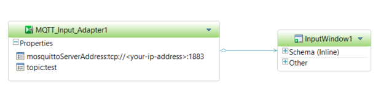

## Prerequisites
 - **Tutorial:** [Editing Adapter Configuration Files](https://developers.sap.com/tutorials/hsa-java-toolkit-adapter-part4.html)

## Next Steps
 - [Test the Custom Java Toolkit Adapter](https://developers.sap.com/tutorials/hsa-java-toolkit-adapter-part6.html)

## Details
### You will learn
 - Where to place the Custom Adapter Files on the server
 - Where to place the Custom Adapter Files on the client
 - How to access your Custom Adapter in HANA Studio

### Time to Complete
**15 Min**

---

The files for the custom adapter include the:

  - `mqtt-input.jar` and `org.eclipse.paho.client.mqttv3-<version>.jar` files
  - `adapter_config.xml` file
  - `mqtt_input.cnxml` file
  - edited versions of the `modulesdefine.xml`, `custommodulesdefine.xml`, and `parametersdefine.xsd` files

The directory paths for these files will be relative to the `STREAMING_HOME` and `STREAMING_CUSTOM_ADAPTERS_HOME` environment variables. The streaming home environment variables are `%STREAMING_HOME%` and `%STREAMING_CUSTOM_ADAPTERS_HOME% `for Windows, and `$STREAMING_HOME` and `$STREAMING_CUSTOM_ADAPTERS_HOME` for Unix operating systems (please edit the below paths according to your intention). The rest of the directory path relative to the `STREAMING_HOME` environment variable is the same on both Linux and Windows.


[ACCORDION-BEGIN [Step 1: ](Client Side (HANA Studio))]

Assuming you used the default install location, then the local Windows Streaming Analytics `$STREAMING_HOME` will be <pre>`<Hana Studio installation location>\plugins\com.sybase.cep.studio.native.bins_`<b>`<version>`</b>.<b>`<timestamp>`</b></pre> and the `$STREAMING_CUSTOM_ADAPTERS_HOME` will be

 <pre>`<Hana Studio installation location>\plugins\com.sybase.cep.studio.native.bins_`<b>`<version>`</b>.<b>`<timestamp>`</b>`\adapters\framework`</pre> relative to your `IDE`'s directory.

| Files | New Path |
|---|---|
| `mqtt-input.jar` <br/> `org.eclipse.paho.client.mqttv3-<version>.jar`|`$STREAMING_CUSTOM_ADAPTERS_HOME/libj` |
| `adapter_config.xml`  |`$STREAMING_HOME/adapters/framework/instances/mqtt_input` <br/> *Note:* You will need to create the `mqtt_input` folder |
| `mqtt_input.cnxml`  | `$STREAMING_HOME/lib/adapters` |
| `modulesdefine.xml` | `$STREAMING_HOME/adapters/framework/config` |
| `custommodulesdefine.xml` <br/> `parametersdefine.xsd` | `$STREAMING_CUSTOM_ADAPTERS_HOME /config` |

[DONE]

[ACCORDION-END]

[ACCORDION-BEGIN [Step 2: ](Server Side)]

To check the `$STREAMING_HOME` environment variable make sure that you're connected as the `<sidadm>` user, and use the echo command "`echo $STREAMING_HOME`".

> **IMPORTANT!** Since you're running a `multidb` SAP HANA environment, `$STREAMING_CUSTOM_ADAPTERS_HOME` will refer to <pre> `/hana/shared/`<b>`<SID>`</b>`/streaming/cluster/`<b>`<tenant db>`</b>`/adapters`</pre> assuming you have used the default location of `/hana` as the root directory for the installation.

| Files | New Path |
|---|---|
| `mqtt-input.jar` <br/> `org.eclipse.paho.client.mqttv3-<version>.jar`|`$STREAMING_CUSTOM_ADAPTERS_HOME/libj` |
| `adapter_config.xml`  |`$STREAMING_HOME/adapters/framework/instances/mqtt_input` <br/> *Note:* You will need to create the `mqtt_input` folder |
| `mqtt_input.cnxml`  | `$STREAMING_CUSTOM_ADAPTERS_HOME/cnxml ` |
| `modulesdefine.xml` | `$STREAMING_HOME/adapters/framework/config` |
| `custommodulesdefine.xml` <br/> `parametersdefine.xsd` | `$STREAMING_CUSTOM_ADAPTERS_HOME /config` |

For the question below, select the correct answer, and click **Validate**.

[VALIDATE_1]

[ACCORDION-END]

[ACCORDION-BEGIN [Step 3: ](Access your Custom Adapter in HANA Studio)]

If you have placed your `mqtt_input.cnxml` file in the correct location, you will be able to see your custom input adapter in the Input Adapters drawer in the palette.

Create a new Streaming Project using the Streaming Analytics plugin. Use the `ccl` code provided below for the project shown in the screenshot.



```SQL

CREATE INPUT WINDOW InputWindow1 SCHEMA ( Message string )
PRIMARY KEY ( Message ) KEEP ALL ROWS ;

ATTACH INPUT ADAPTER MQTT_Input_Adapter1
TYPE mqtt_input TO InputWindow1
PROPERTIES  mosquittoServerAddress = 'tcp://<your-ip-address>:1883' ,
topic = 'test' ;
```

Click the **Done** button below once you have completed this tutorial.

[DONE]

[ACCORDION-END]

