## Prerequisites
 - **Tutorial:** [Where to Place the Custom Adapter Files](https://developers.sap.com/tutorials/hsa-java-toolkit-adapter-part5.html)

## Next Steps
 - [Further Readings on Custom Adapters](https://developers.sap.com/tutorials/hsa-java-toolkit-adapter-part7.html)

### Time to Complete
**15 Min**

---

[ACCORDION-BEGIN [Step 1: ](Run the `Mosquitto` broker)]

Open a command prompt(`CMD`) and navigate to the install directory of `Mosquitto`. The default location is in **`C:\Program Files(x86)\Mosquitto`**. Run the `Mosquitto` broker by typing **`mosquitto.exe`**

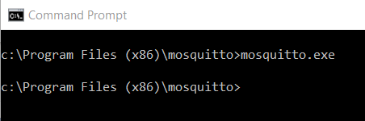

[DONE]

[ACCORDION-END]

[ACCORDION-BEGIN [Step 2: ](Configure your Streaming Project)]

Set up a streaming project like the one shown below if you haven't already set up one in the previous tutorial (Where to Place the Custom Adapter Files). The `ccl` code is provided in the Appendix section.


Right click on the "Properties" to enable editing.

Choose the **topic** for the new `MQTT_Input_Adapter1` to subscribe to. In this tutorial, we will use "test".

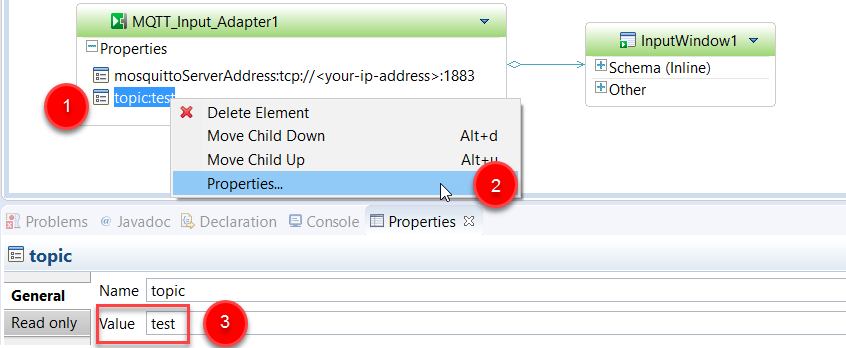

Replace **`<your-ip-address>`** with the `ip address` of the machine you will be running the `Mosquitto` `MQTT` message broker.

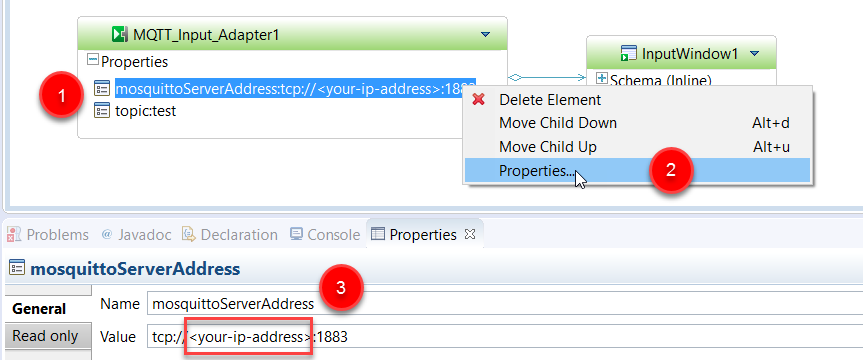

[DONE]

[ACCORDION-END]

[ACCORDION-BEGIN [Step 3: ](Set Default Server URL)]

Ensure that the server you have placed your custom adapter, including the required configuration files on is set as the `Default Server URL`. The `Streaming Server` being used to compile the project that is using the custom adapter needs to have access to the adapter configuration files during the compile process.

  1. Select Window > Preferences in your `IDE`.

    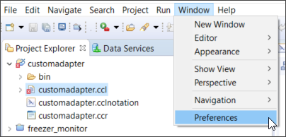

  2. With the Preferences window now open, select SAP HANA streaming analytics and, if necessary, change the `Default Server URL` to match the `ip address` of the machine you are running the Streaming Server. Click `Apply` and then `OK`.

    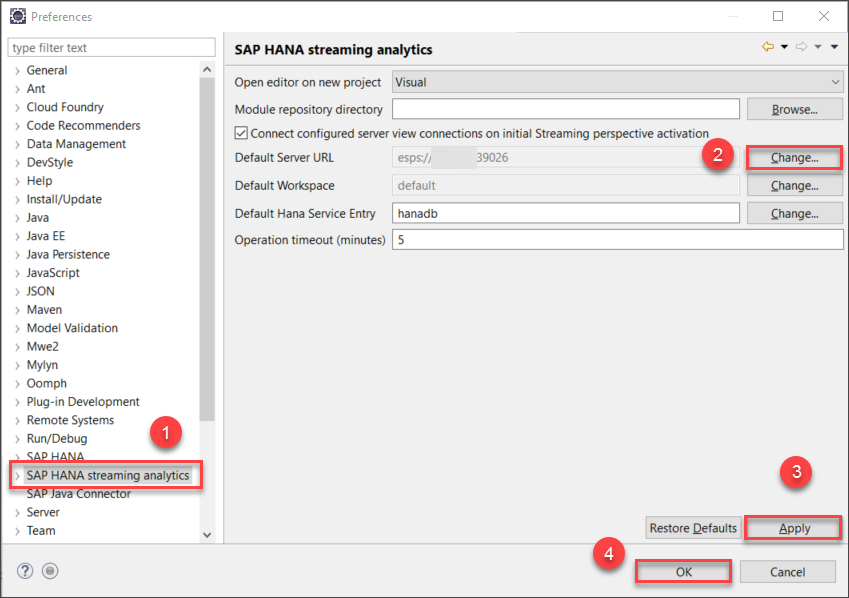

[DONE]

[ACCORDION-END]

[ACCORDION-BEGIN [Step 4: ](Run your Streaming Project)]

In the SAP HANA Streaming Development perspective right click on the project in the Project Explorer, go to SAP HANA streaming analytics, and click on **Compile Streaming Project** to compile your project.

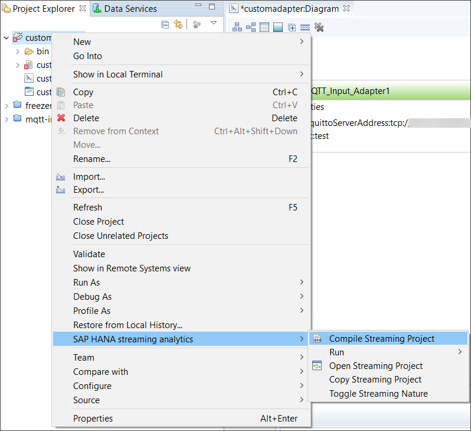

To run your project, right click on the project in the Project Explorer, go to SAP HANA streaming analytics, then run, and click on **Run Streaming Project in Workspace** to run your project.

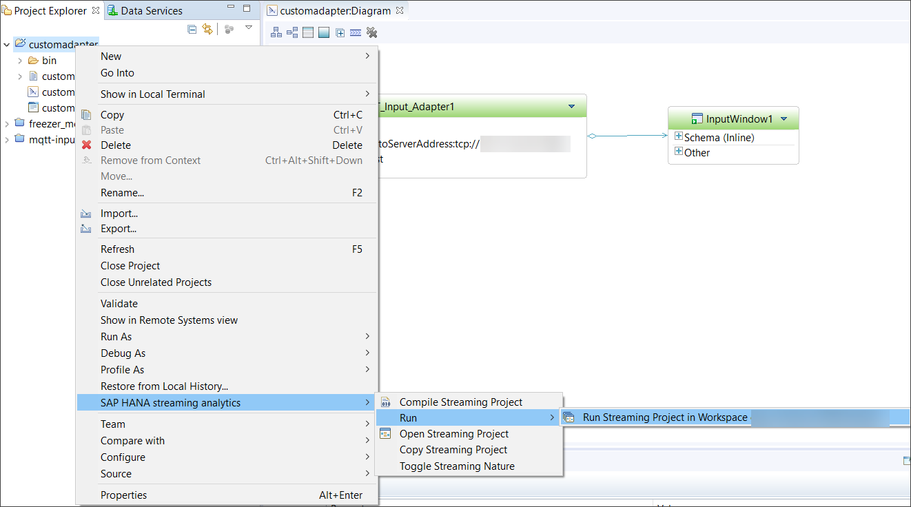

[DONE]

[ACCORDION-END]

[ACCORDION-BEGIN [Step 5: ](Open the Input Window)]

Switch to the SAP HANA Streaming Run-Test perspective from the Quick Access toolbar in the top right corner of your `IDE`.

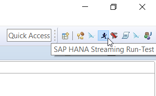

Open the input window by double clicking `InputWindow1` in the Run-Test perspective of HANA Studio. This is where the `MQTT` message will appear.

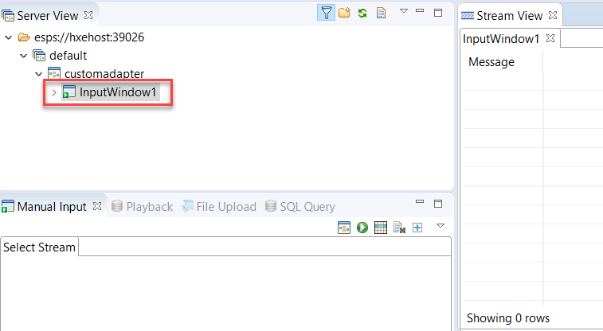

[DONE]

[ACCORDION-END]

[ACCORDION-BEGIN [Step 6: ](Send an MQTT Message using Mosquitto)]

 Open another command prompt (`CMD`) window and navigate to the install directory of `Mosquitto`. The default location is in `C:\Program Files (x86)/Mosquitto`.

Run the `mosquitto_pub.exe` program with <pre>`mosquitto_pub.exe -t `"<b>`<topic>`</b>" `–m` "<b>`<message>`</b>" `–h` "<b>`<your-ip-address>`</b>".</pre>
 E.g.  `mosquitto_pub.exe –t "test" –m "Hello World!" –h "1.0.100.200"`

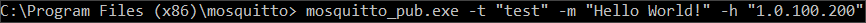

You should now be able to view the published `MQTT` message in `InputWindow1`.

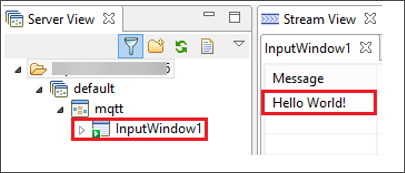

In the box below, enter the string you have received in the `MQTT` message on HANA Studio, and click **Validate**.

[VALIDATE_1]

[ACCORDION-END]

[ACCORDION-BEGIN [Appendix ](&nbsp;)]

```SQL

CREATE INPUT WINDOW InputWindow1 SCHEMA ( Message string )
PRIMARY KEY ( Message ) KEEP ALL ROWS ;

ATTACH INPUT ADAPTER MQTT_Input_Adapter1
TYPE mqtt_input TO InputWindow1
PROPERTIES  mosquittoServerAddress = 'tcp://<your-ip-address>:1883' ,
topic = 'test' ;

```

[DONE]

[ACCORDION-END]

