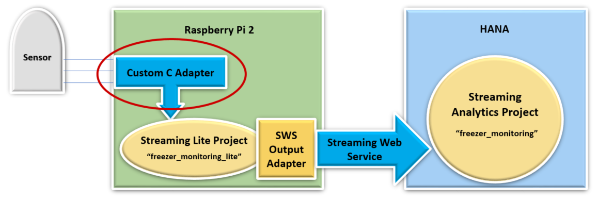
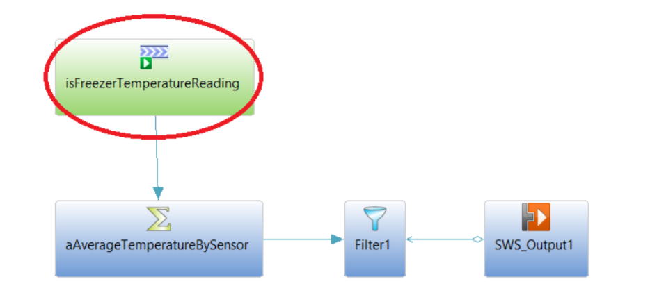

## Prerequisites  
 - **Tutorial:** [Streaming Analytics: Freezer Monitoring Tutorial](group.sds-hxe-get-started)
 - **Tutorial:** [Freezer Monitoring Lite Tutorial for Streaming Lite](hsa-streaming-lite-freezer-monitoring-part1)
 - SAP HANA 2.0 system with minimum version SP02
 - Streaming Analytics server running on SAP HANA
 - C/C++ editor of your choice
 - HANA Studio development environment, `PuTTY`, and `WinSCP`
 - `Raspberry Pi 2` microcontroller board setup running `Raspbian` with network connection for `SSH`
 - Setup `Raspberry Pi` user as `"Pi"`, and root directory as `"/home/pi"`

## Next Steps
 - [Code Custom C/C++ Adapter for Freezer Monitoring Lite](hsa-lite-custom-c-adapter-part2)

## Details
### You will learn  
- An overview of Custom C/C++ Adapters for SAP HANA Streaming Lite
- The steps in order to create and deploy a Custom C/C++ Adapter
- How to create a Makefile for a Custom C/C++ Adapter

---

This tutorial will go over how to create a Custom `C/C++` Adapter that will work with either HANA Streaming Analytics or Streaming Lite. In the testing section, the Custom `C/C++` Adapter will be executed on a remote device, and will send data into a Streaming Lite project running on that same device. It is up to the Custom `C/C++` Adapter to poll any available hardware sensors for values.

The Custom `C/C++` Adapter will be created using the `C/C++` `SDK`, and built using a `makefile` which we will provide. In this document, we will be building an adapter to feed data into the Freezer Monitoring Lite project. The purpose of this tutorial is to show how to create your own Custom `C/C++` Adapter given a specific schema.

The `C/C++` Adapter fits into a larger architecture. After sending data into Streaming Lite, a Streaming Web Service output adapter carries the manipulated data into a Streaming Analytics project via the Streaming Web Service. For this tutorial, we will only be focusing on the Custom `C/C++` Adapter and nothing else.



The remote device we will be using is a Raspberry Pi, running on `Raspbian` 7.8. However, any device which runs Streaming Lite will work for this walk-through. On the Raspberry Pi, the home directory is `/home/pi`, and the `$STREAMING_HOME` variable is our Streaming Lite installation folder, `/home/pi/install`.

>**Note:** If you would like to add the Streaming Web Service Output Adapter to your Streaming Lite project first, complete these two tutorials: [Streaming Web Service Configuration and Testing (for SAP HANA Streaming Analytics)], [Streaming Web Service Output Adapter Tutorial (for Streaming Lite)]. Completion of these tutorials is not necessary for the purpose of this tutorial.

We will be developing a `C/C++` project consisting of one `.cpp` file. This will ultimately be built on the remote device into an executable. This setup makes debugging tricky, since the `C` and `C++ SDK` used for the `C/C++` Adapter will be located on the remote device. Although there are a variety of ways to set up a more suitable environment, for simplicity we will be coding directly on the `Raspberry Pi`, using `Notepad++`. Follow these instructions, and any errors can be fixed when the code is built using our `Makefile`.

The project we are creating this Java Adapter for is called `freezer_monitoring_lite`, and has been created in previous tutorial [Streaming Lite: Freezer Monitoring Lite]. The specific stream we are connecting to is called `isFreezerTemperatureReading`. Here is the `CCL` for the stream:

```SQL

CREATE INPUT STREAM isFreezerTemperatureReading SCHEMA (
  SensorId string ,
  Temperature float ,
  ReadingDate msdate ,
  Id long ) AUTOGENERATE ( Id ) ;
```



You do not require the `"SWS_Output1"` Streaming Web Service Output Adapter to go through this tutorial. All you need is the `isFreezerTemperatureReading` input stream..

[ACCORDION-BEGIN [Step 1: ](Create the Makefile)]

Connect to your `Raspberry Pi` with `WinSCP`, and create a folder called `"custom_c_adapter"` in the root directory `(/home/pi)`

Create a blank file in the folder called `"Makefile"`. This is what will be used to build our code. It contains paths to all required dependencies. Paste in the following and save:

```Bash

CC=g++
CPPFLAGS=-I$(STREAMING_HOME)/include
LDFLAGS=-Wl,-R,$(STREAMING_HOME)/lib –L$(STREAMING_HOME)/lib –lstreamingclient_lib –lstreamingproject_lib

custom_c_adapter: custom_c_adapter.o

clean:
  rm –f *.o custom_c_adapter
```

For the question below, select the correct answer, and click **Validate**.

[DONE]
[ACCORDION-END]

[ACCORDION-BEGIN [Step 2: ](Test yourself)]

[VALIDATE_1]
[ACCORDION-END]

---
