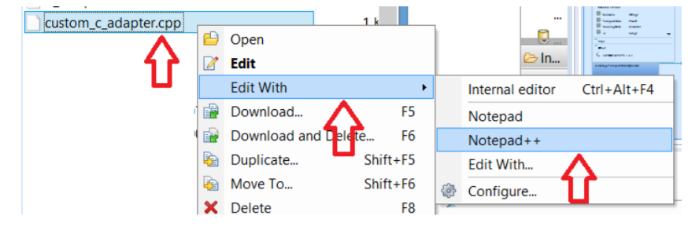
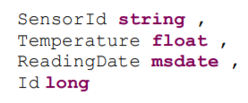
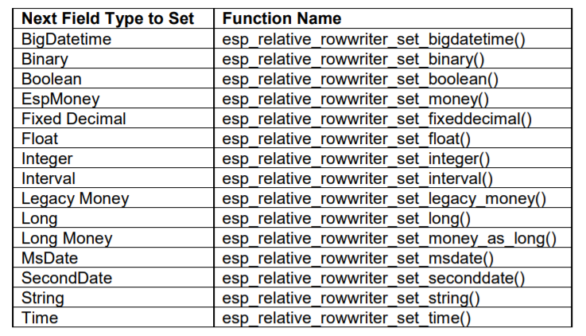

## Prerequisites  
 - **Tutorial:** [Introduction to Custom C/C++ Adapters for Freezer Monitoring Lite](https://developers.sap.com/tutorials/hsa-lite-custom-c-adapter-part1.html)

## Next Steps
 - [Build and Test Custom C/C++ Adapter for Freezer Monitoring Lite](https://developers.sap.com/tutorials/hsa-lite-custom-c-adapter-part3.html)

## Details

The full source for `custom_c_adapter.cpp` is available in the **Appendix** section of this tutorial.

---

[ACCORDION-BEGIN [Step 1: ](Create File)]

Remember how we created a `Makefile` in the root directory `(/home/pi)` in the previous tutorial [Introduction to Custom `C/C++` Adapters for Freezer Monitoring Lite](https://developers.sap.com/tutorials/hsa-lite-custom-c-adapter-part1.html). Now inside of the same folder, create another new blank file called `"custom_c_adapter.cpp"`.

Save the file, and close the window. (You may need to type something and then delete it in order to save the blank file).

Reopen it using a `C/C++` editor from your own computer. To do this, right click the file, go to `Edit With > Edit With...`, and point to the location of the editor executable on your local machine. We will be using `Notepad++`.



[DONE]

[ACCORDION-END]

[ACCORDION-BEGIN [Step 2: ](Include Statements)]

Your blank `"custom_c_adapter.cpp"` file should now be open in `Notepad++`. The first thing to do is add all the include statements needed for our program.

Paste the following:

```C++

#include <string>
#include <iostream>
#include <stdlib.h>
#include <time.h>
#include <stdio.h>

#include "sdk/esp_sdk.h"
#include "sdk/esp_error.h"
#include "sdk/esp_credentials.h"
#include "sdk/esp_project.h"
#include "sdk/esp_publisher.h"

using namespace std;
```

The first block of include statements are standard `C` and `C++` libraries. The second block of include statements are Streaming Analytics specific `SDK` header files, located in the directory `$STREAMING_HOME/lib/sdk`. The `SDK`'s shared object libraries are located in `$STREAMING_HOME/lib`, and will be linked at build-time. These paths are defined in our `Makefile`.

[DONE]

[ACCORDION-END]


[ACCORDION-BEGIN [Step 3: ](Declare Global Variables)]

We will be using two global variables, which can be used by any function in our `.cpp` file. We will declare a `"g_error"` of type `EspError`, and a `"g_creds"` of type `EspCredentials`. This declaration must be made ahead of all function declarations.

Add the following:

```C++

EspError *g_error = NULL;
EspCredentials *g_creds = NULL;
```

`g_error` will be used to hold any error data in case one of the `SDK` calls fail. `g_creds` will contain the user credentials needed to connect to the streaming project.

[DONE]

[ACCORDION-END]

[ACCORDION-BEGIN [Step 4: ](`print_error_and_exit` function)]

Our Custom `C/C++` Adapter will contain three functions. Parameters omitted, they are `print_error_and_exit()`, `exec()`, and `main()`.

The `print_error_and_exit()` function is called whenever a `SDK` call does not return `0`, which indicates failure. It prints the error description along with what line it was called on, releases our global instances, and exits the program. The function itself takes two parameters: `EspError *streamingError`, and `int line`. It returns nothing. This function is optional to the functionality of our adapter, but will make debugging the program a lot easier.

Add the following after declaring global variables:

```C++

void print_error_and_exit(EspError * streamingError, int line) {
 printf("An error was encountered on line %d\n", line);
 printf("%s", esp_error_get_message(streamingError));
 printf("\nExiting\n");

 //EspCredentials freed
 if (g_creds) esp_credentials_free(g_creds, g_error);
 //stop SDK call
 esp_sdk_stop(g_error);
 //EspError freed
 if (g_error) esp_error_free(g_error);
 exit(1);
}
```

You are required to call `esp_sdk_stop()` in order to cleanly shut down the adapter. This is an `SDK` call.

[DONE]

[ACCORDION-END]

[ACCORDION-BEGIN [Step 5: ](`exec` function)]

This function takes one parameter, `char const *cmd`, and returns a `string`. It is used to output the value printed by whatever command is given in input. This function is useful because various scripts can be executed to poll external hardware sensors on our `Raspberry Pi` (or other remote device).

Add the following after the `print_error_and_exit()` function:

```c++

string exec(char const* cmd)
{
 FILE* pipe = popen(cmd, "r");
 if (!pipe) return "ERROR";
 char buffer[128];
 string result = "";
 while(!feof(pipe)) {
 if(fgets(buffer, 128, pipe) != NULL)
 result += buffer;
 }
 pclose(pipe);
 return result;
}
```

For example, if `cmd = "echo 90"` is passed in, the function will return `"90"`. Additionally, if we had a python script called `SensorPoll.py`, we can pass in `cmd = "sudo python SensorPoll.py"`. This will return the output of the sensor being polled.

[DONE]

[ACCORDION-END]

[ACCORDION-BEGIN [Step 6: ](`main` function)]

The `main()` function is where a connection will be established between our code and the streaming lite project, and where the values are sent to the stream.

In pseudo code, it has the following functionality:

  1. Declare variables containing necessary values including `hostname`, `stream`, `row` values to be sent
  2. Calls to start the `SDK`
  3. Sets up previously instanced error object and credentials object
  4. Creates `project`, `stream`, `publisher`, `message writer`, and `relative row writer` objects
  5. Connects to project and publisher
  6. Releases credentials object
  7. Starts a `do/while` loop

    - Creates new row definition with the relative row writer
    - Define row operation as insert
    - Inserts row fields one by one
    - Ends row definition
    - Publishes and commits row

  8. Calls to stop `SDK`
  9. Releases error object

This document will explain step -by-step which `SDK` calls to use for each function, and how to construct a row for any schema. Further details will be provided in chart form for calls with less straight-forward parameters.

Start by setting up the `main()` function:

```C++

int main(){
  //Code will go here
}
```

  1. Declare Adapter variables

    We are now coding the `main()` function, and the first thing to do is declare adapter variables. The adapter variables can be split into two groups. The first group is used to connect to our Streaming Lite project, and control the quantity and rate of rows sent. The second group is a direct reflection of the stream we are writing to, with one variable for each column.

    - Declare and Define Variables in the First Group

        First group of variables are `hostname`, `port`, `stream`, `username`, `password`, `repeat`, and `interval`. These variables can be named whatever you wish; they are either passed into the various `SDK` calls, or used for loop logic.

        Variable   |  Explanation |
        |---|---|
        |hostname| String value containing the `FQDN` of your remote device  |
        |port| Integer value of the port your Streaming Lite project is running on   |
        |stream|  String value of the stream name you wish to write to |
        |username| String value of username you started Streaming Lite with. If you didn't start Streaming Lite with credentials, leave blank  |
        |password| String value of password you started Streaming Lite with. If you didn't start Streaming Lite with credentials, leave blank |
        |repeat| Integer value of many times you want to send a row of data into Streaming Lite. A value of -1 will cause the program to repeat infinitely   |
        |interval| Integer value of the number of seconds in-between sending rows  |

        The implementation is shown here:

        ```C++

        string val_host = "SAPraspberrypi2-B3";
        int val_port = 9230;
        string val_stream = "isFreezerTemperatureReading";
        string val_username ="";
        string val_password ="";
        int val_repeat = -1;
        int val_interval = 1;
        ```

        When this `C/C++` Adapter executes, it will connect with the project running on port `9230`, and write to the stream `"isFreezerTemperatureReading"`. There are no credentials, and the program will continuously send one row every second.

    -  Declare and Define Column Variables in the Second Group

        Recall that the schema of the stream we are writing to is:

        

        This means we will be using four variables. Once again, naming does not matter. In this document they will be:

        ```C++

        string val_sensorId = "RaspberryPi";
        string val_Temperature_Command = "echo 90";
        int64_t val_readingDate; //generated right before column is set
        int64_4 val_id = 0; //generated in streaming lite
        ```

          - `string val_sensorId` is the name of our sensor
          -  `string val_temperature` holds the command to run in order to obtain the value for our Temperature column
          -  `int64_t val_readingDate` is a timestamp, and is only initialized here. A value will be assigned to it later in the code, directly before it is used
          -  `int64_t val_id` is our primary key, but will be auto-generated inside the streaming project. Although we still declare it, the value of `val_id` is arbitrary and will be overwritten once inside the streaming project. The reason we need it in our Custom `C/C++` Adapter is because the entire row must be constructed before it is sent into Streaming Lite.

    - Set Up a Flag

        The majority of `SDK` calls will return `0` upon successful completion. We will also set up a flag variable to detect any failures.

        ```C++

        int errorflag = 0;
        ```

  2. Create the Error Object

    This error object is passed into almost every subsequent `SDK` call as an argument. It works hand in hand with our flag variable: If we check that `errorflag != 0` (meaning the `SDK` call has failed), our error object will contain the relevant error information.

    We have previously declared a global variable called `g_error`. Now we must instantiate the object. This is done using:

    ```C++

    g_error = esp_error_create();
    ```

    We will need to remember to free the `g_error` object before the program exits.

  3. Starting the `SDK`

    We must now start the `SDK`. This is done by calling `esp_sdk_start()`. We will need to remember to send a stop call to the `SDK` before the program exits.

    Additionally, we will pass the return value into `errorflag`, and check if it was successful. If it fails, `g_error` and `__LINE__` are passed into `print_error_and_exit()` to output a description of the error. `__LINE__` is a predefined macro that defines the current line number.

    You will see this error-detection structure throughout our Custom `C/C++` Adapter code:

    ```C++

    errorflag = esp_sdk_start(g_error);
    if (errorflag != 0) print_error_and_exit(g_error, __LINE__);
    ```

  4. Create the Credentials object

    We have previously declared a global variable called `g_creds`. Now we must instantiate the object using `esp_credentials_create()`. It returns `NULL` if unsuccessful, which we must check for.  

    ```C++

    g_creds = esp_credentials_create(ESP_CREDENTIALS_USER_PASSWORD, g_error);
    if (NULL == g_creds) print_error_and_exit(g_error, __LINE__);
    ```

    `ESP_CREDENTIALS_USER_PASSWORD` is an `enum` of type `ESP_CREDENTIALS_T`. Other values can be found in the header file `esp_credentials.h`. The credentials object will need to be freed after we are done with it.

    

    We will now set the user and password for our credentials object as well, even though both values are blank. Make sure to convert our `val_username` and `val_password` variables into `cstrings` using `c_str()`:

    ```C++

    esp_credentials_set_user(g_creds, val_username.c_str(), g_error);
    esp_credentials_set_password(g_creds, val_password.c_str(), g_error);
    ```

    

    

  5. Create and Connect to Project Object

    Create the project object. Since Streaming Lite only runs one project at a time, we will use `esp_project_get_standalone()`. Its parameters include our host and port name, our credentials object, the error object, and an `EspProjectOptions` type. Set the `EspProjectOptions` parameter as `NULL` for default values.

    ```C++

    EspProject * project = esp_project_get_standalone(val_host.c_str(), val_port, g_creds, NULL, g_error);
    if (NULL == project) print_error_and_exit(g_error, __LINE__);
    ```

    

    Connect to the project by passing our project object into `esp_project_connect()`. Check for failure.

    ```C++

    errorflag = esp_project_connect(project, g_error);
    if (errorflag != 0) print_error_and_exit(g_error, __LINE__);
    ```

  6. Free Credentials Object

    After the project object has been created, we are done with the credentials object. Free it using `esp_credentials_free()`. Check for failure.

    ```C++

    errorflag = esp_credentials_free(g_creds, g_error);
    if (errorflag != 0) print_error_and_exit(g_error, __LINE__);
    g_creds = NULL;
    ```

  7. Retrieve the Stream Object

    After we have connected to the project object, we can now retrieve the project stream we want to write to. This is done by passing our project object, and stream name into `esp_project_get_stream()`. Make sure to convert `val_stream` into a `c-string` using `c_str()`.

    ```C++

    const EspStream * stream = esp_project_get_stream(project,
    val_stream.c_str(), g_error);
    if (NULL == stream) print_error_and_exit(g_error, __LINE__);
    ```

    

  8. Create and Connect to the Publisher Object

    We now create the publisher object using `esp_project_create_publisher()`. Its lifetime is managed by the `SDK`, and does not require to be freed. We pass in our project object, the error object, and an `EspPublisherOptions` type. Set the `EspPublisherOptions` parameter as `NULL` for default values.

    ```C++

    EspPublisher * publisher = esp_project_create_publisher(project, NULL, g_error);
    if (NULL == publisher) print_error_and_exit(g_error, __LINE__);
    ```

    

    Connect to the publisher you just created, by passing the publisher object into `esp_publisher_connect()`:

    ```C++

    errorflag = esp_publisher_connect(publisher, g_error);
    if (errorflag != 0) print_error_and_exit(g_error, __LINE__);
    ```

  9. Retrieve the Message Writer Object

    The message writer object builds a single row to be sent into the specific project and stream it was created for.

    We now retrieve the `EspMessageWriter` object, using our publisher and stream objects. This is achieved by calling `esp_publisher_get_writer()`:

    ```C++

    EspMessageWriter * message = esp_publisher_get_writer(publisher, stream, g_error);
    if (NULL == message) print_error_and_exit(g_error, __LINE__);
    ```

  10. Retrieve the Relative Row Writer Object

    The relative row writer formats a row of data for the stream the `EspMessageWriter` writes to.

    Retrieve the relative row writer by passing our message writer object into `esp_message_writer_get_relative_rowwriter()`:

    ```C++

    EspRelativeRowWriter * row = esp_message_writer_get_relative_rowwriter(message, g_error);
    if (NULL == row) print_error_and_exit(g_error, __LINE__);
    ```

  11. Loop
    After setting up all required objects, we will now be able to construct and send our row. This will be done inside a loop, governed by our `val_repeat` and `val_interval` variables. This loop runs inside `main()` and is what controls the quantity and frequency of data the Custom `C/C++` Adapter sends.

      - Set Up the Loop

        Since our loop has to run at least once, we will use a `do/while` loop. Copy this into your `main()`:

        ```C++

        do
        {
          if ( val_repeat != -1)
            val_repeat --;

            //***more code here***

            if ((val_repeat == -1 || val_repeat > 0) && val_interval > 0)
              sleep( val_interval);
            }
        }
        while ((val_repeat == -1 || val_repeat > 0) && val_interval > 0);
        ```

        There are two `if` statements inside the loop. The first `if` statement checks for our infinity condition. If the value of `val_repeat` is `-1`, no decrement occurs and the loop runs forever.

        The second `if` statement pauses execution using the `sleep()` function for a `val_interval` number of seconds. This controls the frequency of loop execution.

        The code to construct and send a row will be written in between these two `if` statements.

      - Starting a New Row Definition and Setting the Operation

        We will now start a new row definition by passing our `EspRelativeRowWriter` object into `esp_relative_rowwriter_start_row()`. This is the first call to do when starting a row. Insert this after the first `if` statement.

        ```C++

        errorflag = esp_relative_rowwriter_start_row(row, g_error);
        if (errorflag != 0) print_error_and_exit(g_error, __LINE__);
        ```

        We now need to set the operation for the row. This is done using `esp_relative_rowwriter_set_operation()`. Once again, we pass in our `EspRelativeRowWriter` object.

        ```C++

        errorflag = esp_relative_rowwriter_set_operation(row, ESP_STREAM_OP_INSERT, g_error);
        if (errorflag != 0) print_error_and_exit(g_error, __LINE__);
        ```

        `ESP_STREAM_OP_INSERT` is an `enum` of type `ESP_STREAM_TYPE_T`, located inside the header file `esp_stream.h`.

        

      - Constructing One Row

        The `C/C++ SDK` provides a series of functions which set one field of your row at a time. Every function will set a field with a specific data type, and these functions cannot search by field name. Therefore, calling one will set the next available matching field of that data type, without regard for field names. A full list of the functions for each data type is listed below. Parameters have been omitted; you can find all their declarations inside the header file `esp_publisher.h`. Each function generally has three parameters: our `relative row writer` object, the `value` we are writing, and our `error` object.

        

          - **Column 1:** `SensorId`

            Following the schema of the stream we are writing to, we will now set the first field, called `SensorId`. The field is a type string, and the value we wish to write is in our variable `val_sensorId`. To set the field, we use `esp_relative_rowwriter_set_string()`. Make sure to convert from `string` to `cstring` using `c_str()`.

            ```C++

            errorflag = esp_relative_rowwriter_set_string(row, val_sensorId.c_str(), g_error);
            if (errorflag != 0) print_error_and_exit(g_error, __LINE__);
            ```

            

          - **Column 2:** `Temperature`

            The second field is called `Temperature`, and will contain our temperature sensor data. This is where the function `exec()` must be called, to run the command in our string variable `val_Temperature_Command`.
            We will start by initializing a new variable called string `temperature_s`, using `exec()`'s return value. Since our command is `"echo 90"`, `temperature_s` will get a value of `90`.

            ```C++

            string temperature_s = exec(val_Temperature_Command.c_str());
            ```

            Next, we will set the `Temperature` field by calling `esp_relative_rowwriter_set_float()`. We use the functions `c_str()` and `atof()` to cast `temperature_s` into a `double`.

            ```C++

            errorflag = esp_relative_rowwriter_set_float(row, atof(temperature_s.c_str()), g_error);
            if (errorflag != 0) print_error_and_exit(g_error, __LINE__);
            ```

            

          - **Column 3:** `Reading Date`

            The next field is `ReadingDate`, a timestamp for the row. Earlier, we only declared the variable `val_readingdate`. We will now give it a value, using the `time(0)` function. This is the number of seconds since `epoch`.

            ```C++

            val_readingDate = time(0);
            ```

            To set the column, we use `esp_relative_rowwriter_set_msdate()`. We pass in `val_readingdate`, multiplied by `1000`. This is because `esp_relative_rowwriter_set_msdate()` reads values as milliseconds, not seconds.

            ```C++

            errorflag = esp_relative_rowwriter_set_msdate(row, val_readingDate * 1000, g_error);
            if (errorflag != 0) print_error_and_exit(g_error, __LINE__);
            ```

            

          - **Column 4:** `Id`

            The last field is `Id`. Recall that this is automatically generated in our Streaming Lite project. Therefore, we are arbitrarily sending a value of `0`, from our `val_id` variable. To set the column, we use `esp_relative_rowwriter_set_long()`:

            ```C++

            errorflag = esp_relative_rowwriter_set_long(row, val_id, g_error);
            if (errorflag!=0) print_error_and_exit(g_error, __LINE__);
            ```

            

      - Ending the Row Definition

        After every field in our row has been populated, we can now end the row definition. This is done by passing our `relative row writer` object into `esp_relative_rowwriter_end_row()`.

        ```C++

        errorflag = esp_relative_rowwriter_end_row(row, g_error);
        if (errorflag != 0) print_error_and_exit(g_error, __LINE__);
      ```

     - Publishing and Committing Data

        We now publish the data we have packaged inside our `message writer` object. This is done by passing our message writer object and publisher object into `esp_publisher_publish()`
        ```C++

        esp_publisher_publish() errorflag = esp_publisher_publish(publisher, message, g_error);
        if (errorflag != 0) print_error_and_exit(g_error, __LINE__);
        ```

        We now issue a commit call to the publisher, which causes it to process all its input queues and commit the data
        ```C++

        errorflag = esp_publisher_commit(publisher, g_error);
        if (errorflag != 0) print_error_and_exit(g_error, __LINE__);
        ```

        Since no errors were detected, at this point we can print a line to notify the user that the row has published correctly:
        ```C++

        printf("Messages published successfully\n");
        ```

  12. Stopping the `SDK`

    We have finished coding the loop. Jumping out of the loop now, we have to do two things before our program ends. After the loop, we will need to send a stop call to the `SDK`, and release our error object.

    Similar to how we started it, we will now call `esp_sdk_stop()` to stop the `SDK`. Insert this line after our loop body:

    ```C++

    errorflag = esp_sdk_stop(g_error);
    if (errorflag != 0) print_error_and_exit(g_error, __LINE__);
    ```

  13. Releasing the `Error` Object

    The last line in our `main()` function is a call to release our error object:

    ```C++

    esp_error_free(g_error);
    ```

    Save and close your `.cpp` file. You should now have two files inside of your `"custom_c_adapter"` folder, named `"custom_c_adapter.cpp"` and `"Makefile"`.

For the question below, select all of the correct answers, and click **Validate**.

[VALIDATE_1]

[ACCORDION-END]

[ACCORDION-BEGIN [Appendix: ](&nbsp;)]

`custom_c_adapter.cpp`

```C++

#include <string>
#include <iostream>
#include <stdlib.h>
#include <time.h>
#include <stdio.h>
#include "sdk/esp_sdk.h"
#include "sdk/esp_error.h"
#include "sdk/esp_credentials.h"
#include "sdk/esp_project.h"
#include "sdk/esp_publisher.h"

using namespace std;

EspError * g_error = NULL;
EspCredentials * g_creds = NULL;

void print_error_and_exit(EspError * streamingError, int line) {
      printf("An error was encountered on line %d\n", line);
      printf("%s", esp_error_get_message(streamingError));
      printf("\nExiting\n");

      //free EspCredentials object if it was created
      if (g_creds) esp_credentials_free(g_creds, g_error);

      //stop SDK
      esp_sdk_stop(g_error);

      //free EspError object if it was created
      if (g_error) esp_error_free(g_error);

      exit(1);
   }

// Execute a command and return result as string.
// In this example the command should only generate one number.
string exec(char const * cmd) {
   FILE * pipe = popen(cmd, "r");
   if (!pipe) return "ERROR";
   char buffer[128];
   string result = "";
   while (!feof(pipe)) {
      if (fgets(buffer, 128, pipe) != NULL)
         result += buffer;
   }
   pclose(pipe);
   return result;
}

int main() {
   string val_host = "SAPraspberrypi2-B3";
   int val_port = 9230;
   string val_stream = "isFreezerTemperatureReading";
   string val_username = "";
   string val_password = "";

   int val_repeat = -1;
   int val_interval = 1;

   string val_sensorId = "RaspberryPi";
   string val_Temperature_Command = "echo 90";
   int64_t val_readingDate; //will be generated right before row is
   sent
   int64_t val_id = 0; //generated in streaming lite

   int errorflag = 0;

   //creates error object. Must be freed after use
   g_error = esp_error_create();

   //esp_sdk_start initializes the sdk, must matched with same number of stop calls
   errorflag = esp_sdk_start(g_error);
   if (errorflag != 0) print_error_and_exit(g_error, __LINE__);

   //sets up credentials with authentication using digest and signature verification
   //other types are available as well
   g_creds = esp_credentials_create(ESP_CREDENTIALS_USER_PASSWORD, g_error);
   if (NULL == g_creds) print_error_and_exit(g_error, __LINE__);

   esp_credentials_set_user(g_creds, val_username.c_str(), g_error);
   esp_credentials_set_password(g_creds, val_password.c_str(), g_error);

   //retrieves standalone project (Streaming Lite) object to connect to
   EspProject * project = esp_project_get_standalone(val_host.c_str(), val_port, g_creds, NULL, g_error);
   if (NULL == project) print_error_and_exit(g_error, __LINE__);

   //connect to project
   errorflag = esp_project_connect(project, g_error);
   if (errorflag != 0) print_error_and_exit(g_error, __LINE__);

   // Once we have retrieved the project we do not need the EspCredentials object
   // Since we are not going to reuse them, need to free them
   errorflag = esp_credentials_free(g_creds, g_error);
   if (errorflag != 0) print_error_and_exit(g_error, __LINE__);
   g_creds = NULL;

   //Retrieves the stream object
   const EspStream * stream = esp_project_get_stream(project, val_stream.c_str(), g_error);
   if (NULL == stream) print_error_and_exit(g_error, __LINE__);

   //Creates a publisher for this project. Lifetime is managed by SDK
   EspPublisher * publisher = esp_project_create_publisher(project, NULL, g_error);
   if (NULL == publisher) print_error_and_exit(g_error, __LINE__);

   //Connects to publisher
   errorflag = esp_publisher_connect(publisher, g_error);
   if (errorflag != 0) print_error_and_exit(g_error, __LINE__);

   //retrieve an EspMessageWriter to build a single row
   EspMessageWriter * message = esp_publisher_get_writer(publisher, stream, g_error);
   if (NULL == message) print_error_and_exit(g_error, __LINE__);

   //formats data for the stream the EspMessageWriter writes to
   EspRelativeRowWriter * row = esp_message_writer_get_relative_rowwriter(message, g_error);
   if (NULL == row) print_error_and_exit(g_error, __LINE__);

   do {

      if (val_repeat != -1) val_repeat--;

      //starts new row definition. First call when starting a row
      errorflag = esp_relative_rowwriter_start_row(row, g_error);
      if (errorflag != 0) print_error_and_exit(g_error, __LINE__);

      //sets operation for row
      errorflag = esp_relative_rowwriter_set_operation(row, ESP_STREAM_OP_INSERT, g_error);
      if (errorflag != 0) print_error_and_exit(g_error, __LINE__);

      // column 1 a string (SensorID)
      errorflag = esp_relative_rowwriter_set_string(row, val_sensorId.c_str(), g_error);
      if (errorflag != 0) print_error_and_exit(g_error, __LINE__);

      // column 2 a float (Temperature)
      string temperature_s = exec(val_Temperature_Command.c_str());
      errorflag = esp_relative_rowwriter_set_float(row, atof(temperature_s.c_str()), g_error);
      if (errorflag != 0) print_error_and_exit(g_error, __LINE__);

      //column 3 a msdate (ReadingDate)
      val_readingDate = time(0);
      errorflag = esp_relative_rowwriter_set_msdate(row, val_readingDate * 1000, g_error);
      if (errorflag != 0) print_error_and_exit(g_error, __LINE__);

      //column 4 a long (Id)
      errorflag = esp_relative_rowwriter_set_long(row, val_id, g_error);
      if (errorflag != 0) print_error_and_exit(g_error, __LINE__);

      //ends row definition
      errorflag = esp_relative_rowwriter_end_row(row, g_error);
      if (errorflag != 0) print_error_and_exit(g_error, __LINE__);

      //Publishes data currently in EspMessageWriter. On successful completion data in EspMessageWriter is cleared
      errorflag = esp_publisher_publish(publisher, message, g_error);
      if (errorflag != 0) print_error_and_exit(g_error, __LINE__);

      //causes publisher to process all its input queues and commit the data to its log stores
      errorflag = esp_publisher_commit(publisher, g_error);
      if (errorflag != 0) print_error_and_exit(g_error, __LINE__);

      printf("Messages published successfully\n");

      // wait for interval..
      if ((val_repeat == -1 || val_repeat > 0) && val_interval > 0)
         sleep(val_interval);
   }
   while ((val_repeat == -1 || val_repeat > 0) && val_interval > 0);

   //stopping the sdk
   errorflag = esp_sdk_stop(g_error);
   if (errorflag != 0) print_error_and_exit(g_error, __LINE__);

   //release error object
   esp_error_free(g_error);
}
```

[DONE]

[ACCORDION-END]
---
