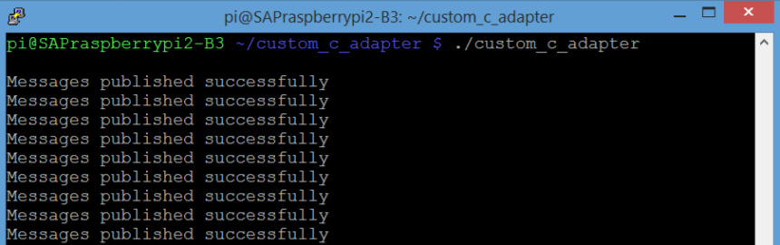
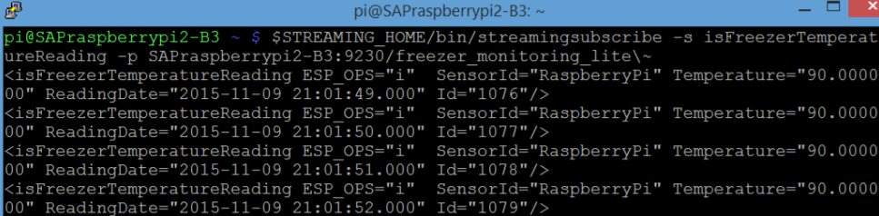

## Prerequisites  
 - **Tutorial:** [Code Custom C/C++ Adapter for Freezer Monitoring Lite](https://developers.sap.com/tutorials/hsa-lite-custom-c-adapter-part2.html)

---

[ACCORDION-BEGIN [Step 1: ](Build the Adapter Code)]

Now we need to compile and build our Custom `C/C++` Adapter into an executable. To do this, open up `PuTTY` and navigate to your `"custom_c_adapter"` folder.

Run the command `make` to build the `.cpp` file. This should generate an executable called `custom_c_adapter`.


[DONE]

[ACCORDION-END]

[ACCORDION-BEGIN [Step 2: ](See Results)]

We will now test out our Custom `C/C++` Adapter.

First, start up the freezer monitoring lite program in `PuTTY` by running:

```Bash

$STREAMING_HOME/bin/streamingproject --ccx $HOME/freezer_monitoring_lite.ccx --command-port 9230
```

In another `PuTTY` window, navigate to the `custom_c_adapter` folder and run our Custom `C/C++` Adapter:

```Bash

./custom_c_adapter
```



If successful, you will begin to see "Messages published successfully" on the screen.

Finally, we will subscribe to the input stream inside our running project. The `streamingsubscribe` executable comes with the installation of Streaming Lite, and is used to view the contents of any stream in a running project. Open up another `PuTTY` window, and use it by running the following command. Make sure to replace `<host>` with your Fully Qualified Domain Name `(FQDN)`:

```Bash

$STREAMING_HOME/bin/streamingsubscribe -s isFreezerTemperatureReading -p <host>:9230/freezer_monitoring_lite
```

If successful, you should be able to see the rows our Custom `C/C++` Adapter is sending into the project.



For the question below, select the correct answer, and click **Validate**.

[VALIDATE_1]

[ACCORDION-END]

---
