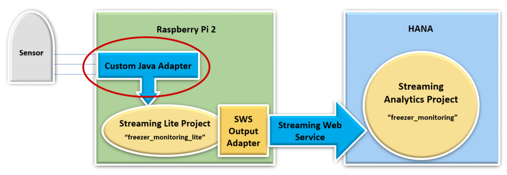
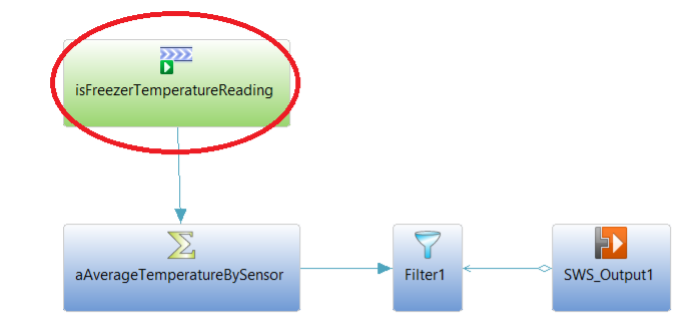

## Prerequisites  
 - **Proficiency:** Beginner
 - **Tutorial:** [Streaming Analytics: Freezer Monitoring Tutorial](https://developers.sap.com/group.sds-hxe-get-started.html)
 - **Tutorial:** [Freezer Monitoring Lite Tutorial for Streaming Lite](https://developers.sap.com/tutorials/hsa-streaming-lite-freezer-monitoring-part1.html)
 - SAP HANA 2.0 system with minimum version SP02
 - Streaming Analytics server running on SAP HANA
 - HANA Studio development environment, `PuTTY`, and `WinSCP`
 - `Raspberry Pi 2` microcontroller board setup running `Raspbian` with network connection for `SSH`
 - Setup `Raspberry Pi` user as `"Pi"`, and root directory as `"/home/pi"`

## Details
### You will learn  
- An overview of Custom Adapters for SAP HANA Streaming Lite
- The steps in order to create and deploy a Custom Java Adapter

## Next Steps
- [Set Up the Eclipse Project for Streaming Lite Custom Java Adapter](https://developers.sap.com/tutorials/hsa-lite-custom-java-adapter-part2.html)

### Time to Complete
**15 Min**

---

[ACCORDION-BEGIN [Introduction ](&nbsp;)]

The Custom Java Adapter will be executed on a remote device, and will send data into a Streaming Lite project running on that same device. It is up to the Custom Java Adapter to poll any available hardware sensors for values.

The Custom Java Adapter will be created using the Java SDK, and can be built from the SAP HANA Studio eclipse environment. We will deploy the package onto the Raspberry Pi (the remote device used for this tutorial) to stream data into the Freezer Monitoring Lite project. The purpose of this tutorial is to show how to create your own Custom Java Adapter tool given a specific schema.

The Java Adapter fits into a larger architecture. After sending data into Streaming Lite, a Streaming Web Service output adapter carries the manipulated data into a Streaming Analytics project via the Streaming Web Service. For this tutorial, we will only be focusing on the Custom Java Adapter.



The remote device we will be using is a Raspberry Pi, running on `Raspbian` 7.8. However, any device which runs Streaming Lite will work for this walk-through. On the Raspberry Pi, the home directory is `/home/pi`, and the `$STREAMING_HOME` variable is our Streaming Lite installation folder, `/home/pi/install`.

First, we will obtain the necessary Java SDK files from our Smart Data Streaming installation on our SAP HANA system. We will then develop a Java class called `"JavaAdapter"`, inside `Eclipse/HANA Studio` on our personal computer. Finally, we will export the source file into a `.jar`, and deploy the project onto the Raspberry Pi to be run.

The project we are creating this Java Adapter for is called `freezer_monitoring_lite`, and has been created in previous tutorial [Streaming Lite: Freezer Monitoring Lite]((https://developers.sap.com/tutorials/hsa-streaming-lite-freezer-monitoring-part1.html)). The specific stream we are connecting to is called `isFreezerTemperatureReading`. Here is the `CCL` for the stream:

```SQL

CREATE INPUT STREAM isFreezerTemperatureReading SCHEMA (
  SensorId string ,
  Temperature float ,
  ReadingDate msdate ,
  Id long ) AUTOGENERATE ( Id ) ;
```



For the question below, select the correct answer, and click **Validate**.

[VALIDATE_1]

[ACCORDION-END]

---

