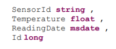
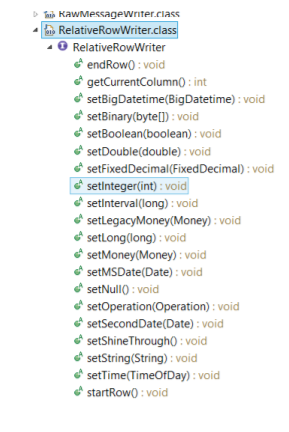

## Prerequisites  
- **Tutorial:** [Set Up the Eclipse Project for Streaming Lite Custom Java Adapter](https://developers.sap.com/tutorials/hsa-lite-custom-java-adapter-part2.html)

## Next Steps
 - [Deploy and Test the Streaming Lite Custom Adapter](https://developers.sap.com/tutorials/hsa-lite-custom-java-adapter-part4.html)

## Details

The full source code for the Custom Java Adapter is available in the 'Appendix' section of this tutorial.

---


[ACCORDION-BEGIN [Step 1: ](Import Statements)]

Add the following import statements required to create our custom Java Adapter, below our package `custom_java_adapter` line:

```Java

import java.io.BufferedReader;
import java.io.IOException;
import java.io.InputStreamReader;
import java.util.Date;

import javax.security.auth.login.LoginException;

import com.sybase.esp.sdk.Credentials;
import com.sybase.esp.sdk.Project;
import com.sybase.esp.sdk.SDK;
import com.sybase.esp.sdk.Stream;
import com.sybase.esp.sdk.Stream.Operation;
import com.sybase.esp.sdk.data.MessageWriter;
import com.sybase.esp.sdk.data.Publisher;
import com.sybase.esp.sdk.data.RelativeRowWriter;
import com.sybase.esp.sdk.exception.EntityNotFoundException;
import com.sybase.esp.sdk.exception.ServerErrorException;
```

[DONE]

[ACCORDION-END]

[ACCORDION-BEGIN [Step 2: ](Declare Global Instance)]

We will need to use our `SDK` object throughout the code, and so we will add it inside of our `JavaAdapter` class:

```Java

private static final SDK s_sdk = SDK.getInstance();
```

[DONE]
[ACCORDION-END]


[ACCORDION-BEGIN [Step 3: ](Method 1: exec())]

We will now add a method inside our `JavaAdapter` class, before the `main()` method and after our `SDK` object. It will be called `exec()`, and is used to output the value printed by whatever command is given in input. This function is useful because various scripts can be executed to poll external hardware sensors on our `Raspberry Pi` (or other remote device).

For example, if `cmd = "echo 90"` is passed in, the function will return "90". Additionally, if we had a Python script called `SensorPoll.py`, we can pass in `cmd = "sudo python SensorPoll.py"`. This will return the output of the sensor being polled.

```Java

private static String exec(String cmd) throws IOException{
  Process p = Runtime.getRuntime().exec(cmd);
  BufferedReader stdInput = new BufferedReader(new
InputStreamReader(p.getInputStream()));
  String s = stdInput.readLine();
  return s;
}
```

[DONE]

[ACCORDION-END]

[ACCORDION-BEGIN [Step 4: ](Declaring Adapter Variables)]

We are ready to code the `main()` function, and the first thing to do is declare adapter variables.

The adapter variables can be split into two groups. The first group is used to connect to our Streaming Lite project, and control the quantity and rate of rows sent. The second group is the schema of the stream we are writing to, with one variable for each column.

  1. Declare and define all variables in the first group. They are: `hostname`, `port`, `stream`, `username`, `password`, `repeat`, and `interval`. These variables can be named whatever you wish; they are either passed into the various `SDK` calls, or used for loop logic.

    Variable   |  Explanation |
    |---|---|
    |hostname| String value containing the FQDN of your remote device  |
    |port| Integer value of the port your Streaming Lite project is running on   |
    |stream|  String value of the stream name you wish to write to |
    |username| String value of username you started Streaming Lite with. If you didn't start Streaming Lite with credentials, leave blank  |
    |password| String value of password you started Streaming Lite with. If you didn't start Streaming Lite with credentials, leave blank |
    |repeat| Integer value of many times you want to send a row of data into Streaming Lite. A value of -1 will cause the program to repeat infinitely   |
    |interval| Integer value of the number of seconds in-between sending rows  |


    Our implementation is shown here. You will need to change these values to suit your program:

    ```Java

    String val_host = "SAPraspberrypi2-B3";
    int val_port = 9230;
    String val_stream = "isFreezerTemperatureReading";
    String val_username ="";
    String val_password ="";
    int val_repeat = -1;
    int val_interval = 1;
    ```

    When this Java Adapter executes, it will connect with the project running on port `9230`, and write to the stream `"isFreezerTemperatureReading"`. There are no credentials, and the program will continuously send one row every second.

  2. Declare and define column variables in the second group. Recall that the schema of the stream we are writing to is:

    

    This means we will be using four variables. Every custom Java Adapter will have a different group of variables for this section. Once again, naming does not matter. In this document they will be:

    ```Java

    String val_sensorId ="RaspberryPi";
    String val_Temperature_Command = "echo 90";
    Date val_readingDate = null; //generated right before row is sent
    long val_id = 0; //generated in streaming lite
    ```

      - **`String val_sensorId`** is the name of our sensor.
      - **`String val_temperature`** holds the command to run in order to obtain the value for our Temperature column.
      - **`Date val_readingDate`** is a timestamp. A value will be assigned to it later in the code, directly before it is used.
      - **`long val_id`** is our primary key, but will be auto-generated inside the streaming project. Although we still declare it, the value of `val_id` is arbitrary and will be overwritten once inside the streaming project. The reason we need it in our custom Java Adapter is because the entire row must be constructed before it is sent into Streaming Lite.

[DONE]

[ACCORDION-END]

[ACCORDION-BEGIN [Step 5: ](Try/Catch)]

We will now start using `SDK` calls to connect with the project we want to write to. However, in order to do that, we must be aware of the errors our code might throw. Therefore, we will add a `try/catch` block in our `main()`.

Add this block directly after our adapter variables:

```Java

try{

} catch (LoginException | EntityNotFoundException | ServerErrorException | IOException e){
  e.printStackTrace();
}
```

For the question below, select the correct answer, and click **Validate**.

[VALIDATE_1]

[ACCORDION-END]

[ACCORDION-BEGIN [Step 6: ](SDK Preparation Calls)]

Generally, all `SDK` calls (inside the `main()`) can be grouped into two sections. The first section prepares for writing to our project, and creates/connects the required `project`/`credentials`/`streams`/`writer` objects. The second section writes a single row into our project, and runs inside a loop. We will take a look at the first section now. All of this will be included inside of our try block.

Start the `SDK`:

```Java

s_sdk.start();
```

Create the Credentials object, even if our username and password are both blank:

```Java

Credentials creds = new Credentials.Builder(Credentials.Type.USER_PASSWORD).setUser(val_username).setPassword(val_password).create();
```

Create and connect to the Project object. When we connect, we will wait for a max of 1000 milliseconds.

```Java

Project project = s_sdk.getProject(val_host, val_port, creds); project.connect(1000);
```

Create and connect to the Publisher object.

```Java

Publisher publisher = project.createPublisher();
publisher.connect();
```

Create the Stream object

```Java

Stream stream = project.getStream(val_stream);
```

Create the `MessageWriter` object. The `MessageWriter` object builds a single row to be sent into the specific project and stream it was created for

```Java

MessageWriter message = publisher.getMessageWriterCached(stream);
```

Create the `RelativeRowWriter` object. The `RelativeRowWriter` object formats a row of data for the stream that the `MessageWritter` writes to.

```Java

RelativeRowWriter row = message.getRelativeRowWriter();
```

[DONE]

[ACCORDION-END]

[ACCORDION-BEGIN [Step 7: ](Set Up the Loop)]

After setting up all required objects, we will now be able to construct and send our row. This will be done inside a loop, governed by our `val_repeat` and `val_interval` variables. This loop runs inside our try block, and is what controls the quantity and frequency of data the custom Java Adapter sends. It will contain the second section of `SDK` calls.

We will be using a `do/while` loop. Copy this directly after our `SDK` preparation calls (we are still inside the `try` block):

```Java

do
{
  if ( val_repeat != -1) val_repeat-- ;

  //SDK row writing calls go here

  // wait for interval..
  if ((val_repeat == -1 || val_repeat > 0) && val_interval > 0){
    try {
      Thread.sleep(val_interval*1000);
    } catch (InterruptedException e) {
      e.printStackTrace();
      break;
    }
  }
}
while ((val_repeat == -1 || val_repeat > 0) && val_interval > 0);
```

There are two if statements inside the loop. The first if statement checks for our infinity condition. If the value of `val_repeat` is `-1`, no decrement occurs and the loop runs forever.

The second if statement pauses execution using the `Thread.sleep()` function for a `val_interval*1000` number of milliseconds. This controls the frequency of loop execution. If an exception is thrown, the loop will exit.

The second section of `SDK` calls used to construct and send a row will be written in between these 2 if statements.

[DONE]

[ACCORDION-END]

[ACCORDION-BEGIN [Step 8: ](SDK Row Writing Calls)]

In this section we will start a row, and set its fields according to the schema of the stream we are sending it into. This is the part of the code that must be customized for each project that the custom Java Adapter is used with.

  1. Starting the row

    Start a new row definition. It is the first call when starting a new row:

    ```Java

    row.startRow();
    ```

    Set the row operation as insert:

    ```Java

    row.setOperation(Operation.INSERT);
    ```

    Other possible `enum` values are:
        - NOOP
        - UPDATE
        - DELETE
        - UPSERT
        - SAFEDELETE

  2. Setting Fields

    The `RelativeRowWriter` class provides a series of functions which set one field of your row at a time. Every function will set a field with a specific data type, and these functions cannot search by field name. Therefore, calling one will set the next available matching field of that data type, without regard for field names.

    A full list of the functions for each data type can be found by viewing the `RelativeRowWriter` class. Under the Package Explorer window, go to Referenced Libraries, and then expand:

    **`streaming_client.jar > com.sybase.esp.sdk.data > RelativeRowWriter.class`**

    

      - **Column 1:** Following the schema of the stream we are writing to, we will now set the first field called `SensorId`. This field is a type String, and the value we wish to write is in our variable `val_sensorId`. To set the field, we will use `row.setString()`

    ```Java

    row.setString(val_sensorId);
    ```

      - **Column 2:** The second column we are setting is called `Temperature`, and will contain our temperature sensor data. This is where the function `exec()` will be called, to run the command in our string variable `val_Temperature_Command`. We will declare a new String variable to hold the return value of our `exec()` function, and parse it into a double before setting the field using `row.setDouble()`

    ```Java

    String temperature_s = exec(val_Temperature_Command);
    row.setDouble(Double.parseDouble(temperature_s));
    ```

      - **Column 3:** The third column is called `ReadingDate`, and is a timestamp of when the temperature value was read. We will provide our `val_readingDate` with the current time value, and pass it into `row.setMSDate()`

    ```Java

    val_readingDate = new Date();
    row.setMSDate(val_readingDate);
    ```

      - **Column 4:** The forth column is called `Id`, will be automatically generated in our Streaming Lite project. Therefore, we will be arbitrarily sending it a value of `0`, from our `val_id` variable. To set this last column, we will use `row.setLong()`

    ```Java

    row.setLong(val_id);
    ```

  3. Ending the Row

    We end the row by calling `row.endRow()`:

    ```Java

    row.endRow();
    ```

  4. Writing the Completed Row to Streaming Lite

    We now publish the row which `RelativeRowWriter` has packaged inside our `MessageWriter` object

    ```Java

    publisher.publish(message, true);
    ```

    When we commit the publisher, the row gets sent into Streaming Lite:

    ```Java

    publisher.commit();
    ```

    We can add this line after sending the row successfully:

    ```Java

    System.out.print("Message published successfully\n");
    ```

[DONE]

[ACCORDION-END]

[ACCORDION-BEGIN [Step 9: ](Stopping the SDK)]

Now that we have completed coding everything inside the loop, as well as the `try/catch` block, we will need to stop the `SDK`, no matter how the program exits.

The last line of our `main()` method is a stop call to the SDK. This is placed directly after the catch block, and before the closing bracket for our `main()` method:

```Java

s_sdk.stop();
```

Click the **Done** button below once you have completed this tutorial.

[DONE]

[ACCORDION-END]

[ACCORDION-BEGIN [Appendix ](&nbsp;)]

Below is the source code for our Java Adapter, customized to write into Freezer Monitoring Lite. You will need to change the hostname variable `(val_host)` to match your remote device.

`JavaAdapter.java`

```Java

package custom_java_adapter;
import java.io.BufferedReader;
import java.io.IOException;
import java.io.InputStreamReader;
import java.util.Date;
import javax.security.auth.login.LoginException;
import com.sybase.esp.sdk.Credentials;
import com.sybase.esp.sdk.Project;
import com.sybase.esp.sdk.SDK;
import com.sybase.esp.sdk.Stream;
import com.sybase.esp.sdk.Stream.Operation;
import com.sybase.esp.sdk.data.MessageWriter;
import com.sybase.esp.sdk.data.Publisher;
import com.sybase.esp.sdk.data.RelativeRowWriter;
import com.sybase.esp.sdk.exception.EntityNotFoundException;
import com.sybase.esp.sdk.exception.ServerErrorException;
public class JavaAdapter {
    private static final SDK s_sdk = SDK.getInstance();
    /*
     * Executes a command and return result as string.
     * In this example the command should only generate one number.
     */
    private static String exec(String cmd) throws IOException {
        Process p = Runtime.getRuntime().exec(cmd);
        BufferedReader stdInput = new BufferedReader(new InputStreamReader(p.getInputStream()));
        String s = stdInput.readLine();
        return s;
    }
    public static void main(String[] args) {
        String val_host = "SAPraspberrypi2-B3";
        int val_port = 9230;
        String val_stream = "isFreezerTemperatureReading";
        String val_username = "";
        String val_password = "";
        int val_repeat = -1;
        int val_interval = 1;

        String val_sensorId = "RaspberryPi";
        String val_Temperature_Command = "echo 90";
        Date val_readingDate = null; //generated right before row is sent
        long val_id = 0; //generated in streaming lite

        try {
            //start SDK
            s_sdk.start();

            //create Credentials object
            Credentials creds = new
            Credentials.Builder(Credentials.Type.USER_PASSWORD).setUser(val_username).setPassword(val_password).create();

            //create and connect Project object
            Project project = s_sdk.getProject(val_host, val_port,
                creds);;
            project.connect(1000);

            //create and connect Publisher object
            Publisher publisher = project.createPublisher();
            publisher.connect();

            //create Stream object
            Stream stream = project.getStream(val_stream);

            //create MessageWriter object
            MessageWriter message =
                publisher.getMessageWriterCached(stream);

            //create RelativeRowWriter object
            RelativeRowWriter row =
                message.getRelativeRowWriter();

            do {
                if (val_repeat != -1) val_repeat--;

                //starts a new row definition. First call when starting row
                row.startRow();

                //set row operation
                row.setOperation(Operation.INSERT);
                //column 1 a string (SensorID)
                row.setString(val_sensorId);

                //column 2 a float (Temperature)
                String temperature_s = exec(val_Temperature_Command);
                row.setDouble(Double.parseDouble(temperature_s));

                //column 3 a msdate (ReadingDate)
                val_readingDate = new Date();
                row.setMSDate(val_readingDate);
                //column 4 a long (Id)
                //end row
                row.endRow();
                //publish and commit data
                publisher.publish(message, true);
                publisher.commit();

                System.out.print("Message published successfully\n");
                // wait for interval..
                if ((val_repeat == -1 || val_repeat > 0) && val_interval >
                    0) {
                    try {
                        Thread.sleep(val_interval * 1000);
                    } catch (InterruptedException e) {
                        e.printStackTrace();
                        break;
                    }
                }
            }
            while ((val_repeat == -1 || val_repeat > 0) && val_interval >
                0);

        } catch (LoginException | EntityNotFoundException |
            ServerErrorException | IOException e) {
            e.printStackTrace();
        }

        //stops SDK
        s_sdk.stop();

    }
}
```

[DONE]

[ACCORDION-END]

---
