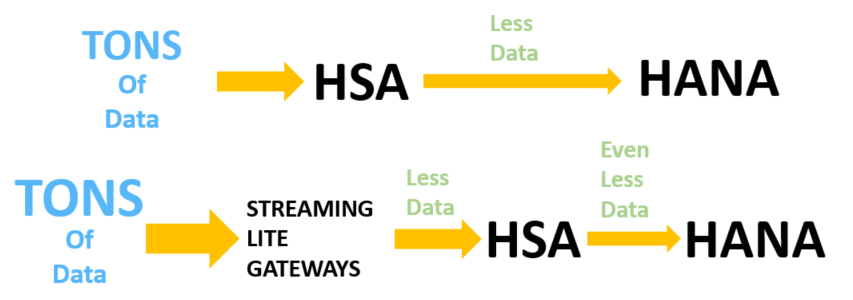

## Prerequisites  
 - SAP HANA 2.0 system with minimum version SP02
 - Streaming Analytics Server running on SAP HANA
 - HANA Studio Development Environment, `PuTTY`, and `WinSCP`
 - `Raspberry Pi 2` microcontroller board setup running `Raspbian` with network connection for `SSH`
 - Setup `Raspberry Pi` user as `"Pi"`, and root directory as `"/home/pi"`

## Details
### You will learn  
- An overview of SAP HANA Streaming Lite
- The steps in order to create and deploy a Streaming Lite project

---

[ACCORDION-BEGIN [Step 1: ](Introduction)]

Streaming Lite (SL) is a component of HAHA Streaming Analytics (HSA), designed for edge processing in `IoT` scenarios. It's a slimmed down version of the Streaming Analytics server, and connects through an internal output adapter to the full HANA Streaming Analytics server via a `WebSocket` connection. This allows for deployment of streaming projects on remote gateway devices, such as a Raspberry Pi (the device used in this tutorial).

Streaming Lite is meant for running on `IoT` gateways to preprocess data before it gets sent to Streaming Analytics. As `IoT` enabled devices and sensors increase dramatically in the coming years, Streaming Lite will help preprocess and filter data at the source, before sending it through to Streaming Analytics and HANA. Streaming Lite runs a single streaming project, and has full `CCL` window support. As of SAP HANA 2.0 SP02, Streaming Lite can run on Linux x86, and Linux ARM. SAP documentation regarding the process can be found in section [Streaming Lite](https://help.sap.com/viewer/f88d9ca095a64d56ba1b81d4cf5cdc50/1.0.12/en-US/6df3acf1ee9645418dff08f20c864a6a.html?q=streaming%20lite).

This Streaming Lite project will be run on a Raspberry Pi 2 microcontroller board, which has the potential to read values from attached sensors. However, this requires a custom adapter, which is beyond the scope of this tutorial. Additionally, to utilize Streaming Lite to its full potential, a Streaming Web Service output adapter can be added into any Streaming Lite project, in order to stream data directly into any Streaming Analytics project. However, this too is beyond the scope of this tutorial.

In this tutorial, we are focusing solely on creating and deploying a Streaming Lite project called `"freezer_monitoring_lite"`. This project will take in temperature values, and output an average of every 15 rows. In order to visualize the flow of data we will be using standard command line utilities which come with the installation of Streaming Lite, to perform the basic input and output readings for our project.

For the question below, select the correct answer, and click **Validate**.

[DONE]
[ACCORDION-END]

[ACCORDION-BEGIN [Step 2: ](Test yourself)]

[VALIDATE_1]
[ACCORDION-END]

---
