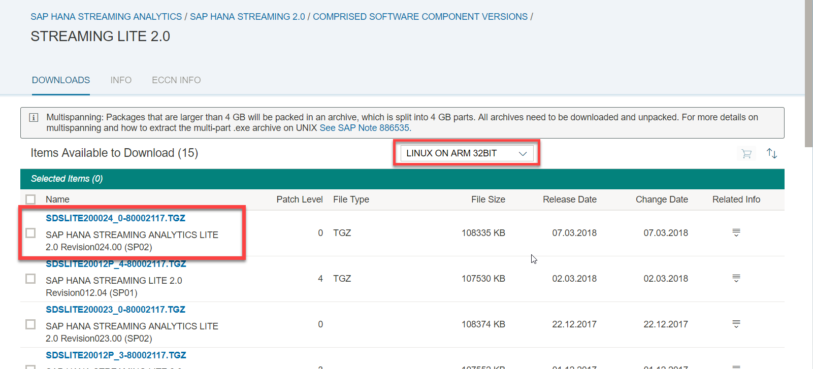
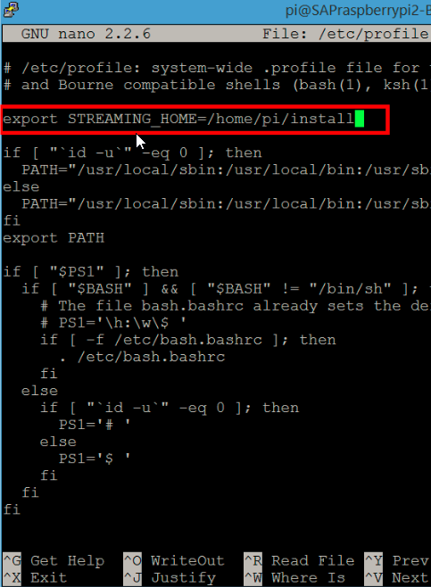

## Prerequisites  
 - **Proficiency:** Beginner
 - **Tutorial:** [Introduction to Freezer Monitoring Lite](https://developers.sap.com/tutorials/hsa-streaming-lite-freezer-monitoring-part1.html)

## Next Steps
   - [Build and Deploy Streaming Lite Project](https://developers.sap.com/tutorials/hsa-streaming-lite-freezer-monitoring-part3.html)

## Details
### You will learn  
 - How to download Streaming Lite for `Raspberry Pi 2`
 - How to configure the environment variable `STREAMING_HOME` on `Raspberry Pi 2`

### Time to Complete
**15 Min**

---

[ACCORDION-BEGIN [Step 1: ](Install Streaming Lite)]

  1. Download

    Go to [SAP Software Downloads > Support Packages and Patches](https://launchpad.support.sap.com/#/softwarecenter/support/index). Look under H, and navigate to "SAP HANA Streaming Analytics". There, click the version of Streaming Analytics you have, and you will see STREAMING LITE under "Comprised Software Component Versions". We want the `LINUX ON ARM 32 BIT` version. Download the most recent edition, which is at the top. In this tutorial, this file is called `"SDSLITE200024_0-80002117.TGZ"`.

    

  2. Move

    Move the installation file you just downloaded to the root (`/home/pi`) directory of our `Raspberry Pi 2`. `WinSCP` is a useful file transfer tool if you don't already have another preferred option.

  3. Extract

    Extract our installation file by running the following line on `Raspberry Pi 2`. (change the file name below to match the file you downloaded):

    ```LINUX
    tar xvf streaming_lite_1.0.100.00_linuxarm32.tar
    ```

[DONE]

[ACCORDION-END]

[ACCORDION-BEGIN [Step 2: ](Configure Raspberry Pi)]

  1. SSH to our `Raspberry Pi` using `PuTTY`.

    > **Note:** You can run the command `hostname - I` in a local shell session on the `Pi` to return the board's `IP address`

  2. Configure environment variable

    You need to configure the environment variable `STREAMING HOME` to be the path of our "install" folder. This is done by opening the `/etc/profile` configuration file using:

    ```Bash

    sudo nano /etc/profile
    ```

    and then adding the following line:

    ```Bash

    export STREAMING_HOME= $HOME/install
    ```

    `$HOME` is a variable containing the root directory for the current user, which should be `/home/pi`.

    Press `Ctrl+O` to write the change, click `Enter` to confirm, and then `Ctrl+x` to exit.

    

For the question below, select the correct answer, and click **Validate**.

[VALIDATE_1]

[ACCORDION-END]

---

