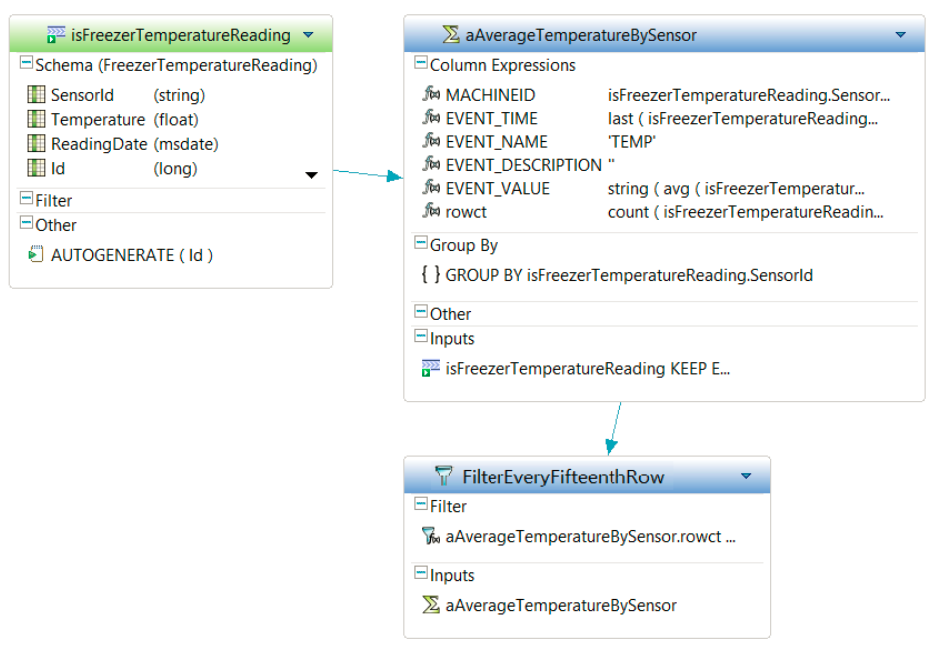
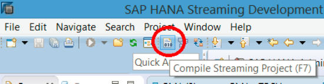
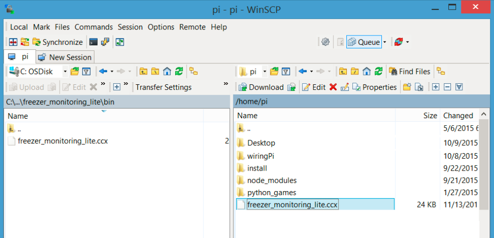
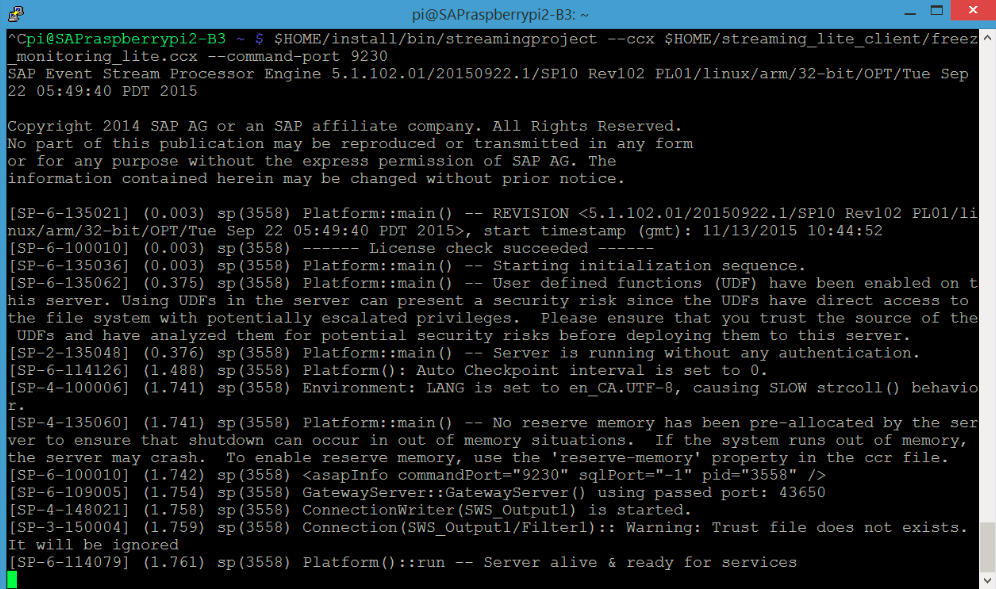

## Prerequisites  
 - **Proficiency:** Beginner
 - **Tutorial:** [Install Streaming Lite and Setup Freezer Lite](https://developers.sap.com/tutorials/hsa-streaming-lite-freezer-monitoring-part2.html)

## Details
### You will learn  
- How to build a Streaming Lite project on HANA Studio
- How to deploy our project on `Raspberry Pi 2`

## Next Steps
- [Test Streaming Lite Project](https://developers.sap.com/tutorials/hsa-streaming-lite-freezer-monitoring-part4.html)

### Time to Complete
**15 Min**

---

Streaming Lite runs `.ccx` files, which come from standard HANA Studio Streaming Analytics projects. We will be creating a streaming project called `"freezer_monitoring_lite"` in HANA Studio. After creating and compiling the Streaming Analytics project, we will obtain a `.ccx` file. This file is then uploaded to the `Raspberry Pi` and run by Streaming Lite.

[ACCORDION-BEGIN [Step 1: ](Build Streaming Analytics Project)]

  1. Create project `"freezer_monitoring_lite"`

    In HANA Studio, create a new HANA Streaming Analytics project called `"freezer_monitoring_lite"`, in the "default" workspace. For detailed instructions on creating a project, you can refer back to the [Streaming Analytics: Run and Test a Streaming Project](https://developers.sap.com/tutorials/sds-run-test.html) tutorial.

  2. Copy `CCL` code

    Copy the following `CCL` code into our `"freezer_monitoring_lite"` project. Remember to delete the `NEWSTREAM` element that is created by default in each new project.

    ```sql

    CREATE SCHEMA FreezerTemperatureReading (
    	SensorId string ,
    	Temperature float,
    	ReadingDate msdate,
    	Id long) ;

    CREATE INPUT STREAM isFreezerTemperatureReading
    SCHEMA FreezerTemperatureReading AUTOGENERATE ( Id ) ;

    /**@SIMPLEQUERY=AGGREGATE*/
    CREATE OUTPUT WINDOW aAverageTemperatureBySensor
    PRIMARY KEY DEDUCED
    AS
    	SELECT
    		isFreezerTemperatureReading.SensorId MACHINEID ,
    		last (isFreezerTemperatureReading.ReadingDate) EVENT_TIME ,
    		'TEMP'EVENT_NAME ,
    		'' EVENT_DESCRIPTION ,
    		string ( avg ( isFreezerTemperatureReading.Temperature ) )
    EVENT_VALUE ,
    		count (isFreezerTemperatureReading.Temperature) rowct  
    FROM isFreezerTemperatureReading KEEP EVERY 15 ROWS PER (SensorId)
    GROUP BY isFreezerTemperatureReading.SensorId ;

    /**@SIMPLEQUERY=FILTER*/
    CREATE OUTPUT STREAM FilterEveryFifteenthRow
    AS SELECT
    	aAverageTemperatureBySensor.MACHINEID,
    	aAverageTemperatureBySensor.EVENT_TIME,
    	aAverageTemperatureBySensor.EVENT_NAME,
    	aAverageTemperatureBySensor.EVENT_DESCRIPTION,
    	aAverageTemperatureBySensor.EVENT_VALUE
    FROM aAverageTemperatureBySensor
    WHERE	aAverageTemperatureBySensor.rowct = 15 ;
    ```

    

    The elements used in this project are:

      - `isFreezerTemperatureReading`

        Input stream for temperature sensor readings. In this tutorial, we will be using the `streamingupload` command line utility to write rows of data to this stream.

      - `aAverageTemperatureBySensor`

        - Incoming temperature values are grouped by `SensorId`

        - The average temperature is calculated for each `SensorId` based on the temperature values currently in the window for the given `SensorId`.

        - `KEEP EVERY 15 ROWS PER (SensorId)` policy specifies after receiving and processing the 15th value for a given `SensorId`, all values for that `SensorId` are cleared from the window and the count is reset to 0. This behavior is referred to as a "jumping" window. If the `KEEP` clause did not use the `EVERY` keyword, then it would be a sliding window in which the arrival of the `nth` value would push out the `n-15th` value. (The arrival of the 16th value would push out the 1st value, the 17th value would push out the 2nd value)

        - There is a counter to count the number of rows currently in the window

        - Maps the input schema into the schema that our SDS project `freezer_monitoring` uses

      - `FilterEveryFifteenthRow`

        - This filter allows a row through when the `aAverageTemperatureBySensor` counter equals 15 for a given `SensorId`

        - Result is that for every 15 rows that enter the project for a given `SensorId`, one row is output from the filter for that `SensorId`

  3. Compile

    After creating our streaming project, compile it to generate the `.ccx` file. It will be located in the `bin/` directory of our project folder.

    

For the question below, select the correct answer, and click **Validate**.

[VALIDATE_1]

[ACCORDION-END]

[ACCORDION-BEGIN [Step 2: ](Deploy Streaming Lite)]

Connect to your `Raspberry Pi` with `WinSCP`, and move your `.ccx` file over onto the `Pi`. We are moving it into the `/home/pi` directory.



Run the Streaming Lite project using the command line. You can do this directly from a shell session on the `Pi` or remotely using Putty to open an SSH session. In either case you will run the following command line:

```Bash

$HOME/install/bin/streamingproject --ccx $HOME/freezer_monitoring_lite.ccx --command-port 9230
```

The first path points to `streamingproject`, a binary executable from the Streaming Lite "install" folder. The second path points to the `freezer_monitoring_lite.ccx` project file. We then specify the port which our project will run on.

You should now see our Streaming Lite project running:



[DONE]

[ACCORDION-END]

---

