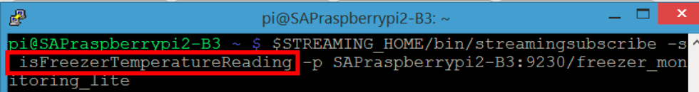
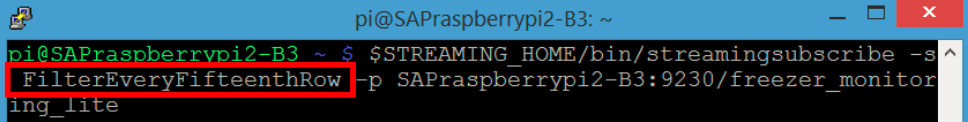
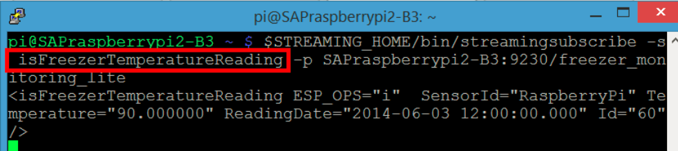
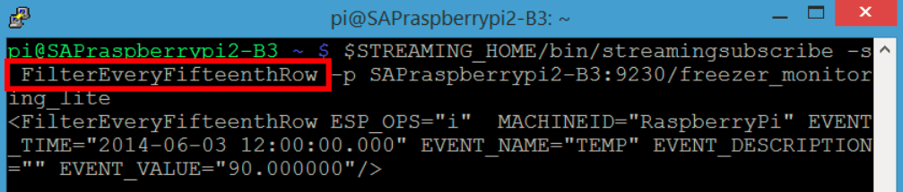

## Prerequisites  
 - [Build and Deploy Streaming Lite Project](https://developers.sap.com/tutorials/hsa-streaming-lite-freezer-monitoring-part3.html)

## Details
### You will learn  
- How to subscribe for the `isFreezerTemperatureReading` stream to show the individual events entering the project
- How to subscribe for the `FilterEveryFifteenthRow` stream to show the final output after the project has processed the events
- How to send event records into our Streaming Lite project
- To wrap up our Streaming Lite projects


---

Open three more `PuTTY/SSH` sessions connected to our `Raspberry Pi`. You will need to run a separate command line utility in each session to see the flow of events through the project.

Using the `streamingsubscribe` command line utility, we will be subscribing to two streams in our project.

The first subscribe will be for `theisFreezerTemperatureReading` stream. This will be used to show the individual events entering the project.

The second subscribe will be for the `FilterEveryFifteenthRow` stream of our project. This will be used to show the final output after the project has process the events through all three elements.

[ACCORDION-BEGIN [Step 1: ](isFreezerTemperatureReading Stream)]

In the first `PuTTY/SSH` session, run this command to subscribe to the `isFreezerTemperatureReading` stream:

> **Note:** Don't forget to replace \<Raspberry Pi IP Address\> with our Raspberry Pi's IP Address

```Bash

$STREAMING_HOME/bin/streamingsubscribe -s isFreezerTemperatureReading -p <Raspberry Pi IP Address>:9230/freezer_monitoring_lite
```



For the question below, select the correct answer, and click **Validate**.

[VALIDATE_1]

[ACCORDION-END]

[ACCORDION-BEGIN [Step 2: ](FilterEveryFifteenthRow Stream)]

In the second `PuTTY/SSH` session, run this command to subscribe to the `FilterEveryFifteenthRow` stream:

> **Note:** Don't forget to replace \<Raspberry Pi IP Address\> with our Raspberry Pi's IP Address

```Bash

$STREAMING_HOME/bin/streamingsubscribe -s FilterEveryFifteenthRow -p <Raspberry Pi IP Address>:9230/freezer_monitoring_lite
```




You will now be able to see when data passes through either stream. `streamingsubscribe` is a binary executable which subscribes to our stream of choice, in a running instance of any streaming project.

[DONE]

[ACCORDION-END]


[ACCORDION-BEGIN [Step 3: ](Send Event Record)]

We will now send a single event record into our Streaming Lite project. The first part of this command prints out a record in a [delimited format](https://help.sap.com/viewer/e54136ab6a4a43e6a370265bf0a2d744/4.2.9/en-US/3cef7c1f75c542b1bc6dc01f2606f54c.html?q=delimited%20format). This output is then piped into [`streamingconvert`](https://help.sap.com/saphelp_esp_51sp09_util/helpdata/en/e7/8124f56f0f10148c0afd9de7ceb2b7/content.htm?no_cache=true), which converts the delimited record into 32-bit binary records compatible with Streaming Lite. Finally, this output is piped again into [`streamingupload`](https://help.sap.com/saphelp_esp_51sp09_util/helpdata/en/e7/8136296f0f1014b316940b33de65c6/content.htm?no_cache=true), which writes the row into our stream.

To represent our record in a delimited format, we will use the following string: `"isFreezerTemperatureReading,i,RaspberryPi,90,2014-06-03T12:00:00.000,218"`. This string is made up of six parts. First, we state the stream name. Next, we define the opcode to be `i` for insert. The subsequent four values correspond to the four fields as defined in the stream schema, in consecutive order. `SensorId` is set as `Raspberry Pi`, Temperature is set to `"90"`, `ReadingDate` is set to `"2014-06-03 12:00:00.000"`, and `Id` is set to `"218"`. (`Id` is arbitrary since it will be `autogenerated` inside the project)

Run the command in our third `PuTTY/SSH` window:

> **Note:** Don't forget to replace \<Raspberry Pi IP Address\> with our Raspberry Pi's IP Address

```Bash

echo "isFreezerTemperatureReading, i, RaspberryPi, 90, 2014-06-03T12:00:00.000,218" | $STREAMING_HOME/bin/streamingconvert -d "," -p <Raspberry Pi IP Address>:9230/freezer_monitoring_lite | $STREAMING_HOME/bin/streamingupload -p <Raspberry Pi IP Address>:9230/freezer_monitoring_lite
```

[DONE]

[ACCORDION-END]

[ACCORDION-BEGIN [Step 4: ](Check Results)]

After running the send row command, you should now see something in the first `PuTTY/SSH` window, which is subscribed to `isFreezerTemperatureReading`:



Note that nothing has yet appeared in our second `PuTTY/SSH` window, which is subscribed to the `FilterEveryFifteenthRow` stream.

Run the send row command 14 more times. You will see each row appear in our first `isFreezerTemperatureReading` `PuTTY/SSH` window.

After 15 rows have been sent, check our second `PuTTY/SSH` window, which is subscribed to the `FilterEveryFifteenthRow` stream.



Our `"FilterEveryFifteenthRow"` stream has finally passed a row, after averaging the last 15 rows of temperature values.

[DONE]

[ACCORDION-END]

[ACCORDION-BEGIN [Step 5: ](Summary)]

In summary, Streaming Lite runs on remote devices to collect data, and processes the bulk of the information before sending it off. By pushing computation into the edge, more data can be processed without hindering the central nodes.

In the future, we will be adding a Streaming Web Service output adapter onto this stream, to send records into a Streaming Analytics project.

[DONE]

[ACCORDION-END]

