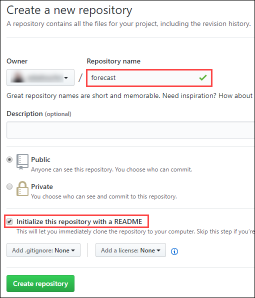
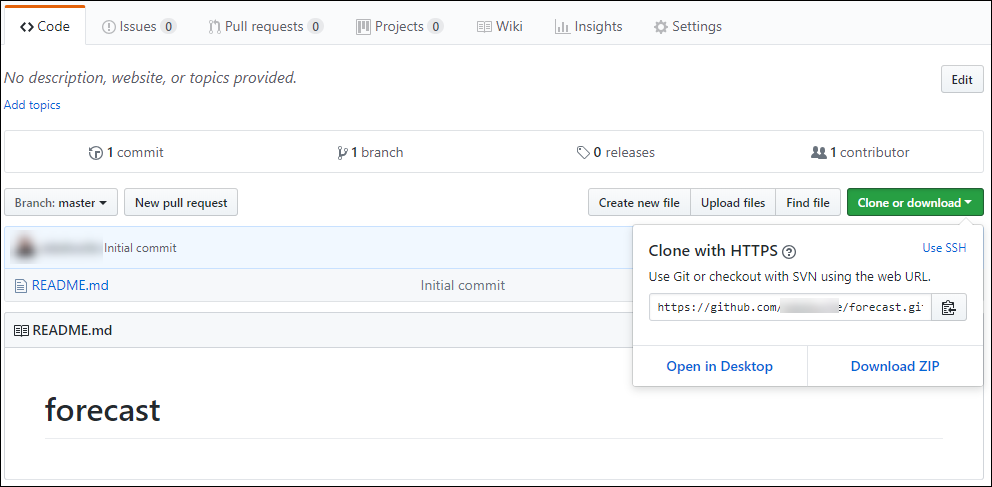
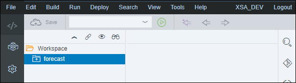
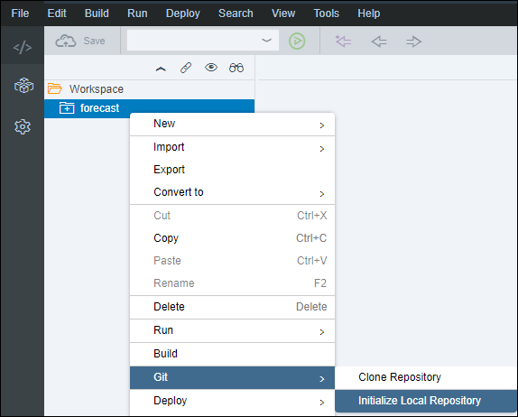
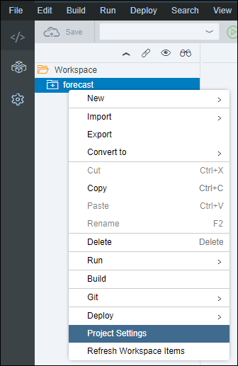
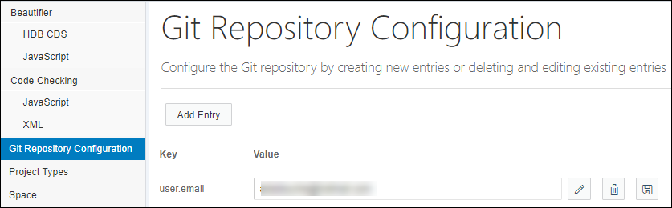
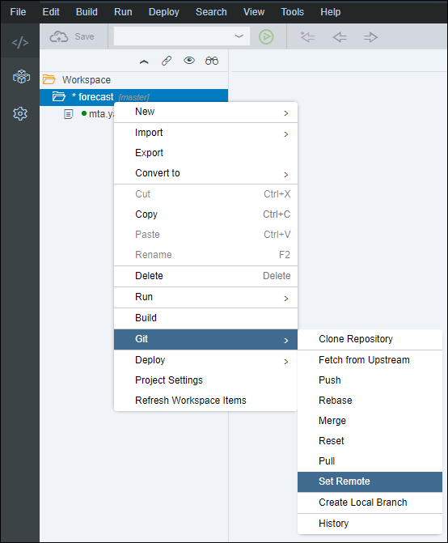
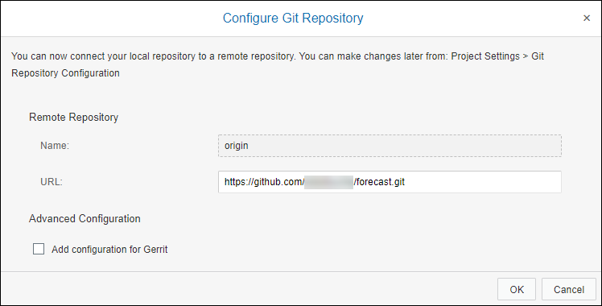
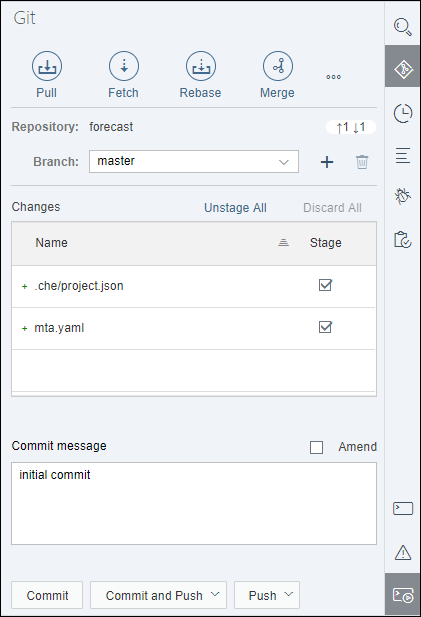

## Prerequisites
 - [Use Machine Learning to Build a Forecasting application using the XS advanced development model](https://www.sap.com/developer/tutorials.html?/groups/hxe-aa-forecast.html)

## Next Steps
 - [Use Machine Learning to Build a Forecasting application using the XS advanced development model](https://www.sap.com/developer/tutorials.html?/groups/hxe-aa-forecast.html)

## Details
### You will learn
- Create a Multi-Target Application Project
- Save your Web IDE project in a GIT repository

[ACCORDION-BEGIN [Step 1: ](Create a GitHub repository)]

Open the GitHub <https://github.com/> home page in your browser and either sign in or sign-up for a new account.

Once logged in, on the top right corner click the  icon, and select **New repository**:


Enter **`forecast`** as **Repository Name**, check **Initialize this repository with a README**, then click on **Create Repository**.



Once the repository is created, get the repository URL by clicking on **Clone or Download**.



Save this URL locally or keep the GitHub repository page open.

Follow the instruction below then click on **Validate**.

[VALIDATE_1]
[ACCORDION-END]

[ACCORDION-BEGIN [Step 1: ](Set your Preferences)]

Open the Web IDE and login using the **`XSA_DEV`** credentials.

As a reminder the default URL for the Web IDE is:

 - `https://hxehost:53075`

A link to the Web IDE can also be found on the ***XSA Controller page*** at:

 - `https://hxehost:39030`

Switch to the ***Preference*** perspective using the  icon.

#### Enable Features

Select **Features** and turn on the following features:

 - Tools for SAP HANA Database Development
 - Tools for Node.js Development
 - Layout Editor
 - SAP HANA Database Explorer

Click on **Save**. The Web IDE will need to refresh.


#### Set your Git Settings

Select **Git Settings** and enter your Git email address and user name.


Click on **Save**.

[DONE]
[ACCORDION-END]

[ACCORDION-BEGIN [Step 1: ](Create your project)]

Switch to the ***Development*** perspective using the  icon.


Open the Project template wizard using the **File > New > Project From Template** menu.

Select **Multi-Target Application Project**, then click on **Next**.


Set your project name to **`forecast`**, then click on **Next**.


Leave the MTA details by default, set the **Space** to ***development*** and click on **Finish**.



Now, right click on the **`forecast`** project folder and select **Build** from the drop down menu or use the **Build** menu to build your project.

The console should output the following:

```
2:35:40 PM (Project Space) Workspace settings set successfully
2:41:13 PM (Builder) Build of /forecast started.
2:41:16 PM (DIBuild) [INFO] Target platform is XSA[INFO] Reading mta.yaml[INFO] Processing mta.yaml[INFO] Creating MTA archive[INFO] Saving MTA archive forecast_0.0.1.mtar[INFO] Done
2:41:16 PM (DIBuild) ********** End of /forecast Build Log **********
2:41:16 PM (DIBuild) Build results link: https://hxehost:53075/che/builder/workspaceb17f2iulenl46tib/download-all/53fd1280-3828-4a77-bcc2-8eedfdb6ea54?arch=zip
2:41:16 PM (Builder) Build of /forecast completed successfully.
```

> ### **Note:**
>If you get the following error: ***Could not start the build because no builder is installed in your space***, it probably mean that the builders are not deployed in the ***development*** space.
>&nbsp;
>You will need to complete the first step (Verify the builders deployment) from the [***Check your environment*** tutorial](https://www.sap.com/developer/tutorials.html?/hxe-aa-forecast-01.html).

[DONE]
[ACCORDION-END]

[ACCORDION-BEGIN [Step 1: ](Initialize your local repository)]

Before linking your project to your GitHub repository, you will need to initialize a local repository.

Right click on the **`forecast`** project and select **Git > Initialize Local Repository**.



The console should output the following:

```
2:40:13 PM (git) Project : Initialize repository request sent
2:40:14 PM (git) Project : Initialize repository completed successfully
2:40:15 PM (git) Project forecast: Status request completed successfully
```

Right click on the `forecast` project and select **Project Setting**.



Under the **Git Repository Configuration** section, make sure the **`user.email`** is not set to **`null`**. If so, update the value with your email address.



[DONE]
[ACCORDION-END]

[ACCORDION-BEGIN [Step 1: ](Set the Git Remote URL)]

Right click on the **`forecast`** project and select **Git > Set Remote**.



Enter the GitHub repository URL, and click on **OK**.



Enter your GitHub credentials, and click on **OK**.


Click on **OK** on the ***Changes Fetched*** window.

[DONE]
[ACCORDION-END]

[ACCORDION-BEGIN [Step 1: ](Commit your changes)]

On the icon bar located on the right side of the Web IDE, click on the **Git Pane** icon .



Click on **Pull** .

Click on **Stage All**, enter a commit comment, then click on **Commit and Push > origin master**.

[DONE]
[ACCORDION-END]
