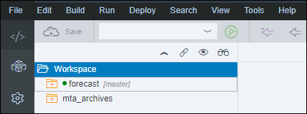
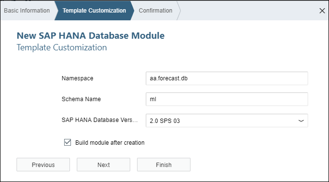
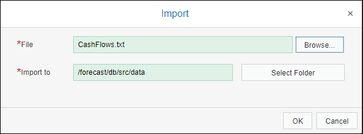
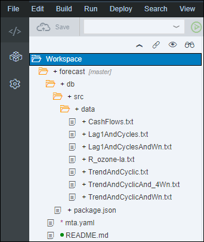
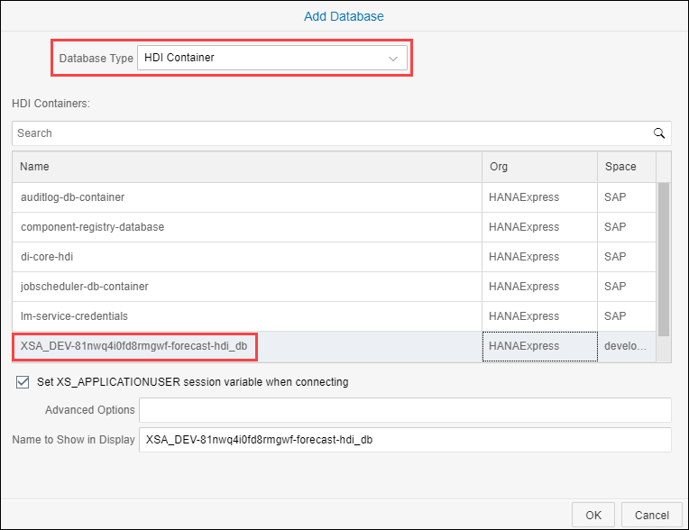
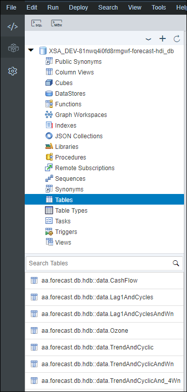

## Prerequisites
 - [Use Machine Learning to Build a Forecasting application using the XS advanced development model](https://www.sap.com/developer/tutorials.html?/groups/hxe-aa-forecast.html)

## Next Steps
 - [Use Machine Learning to Build a Forecasting application using the XS advanced development model](https://www.sap.com/developer/tutorials.html?/groups/hxe-aa-forecast.html)

## Details
### You will learn
- How to create CDS artifacts to expose your dataset as CDS entities.
- How to load your dataset content in the CDS entities.

[ACCORDION-BEGIN [Step 1: ](Which Time series dataset?)]

In order to build your time series model, you will be using the sample datasets from SAP Predictive Analytics made available as part of the [online documentation](https://help.sap.com/viewer/p/SAP_PREDICTIVE_ANALYTICS).

The datasets archive structure for the [**Sample Time Series**](https://help.sap.com/http.svc/download?deliverable_id=20555051) is the following:

```
|--sample_time_series_3.3.1_en-us_production.zip
   |-- Time series.zip
   |   |-- Time series
   |       |-- CashFlows.txt
   |       |-- KxDesc_CashFlows.txt
   |       |-- Lag1AndCycles.txt
   |       |-- Lag1AndCyclesAndWn.txt
   |       |-- R_ozone-la.txt
   |       |-- TrendAndCyclic.txt
   |       |-- TrendAndCyclicAnd_4Wn.txt
   |       |-- TrendAndCyclicAndWn.txt
   |-- metadata.xml
```

> ### **Note:** `desc` and `KxDesc` files are SAP Predictive Analytics dataset description files and will not be loaded.


#### **Cash Flows**

The Cash Flows file (`CashFlows.txt`) presents daily measures of cash flows from January 2, 1998 to September, 30 1998. Each observation is characterized by 25 variables.

In this scenario, you are an executive of a financial entity that manages cash-flows. Your role is to make sure that credits are available with the correct amount at the correct date to provide the best management possible of your financial flows.

#### **Los Angeles Ozone**

The Los Angeles Ozone file (`R_ozone-la.txt`) presents monthly averages of hourly ozone (O3) readings in downtown Los Angeles from 1955 to 1972.

Each observation is characterized by 2 variables, a time and an average of the hourly ozone readings for the month.

The purpose of this scenario is to confirm the decreasing trend of the ozone rate by predicting the next 18 months and describing the different signal elements based on the ozone rate.

#### **Lag 1 And Cycles** & **Trend And Cyclic** with and without White Noise (`Wn`)

These files can be used to observe and analyze the impact of a specific signal phenomenon like:

 - Lag 1
 - Cycles
 - Trends
 - White Noise

Each observation is characterized by 2 variables, a time and a signal value.

[DONE]
[ACCORDION-END]

[ACCORDION-BEGIN [Step 1: ](SAP HANA data import options)]

There are multiple ways to import data set files inside of your SAP HANA, express edition instance.

- ***Eclipse IDE***

The ***SAP HANA Tools*** plugin for Eclipse provides an ***Import/Export*** feature which would allow you to create the appropriate physical tables first and then import the data.

However, this would require the ***Eclipse IDE*** to be locally installed and properly configured with the ***SAP HANA Tools*** plugin.

Then, you would need to know the complete data file format description in order to create the tables with the proper columns structure. And, last but not least, any changes would require to recreate the all structure and reload the data.

If you want to learn more about this import method, you can check the following tutorial: [Import CSV into SAP HANA, express edition using the SAP HANA Tools for Eclipse](https://www.sap.com/developer/tutorials/mlb-hxe-import-data-eclipse.html)

- ***SAP HANA HDB Client***

The **SAP HANA HDB Client** provides an ***IMPORT FROM*** statement allowing you to import CSV files physically located on your SAP HANA, express edition host using a SQL command.

However, this method requires that the table are created before the execution of the command.

If you want to learn more about this import method, you can check the following tutorial: [Import CSV into SAP HANA, express edition using IMPORT FROM SQL command](https://www.sap.com/developer/tutorials/mlb-hxe-import-data-sql-import.html)

- ***SAP HANA Persistence Model***

The **SAP HANA extended application services, advanced model**, (XS advanced) provide a comprehensive platform for the development and execution of native data-intensive applications.

The application data model comprises all the database artifacts used to store and provision data for your application's back end and user interface.

As part of the process of defining the database persistence model for your application, you can create database design-time artifacts such as tables and views, for example using Core Data Services (CDS).

At the same time, you can also create procedures and functions using SQLScript, which can be used to insert data into (and remove data from) tables or views.

#### ***Solution***

As the purpose of this tutorial series is to discover how to use Machine Learning algorithms to build an end to end solution including a native SAP HANA application, you will be using the ***SAP HANA Persistence Model*** with the ***Core Data Service*** (CDS) artifacts in a ***SAP HANA Database Module***.

[DONE]
[ACCORDION-END]

[ACCORDION-BEGIN [Step 1: ](Create a SAP HANA Database Module)]

Open the Web IDE, and login using the **`XSA_DEV`** credentials.

Switch to the ***Development*** perspective using the  icon.



As a reminder the default URL for the Web IDE is:

 - `https://hxehost:53075`

A link to the Web IDE can also be found on the ***XSA Controller page*** at:

- `https://hxehost:39030`

In the left panel, right click on the **`forecast`** project folder, then select **New > SAP HANA Database Module**.


Set the name to **`db`** and click on **Next**.


Set the following details on the next screen:

| Name                        | Value               |
|:----------------------------|--------------------:|
| Name Space                  | `aa.forecast.db`    |
| Schema Name                 | `ml`                |
| SAP HANA Database Version   | `2.0 SPS 03`        |
| Build module after creation | `checked`           |

Click on **Finish**.



[DONE]
[ACCORDION-END]

[ACCORDION-BEGIN [Step 1: ](Create the folder structure)]

Expand the **`forecast/db/src`** folder.

Create the following directory structure:

```
|-- forecast/db/src
    |-- algorithms
		|-- apl
	        |-- afllang
	        |-- procedures
	        |-- views
	    |-- pal
	        |-- afllang
	        |-- procedures
	        |-- views
    |-- data
```

You can use the right click on the target folder and select **New > Folder**.

Enter the folder name, then click on **OK**.

[DONE]
[ACCORDION-END]

[ACCORDION-BEGIN [Step 1: ](Import the dataset CSV files)]

As the dataset files get updated periodically, and in order to ensure consistency of content and validation, a copy of the data is available under the <a href="https://github.com/SAPDocuments/Tutorials/tree/master/tutorials/hxe-aa-forecast-03/data" target="new">data</a> directory within the SAP Tutorial GitHub repository.

Download the following files locally (right click on the link, then use the ***Save link as*** option):

- <a href="https://raw.githubusercontent.com/SAPDocuments/Tutorials/master/tutorials/hxe-aa-forecast-03/CashFlows.csv" target="new">`CashFlows.csv`</a>
- <a href="https://raw.githubusercontent.com/SAPDocuments/Tutorials/master/tutorials/hxe-aa-forecast-03/KxDesc_CashFlows.csv" target="new">`KxDesc_CashFlows.csv`</a>
- <a href="https://raw.githubusercontent.com/SAPDocuments/Tutorials/master/tutorials/hxe-aa-forecast-03/Lag1AndCycles.csv" target="new">`Lag1AndCycles.csv`</a>
- <a href="https://raw.githubusercontent.com/SAPDocuments/Tutorials/master/tutorials/hxe-aa-forecast-03/Lag1AndCyclesAndWn.csv" target="new">`Lag1AndCyclesAndWn.csv`</a>
- <a href="https://raw.githubusercontent.com/SAPDocuments/Tutorials/master/tutorials/hxe-aa-forecast-03/Ozone.csv" target="new">`Ozone.csv`</a>
- <a href="https://raw.githubusercontent.com/SAPDocuments/Tutorials/master/tutorials/hxe-aa-forecast-03/TrendAndCyclic.csv" target="new">`TrendAndCyclic.csv`</a>
- <a href="https://raw.githubusercontent.com/SAPDocuments/Tutorials/master/tutorials/hxe-aa-forecast-03/TrendAndCyclicAndWn.csv" target="new">`TrendAndCyclicAndWn.csv`</a>
- <a href="https://raw.githubusercontent.com/SAPDocuments/Tutorials/master/tutorials/hxe-aa-forecast-03/TrendAndCyclicAnd_4Wn.csv" target="new">`TrendAndCyclicAnd_4Wn.csv`</a>

> ###**Note**: If you want to import your own data files, make sure it uses the  **`csv`** file extension.

In the left side panel, expand the **`forecast/db/src/hdb/data`** tree node.

Right click on the **`data`** folder, and use the **Import** > **File or Project** menu item.

Select one of the previously downloaded files.



Click on **OK**.

Repeat the operation for all the previously downloaded files:

- <a href="https://raw.githubusercontent.com/SAPDocuments/Tutorials/master/tutorials/hxe-aa-forecast-03/CashFlows.csv" target="new">`CashFlows.csv`</a>
- <a href="https://raw.githubusercontent.com/SAPDocuments/Tutorials/master/tutorials/hxe-aa-forecast-03/KxDesc_CashFlows.csv" target="new">`KxDesc_CashFlows.csv`</a>
- <a href="https://raw.githubusercontent.com/SAPDocuments/Tutorials/master/tutorials/hxe-aa-forecast-03/Lag1AndCycles.csv" target="new">`Lag1AndCycles.csv`</a>
- <a href="https://raw.githubusercontent.com/SAPDocuments/Tutorials/master/tutorials/hxe-aa-forecast-03/Lag1AndCyclesAndWn.csv" target="new">`Lag1AndCyclesAndWn.csv`</a>
- <a href="https://raw.githubusercontent.com/SAPDocuments/Tutorials/master/tutorials/hxe-aa-forecast-03/Ozone.csv" target="new">`Ozone.csv`</a>
- <a href="https://raw.githubusercontent.com/SAPDocuments/Tutorials/master/tutorials/hxe-aa-forecast-03/TrendAndCyclic.csv" target="new">`TrendAndCyclic.csv`</a>
- <a href="https://raw.githubusercontent.com/SAPDocuments/Tutorials/master/tutorials/hxe-aa-forecast-03/TrendAndCyclicAndWn.csv" target="new">`TrendAndCyclicAndWn.csv`</a>
- <a href="https://raw.githubusercontent.com/SAPDocuments/Tutorials/master/tutorials/hxe-aa-forecast-03/TrendAndCyclicAnd_4Wn.csv" target="new">`TrendAndCyclicAnd_4Wn.csv`</a>

Your package structure should now look like this:



> ### **Note**:
>You should close the tabs that got opened for each of the imported files in order to release the resources used by your browser.

[DONE]
[ACCORDION-END]

[ACCORDION-BEGIN [Step 1: ](Create the HDI Table Artifacts)]

> #### **HDI Table Artifacts**
>
>The XS advanced deployment infrastructure supports a wide variety of database artifact types, for example, tables, types, views.
>
>For additional details, check the [HDI Table Artifacts](https://help.sap.com/viewer/4505d0bdaf4948449b7f7379d24d0f0d/latest/en-US/453d48e28f6747799546236b4b432e58.html) documentation.

### **Cash Flows**

Create a new file named **`CashFlows.hdbtable`** in the **`forecast/db/src/data`** folder.

This is the full path of the created file:

```
forecast/db/src/data/CashFlows.hdbtable
```

Paste the following content:

```js
COLUMN TABLE "aa.forecast.db.data::CashFlows" (
    "signal_time"  DATE CS_DAYDATE NOT NULL,
    "signal_value" DOUBLE CS_DOUBLE,
    PRIMARY KEY (
        "signal_time"
    )
);
```

Save the file using the  icon from the menu.

Create a new file named **`CashFlows_extrapredictors.hdbtable`** in the **`forecast/db/src/data`** folder.

This is the full path of the created file:

```
forecast/db/src/data/CashFlows_extrapredictors.hdbtable
```

Paste the following content:

```js
COLUMN TABLE "aa.forecast.db.data::CashFlows_extrapredictors" (
    "signal_time"               DATE CS_DAYDATE NOT NULL,
    "WorkingDaysIndices"        INTEGER CS_INT,
    "ReverseWorkingDaysIndices" INTEGER CS_INT,
    "MondayMonthInd"            INTEGER CS_INT,
    "TuesdayMonthInd"           INTEGER CS_INT,
    "WednesdayMonthInd"         INTEGER CS_INT,
    "ThursdayMonthInd"          INTEGER CS_INT,
    "FridayMonthInd"            INTEGER CS_INT,
    "BeforeLastMonday"          INTEGER CS_INT,
    "LastMonday"                INTEGER CS_INT,
    "BeforeLastTuesday"         INTEGER CS_INT,
    "LastTuesday"               INTEGER CS_INT,
    "BeforeLastWednesday"       INTEGER CS_INT,
    "LastWednesday"             INTEGER CS_INT,
    "BeforeLastThursday"        INTEGER CS_INT,
    "LastThursday"              INTEGER CS_INT,
    "BeforeLastFriday"          INTEGER CS_INT,
    "LastFriday"                INTEGER CS_INT,
    "Last5WDaysInd"             INTEGER CS_INT,
    "Last5WDays"                INTEGER CS_INT,
    "Last4WDaysInd"             INTEGER CS_INT,
    "Last4WDays"                INTEGER CS_INT,
    "LastWMonth"                INTEGER CS_INT,
    "BeforeLastWMonth"          INTEGER CS_INT,
    "signal_value"              DOUBLE CS_DOUBLE,
    PRIMARY KEY (
        "signal_time"
    )
);
```

Save the file using the  icon from the menu.

Create a new file named **`KxDesc_CashFlows_extrapredictors.hdbtable`** in the **`forecast/db/src/data`** folder.

This is the full path of the created file:

```
forecast/db/src/data/KxDesc_CashFlows_extrapredictors.hdbtable
```

Paste the following content:

```js
COLUMN TABLE "aa.forecast.db.data::KxDesc_CashFlows_extrapredictors" (
    "RANK"          INTEGER CS_INT,
    "NAME"          VARCHAR(255),
    "STORAGE"       VARCHAR(20),
    "VALUETYPE"     VARCHAR(20),
    "KEYLEVEL"      INTEGER CS_INT,
    "ORDERLEVEL"    INTEGER CS_INT,
    "MISSINGSTRING" VARCHAR(255),
    "GROUPNAME"     VARCHAR(255),
    "DESCRIPTION"   VARCHAR(255),
    "OID"           VARCHAR(50),
    PRIMARY KEY (
        "RANK"
    )
);
```

Save the file using the  icon from the menu.


### **Lag 1 And Cycles**

Create a new file named **`Lag1AndCycles.hdbtable`** in the **`forecast/db/src/data`** folder.

This is the full path of the created file:

```
forecast/db/src/data/Lag1AndCycles.hdbtable
```

Paste the following content:

```js
COLUMN TABLE "aa.forecast.db.data::Lag1AndCycles" (
    "signal_time"  DATE CS_DAYDATE NOT NULL,
    "signal_value" DOUBLE CS_DOUBLE,
    PRIMARY KEY (
        "signal_time"
    )
);
```

Save the file using the  icon from the menu.

Create a new file named **`Lag1AndCyclesAndWn.hdbtable`** in the **`forecast/db/src/data`** folder.

This is the full path of the created file:

```
forecast/db/src/data/Lag1AndCyclesAndWn.hdbtable
```

Paste the following content:

```js
COLUMN TABLE "aa.forecast.db.data::Lag1AndCyclesAndWn" (
    "signal_time"  DATE CS_DAYDATE NOT NULL,
    "signal_value" DOUBLE CS_DOUBLE,
    PRIMARY KEY (
        "signal_time"
    )
);
```

Save the file using the  icon from the menu.

### **Ozone**

Create a new file named **`Ozone.hdbtable`** in the **`forecast/db/src/data`** folder.

This is the full path of the created file:

```
forecast/db/src/data/Ozone.hdbtable
```

Paste the following content:

```js
COLUMN TABLE "aa.forecast.db.data::Ozone"(
    "signal_time"  DATE CS_DAYDATE NOT NULL,
    "signal_value" DOUBLE CS_DOUBLE,
    PRIMARY KEY (
        "signal_time"
    )
);
```

Save the file using the  icon from the menu.

### **Trend And Cycles**

Create a new file named **`TrendAndCyclic.hdbtable`** in the **`forecast/db/src/data`** folder.

This is the full path of the created file:

```
forecast/db/src/data/TrendAndCyclic.hdbtable
```

Paste the following content:

```js
COLUMN TABLE "aa.forecast.db.data::TrendAndCyclic"(
    "signal_time"  DATE CS_DAYDATE NOT NULL,
    "signal_value" DOUBLE CS_DOUBLE,
    PRIMARY KEY (
        "signal_time"
    )
);
```

Save the file using the  icon from the menu.

Create a new file named **`TrendAndCyclicAndWn.hdbtable`** in the **`forecast/db/src/data`** folder.

This is the full path of the created file:

```
forecast/db/src/data/TrendAndCyclicAndWn.hdbtable
```

Paste the following content:

```js
COLUMN TABLE "aa.forecast.db.data::TrendAndCyclicAndWn"(
    "signal_time"  DATE CS_DAYDATE NOT NULL,
    "signal_value" DOUBLE CS_DOUBLE,
    PRIMARY KEY (
        "signal_time"
    )
);
```

Save the file using the  icon from the menu.

Create a new file named **`TrendAndCyclicAnd_4Wn.hdbtable`** in the **`forecast/db/src/data`** folder.

This is the full path of the created file:

```
forecast/db/src/data/TrendAndCyclicAnd_4Wn.hdbtable
```

Paste the following content:

```js
COLUMN TABLE "aa.forecast.db.data::TrendAndCyclicAnd_4Wn" (
    "signal_time"  DATE CS_DAYDATE NOT NULL,
    "signal_value" DOUBLE CS_DOUBLE,
    PRIMARY KEY (
        "signal_time"
    )
);
```

Save the file using the  icon from the menu.

[DONE]
[ACCORDION-END]

[ACCORDION-BEGIN [Step 1: ](Create the Table Data Artifacts)]

> #### **Table Data Artifact**
>
>The Table Data plug-in can be used to insert data defined in other design-time artifacts into database tables which are managed by SAP HANA DI and are not system-versioned, temporary, or virtual tables.
>&nbsp;
>For additional details, check the [Table Data in XS Advanced](https://help.sap.com/viewer/4505d0bdaf4948449b7f7379d24d0f0d/2.0.03/en-US/35c4dd829d2046f29fc741505302f74d.html) documentation.

In the scenario, you will load the data in ***generic*** to avoid the creation of additional views.

For example, the ***time*** and signal columns will all be named the same way across dataset.

Create a new file named **`upload_tabledata.hdbtabledata`** in the **`forecast/db/src/data`** folder.

This is the full path of the created file:

```
forecast/db/src/data/upload_tabledata.hdbtabledata
```

Paste the following content:

```JSON
{
    "format_version": 1,
    "imports": [
        {
            "column_mappings" : { "signal_time" : "Date", "signal_value" : "Cash"},
            "import_settings" : { "import_columns" : [ "signal_time", "signal_value"], "include_filter" : [], "exclude_filter" : []},
            "source_data" : {
                "data_type" : "CSV", "has_header" : true, "dialect" : "HANA", "type_config" : { "delimiter" : "\t", "do_quote": false },
                "file_name" : "aa.forecast.db.data::CashFlows.csv"
            },
            "target_table" : "aa.forecast.db.data::CashFlows"  
        },   
        {
            "column_mappings" : {"signal_time" : "Date", "signal_value" : "Cash"},
            "import_settings" : {
                "import_columns" : [ "signal_time", "signal_value","WorkingDaysIndices", "ReverseWorkingDaysIndices", "MondayMonthInd", "TuesdayMonthInd", "WednesdayMonthInd", "ThursdayMonthInd", "FridayMonthInd", "BeforeLastMonday", "LastMonday", "BeforeLastTuesday", "LastTuesday", "BeforeLastWednesday", "LastWednesday", "BeforeLastThursday", "LastThursday", "BeforeLastFriday", "LastFriday", "Last5WDaysInd", "Last5WDays", "Last4WDaysInd", "Last4WDays", "LastWMonth", "BeforeLastWMonth"],
                "include_filter" : [], "exclude_filter" : []
            },
            "source_data" : {
                "data_type" : "CSV", "has_header" : true, "dialect" : "HANA", "type_config" : { "delimiter" : "\t", "do_quote": false },
                "file_name" : "aa.forecast.db.data::CashFlows.csv"
            },
            "target_table" : "aa.forecast.db.data::CashFlows_extrapredictors"  
        },
        {
            "column_mappings" : {
                "RANK" : { "type" : "function", "name" : "range",  "parameters" : {"increment_by" : "1", "start_with" : "1" }},
                "OID" : {"type" : "constant",  "value" : ""}
            },
            "import_settings" : {
                "import_columns" : [ "RANK", "NAME", "STORAGE", "VALUETYPE", "KEYLEVEL", "ORDERLEVEL", "MISSINGSTRING", "GROUPNAME", "DESCRIPTION", "OID"],
                "include_filter" : [],
                "exclude_filter" : [
                    {"NAME" : "Date"}, { "NAME" : "Cash"}  
                ]
            },
            "source_data" : {
                "data_type" : "CSV", "has_header" : true, "dialect" : "HANA", "type_config" : { "delimiter" : "\t", "do_quote": false },
                "file_name" : "aa.forecast.db.data::KxDesc_CashFlows.csv"
            },
            "target_table" : "aa.forecast.db.data::KxDesc_CashFlows_extrapredictors"  
        },        
        {
            "column_mappings" : { "signal_time" : "TIME", "signal_value" : "R_ozone-la"},
            "import_settings" : { "import_columns" : [ "signal_time", "signal_value"], "include_filter" : [], "exclude_filter" : []},
            "source_data" : {
                "data_type" : "CSV", "has_header" : true, "dialect" : "HANA", "type_config" : { "delimiter" : "\t", "do_quote": false },
                "file_name" : "aa.forecast.db.data::Ozone.csv"
            },
            "target_table" : "aa.forecast.db.data::Ozone"  
        },
        {
            "column_mappings" : { "signal_time" : "TIME", "signal_value" : "Signal"},
            "import_settings" : { "import_columns" : [ "signal_time", "signal_value"], "include_filter" : [], "exclude_filter" : []},
            "source_data" : {
                "data_type" : "CSV", "has_header" : true, "dialect" : "HANA", "type_config" : { "delimiter" : "\t", "do_quote": false },
                "file_name" : "aa.forecast.db.data::Lag1AndCycles.csv"
            },
            "target_table" : "aa.forecast.db.data::Lag1AndCycles"  
        },
        {
            "column_mappings" : { "signal_time" : "TIME", "signal_value" : "Signal"},
            "import_settings" : { "import_columns" : [ "signal_time", "signal_value"], "include_filter" : [], "exclude_filter" : []},
            "source_data" : {
                "data_type" : "CSV", "has_header" : true, "dialect" : "HANA", "type_config" : { "delimiter" : "\t", "do_quote": false },
                "file_name" : "aa.forecast.db.data::Lag1AndCyclesAndWn.csv"
            },
            "target_table" : "aa.forecast.db.data::Lag1AndCyclesAndWn"  
        },
        {
            "column_mappings" : { "signal_time" : "TIME", "signal_value" : "Signal"},
            "import_settings" : { "import_columns" : [ "signal_time", "signal_value"], "include_filter" : [], "exclude_filter" : []},
            "source_data" : {
                "data_type" : "CSV", "has_header" : true, "dialect" : "HANA", "type_config" : { "delimiter" : "\t", "do_quote": false },
                "file_name" : "aa.forecast.db.data::TrendAndCyclic.csv"
            },
            "target_table" : "aa.forecast.db.data::TrendAndCyclic"  
        },
        {
            "column_mappings" : { "signal_time" : "TIME", "signal_value" : "Signal"},
            "import_settings" : { "import_columns" : [ "signal_time", "signal_value"], "include_filter" : [], "exclude_filter" : []},
            "source_data" : {
                "data_type" : "CSV", "has_header" : true, "dialect" : "HANA", "type_config" : { "delimiter" : "\t", "do_quote": false },
                "file_name" : "aa.forecast.db.data::TrendAndCyclicAndWn.csv"
            },
            "target_table" : "aa.forecast.db.data::TrendAndCyclicAndWn"  
        },
        {
            "column_mappings" : { "signal_time" : "TIME", "signal_value" : "Signal"},
            "import_settings" : { "import_columns" : [ "signal_time", "signal_value"], "include_filter" : [], "exclude_filter" : []},
            "source_data" : {
                "data_type" : "CSV", "has_header" : true, "dialect" : "HANA", "type_config" : { "delimiter" : "\t", "do_quote": false },
                "file_name" : "aa.forecast.db.data::TrendAndCyclicAnd_4Wn.csv"

            },
            "target_table" : "aa.forecast.db.data::TrendAndCyclicAnd_4Wn"  
        }    
    ]
}
```

Save the file using the  icon from the menu.

[DONE]
[ACCORDION-END]

[ACCORDION-BEGIN [Step 1: ](Build the SAP HANA Database Module)]

Right click on the **`db`** folder and select **Build**.


The console should display at the end the following message:

```
(Builder) Build of /forecast/db completed successfully.
```

[DONE]
[ACCORDION-END]

[ACCORDION-BEGIN [Step 1: ](Open the Database Explorer)]

On the left side bar, click on the Database Explorer icon  icon.


Use the ***Add a database to the Database Explorer*** icon .

Select **HDI Container** as ***Database Type*** and pick the entry that starts with ***`XSA_DEV`*** and ends with ***`forecast-hdi_db`*** that belongs to the **development** ***Space***, then click on **OK**.



Select the **Tables** element, and your tables should appear in the list.



[DONE]
[ACCORDION-END]

[ACCORDION-BEGIN [Step 1: ](Validate the import)]

Let's now validate that the data was properly loaded.

Open a new **SQL Console** using the  icon.

Paste the following content in the console, and use the execute icon .

```SQL
select 'CashFlow'              as "table name", count(1) as "row count" from "aa.forecast.db.data::CashFlows"  
union all
select 'Lag1AndCycles'         as "table name", count(1) as "row count" from "aa.forecast.db.data::Lag1AndCycles"  
union all
select 'Lag1AndCyclesAndWn'    as "table name", count(1) as "row count" from "aa.forecast.db.data::Lag1AndCyclesAndWn"  
union all
select 'Ozone'                 as "table name", count(1) as "row count" from "aa.forecast.db.data::Ozone"  
union all
select 'TrendAndCyclic'        as "table name", count(1) as "row count" from "aa.forecast.db.data::TrendAndCyclic"  
union all
select 'TrendAndCyclicAnd_4Wn' as "table name", count(1) as "row count" from "aa.forecast.db.data::TrendAndCyclicAnd_4Wn"  
union all
select 'TrendAndCyclicAndWn'   as "table name", count(1) as "row count" from "aa.forecast.db.data::TrendAndCyclicAndWn"  
```

Based on the result returned by the above SQL statement, provide an answer to the question below then click on **Validate**.

[VALIDATE_1]
[ACCORDION-END]

[ACCORDION-BEGIN [Step 1: ](Commit your changes)]

On the icon bar located on the right side of the Web IDE, click on the **Git Pane** icon .

Click on **Stage All**, enter a commit comment, then click on **Commit and Push > origin master**.

[DONE]
[ACCORDION-END]
