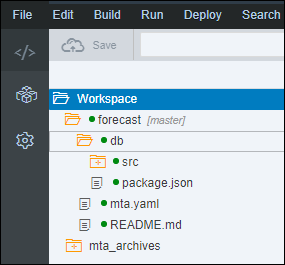
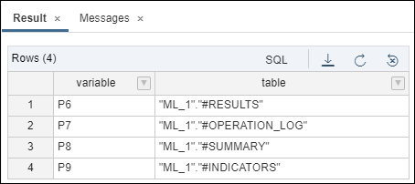

## Prerequisites
 - [Use Machine Learning to Build a Forecasting application using the XS advanced development model](https://developers.sap.com/group.hxe-aa-forecast.html)

## Details
### You will learn
- Understand the basics about the SAP HANA Automated Predictive Library
- How to call SAP HANA Automated Predictive Library functions from an XSA application using an HDI container
- Identify which algorithm options are available in forecasting scenarios
- How to use SAP HANA APL Forecast algorithm from an XSA application using an HDI container

[ACCORDION-BEGIN [Step 1: ](SAP HANA Automated Predictive Library)]

The ***SAP HANA Automated Predictive Library*** (APL) is an ***Application Function Library*** (AFL) which lets you use the data mining capabilities of the ***SAP Predictive Analytics*** automated analytics engine on your SAP HANA stored data.

With the APL, you can create the following types of models to answer your business questions:

- Classification/Regression models
- Clustering models
- Time series analysis models
- Recommendation models
- Social network analysis models

For more details about the SAP HANA APL function, check the online <a href="https://help.sap.com/viewer/cb31bd99d09747089754a0ba75067ed2/latest/en-US/59b79cbb6beb4607875fa3fe116a8eef.html" target="new">documentation</a>.

[DONE]
[ACCORDION-END]

[ACCORDION-BEGIN [Step 1: ](Calling AFL functions from HDI containers)]

In order to use any ***SAP HANA APL*** functions, ultimately an AFL wrapper must be created and then invoked.

Creating and invoking the AFL wrapper is performed by executing ***SAP HANA `SQLScript`***.

Other database objects also need to be created, such as table types or signature table.

There are two techniques for calling APL functions, the ***direct technique*** and the ***procedure technique***.

However, since you are working in an **HDI container** with CDS artifacts, you will be creating an ***AFLLANG procedures*** artefacts to surface the APL functions and call them with table types or signature table defined using design time artifacts, like CDS Entities and others.

For more details, you can check the [AFL Language Procedures](https://help.sap.com/viewer/4505d0bdaf4948449b7f7379d24d0f0d/latest/en-US/7f630904dfe045beb114a6c25896649f.html) documentation.

[DONE]
[ACCORDION-END]

[ACCORDION-BEGIN [Step 1: ](Time Series analysis with SAP HANA APL)]

As stated previously, the ***SAP HANA Automated Predictive Library*** (APL) uses the data mining capabilities provided by the ***SAP Predictive Analytics*** automated analytics engine.

SAP HANA APL provides a ***Forecast*** function that can address Time Series analysis scenarios.

This algorithm will apply and combine several techniques to your data in order to find the best model. Here is are the techniques used:

 - The default technique of the **SAP Predictive Analytics** Automated Analytics engine
 - The exponential smoothing technique
 - The linear regressions technique

For more information please refer to the online <a href="https://help.sap.com/viewer/cb31bd99d09747089754a0ba75067ed2/latest/en-US/6fd6134bd3974edf8392cc540df47d72.html" target="new">documentation</a>.

[DONE]
[ACCORDION-END]

[ACCORDION-BEGIN [Step 1: ](SAP HANA APL Forecast function)]

The **SAP HANA APL** function that you will be using is:

- <a href="https://help.sap.com/viewer/cb31bd99d09747089754a0ba75067ed2/latest/en-US/34ec8a14b4a442a29351bb26bb082e6e.html" target="new"><b>Forecast</b></a>

The ***Forecast*** function provides multiple configuration options like:

Name                         | Description
-----------------------------|-----------------------------
**Time Point Column Name**   | Name of the column in the dataset that contains the time points of the time series
**Horizon**                  | Number of forecast time points
**Last Training Time Point** | Value in the time point column which represents the last point in time for the training dataset
**Cutting Strategy**         | The Cutting Strategy defines how a training set is cut under three subsets (training, validation and testing datasets) when needed. Depending on the model (model type, number of targets ...) not all Cutting Strategies can be used. See Automated Analytics documentation for details. ( **optional**)
**Apply Extra Mode**         | Includes error bars with the forecast values. The error bar columns are `kts_1_lowerlimit_95%` and `kts_1_upperlimit_95%`
**Forecast Method**          | Uses a forecast method different from the default Automated Analytics time-series algorithm ( **optional**)
**Forecast Fallback Method** | Sets the method that will be used if the one specified with **Forecast Method** fails, for example when there are too few data points ( **optional**)
**Smoothing Cycle Length**   | Sets the cycle/seasonal length to be used for the smoothing instead of the cycle length candidates automatically determined by the Automated Analytics engine based on the time granularity, for example: month -> 4 (quarterly) or 12 (yearly). ( **optional**)
**Force Positive Forecast**  | Activates a mode where the negative forecasts are ignored, that is, replaced with zero.
**Forecast Max Cyclic**      | Length of the longest cycle the model will try to detect. Controls the way that the model analyzes the periodicities in the signal. Also limited by the size of the training dataset. You can disable the cyclic analysis by setting this parameter to 0. ( **optional**)
**Forecast Max Lags**        | Defines the maximum dependency of the signal on its own past values. Controls the way that the model analyzes the random fluctuations in the signal. You can set this parameter to 0 to disable the fluctuations analysis. ( **optional**)

[DONE]
[ACCORDION-END]

[ACCORDION-BEGIN [Pre-requisite: ](Install SAP HANA APL package)]

The installation requires you to have access to the system using a SSH client like ***`PuTTY`***, but also to have access to the ***`hxeadm`*** user with ***`sudo`*** rights configured.

To run the download manager you will need Java t be installed on the system.

The installation will trigger a restart of your SAP HANA instance, so make sure to save your current work before.

Once the SAP HANA Automated Predictive Library installation is completed, you will need to wait a few minutes for all services to be back online and proceed with the next step.

So if not done yet, you will need to complete the [SAP HANA Automated Predictive Library installation for SAP HANA, express edition](https://developers.sap.com/tutorials/hxe-ua-apl-binary.html).

[DONE]
[ACCORDION-END]

[ACCORDION-BEGIN [Step 1: ](Open the Web IDE)]

Open the Web IDE, and login using the **`XSA_DEV`** credentials.

Switch to the ***Development*** perspective using the  icon.


As a reminder the default URL for the Web IDE is:

 - `https://hxehost:53075`

A link to the Web IDE can also be found on the ***XSA Controller page*** at:

- `https://hxehost:39030`

[DONE]
[ACCORDION-END]

[ACCORDION-BEGIN [Step 1: ](Create the CDS Table Type Artifacts)]

In order to execute the APL algorithm, a series of table types and entities will be required to process the AFL calls.

These table types maps the input and output table structure for the <a href="https://help.sap.com/viewer/cb31bd99d09747089754a0ba75067ed2/latest/en-US/0bc196486e4047c2a7671ccf529167b6.html" target="new"><b>Create Recommendation Model and Train</b></a> function signature.

Some of these table types are standard whereas some are bound to the dataset structure.

In the left side panel, expand the **`forecast/db/src`** tree node.



Right click on the **`src`** folder and select **New > Folder**.

Enter **`algorithms`** as the folder name, then click on **OK**.

Right click on the **`apl`** folder node from the tree, and select **New > File**.

Enter **`common.hdbcds`** as the file name, then click on **OK**.

This is the full path of the created file:

```
forecast/db/src/algorithms/apl/common.hdbcds
```

Paste the following content:

```JavaScript
namespace aa.forecast.db.algorithms.apl;

context forecast {
    table type tt_function_header {
        "KEY"   : String(50);
        "VALUE" : String(255);
    };
    table type tt_operation_config {
        "KEY"     : String(1000);
        "VALUE"   : LargeString;
        "CONTEXT" : LargeString;
    };
    table type tt_variable_descs {
        "RANK"          : Integer;
        "NAME"          : String(255);
        "STORAGE"       : String(10);
        "VALUETYPE"     : String(10);
        "KEYLEVEL"      : Integer;
        "ORDERLEVEL"    : Integer;
        "MISSINGSTRING" : String(255);
        "GROUPNAME"     : String(255);
        "DESCRIPTION"   : String(255);
        "OID"           : String(255);
    };
    table type tt_variable_roles {
        "NAME"             : String(127);
        "ROLE"             : String(10);
        "COMPOSITION_TYPE" : String(10);
        "COMPONENT_NAME"   : String(127);
        "OID"              : String(50);
    };
    table type tt_operation_log {
        "OID"       : String(50);
        "TIMESTAMP" : UTCTimestamp;
        "LEVEL"     : Integer;
        "ORIGIN"    : String(50);
        "MESSAGE"   : LargeString;
    };
    table type tt_summary {
        "OID"   : String(50);
        "KEY"   : String(100);
        "VALUE" : String(200);
    };
    table type tt_indicators {
        "OID"      : String(50);
        "VARIABLE" : String(255);
        "TARGET"   : String(255);
        "KEY"      : String(100);
        "VALUE"    : LargeString;
        "DETAIL"   : LargeString;
    };
    table type tt_results {
        "signal_time"          : UTCDateTime;
        "signal_value"         : Double;
        "kts_1"                : Double;
        "kts_1_lowerlimit_95%" : Double;
        "kts_1_upperlimit_95%" : Double;
    };
    table type tt_dataset {
        "signal_time"  : UTCDateTime;
        "signal_value" : Double;
    };
    table type tt_dataset_cashflows_extrapredictors {
        "signal_time"               : UTCDateTime;
        "WorkingDaysIndices"        : Integer;
        "ReverseWorkingDaysIndices" : Integer;
        "MondayMonthInd"            : Integer;
        "TuesdayMonthInd"           : Integer;
        "WednesdayMonthInd"         : Integer;
        "ThursdayMonthInd"          : Integer;
        "FridayMonthInd"            : Integer;
        "BeforeLastMonday"          : Integer;
        "LastMonday"                : Integer;
        "BeforeLastTuesday"         : Integer;
        "LastTuesday"               : Integer;
        "BeforeLastWednesday"       : Integer;
        "LastWednesday"             : Integer;
        "BeforeLastThursday"        : Integer;
        "LastThursday"              : Integer;
        "BeforeLastFriday"          : Integer;
        "LastFriday"                : Integer;
        "Last5WDaysInd"             : Integer;
        "Last5WDays"                : Integer;
        "Last4WDaysInd"             : Integer;
        "Last4WDays"                : Integer;
        "LastWMonth"                : Integer;
        "BeforeLastWMonth"          : Integer;
		"signal_value"              : Double;
    };
};
```

Save the file using the  icon from the menu.

[DONE]
[ACCORDION-END]

[ACCORDION-BEGIN [Step 1: ](Create the AFLLANG Procedure Artifact)]

Once the CDS artifacts are created for the entities and table types, you can now surface the AFL function using an AFLLANG procedure.

However, as the Cash Flow dataset includes a series of extra predictors attributes, you will an additional AFLLANG procedure using the a different table type for the input dataset.

In the left side panel, expand the **`forecast/db/src/algorithms/apl`** tree node.

Right click on the **`apl`** folder and select **New > Folder**.

Enter **`afllang`** as the folder name, then click on **OK**.

Right click on the **`afllang`** folder node from the tree, and select **New > File**.

Enter **`forecast.hdbafllangprocedure`** as the file name, then click on **OK**.

This is the full path of the created file:

```
forecast/db/src/algorithms/apl/afllang/forecast.hdbafllangprocedure
```

Paste the following content:

```JSON
{
    "area" : "APL_AREA",
    "function" : "FORECAST",
    "parameters" : [
        { "direction" : "IN",  "type" : "aa.forecast.db.algorithms.apl::forecast.tt_function_header"},
        { "direction" : "IN",  "type" : "aa.forecast.db.algorithms.apl::forecast.tt_operation_config"},
        { "direction" : "IN",  "type" : "aa.forecast.db.algorithms.apl::forecast.tt_variable_descs"},
        { "direction" : "IN",  "type" : "aa.forecast.db.algorithms.apl::forecast.tt_variable_roles"},
        { "direction" : "IN",  "type" : "aa.forecast.db.algorithms.apl::forecast.tt_dataset"},
        { "direction" : "OUT", "type" : "aa.forecast.db.algorithms.apl::forecast.tt_results"},
        { "direction" : "OUT", "type" : "aa.forecast.db.algorithms.apl::forecast.tt_operation_log"},
        { "direction" : "OUT", "type" : "aa.forecast.db.algorithms.apl::forecast.tt_summary"},
        { "direction" : "OUT", "type" : "aa.forecast.db.algorithms.apl::forecast.tt_indicators"}
    ]
}
```

Right click on the **`afllang`** folder node from the tree, and select **New > File**.

Enter **`forecast_CashFlows_extrapredictors.hdbafllangprocedure`** as the file name, then click on **OK**.

This is the full path of the created file:

```
forecast/db/src/hdb/apl/afllang/forecast_CashFlows_extrapredictors.hdbafllangprocedure
```

Paste the following content:

```JSON
{
    "area" : "APL_AREA",
    "function" : "FORECAST",
    "parameters" : [
        { "direction" : "IN",  "type" : "aa.forecast.db.algorithms.apl::forecast.tt_function_header"},
        { "direction" : "IN",  "type" : "aa.forecast.db.algorithms.apl::forecast.tt_operation_config"},
        { "direction" : "IN",  "type" : "aa.forecast.db.algorithms.apl::forecast.tt_variable_descs"},
        { "direction" : "IN",  "type" : "aa.forecast.db.algorithms.apl::forecast.tt_variable_roles"},
        { "direction" : "IN",  "type" : "aa.forecast.db.algorithms.apl::forecast.tt_dataset_cashflows_extrapredictors"},
        { "direction" : "OUT", "type" : "aa.forecast.db.algorithms.apl::forecast.tt_results"},
        { "direction" : "OUT", "type" : "aa.forecast.db.algorithms.apl::forecast.tt_operation_log"},
        { "direction" : "OUT", "type" : "aa.forecast.db.algorithms.apl::forecast.tt_summary"},
        { "direction" : "OUT", "type" : "aa.forecast.db.algorithms.apl::forecast.tt_indicators"}
    ]
}
```

Save the file using the  icon from the menu.

[DONE]
[ACCORDION-END]

[ACCORDION-BEGIN [Step 1: ](Build the SAP HANA Database Module)]

Right click on the **`db`** folder and select **Build**.


The console should display at the end the following message:

```
(Builder) Build of /forecast/db completed successfully.
```

[DONE]
[ACCORDION-END]

[ACCORDION-BEGIN [Step 1: ](Test an AFL Procedure with SQL)]

You can now test the AFL Procedure with the Cash Flow dataset.

Switch to the ***Database Explorer*** perspective using the  icon.


Select **HDI Container** created previously with a name starting with ***`XSA_DEV`***.

Open a new **SQL Console** using the  icon.

Paste the following content in the console, and use the execute icon  from the menu.

### **Drop previously created temporary tables**

```SQL
drop table #function_header;
drop table #operation_config;
drop table #variable_descs;
drop table #variable_roles;

drop table #operation_log;
drop table #summary;
drop table #indicators;
drop table #results;
```

### **Create temporary tables**

```SQL
create local temporary table #function_header  like "aa.forecast.db.algorithms.apl::forecast.tt_function_header";
create local temporary table #operation_config like "aa.forecast.db.algorithms.apl::forecast.tt_operation_config";
create local temporary table #variable_descs   like "aa.forecast.db.algorithms.apl::forecast.tt_variable_descs";
create local temporary table #variable_roles   like "aa.forecast.db.algorithms.apl::forecast.tt_variable_roles";

create local temporary table #operation_log    like "aa.forecast.db.algorithms.apl::forecast.tt_operation_log";
create local temporary table #summary          like "aa.forecast.db.algorithms.apl::forecast.tt_summary";
create local temporary table #indicators       like "aa.forecast.db.algorithms.apl::forecast.tt_indicators";
create local temporary table #results          like "aa.forecast.db.algorithms.apl::forecast.tt_results";
```

### **Set the algorithm parameters**

```SQL
insert into #function_header values ('Oid', '#42');
insert into #function_header values ('LogLevel', '8');

insert into #operation_config values ('APL/TimePointColumnName'   , 'signal_time'              , null);
insert into #operation_config values ('APL/ApplyExtraMode'        , 'Forecasts and Error Bars' , null);
insert into #operation_config values ('APL/LastTrainingTimePoint' , '2001-12-28', null);
insert into #operation_config values ('APL/Horizon'               , '21'        , null);

insert into #variable_descs values (0, 'signal_time'  , 'date'     , 'continuous', 1, 1, null, null, null, null);
insert into #variable_descs values (1, 'signal_value' , 'number'   , 'continuous', 0, 0, null, null, null, null);

insert into  #variable_roles values ('signal_time'  , 'input' , NULL, NULL, '#1');
insert into  #variable_roles values ('signal_value' , 'target', NULL, NULL, '#1');
```

### **Run the algorithm with**

```SQL
call "aa.forecast.db.algorithms.apl.afllang::forecast" (
  #function_header,
  #operation_config,
  #variable_descs,
  #variable_roles,
  "aa.forecast.db.data::CashFlows",
  #results,
  #operation_log,
  #summary,
  #indicators
) with overview;
```

For every function calls, a series of logs and summary data will be provided along with the results as displayed in the result pane:



#### **Check the logs, indicators, summary and results**

##### **The operation log**

When performing an APL operation, especially training or applying a model, the Automated Analytics engine produces status/warning/error messages.

These messages are returned from an APL function through an output database table.

```sql
select * from #operation_log;
```

If you look at the output you will find interesting about the overall modeling process :

 - **Automated model learning**

 Using the following SQL, you can see that the process is actually creating multiple models:

```SQL
select * from #operation_log where message like 'Model%' or message like 'The model %';
```

 - **Outlier detection**

 Using the following SQL, you can see that an outlier detection process is applied at various steps

```SQL
select * from #operation_log where message like '%outlier%';
```

 - **Final Model selection**

 At the end of the process, you will get details about the selected model, its performance, and components (trend, fluctuation, cycles, etc.)

```
The final model is (Sum(Regression[CASH][CASHDATE,SquareTime,SquareRootTime],Sum(dayOfMonth(NotSmoothed)))).
The final model maximal horizon is (21), its complexity is (4).
The final model Minimum Pearson (P2) over the horizon is (0.16883962105749536), its cumulative mean square error is (69473.283402336485).
Other performance indicators for the final model are: L1=(39846.556124256829) and MAPE=(5.3496095143430846).
Fit performance on validation: P2=0.16883962105749536 L2=3308.2515905874502
Last forecast(=21) performance on validation: \tP2=0.16883962105749536 L2=3308.2515905874502
Chosen model is (Polynomial)
Chosen trend is (Polynom( CASHDATE))
Chosen periodicity is (dayOfMonth(NotSmoothed))
No modeled fluctuations
Time series learning phase finished
Learning time: 2 seconds
Total elapsed time: 2 seconds.
Checking internal state.
Beginning of applying model. Please wait...
Total elapsed time: 0 seconds.
```

#### **The summary**

When training or applying a model, debriefing information related to the operation is produced which  is known as the summary.

This information includes a set of indicators, provided as string pairs { KEY, VALUE }.

The details are also provided as part of the operation logs.

```sql
select * from #summary;
```

One of the interesting information here is the **`ModelTimeSeriesMAPE`** which inform you about the overall prediction performance.

With the current setting the value is around **0.25**.

#### **The indicators**

When training, testing or querying a model, it's possible to retrieve variable indicators (i.e. variable statistics).

For each variable, a collection of indicators may be retrieved. These indicators are described using the following attributes: { variable name, indicator name, indicator value, indicator detail (when applicable) }.

```sql
select * from #indicators;
```

With the Forecast algorithm, you can get the following indicators:

 - Time Series components (Trends, Cycles & Fluctuations)
 - The MAPE (Mean Absolute Percentage Error) for each forecasted values
 - A set of statistical information about the signal

More importantly, using the following SQL, you will be able to check the Time Series components detected for you models:  

```sql
select oid, key, max(to_nvarchar(value)) as value
from #indicators
where key in ('Trend', 'Fluctuations', 'Cycles', 'MAPE')
group by oid, key
order by key;
```

#### **The results**

From this model, you can now check the result which are stored in the **`apl_cashflow_result`** table using the following SQL:

```SQL
select
      c."signal_time"
    , c."signal_value"
    , "kts_1"                as "forecast"
    , "kts_1_lowerlimit_95%" as "lower_limit"
    , "kts_1_upperlimit_95%" as "upper_limit"
from
     "aa.forecast.db.data::CashFlows" c
join #results f
on   c."signal_time" = f."signal_time"
order by c."signal_time" asc;
```

You can notice that:

 - The forecast ( **`kts_1`** value) is provided for almost all data points in the training set (where cash is not null).
 However, this is not always the case. A forecast ( **`kts_1`** value) is provided only for data points that are finally used during the training as all input data points are not always used in the final model.
 - The error bar (**`kts_1_lowerlimit_95%`** and **`kts_1_upperlimit_95%`**) are only provided for the actual predictions

Here is a graphical representation of the results:


Where you have:

 - the training data set (green)
 - the forecasted values (blue)
 - the error bar (red)

[VALIDATE_1]
[ACCORDION-END]

[ACCORDION-BEGIN [Step 1: ](Commit your changes)]

On the icon bar located on the right side of the Web IDE, click on the **Git Pane** icon .

Click on **Stage All**, enter a commit comment, then click on **Commit and Push > origin master**.

[DONE]
[ACCORDION-END]
