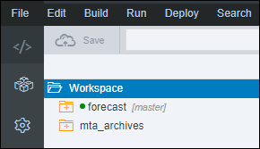
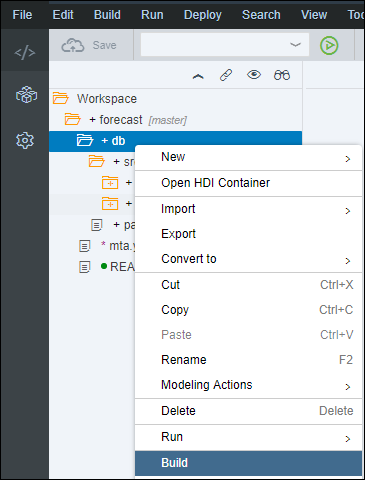
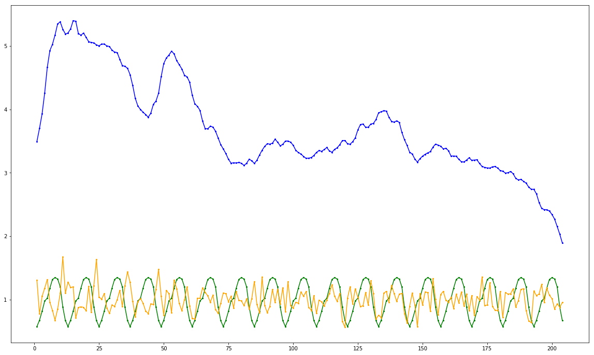

## Prerequisites
 - [Use Machine Learning to Build a Forecasting application using the XS advanced development model](https://www.sap.com/developer/tutorials.html?/groups/hxe-aa-forecast.html)

## Next Steps
 - [Use Machine Learning to Build a Forecasting application using the XS advanced development model](https://www.sap.com/developer/tutorials.html?/groups/hxe-aa-forecast.html)

## Details
### You will learn
- Understand the basics about the SAP HANA Predictive Analytics Library
- How to call SAP HANA Predictive Analytics Library functions from an XSA application and an HDI container
- Identify which algorithm options are available for recommendation engines
- How to use SAP HANA APL algorithms from an XSA application and an HDI container

[ACCORDION-BEGIN [Step 1: ](SAP HANA Predictive Analytics Library)]

The ***SAP HANA Predictive Analytics Library*** (PAL) is an ***Application Function Library*** (AFL) which defines a set of functions that can be called from within ***SAP HANA SQL Script*** (an extension of SQL) to perform analytic algorithms.

The Predictive Analysis Library (PAL) defines functions that can be called from within ***SQL Script*** procedures to perform analytic algorithms and includes classic and universal predictive analysis algorithms in the following data-mining categories:

- Clustering
- Classification
- Regression
- Association
- Time Series
- Preprocessing
- Statistics
- Social Network Analysis
- Miscellaneous

With over 90 algorithm functions across the above data-mining categories, the ***SAP HANA Predictive Analytics Library*** has been built and enhanced upon on the following goals:

- provide the required algorithms for SAP HANA applications features
- provide the most commonly used algorithms based on market surveys
- provide a set of algorithms generally available in other database or processing platforms

For more details about the PAL function, check the online <a href="https://help.sap.com/viewer/2cfbc5cf2bc14f028cfbe2a2bba60a50/latest/en-US/f652a8186a144e929a1ade7a3cb7abe8.html" target="new">documentation</a>..

[DONE]
[ACCORDION-END]

[ACCORDION-BEGIN [Step 1: ](Calling AFL functions from HDI containers)]

In order to use an ***SAP HANA PAL*** function in SAP HANA, ultimately an AFL wrapper must be created and then invoked.

Creating and invoking the AFL wrapper is performed by executing ***SAP HANA `SQLScript`***.

Other database objects also need to be created, such as table types or signature table.

Just like with the SAP HANA APL, there are two techniques for calling APL functions, the ***direct technique*** and the ***procedure technique***.

However, since you are working in an HDI container with CDS artifacts, you will be creating AFLLANG procedures to surface the APL functions.

Therefore, you won't need to create table types or signature table using SQL, but using design time artifacts, like CDS Entities and others.

[DONE]
[ACCORDION-END]


[ACCORDION-BEGIN [Step 1: ](Time Series with SAP HANA PAL)]

As stated above, the ***SAP HANA Predictive Analytics Library*** (PAL) delivers over a hundred of ***best in class industry standard*** algorithms.

There are multiple Time Series algorithms that can be used in PAL, but here are the one you will be looking at:

 - **ARIMA** (Auto Regressive Integrated Moving Average)
 - **Auto ARIMA**: identifies the orders of an ARIMA model
 - **Single Exponential Smoothing**: suitable to model the time series without a trend and a seasonal component.
 - **Double Exponential Smoothing**: suitable to model the time series with a trend but without a seasonal component.
 - **Triple Exponential Smoothing**: suitable to model the time series containing a trend and a seasonal component.
 - **Auto Exponential Smoothing**: calculate optimal parameters for Single, Double and Triple Exponential Smoothing functions

However, before selecting one, you will need to address the existence of a trend, a seasonal component or white noise which can be achieved using the **Seasonality Test** function.

[DONE]
[ACCORDION-END]

[ACCORDION-BEGIN [Step 1: ](SAP HANA PAL xxxXXXxxx function)]

[DONE]
[ACCORDION-END]

[ACCORDION-BEGIN [Step 1: ](Open the Web IDE)]

Open the Web IDE, and login using the **`XSA_DEV`** credentials.

Switch to the ***Development*** perspective using the  icon.



As a reminder the default URL for the Web IDE is:

 - `https://hxehost:53075`

A link to the Web IDE can also be found on the ***XSA Controller page*** at:

- `https://hxehost:39030`

[DONE]
[ACCORDION-END]

[ACCORDION-BEGIN [Step 1: ](Create the CDS Table Type Artifacts)]

In order to execute the APL algorithm, a series of table types and entities will be required to process the AFL calls.

These table types maps the input and output table structure for the <a href="https://help.sap.com/viewer/cb31bd99d09747089754a0ba75067ed2/latest/en-US/0bc196486e4047c2a7671ccf529167b6.html" target="new"><b>Create Recommendation Model and Train</b></a> function signature.

Some of these table types are standard whereas some are bound to the dataset structure.

In the left side panel, expand the **`forecast/db/src`** tree node.


Right click on the **`src`** folder and select **New > Folder**.

Enter **`algorithms`** as the folder name, then click on **OK**.

Right click on the **`pal`** folder node from the tree, and select **New > File**.

Enter **`commmon.hdbcds`** as the file name, then click on **OK**.

This is the full path of the created file:

```
forecast/db/src/algorithms/pal/commmon.hdbcds
```

Paste the following content:

```JavaScript
namespace aa.forecast.db.algorithms.pal;

context common {
    table type tt_parameter {
        "param_name"   : String(1000);
        "int_value"    : Integer;
        "double_value" : Double;
        "string_value" : String(255);
    };
    table type tt_dataset {
        "signal_time"  : Integer;
        "signal_value" : Double;
    };
    table type tt_statistics {
        "stat_name"  : String(100);
        "stat_value" : String(100);
    };
};

context seasonality_test {
    table type tt_output {
        "signal_time" : Integer;
        "seasonal"    : Double;
        "trend"       : Double;
        "random"      : Double;
    };
};

context smoothing {
    table type tt_output_raw {
        "signal_time"  : Integer;
        "forecast"     : Double;
        "lowerlimit_1" : Double;
        "upperlimit_1" : Double;
        "lowerlimit_2" : Double;
        "upperlimit_2" : Double;
    };
    table type tt_output {
        "signal_time"  : Integer;
        "signal_value" : Double;
        "forecast"     : Double;
        "lowerlimit_1" : Double;
        "upperlimit_1" : Double;
        "lowerlimit_2" : Double;
        "upperlimit_2" : Double;
    };
};

context arima {
    table type tt_model {
        "key"   : String(100);
        "value" : String(5000);
    };
    table type tt_fit {
        "signal_time" : Integer;
        "fitted"      : Double;
        "residuals"   : Double;
    };
    table type tt_output_raw {
        "signal_time"    : Integer;
        "forecast"       : Double;
        "standard_error" : Double;
        "lowerlimit_80"  : Double;
        "upperlimit_80"  : Double;
        "lowerlimit_95"  : Double;
        "upperlimit_95"  : Double;
    };
    table type tt_output {
        "signal_time"    : Integer;
        "signal_value"   : Double;
        "forecast"       : Double;
        "standard_error" : Double;
        "lowerlimit_80"  : Double;
        "upperlimit_80"  : Double;
        "lowerlimit_95"  : Double;
        "upperlimit_95"  : Double;
    };
};
```

Save the file using the  icon from the menu.

[DONE]
[ACCORDION-END]

[ACCORDION-BEGIN [Step 1: ](Create the AFLLANG Procedure Artifact)]

Once the CDS artifacts are created for the entities and table types, you can now surface the AFL function using an AFL procedure.

In the left side panel, expand the **`forecast/db/src/hdb/pal`** tree.


Right click on the **`pal`** folder node from the tree, and select **New > Folder**.

Enter **`afllang`** as the folder name, then click on **OK**.

### **Seasonality Test**

Right click on the **`afllang`** folder and select **New > File**.

Enter **`seasonality_test.hdbafllangprocedure`** as the file name, then click on **OK**.

This is the full path of the created file:

```
forecast/db/src/hdb/pal/afllang/seasonality_test.hdbafllangprocedure
```

Paste the following content:

```JSON
{
    "area" : "AFLPAL",
    "function" : "SEASONALITYTEST_ANY",
    "parameters" : [
        {  "direction" : "IN",  "type" : "aa.forecast.db.algorithms.pal::common.tt_dataset"},
        {  "direction" : "IN",  "type" : "aa.forecast.db.algorithms.pal::common.tt_parameter"},
        {  "direction" : "OUT", "type" : "aa.forecast.db.algorithms.pal::common.tt_statistics"},
        {  "direction" : "OUT", "type" : "aa.forecast.db.algorithms.pal::seasonality_test.tt_output"}
    ]
}
```

Save the file using the  icon from the menu.

### **Auto Exponential Smoothing**

Right click on the **`afllang`** folder and select **New > File**.

Enter **`auto_smoothing.hdbafllangprocedure`** as the file name, then click on **OK**.

This is the full path of the created file:

```
forecast/db/src/hdb/pal/afllang/auto_smoothing.hdbafllangprocedure
```

Paste the following content:

```JSON
{
    "area" : "AFLPAL",
    "function" : "FORECASTSMOOTHING_ANY",
    "parameters" : [
        {  "direction" : "IN",  "type" : "aa.forecast.db.algorithms.pal::common.tt_dataset"},
        {  "direction" : "IN",  "type" : "aa.forecast.db.algorithms.pal::common.tt_parameter"},
        {  "direction" : "OUT", "type" : "aa.forecast.db.algorithms.pal::smoothing.tt_output_raw"},
        {  "direction" : "OUT", "type" : "aa.forecast.db.algorithms.pal::common.tt_statistics"}
    ]
}
```

Save the file using the  icon from the menu.

### **Auto ARIMA**

Right click on the **`afllang`** folder and select **New > File**.

Enter **`auto_arima.hdbafllangprocedure`** as the file name, then click on **OK**.

This is the full path of the created file:

```
forecast/db/src/hdb/pal/afllang/auto_arima.hdbafllangprocedure
```

Paste the following content:

```JSON
{
    "area" : "AFLPAL",
    "function" : "AUTOARIMA_ANY",
    "parameters" : [
        {  "direction" : "IN",  "type" : "aa.forecast.db.algorithms.pal::common.tt_dataset"},
        {  "direction" : "IN",  "type" : "aa.forecast.db.algorithms.pal::common.tt_parameter"},
        {  "direction" : "OUT", "type" : "aa.forecast.db.algorithms.pal::arima.tt_model"},
        {  "direction" : "OUT", "type" : "aa.forecast.db.algorithms.pal::arima.tt_fit"}
    ]
}
```

Save the file using the  icon from the menu.

### **ARIMA Forecasting**

Right click on the **`afllang`** folder and select **New > File**.

Enter **`auto_arima_forecast.hdbafllangprocedure`** as the file name, then click on **OK**.

This is the full path of the created file:

```
forecast/db/src/hdb/pal/afllang/auto_arima_forecast.hdbafllangprocedure
```

Paste the following content:

```JSON
{
    "area" : "AFLPAL",
    "function" : "ARIMAFORECAST_ANY",
    "parameters" : [
        {  "direction" : "IN",  "type" : "aa.forecast.db.algorithms.pal::common.tt_dataset"},
        {  "direction" : "IN",  "type" : "aa.forecast.db.algorithms.pal::arima.tt_model"},
        {  "direction" : "IN",  "type" : "aa.forecast.db.algorithms.pal::common.tt_parameter"},
        {  "direction" : "OUT", "type" : "aa.forecast.db.algorithms.pal::arima.tt_output_raw"}
    ]
}
```

Save the file using the  icon from the menu.

[DONE]
[ACCORDION-END]

[ACCORDION-BEGIN [Step 1: ](Create the SQL View Artifact)]

When using PAL function for Time Series, the input dataset must be indexed using an integer value and not a ***real*** timestamp compare to APL function.

Therefore, to accommodate this, you will need to create a series of SQL views.

In the left side panel, expand the **`forecast/db/src/hdb/pal`** tree.


Right click on the **`pal`** folder node from the tree, and select **New > Folder**.

Enter **`views`** as the folder name, then click on **OK**.

### **Cash Flows**

Right click on the **`views`** folder and select **New > File**.

Enter **`CashFlows.hdbview`** as the file name, then click on **OK**.

This is the full path of the created file:

```
forecast/db/src/hdb/pal/views/CashFlows.hdbview
```

Paste the following content:

```JSON
VIEW "aa.forecast.db.algorithms.pal.views::CashFlows" as
    select
        to_int(rank() over (order by "signal_time" asc)) as "signal_time",
        "signal_value"
    from
        "aa.forecast.db.data::CashFlows"
    where
        "signal_value" is not null
    order by 1 asc
```

Save the file using the  icon from the menu.

Right click on the **`views`** folder and select **New > File**.

Enter **`CashFlows_extrapredictors.hdbview`** as the file name, then click on **OK**.

This is the full path of the created file:

```
forecast/db/src/hdb/pal/views/CashFlows_extrapredictors.hdbview
```

Paste the following content:

```JSON
VIEW "aa.forecast.db.algorithms.pal.views::CashFlows_extrapredictors" as
    select
        to_int(rank() over (order by "signal_time" asc)) as "signal_time",
        "signal_value",
        "WorkingDaysIndices",
        "ReverseWorkingDaysIndices",
        "MondayMonthInd",
        "TuesdayMonthInd",
        "WednesdayMonthInd",
        "ThursdayMonthInd",
        "FridayMonthInd",
        "BeforeLastMonday",
        "LastMonday",
        "BeforeLastTuesday",
        "LastTuesday",
        "BeforeLastWednesday",
        "LastWednesday",
        "BeforeLastThursday",
        "LastThursday",
        "BeforeLastFriday",
        "LastFriday",
        "Last5WDaysInd",
        "Last5WDays",
        "Last4WDaysInd",
        "Last4WDays",
        "LastWMonth",
        "BeforeLastWMonth"
    from
        "aa.forecast.db.data::CashFlows_extrapredictors"
    where
        "signal_value" is not null
    order by 1 asc
```

Save the file using the  icon from the menu.

### **Ozone**

Right click on the **`views`** folder and select **New > File**.

Enter **`Ozone.hdbview`** as the file name, then click on **OK**.

This is the full path of the created file:

```
forecast/db/src/hdb/pal/views/Ozone.hdbview
```

Paste the following content:

```JSON
VIEW "aa.forecast.db.algorithms.pal.views::Ozone" as
    select
        to_int(rank() over (order by "signal_time" asc)) as "signal_time",
        "signal_value"
    from
        "aa.forecast.db.data::Ozone"
    where
        "signal_value" is not null
    order by 1 asc
```

### **Lag 1 And Cycles**

Right click on the **`views`** folder and select **New > File**.

Enter **`Lag1AndCycles.hdbview`** as the file name, then click on **OK**.

This is the full path of the created file:

```
forecast/db/src/hdb/pal/views/Lag1AndCycles.hdbview
```

Paste the following content:

```JSON
VIEW "aa.forecast.db.algorithms.pal.views::Lag1AndCycles" as
    select
        to_int(rank() over (order by "signal_time" asc)) as "signal_time",
        "signal_value"
    from
        "aa.forecast.db.data::Lag1AndCycles"
    where
        "signal_value" is not null
    order by 1 asc
```

Save the file using the  icon from the menu.

Right click on the **`views`** folder and select **New > File**.

Enter **`Lag1AndCyclesAndWn.hdbview`** as the file name, then click on **OK**.

This is the full path of the created file:

```
forecast/db/src/hdb/pal/views/Lag1AndCyclesAndWn.hdbview
```

Paste the following content:

```JSON
VIEW "aa.forecast.db.algorithms.pal.views::Lag1AndCyclesAndWn" as
    select
        to_int(rank() over (order by "signal_time" asc)) as "signal_time",
        "signal_value"
    from
        "aa.forecast.db.data::Lag1AndCyclesAndWn"
    where
        "signal_value" is not null
    order by 1 asc
```

Save the file using the  icon from the menu.

### **Trend And Cycles**

Right click on the **`views`** folder and select **New > File**.

Enter **`TrendAndCyclic.hdbview`** as the file name, then click on **OK**.

This is the full path of the created file:

```
forecast/db/src/hdb/pal/views/TrendAndCyclic.hdbview
```

Paste the following content:

```JSON
VIEW "aa.forecast.db.algorithms.pal.views::TrendAndCyclic" as
    select
        to_int(rank() over (order by "signal_time" asc)) as "signal_time",
        "signal_value"
    from
        "aa.forecast.db.data::TrendAndCyclic"
    where
        "signal_value" is not null
    order by 1 asc
```

Save the file using the  icon from the menu.

Right click on the **`views`** folder and select **New > File**.

Enter **`TrendAndCyclicAndWn.hdbview`** as the file name, then click on **OK**.

This is the full path of the created file:

```
forecast/db/src/hdb/pal/views/TrendAndCyclicAndWn.hdbview
```

Paste the following content:

```JSON
VIEW "aa.forecast.db.algorithms.pal.views::TrendAndCyclicAndWn" as
    select
        to_int(rank() over (order by "signal_time" asc)) as "signal_time",
        "signal_value"
    from
        "aa.forecast.db.data::TrendAndCyclicAndWn"
    where
        "signal_value" is not null
    order by 1 asc
```

Save the file using the  icon from the menu.

Right click on the **`views`** folder and select **New > File**.

Enter **`TrendAndCyclicAnd_4Wn.hdbview`** as the file name, then click on **OK**.

This is the full path of the created file:

```
forecast/db/src/hdb/pal/views/TrendAndCyclicAnd_4Wn.hdbview
```

Paste the following content:

```JSON
VIEW "aa.forecast.db.algorithms.pal.views::TrendAndCyclicAnd_4Wn" as
    select
        to_int(rank() over (order by "signal_time" asc)) as "signal_time",
        "signal_value"
    from
        "aa.forecast.db.data::TrendAndCyclicAnd_4Wn"
    where
        "signal_value" is not null
    order by 1 asc
```

Save the file using the  icon from the menu.

[DONE]
[ACCORDION-END]

[ACCORDION-BEGIN [Step 1: ](Build the SAP HANA Database Module)]

Right click on the **`db`** folder and select **Build**.



The console should display at the end the following message:

```
(Builder) Build of /forecast/db completed successfully.
```

[DONE]
[ACCORDION-END]

[ACCORDION-BEGIN [Step 1: ](Test an AFL Procedure with SQL)]

You can now test one of the AFL Procedure like the seasonality test with the Cash Flow dataset.

Switch to the ***Database Explorer*** perspective using the  icon.


Select **HDI Container** created previously with a name starting with ***`XSA_DEV`***.

Open a new **SQL Console** using the  icon.

Paste the following content in the console, and use the execute icon  from the menu.

### **Drop previously created temporary tables**

```SQL
drop table #function_parameter;
drop table #seasonality_statistics;
drop table #decomposed_seasonality;
```

### **Create temporary tables**

```SQL
create local temporary table #function_parameter      like "aa.forecast.db.algorithms.pal::common.tt_parameter";
create local temporary table #seasonality_statistics  like "aa.forecast.db.algorithms.pal::common.tt_statistics";
create local temporary table #decomposed_seasonality  like "aa.forecast.db.algorithms.pal::seasonality_test.tt_output";
```

### **Set the algorithm parameters**

```SQL
insert into #function_parameter values ('ALPHA' , null , 0.2, null);
```

### **Seasonality Test on Cash flow**

You can now test the Cash Flow with the seasonality test function using the following SQL:

```sql
call "aa.forecast.db.algorithms.pal.afllang::seasonality_test" (
  "aa.forecast.db.algorithms.pal.views::CashFlows",
  #function_parameter,
  #seasonality_statistics,
  #decomposed_seasonality
) with overview;
```

#### **Results**

The output results will provide you a series of statistical indicator about the test and the decomposed signal.

##### **The statistics**

The output statistics will provide you the following details:

**Key**  | **Description**
---------|-------------
type     | The decomposition model (additive or multiplicative)
period   | The length of seasonality cycle
ACF      | The auto correlation factor

```sql
select * from #seasonality_statistics;
```

The result should be:

| Key    | Value
|--------|-------------
| type   | additive
| period | 20
| ACF    | 0.340072

##### **The decomposed signal**

The decomposed signal will provide you value of the seasonal, the trend and the random component.

```sql
select * from #decomposed_seasonality;
```

Here is a graphical representation of the results:


Where you have:

 - the seasonal component (green)
 - the trend component (blue)
 - the random component (orange)

##### **Conclusion**

As the test demonstrated that the data embeds a seasonal component some algorithm like Single and Double Smooth Exponential will not provide good results.

A few interesting information can be extracted here:

 - the seasonal cycle length is 20
 - the decomposition is additive

In some situation, you might be tempted to separately model the decomposed trend and random and add it back manual to the seasonal component in order to produce your forecast, but some algorithms can achieve that for you.

### **Seasonality Test on Ozone**

```sql
call "aa.forecast.db.algorithms.pal.afllang::seasonality_test" (
  "aa.forecast.db.algorithms.pal.views::Ozone",
  #function_parameter,
  #seasonality_statistics,
  #decomposed_seasonality
) with overview;
```

#### **Results**

##### **The statistics**

```sql
select * from #seasonality_statistics;
```

##### **The decomposed signal**

```sql
select * from #decomposed_seasonality;
```

Here is a graphical representation of the results:



Where you have:

 - the seasonal component (green)
 - the trend component (blue)
 - the random component (orange)

##### **Conclusion**

A few interesting information can be extracted here:

 - the seasonal cycle length is 12
 - the decomposition is multiplicative

Provide an answer to the question below then click on **Validate**.

[VALIDATE_1]
[ACCORDION-END]

[ACCORDION-BEGIN [Step 1: ](Commit your changes)]

On the icon bar located on the right side of the Web IDE, click on the **Git Pane** icon .

Click on **Stage All**, enter a commit comment, then click on **Commit and Push > origin master**.

[DONE]
[ACCORDION-END]
