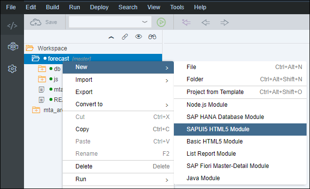
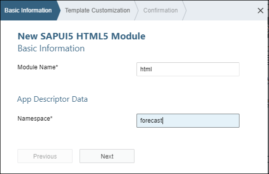
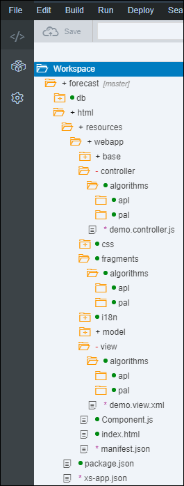
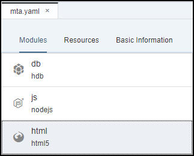
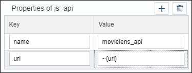
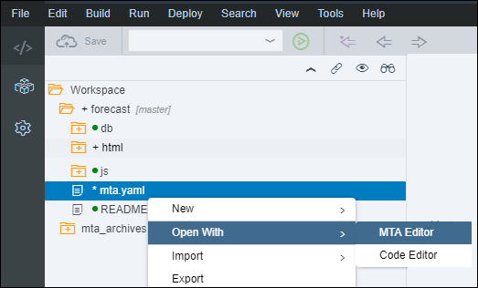
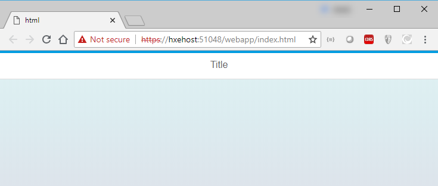

## Prerequisites
 - [Use Machine Learning to Build a Forecasting application using the XS advanced development model](https://developers.sap.com/group.hxe-aa-forecast.html)

## Prerequisites
 - **Proficiency:** Beginner

## Details
### You will learn
 - Create a SAPUI5 HTML Module
 - Add a dependency to the Node.js Module as a destination
 - Run your SAPUI5 application

**Note:** The intent of the following tutorials is not to focus on SAPUI5 but to use it as mean to execute the SAP Predictive services.
For more content on SAPUI5, you can check the dedicated <a href="https://sapui5.hana.ondemand.com/#/topic/3da5f4be63264db99f2e5b04c5e853db" target="new">tutorials</a> section available on the <a href="https://sapui5.hana.ondemand.com" target="new">SAPUI5 documentation</a>.

### Time to Complete
**25 Min**

[ACCORDION-BEGIN [Step 1: ](Open the Web IDE)]

Open the Web IDE, and login using the **`XSA_DEV`** credentials.

Switch to the ***Development*** perspective using the  icon.


As a reminder the default URL for the Web IDE is:

 - `https://hxehost:53075`

A link to the Web IDE can also be found on the ***XSA Controller page*** at:

- `https://hxehost:39030`

[DONE]
[ACCORDION-END]

[ACCORDION-BEGIN [Step 1: ](Create a SAPUI5 HTML Module)]

In the left panel, right click on the `forecast` project, then select **New > SAPUI5 HTML Module**.



Enter the following information, then click on **Next**

Field Name          | Value
------------------- | --------------
Module Name         | `html`
Namespace           | `forecast`



Enter the following information, then click on **Finish**

Field Name          | Value
------------------- | --------------
View Type           | `XML`
View Name           | `demo`


[DONE]
[ACCORDION-END]

[ACCORDION-BEGIN [Step 1: ](Create the folder structure)]

Expand the **`forecast/html/resources/webapp/`** folder.

Create the following folder structure:

```
|-- forecast/html/resources/webapp/
  |-- base
  |   |-- algorithms
  |-- controller
  |   |-- algorithms
  |      |-- apl
  |      |-- pal
  |-- fragment
  |   |-- algorithms
  |   |  |-- apl
  |   |  |-- pal
  |   |-- data
  |-- model
  |   |-- algorithms
  |      |-- apl
  |      |-- pal
  |-- view
  |   |-- algorithms
  |      |-- apl
  |      |-- pal
```



[DONE]
[ACCORDION-END]

[ACCORDION-BEGIN [Step 1: ](Add Module Dependencies)]

In order to consume the XS OData service from the Node.js Module created previously, you will need to add a dependency from the SAPUI5 HTML Module to the Node.js Module.

Open the **`mta.yaml`** file located in the **`forecast`** project folder.


Select the **`html`** module.



Under the **Requires** section, add your ***Node.js API provider*** (most likely named **`js_api` (provider)**).

Set the **Group** value to **destinations**.


Add the following properties to the **`js_api`** entry:

Key                 | Value
------------------- | --------------
`name`              | `forecast_api`
`url`               | `~{url}`
`timeout`           | 3000000



Save the file using the  icon from the menu.

[DONE]
[ACCORDION-END]

[ACCORDION-BEGIN [Step 1: ](Validate your changes)]

Open the **`mta.yaml`** file located in the `forecast` project folder using the **Code editor**.



Provide an answer to the question below then click on **Validate**.

[VALIDATE_1]
[ACCORDION-END]

[ACCORDION-BEGIN [Step 1: ](Run the application)]

Select the **`html`** module, then click on the execute icon  from the menu bar.

Once the application is started, the application will open in a new tab/window or you can click on the application URL:


This will open a web page with the following content:



[DONE]
[ACCORDION-END]

[ACCORDION-BEGIN [Step 1: ](Commit your changes)]

On the icon bar located on the right side of the Web IDE, click on the **Git Pane** icon .

Click on **Stage All**, enter a commit comment, then click on **Commit and Push > origin master**.

[DONE]
[ACCORDION-END]
