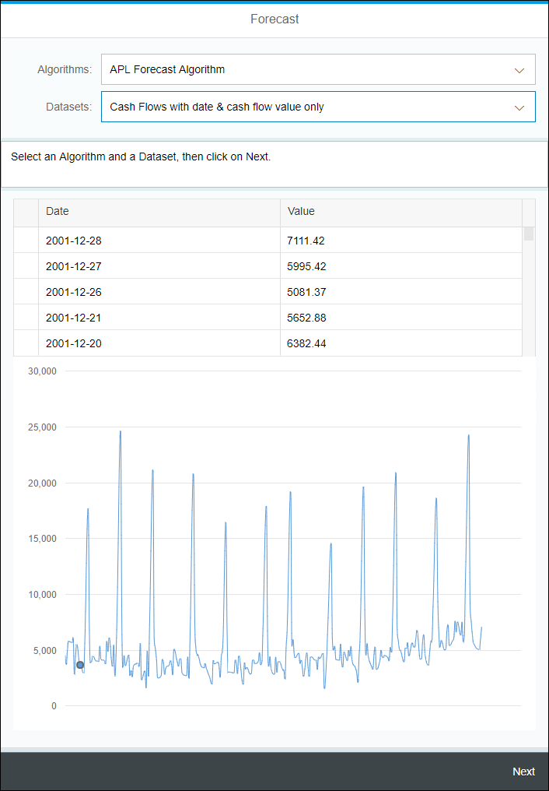

## Details
### You will learn
- How to use inheritance in controller
- How use JSON models
- Create and use Formatters
- Configure the Application Router
- Configure the Application Manifest
- Create and use Fragments (including Pop Over)
- How to use an XS OData service (sorting and filtering) in a table and a `VizFrame`

[ACCORDION-BEGIN [Step 1: ](Open the Web IDE)]

Open the Web IDE, and login using the **`XSA_DEV`** credentials.

Switch to the ***Development*** perspective using the  icon.


As a reminder the default URL for the Web IDE is:

 - `https://hxehost:53075`

A link to the Web IDE can also be found on the ***XSA Controller page*** at:

- `https://hxehost:39030`

[DONE]
[ACCORDION-END]

[ACCORDION-BEGIN [Step 1: ](Create a Base Controller)]

In order to reuse some JavaScript functions over different controllers, you will define a ***base*** controller that will be reused over replacing the ***`sap/ui/core/mvc/Controller`*** controller.

In the left side panel, expand the **`forecast/html/resources/webapp/base`** tree node.

Right click on the **`base`** folder node from the tree, and select **New > File**.

Enter **`Controller.js`** as the file name, then click on **OK**.


The default application controller is located in:

 - **`forecast/html/resources/webapp/base/Controller.js`**

These updates are made in preparation for the next steps.

Open the **`Controller.js`** file and paste the following code:

```js
sap.ui.define([
	"sap/ui/core/mvc/Controller",
	"sap/ui/core/routing/History",
	"sap/ui/model/Filter",
	"sap/ui/model/FilterOperator",
	"sap/m/MessageBox",
	"forecast/html/model/formatter"
], function(Controller, History, Filter, FilterOperator, MessageBox, formatter) {
	"use strict";
	return Controller.extend("forecast.html.base.controller", {
		formatter: formatter,
		getRouter: function() {
			return sap.ui.core.UIComponent.getRouterFor(this);
		},
		onPressNext: function() {
			var config = this.getView().getModel("config").getData();
			var to = config.selectedAlgorithmKey;
			if (to) {
				this.getRouter().navTo(to);
			}
		},
		onNavHome: function() {
			this.getRouter().navTo("home");
		},
		disableDatasetSelectItems: function(library) {
			var defaultConfig = this.getView().getModel("default").getData();
			var datasets = defaultConfig.datasets.list;
			var items = [];
			for (var i = 0; i < datasets.length; i++) {
				if (datasets[i].libraries) {
					for (var j = 0; j < datasets[i].libraries.length; j++) {
						if (datasets[i].libraries[j].key === library) {
							items.push(datasets[i]);
						}
					}
				}
			}
			this.getView().getModel("default").setProperty("/datasets/items", items);
		},
		setVizParams: function(idODataService, filterNullValue) {
			var oTable = this.getView().byId("table");
			if (oTable) {
				var oTableSettings = oTable.getRowSettingsTemplate();
				var oSorter = new sap.ui.model.Sorter({
					path: "signal_time",
					descending: true
				});
				var filters = [];
				if (filterNullValue) {
					filters.push(new Filter("signal_value", FilterOperator.NE, null));
				}
				oTable.bindAggregation("rows", {
					path: "odata>/" + idODataService,
					sorter: oSorter,
					filters: filters
				});
				oTable.setRowSettingsTemplate(oTableSettings);
			}
			var oVizFlattenDataSet = this.getView().byId("viz_ds");
			if (oVizFlattenDataSet) {
				oVizFlattenDataSet.bindData("odata>/" + idODataService);
			}
			this.setVizProperties("viz_frame", "popover");
		},
		setVizProperties: function(idVizFrame, idPopover) {
			var defaultConfig = this.getView().getModel("default").getData();
			var oVizFrame = this.getView().byId(idVizFrame);
			if (oVizFrame) {
				var oPopOver = this.getView().byId(idPopover);
				oPopOver.connect(oVizFrame.getVizUid());
				var vizProperties = defaultConfig.vizProperties;
				oVizFrame.setVizProperties(vizProperties);
			}
		}
	});
});
```

Save the file using the  icon from the menu.

[DONE]
[ACCORDION-END]

[ACCORDION-BEGIN [Step 1: ](Create JSON Model)]

In order to drive some of the UI elements, you will define a JSON model. This model will hold the display list for the algorithm and dataset selection.

In the left side panel, expand the **`forecast/html/resources/webapp/model`** tree node.

Right click on the **`model`** folder node from the tree, and select **New > File**.

Enter **`config.json`** as the file name, then click on **OK**.

This is the full path of the created file:

```
forecast/html/resources/webapp/model/config.json
```

Paste the following content:

```JavaScript
 {
 	"enableSelectAlgorithm": true,
 	"enableSelectDataset": false,
 	"enableNext": false
 }
```

Save the file using the  icon from the menu.


Enter **`default.json`** as the file name, then click on **OK**.

This is the full path of the created file:

```
forecast/html/resources/webapp/model/default.json
```

Paste the following content:

```JavaScript
{
	"algorithms": {
		"label": "Algorithms",
		"description": "Select an algorithm",
		"items": [{
			"key": "forecast",
			"library": "apl",
			"label": "APL Forecast Algorithm"
		}, {
			"key": "auto_arima",
			"library": "pal",
			"label": "PAL Auto ARIMA"
		}, {
			"key": "auto_smoothing",
			"library": "pal",
			"label": "PAL Auto Exponential Smoothing"
		}, {
			"key": "seasonality_test",
			"library": "pal",
			"label": "PAL Seasonality Test"
		}]
	},
	"datasets": {
		"label": "Datasets",
		"description": "Select a dataset",
		"list": [{
			"key": "CashFlows",
			"label": "Cash Flows with date & cash flow value only",
			"libraries": [{
				"key": "apl"
			}, {
				"key": "pal"
			}]
		}, {
			"key": "CashFlows_extrapredictors",
			"label": "Cash Flows with date, cash flow value and extra predictors",
			"hasExtraPredictors": true,
			"libraries": [{
				"key": "apl"
			}]
		}, {
			"key": "Ozone",
			"label": "Ozone level for LA",
			"libraries": [{
				"key": "apl"
			}, {
				"key": "pal"
			}]
		}, {
			"key": "Lag1AndCycles",
			"label": "Lag 1 And Cycles",
			"libraries": [{
				"key": "apl"
			}, {
				"key": "pal"
			}]
		}, {
			"key": "Lag1AndCyclesAndWn",
			"label": "Lag 1 And Cycles And White Noise",
			"libraries": [{
				"key": "apl"
			}, {
				"key": "pal"
			}]
		}, {
			"key": "TrendAndCyclic",
			"label": "Trend And Cyclic",
			"libraries": [{
				"key": "apl"
			}, {
				"key": "pal"
			}]
		}, {
			"key": "TrendAndCyclicAndWn",
			"label": "Trend And Cyclic And White Noise",
			"libraries": [{
				"key": "apl"
			}, {
				"key": "pal"
			}]
		}, {
			"key": "TrendAndCyclicAnd_4Wn",
			"label": "Trend And Cyclic And 4 * White Noise",
			"libraries": [{
				"key": "apl"
			}, {
				"key": "pal"
			}]
		}]
	},
	"vizProperties": {
		"title": {
			"visible": false
		},
		"legend": {
			"visible": false
		},
		"plotArea": {
			"width": 1,
			"adjustScale": true,
			"isSmoothed": true
		},
		"timeAxis": {
			"levels": "year",
			"visible": false,
			"title": {
				"visible": false
			}
		},
		"valueAxis": {
			"title": {
				"visible": false
			}
		},
		"categoryAxis": {
			"visible": false,
			"adjustScale": true,
			"isSmoothed": true,
			"primaryScale": {
				"fixedRange": true,
				"minValue": 0,
				"maxValue": 100
			},
			"title": {
				"visible": false
			},
			"layout": {
				"maxWidth": 0.01,
				"width": 100

			},
			"scale": {
				"fixedRange": true,
				"minValue": 0,
				"maxValue": 100
			}
		},
		"interaction": {
			"selectability": {
				"mode": "single"
			}
		}
	}
}
```

Save the file using the  icon from the menu.

[DONE]
[ACCORDION-END]

[ACCORDION-BEGIN [Step 1: ](Create Formatters)]

In order to format some of the properties in the User Interface that will be returned by the XS OData or the XSJS services, you will need to define formatters.

In the left side panel, expand the **`forecast/html/resources/webapp/model`** tree node.

Right click on the **`model`** folder node from the tree, and select **New > File**.

Enter **`formatter.js`** as the file name, then click on **OK**.

This is the full path of the created file:

```
forecast/html/resources/webapp/model/formatter.js
```

Paste the following content:

```JavaScript
sap.ui.define([], function() {
	"use strict";
	var isNumeric = function(oValue) {
		var tmp = oValue && oValue.toString();
		return !jQuery.isArray(oValue) && (tmp - parseFloat(tmp) + 1) >= 0;
	};
	return {
		formatNumberOrDate: function(value) {
			if (value) {
				if (!isNumeric(value)) {
					var oDateFormat = sap.ui.core.format.DateFormat.getDateTimeInstance({
						pattern: "yyyy-MM-dd hh:mm:ss"
					});
					return oDateFormat.format(new Date(value));
				} else {
					return value;
				}
			} else {
				return value;
			}
		},
		formatNumber: function(value) {
			var result = "";
			if (value !== "undefined" && isNumeric(value)) {
				result = Number(value).toFixed(2);
			}
			return result;
		},
		formatPercent: function(value) {
			var result = "";
			if (value !== "undefined" && isNumeric(value)) {
				result = Number(value * 100).toFixed(2) + "%";
			}
			return result;
		},
		isNumeric: isNumeric
	};
});
```

Save the file using the  icon from the menu.

[DONE]
[ACCORDION-END]

[ACCORDION-BEGIN [Step 1: ](Edit the Application Router Configuration)]

The XS Advanced Application Router Configuration file (`xs-app.json`) contains the configuration information used by the application router.

For more details on the syntax, please check the online [documentation](https://help.sap.com/viewer/4505d0bdaf4948449b7f7379d24d0f0d/latest/en-US/5f77e58ec01b46f6b64ee1e2afe3ead7.html).

Open the **`xs-app.json`** file located in the **`forecast/html`** folder.

Replace the current content by the following:

```JSON
{
    "welcomeFile": "webapp/index.html",
    "authenticationMethod": "none",
    "routes": [{
        "source": "/xsjs/(.*)(.xsjs)",
        "destination": "forecast_api",
        "csrfProtection": true,
        "authenticationType": "none"
    }, {
        "source": "/xsodata/(.*)(.xsodata)",
        "destination": "forecast_api",
        "csrfProtection": true,
        "authenticationType": "none"
    }]
}
```

Save the file using the  icon from the menu.

[DONE]
[ACCORDION-END]

[ACCORDION-BEGIN [Step 1: ](Edit the Application Descriptor)]

The descriptor file (`manifest.json`) for applications, components, and libraries is inspired by the Web Application Manifest concept introduced by the W3C.

The descriptor provides a central, machine-readable and easy-to-access location for storing metadata associated with an application, an application component, or a library.

It includes the definition of OData data sources and models used by SAPUI5 applications.

Open the **`manifest.json`** file located in the **`forecast/html/resources/webapp`** folder.

In the **`"sap.app"`** section, replace the **`"sourceTemplate"`** element by:

```JSON
"sourceTemplate": {
  "id": "hanatemplates.basicSAPUI5ApplicationProject",
  "version": "0.0.0"
},
"dataSources": {
  "data.xsodata": {
    "uri": "/xsodata/data.xsodata/",
    "type": "OData",
    "settings": {
      "odataVersion": "2.0"
    }
  }
}
```

In the **`"models"`** section, add next to the **`"i18n"`** element the **`"odata"`** and **`"config"`** elements like that:

```JSON
"models": {
	"i18n": {
		"type": "sap.ui.model.resource.ResourceModel",
		"settings": {
			"bundleName": "forecast.html.i18n.i18n"
		}
	},
	"odata": {
		"type": "sap.ui.model.odata.v2.ODataModel",
		"preload": false,
		"settings": {
			"defaultOperationMode": "Server",
			"defaultBindingMode": "Default",
			"defaultCountMode": "Request",
			"useBatch": false
		},
		"dataSource": "data.xsodata"
	},
	"config": {
		"type": "sap.ui.model.json.JSONModel",
		"preload": true,
		"uri": "model/config.json"
	},
	"default": {
		"type": "sap.ui.model.json.JSONModel",
		"preload": true,
		"uri": "model/default.json"
	},
},
```

Update the **`"routing"`** section like that:

```JSON
"routing": {
	"config": {
		"routerClass": "sap.m.routing.Router",
		"viewType": "XML",
		"async": true,
		"viewPath": "forecast.html.view",
		"controlAggregation": "pages",
		"controlId": "idAppControl"
	},
	"routes": [{
		"name": "home",
		"pattern": "",
		"target": "demo"
	}],
	"targets": {
		"demo": {
			"clearAggregation": true,
			"viewName": "demo",
			"viewLevel": 1
		}
	}
}
```

Save the file using the  icon from the menu.

[DONE]
[ACCORDION-END]

[ACCORDION-BEGIN [Step 1: ](Create the Fragments)]

Using fragments in SAPUI5 application enables re-usability of display components but it's also a good way to keep your code shorter and easily maintainable.

The XS OData services results are one good example of components that could be defined as fragments and re-used over and over.

Expand the **`movielens/html/resources/webapp/fragment`** folder.

Create a new file **`display_list.fragment.xml`**.

This is the full path of the created file:

```
movielens/html/resources/webapp/fragment/display_list.fragment.xml
```

Paste the following content:

```xml
<core:FragmentDefinition xmlns="sap.m" xmlns:core="sap.ui.core" xmlns:u="sap.ui.unified" xmlns:ui="sap.ui">
	<ui:layout.form.Form editable="true">
		<ui:layout>
			<ui:layout.form.ResponsiveGridLayout columnsL="1" columnsM="1"/>
		</ui:layout>
		<ui:formContainers>
			<ui:layout.form.FormContainer>
				<ui:formElements>
					<ui:layout.form.FormElement label="{default>/algorithms/label}">
						<ui:fields>
							<Select id="algorithm" items="{default>/algorithms/items}" forceSelection="false" tooltip="{default>/algorithms/description}" selectedKey="{config>/selectedAlgorithmKey}"
								change="onSelectionChangeAlgorithm" enabled="{config>/enableSelectAlgorithm}">
								<items>
									<ui:core.ListItem text="{default>label}" key="{default>key}"/>
								</items>
							</Select>
						</ui:fields>
					</ui:layout.form.FormElement>
					<ui:layout.form.FormElement label="{default>/datasets/label}">
						<ui:fields>
							<Select id="dataset" items="{default>/datasets/items}" forceSelection="false" tooltip="{default>/datasets/description}" selectedKey="{config>/selectedDatasetKey}"
								change="onSelectionChangeDataset" enabled="{config>/enableSelectDataset}">
								<items>
									<ui:core.ListItem text="{default>label}" key="{default>key}"/>
								</items>
							</Select>
						</ui:fields>
					</ui:layout.form.FormElement>
				</ui:formElements>
			</ui:layout.form.FormContainer>
		</ui:formContainers>
	</ui:layout.form.Form>
</core:FragmentDefinition>
```

Save the file using the  icon from the menu.

Create a new file **`display_data.fragment.xml`**.

This is the full path of the created file:

```
movielens/html/resources/webapp/fragment/display_data.fragment.xml
```

Paste the following content:

```xml
<core:FragmentDefinition xmlns="sap.m" xmlns:core="sap.ui.core" xmlns:u="sap.ui.unified" xmlns:ui="sap.ui" xmlns:viz="sap.viz"
	xmlns:custom="http://schemas.sap.com/sapui5/extension/sap.ui.core.CustomData/1">
	<ui:table.Table id="table" visibleRowCount="5" selectionMode="Single" enableBusyIndicator="true" refresh="true"
		rowSelectionChange="onTableSelectionChange" cellClick="onTableSelectionChange">
		<ui:columns>
			<ui:table.Column sortProperty="signal_time" filterProperty="signal_time" width="30%">
				<Label text="Date"/>
				<ui:template>
					<Text text="{path : 'odata>signal_time', formatter: '.formatter.formatNumberOrDate'}"/>
				</ui:template>
			</ui:table.Column>
			<ui:table.Column sortProperty="signal_value" filterProperty="signal_value" width="30%">
				<Label text="Value"/>
				<ui:template>
					<Text text="{path : 'odata>signal_value', formatter: '.formatter.formatNumber'}"/>
				</ui:template>
			</ui:table.Column>
			<ui:table.Column width="10%" visible="{= !!${default>/selected/dataset/hasExtraPredictors} }">
				<Label text="Extra Predictors"/>
				<ui:template>
					<Button icon="sap-icon://search" press="onPressPopover" custom:id="{odata>signal_time}" height="300px" />
				</ui:template>
			</ui:table.Column>
		</ui:columns>
	</ui:table.Table>
	<viz:ui5.controls.Popover id="popover"/>
	<viz:ui5.controls.VizFrame id="viz_frame" width="100%" uiConfig="{applicationSet:'fiori'}" vizType="timeseries_line">
		<viz:dataset>
			<viz:ui5.data.FlattenedDataset id="viz_ds">
				<viz:dimensions>
					<viz:ui5.data.DimensionDefinition name="Date" value="{path : 'odata>signal_time'}" dataType="date"/>
				</viz:dimensions>
				<viz:measures>
					<viz:ui5.data.MeasureDefinition name="Value" value="{path : 'odata>signal_value'}"/>
				</viz:measures>
			</viz:ui5.data.FlattenedDataset>
		</viz:dataset>
		<viz:feeds>
			<viz:ui5.controls.common.feeds.FeedItem uid="valueAxis" type="Measure" values="Value"/>
			<viz:ui5.controls.common.feeds.FeedItem uid="timeAxis" type="Dimension" values="Date"/>
		</viz:feeds>
	</viz:ui5.controls.VizFrame>
</core:FragmentDefinition>
```

Save the file using the  icon from the menu.

Expand the **`movielens/html/resources/webapp/fragment/data`** folder.

Create a new file **`CashFlows_extrapredictors.fragment.xml`**.

This is the full path of the created file:

```
movielens/html/resources/webapp/fragment/data/CashFlows_extrapredictors.fragment.xml
```

Paste the following content:

```xml
<core:FragmentDefinition xmlns="sap.m" xmlns:core="sap.ui.core" xmlns:u="sap.ui.unified" xmlns:ui="sap.ui">
	<Popover title="CashFlows With Extra Predictors" class="sapUiContentPadding" placement="Bottom" showHeader="true">
		<footer>
			<Toolbar>
				<ToolbarSpacer/>
			</Toolbar>
		</footer>
		<ui:layout.form.SimpleForm editable="false" layout="ResponsiveGridLayout" labelSpanL="9" labelSpanM="9" labelSpanS="9" columnsXL="3"
			columnsL="3" columnsM="3">
			<ui:content>
				<core:Title text="Indices"/>
				<Label design="Bold" text="Working Days Indices"/>
				<Text text="{odata>WorkingDaysIndices}"/>
				<Label design="Bold" text="Reverse Working Days Indices"/>
				<Text text="{odata>ReverseWorkingDaysIndices}"/>
				<Label design="Bold" text="Monday Month Indices"/>
				<Text text="{odata>MondayMonthInd}"/>
				<Label design="Bold" text="Tuesday Month Indices"/>
				<Text text="{odata>TuesdayMonthInd}"/>
				<Label design="Bold" text="Wednesday Month Indices"/>
				<Text text="{odata>WednesdayMonthInd}"/>
				<Label design="Bold" text="Thursday Month Indices"/>
				<Text text="{odata>ThursdayMonthInd}"/>
				<Label design="Bold" text="Friday Month Indices"/>
				<Text text="{odata>FridayMonthInd}"/>
				<core:Title text="Week Days"/>
				<Label design="Bold" text="Before Last Monday"/>
				<Text text="{odata>BeforeLastMonday}"/>
				<Label design="Bold" text="Last Monday"/>
				<Text text="{odata>LastMonday}"/>
				<Label design="Bold" text="Before Last Tuesday"/>
				<Text text="{odata>BeforeLastTuesday}"/>
				<Label design="Bold" text="Last Tuesday"/>
				<Text text="{odata>LastTuesday}"/>
				<Label design="Bold" text="Before Last Wednesday"/>
				<Text text="{odata>BeforeLastWednesday}"/>
				<Label design="Bold" text="Last Wednesday"/>
				<Text text="{odata>LastWednesday}"/>
				<Label design="Bold" text="Before Last Thursday"/>
				<Text text="{odata>BeforeLastThursday}"/>
				<Label design="Bold" text="Last Thursday"/>
				<Text text="{odata>LastThursday}"/>
				<Label design="Bold" text="Before Last Friday"/>
				<Text text="{odata>BeforeLastFriday}"/>
				<Label design="Bold" text="Last Friday"/>
				<Text text="{odata>LastFriday}"/>
				<core:Title text="Weekly"/>
				<Label design="Bold" text="Last 5 Week Days Indices"/>
				<Text text="{odata>Last5WDaysInd}"/>
				<Label design="Bold" text="Last 5 Week Days"/>
				<Text text="{odata>Last5WDays}"/>
				<Label design="Bold" text="Last 4 Week Days Indices"/>
				<Text text="{odata>WorkingDaysIndices}"/>
				<Label design="Bold" text="Last 4 Week Days"/>
				<Text text="{odata>Last4WDays}"/>
				<Label design="Bold" text="Last Week Month"/>
				<Text text="{odata>LastWMonth}"/>
				<Label design="Bold" text="Before Last Week Month"/>
				<Text text="{odata>BeforeLastWMonth}"/>
			</ui:content>
		</ui:layout.form.SimpleForm>
	</Popover>
</core:FragmentDefinition>
```

Save the file using the  icon from the menu.

[DONE]
[ACCORDION-END]

[ACCORDION-BEGIN [Step 11: ](Update the default controller)]

The default application controller is located in:

 - **`forecast/html/resources/webapp/controller/demo.controller.js`**

These updates are made in preparation for the next steps.

Open the **`demo.controller.js`** file and replace the existing code with the following code:

```js
sap.ui.define([
	"forecast/html/base/Controller"
], function(Controller) {
	"use strict";
	return Controller.extend("forecast.html.controller.demo", {
		onInit: function() {
			this.getRouter().attachRouteMatched(this.handleRouteMatched, this);
		},
		handleRouteMatched: function(oEvent) {
			this.getView().getModel("config").setProperty("/enableSelectAlgorithm", true);
		},
		onSelectionChangeAlgorithm: function(oEvent) {
			var defaultConfig = this.getView().getModel("default").getData();

			var selectedKey = oEvent.getParameters().selectedItem.getKey();
			var item = defaultConfig.algorithms.items.filter(function(e) {
				return e.key === selectedKey;
			})[0];
			this.disableDatasetSelectItems(item.library);

			this.getView().getModel("config").setProperty("/selectedAlgorithmKey", selectedKey);
			this.getView().getModel("config").setProperty("/enableSelectDataset", true);
			this.getView().getModel("config").setProperty("/algorithm", item);
		},
		onSelectionChangeDataset: function(oEvent) {
			var defaultConfig = this.getView().getModel("default").getData();
			var config = this.getView().getModel("config").getData();

			var selectedKey = oEvent.getParameters().selectedItem.getKey();
			var item = defaultConfig.datasets.items.filter(function(e) {
				return e.key === selectedKey;
			})[0];

			var algorithm = config.algorithm;
			var idODataService = algorithm.library + "_" + item.key;
			this.setVizParams(idODataService, true);
			this.getView().getModel("config").setProperty("/selectedDatasetKey", selectedKey);
			this.getView().getModel("config").setProperty("/dataset", item);
			this.getView().getModel("config").setProperty("/enableNext", true);
		},
		onPressPopover: function(oEvent) {
			var defaultConfig = this.getView().getModel("default").getData();
			var id = oEvent.getSource().data("id");
			var dataset = defaultConfig.selected.dataset.key;
			var library = defaultConfig.selected.algorithm.library;
			if (!this.oPopoverExtraPredictor) {
				this.oPopoverExtraPredictor = sap.ui.xmlfragment("forecast.html.fragment.data." + dataset, this);
				this.getView().addDependent(this.oPopoverExtraPredictor);
			}
			this.oPopoverExtraPredictor.bindElement("odata>/" + library + "_" + dataset + "('" + this.formatter.formatNumberOrDate(id) + "')");
			this.oPopoverExtraPredictor.openBy(oEvent.getSource());
		}
	});
});
```

Save the file using the  icon from the menu.

[DONE]
[ACCORDION-END]

[ACCORDION-BEGIN [Step 11: ](Update the default view)]

The default application controller is located in:

 - **`forecast/html/resources/webapp/view/demo.view.xml`**

These updates are made in preparation for the next steps.

Open the **`demo.view.xml`** file and replace the existing code with the following code:

```xml
<mvc:View displayBlock="true" xmlns:html="http://www.w3.org/1999/xhtml" xmlns:mvc="sap.ui.core.mvc" xmlns="sap.m" xmlns:ui="sap.ui"
	xmlns:custom="http://schemas.sap.com/sapui5/extension/sap.ui.core.CustomData/1" controllerName="forecast.html.controller.demo">
	<App id="idAppControl">
		<Page showHeader="true" title="Forecast">
			<content>
				<ui:core.Fragment fragmentName="forecast.html.fragment.display_list" type="XML"/>
				<TextArea wrapping="true" editable="false" width="100%" value="Select an Algorithm and a Dataset, then click on Next."/>
				<Panel visible="{= !!${config>/selectedDatasetKey} }">
					<content>
						<ui:core.Fragment fragmentName="forecast.html.fragment.display_data" type="XML"/>
					</content>
				</Panel>
			</content>
			<footer>
				<Bar>
					<contentRight>
						<Button text="Next" enabled="{config>/enableNext}" press="onPressNext"/>
					</contentRight>
				</Bar>
			</footer>
		</Page>
	</App>
</mvc:View>
```

Save the file using the  icon from the menu.

[DONE]
[ACCORDION-END]

[ACCORDION-BEGIN [Step 1: ](Run the application)]

Select the **`html`** module, then click on the execute icon  from the menu bar.

Once the application is started, the application will open in a new tab/window or you can click on the application URL:


This will open a web page with the following content:


[DONE]
[ACCORDION-END]

[ACCORDION-BEGIN [Step 1: ](Validate your changes)]

Select **APL Forecast Algorithm**, then pick the **Cash Flows with date & cash flow value only** dataset.

Click on **Next**.



Provide an answer to the question below then click on **Validate**.

[VALIDATE_1]
[ACCORDION-END]

[ACCORDION-BEGIN [Step 1: ](Commit your changes)]

On the icon bar located on the right side of the Web IDE, click on the **Git Pane** icon .

Click on **Stage All**, enter a commit comment, then click on **Commit and Push > origin master**.

[DONE]
[ACCORDION-END]
