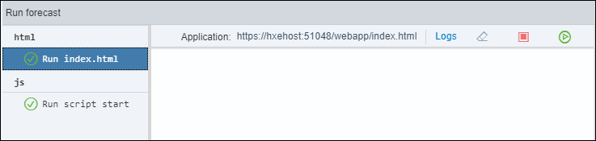
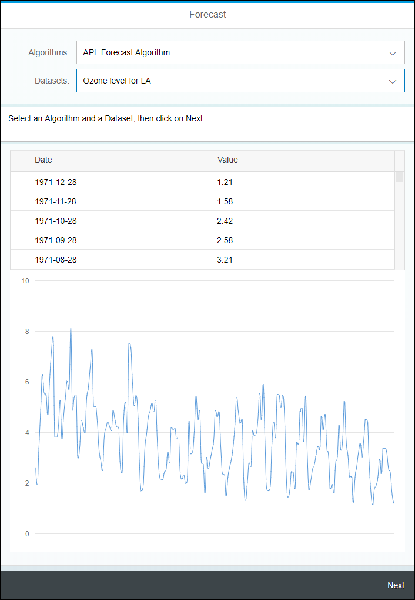
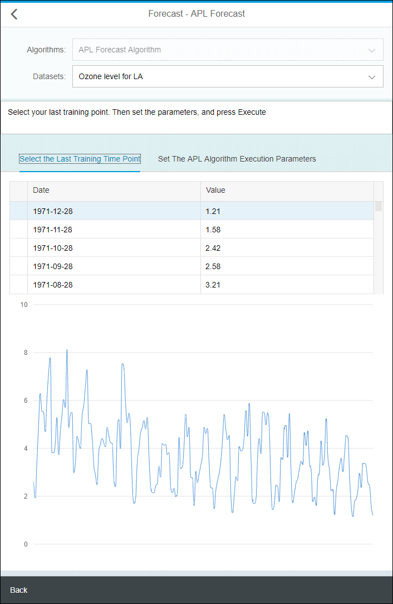
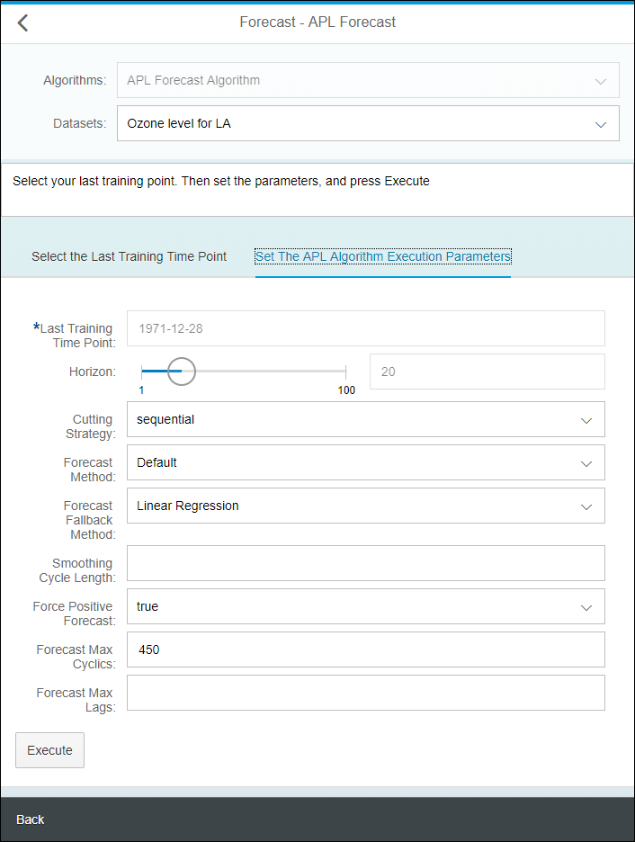
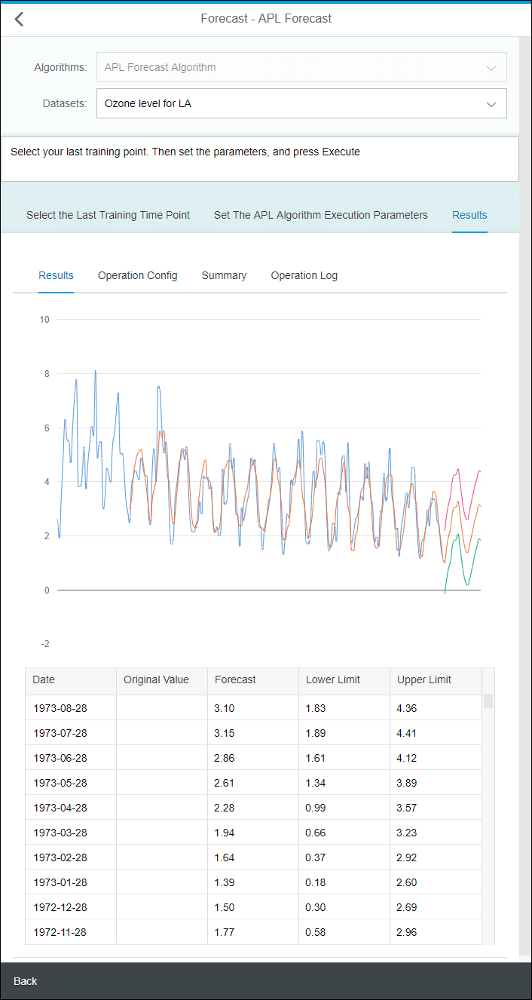

## Prerequisites
 - [Use Machine Learning to Build a Forecasting application using the XS advanced development model](https://developers.sap.com/group.hxe-aa-forecast.html)

## Prerequisites
 - **Proficiency:** Beginner

## Details
### You will learn
- How to use inheritance in controller
- How use JSON models
- Create and use Formatters
- Use the SAPUI5 Router
- Configure the Application Manifest
- Create and use Fragments (including Pop Over)
- How to use an XS OData service (sorting and filtering) in a table and a `VizFrame`

### Time to Complete
**10 Min**

[ACCORDION-BEGIN [Step 1: ](Open the Web IDE)]

Open the Web IDE, and login using the **`XSA_DEV`** credentials.

Switch to the ***Development*** perspective using the  icon.


As a reminder the default URL for the Web IDE is:

 - `https://hxehost:53075`

A link to the Web IDE can also be found on the ***XSA Controller page*** at:

- `https://hxehost:39030`

[DONE]
[ACCORDION-END]

[ACCORDION-BEGIN [Step 1: ](Create a Base Controller)]

In order to reuse some JavaScript functions over different algorithms controllers, you will define a ***base*** controller that will be reused over replacing the ***`forecast/html/base/Controller`*** controller.

In the left side panel, expand the **`forecast/html/resources/webapp/base/algorithms`** tree node.

Right click on the **`base`** folder node from the tree, and select **New > File**.

Enter **`Controller.js`** as the file name, then click on **OK**.


The default application controller is located in:

 - **`forecast/html/resources/webapp/base/algorithms/Controller.js`**

These updates are made in preparation for the next steps.

Open the **`Controller.js`** file and paste the following code:

```js
sap.ui.define([
	"forecast/html/base/Controller",
	"sap/m/MessageBox"
], function(Controller, MessageBox) {
	"use strict";
	return Controller.extend("forecast.html.base.algorithms.controller", {
		onInit: function() {
			this.getRouter().getRoute(this.forcedSelectedAlgorithm).attachPatternMatched(this.handleRouteMatched, this);
		},
		handleRouteMatched: function(oEvent) {
			this.getView().setModel(new sap.ui.model.json.JSONModel(), "algorithm");
			this.getView().setModel(new sap.ui.model.json.JSONModel(), "payload");
			this.getView().setModel(new sap.ui.model.json.JSONModel(), "results");

			var defaultConfig = this.getView().getModel("default").getData();
			var config = this.getView().getModel("config").getData();

			var forcedSelectedAlgorithm = this.forcedSelectedAlgorithm;

			this.getView().getModel("config").setProperty("/enableSelectAlgorithm", false);
			this.getView().getModel("config").setProperty("/selectedAlgorithmKey", forcedSelectedAlgorithm);

			var algorithm = defaultConfig.algorithms.items.filter(function(e) {
				return e.key === forcedSelectedAlgorithm;
			})[0];
			this.getView().getModel("config").setProperty("/algorithm", algorithm);

			this.disableDatasetSelectItems(algorithm.library);

			if (config.selectedDatasetKey) {
				var dataset = defaultConfig.datasets.items.filter(function(e) {
					return e.key === config.selectedDatasetKey;
				})[0];
				this.getView().getModel("config").setProperty("/dataset", dataset);

				var vizODataKey = algorithm.library + "_" + dataset.key;
				this.setVizParams(vizODataKey, true);

				var payloadKey = algorithm.library + "_" + algorithm.key;
				var algorithmConfig = this.getView().getModel(payloadKey).getData();

				this.getView().getModel("algorithm").setData(algorithmConfig);
				this.getView().getModel("payload").setData(algorithmConfig.default_payload);
			}
		},
		ajaxCallCompleted: function(status, message) {
			MessageBox.show(message, {
				title: status
			});
			this.oBusyIndicator.close();
		},
		onPressExecute: function(oEvent) {
			var oController = this;
			var results = oController.getView().getModel("results");

			oController.oBusyIndicator = new sap.m.BusyDialog();
			oController.oBusyIndicator.open();

			var payload = this.getView().getModel("payload").getData();
			var service = this.getView().getModel("algorithm").getData().service;

			payload.DATASETNAME = this.getView().getModel("config").getProperty("/selectedDatasetKey");

			var ajaxSuccess = function(response, status) {
				oController.ajaxCallCompleted(status, response.message);
				results.setProperty("/hasResult", true);
				results.setProperty("/tables", response.results);

				oController.getView().byId("tab").setSelectedKey("result");
				oController.setVizProperties("result_viz_frame", "result_popover");
			};
			var ajaxError = function(xhr, status, error) {
				var msg = error;
				if (error.message) {
					msg = error.message;
				}
				oController.getView().setModel(new sap.ui.model.json.JSONModel(), "results");
				oController.ajaxCallCompleted(status, msg);
			};
			$.ajax({
				method: service.method,
				url: service.url,
				async: true,
				timeout: 3000000,
				headers: {
					"content-type": "application/json",
					"accept": "application/json"
				},
				data: JSON.stringify(payload),
				success: ajaxSuccess,
				error: ajaxError
			});
		}
	});
});
```

Save the file using the  icon from the menu.

[DONE]
[ACCORDION-END]

[ACCORDION-BEGIN [Step 1: ](Create JSON Model)]

In order to drive some of the UI elements, you will define a JSON model. This model will hold the display list for the algorithm and dataset selection.

In the left side panel, expand the **`forecast/html/resources/webapp/model/algorithms/apl`** tree node.

Right click on the **`apl`** folder node from the tree, and select **New > File**.

Enter **`forecast.json`** as the file name, then click on **OK**.

This is the full path of the created file:

```
forecast/html/resources/webapp/model/algorithms/apl/forecast.json
```

Paste the following content:

```JavaScript
{
	"key": "forecast",
	"library": "apl",
	"label": "APL Forecast Algorithm",
	"service": {
		"url": "/xsjs/apl/forecast.xsjs",
		"method": "POST",
		"params": {
			"HORIZON": {
				"label": "Horizon",
				"max": 100,
				"description": "Number of forecast time points"
			},
			"LASTTRAININGTIMEPOINT": {
				"label": "Last Training Time Point",
				"description": "Value in the time point column which represents the last point in time for the training dataset"
			},
			"CUTTINGSTRATEGY": {
				"label": "Cutting Strategy",
				"default": "sequential",
				"values": [{
					"key": "sequential",
					"label": "sequential"
				}, {
					"key": "sequential with no test",
					"label": "sequential with no test"
				}],
				"description": "The Cutting Strategy defines how a training set is cut under three subsets (training, validation and testing datasets) when needed. Depending on the model (model type, number of targets ...) not all Cutting Strategies can be used. See Automated Analytics documentation for details."
			},
			"FORECASTMETHOD": {
				"label": "Forecast Method",
				"values": [{
					"key": "Default",
					"label": "Default"
				}, {
					"key": "LinearRegression",
					"label": "Linear Regression"
				}, {
					"key": "ExponentialSmoothing",
					"label": "Exponential Smoothing"
				}],
				"description": "Uses a forecast method different from the default Automated Analytics time-series algorithm"
			},
			"FORECASTFALLBACKMETHOD": {
				"label": "Forecast Fallback Method",
				"values": [{
					"key": "LinearRegression",
					"label": "Linear Regression"
				}, {
					"key": "ExponentialSmoothing",
					"label": "Exponential Smoothing"
				}],
				"description": "Sets the method that will be used if the one specified with APL/ForecastMethod fails, for example when there are too few data points"
			},
			"SMOOTHINGCYCLELENGTH": {
				"label": "Smoothing Cycle Length",
				"description": "Sets the cycle/seasonal length to be used for the smoothing instead of the cycle length candidates automatically determined by the Automated Analytics engine based on the time granularity, for example: month -> 4 (quarterly) or 12 (yearly)."
			},
			"FORCEPOSITIVEFORECAST": {
				"label": "Force Positive Forecast",
				"values": [{
					"key": "true",
					"label": "true"
				}, {
					"key": "false",
					"label": "false"
				}],
				"description": "Activates a mode where the negative forecasts are ignored, that is, replaced with zero."
			},
			"FORECASTMAXCYCLICS": {
				"label": "Forecast Max Cyclics",
				"default": 450,
				"description": "Length of the longest cycle the model will try to detect. Controls the way that the model analyzes the periodicities in the signal. Also limited by the size of the training dataset. You can disable the cyclic analysis by setting this parameter to 0."
			},
			"FORECASTMAXLAGS": {
				"label": "Forecast Max Lags",
				"description": "Defines the maximum dependency of the signal on its own past values. Controls the way that the model analyzes the random fluctuations in the signal. You can set this parameter to 0 to disable the fluctuations analysis."
			}
		}
	},
	"default_payload": {
		"DATASETNAME": null,
		"HORIZON": 20,
		"LASTTRAININGTIMEPOINT": null,
		"CUTTINGSTRATEGY": "sequential",
		"FORECASTMETHOD": "Default",
		"FORECASTFALLBACKMETHOD": "ExponentialSmoothing",
		"SMOOTHINGCYCLELENGTH": null,
		"FORCEPOSITIVEFORECAST": "false",
		"FORECASTMAXCYCLICS": 450,
		"FORECASTMAXLAGS": null
	}
}
```

Save the file using the  icon from the menu.

[DONE]
[ACCORDION-END]


[ACCORDION-BEGIN [Step 1: ](Edit the Application Descriptor)]

The descriptor file (`manifest.json`) for applications, components, and libraries is inspired by the Web Application Manifest concept introduced by the W3C.

The descriptor provides a central, machine-readable and easy-to-access location for storing metadata associated with an application, an application component, or a library.

It includes the definition of OData data sources and models used by SAPUI5 applications.

Open the **`manifest.json`** file located in the **`forecast/html/resources/webapp`** folder.

Extend the **`"models"`** section with the following element:

```JSON
"apl_forecast": {
	"type": "sap.ui.model.json.JSONModel",
	"preload": true,
	"uri": "model/algorithms/apl/forecast.json"
}
```

In the **`"routing"`** section, extend the **`"routes"`** array and add the following element:

```JSON
{
	"name": "forecast",
	"pattern": "forecast",
	"target": "forecast"
}
```

and extend the **`"targets"`** element and add the following element:


```JSON
"forecast": {
	"clearAggregation": true,
	"viewName": "algorithms.apl.forecast"
}
```

Save the file using the  icon from the menu.

[DONE]
[ACCORDION-END]

[ACCORDION-BEGIN [Step 1: ](Create the controller)]

Expand the **`forecast/html/resources/webapp/controller/algorithms/apl`** folder.

Create a new file **`forecast.controller.js`**.

This is the full path of the created file:

```
forecast/html/resources/webapp/controller/algorithms/apl/forecast.controller.js
```

Paste the following content:

```js
sap.ui.define([
	"forecast/html/base/algorithms/Controller"
], function(Controller) {
	"use strict";
	return Controller.extend("forecast.html.controller.algorithms.apl.forecast", {
		forcedSelectedAlgorithm: "forecast",
		onTableSelectionChange: function(oEvent) {
			var rowContext = oEvent.getParameters().rowContext;
			if (!rowContext) {
				rowContext = oEvent.getParameters().rowBindingContext;
			}
			var signalTime = rowContext.getProperty("signal_time");
			this.getView().getModel("payload").setProperty("/LASTTRAININGTIMEPOINT", signalTime);
			this.getView().getModel("payload").setProperty("/hasDate", true);
			this.getView().byId("tab").setSelectedKey("params");
		},
		onPressExecute: function(oEvent) {
			var payload = this.getView().getModel("payload").getData();
			var lastTrainingTimePoint = payload.LASTTRAININGTIMEPOINT;
			if (!lastTrainingTimePoint) {
				this.ajaxCallCompleted("Error", "Please select an entry from the dataset as your last training time point.");
				return;
			}
			Controller.prototype.onPressExecute.apply(this, oEvent);
		}
	});
});
```

Save the file using the  icon from the menu.

[DONE]
[ACCORDION-END]

[ACCORDION-BEGIN [Step 1: ](Create the Fragments)]

Using fragments in SAPUI5 application enables re-usability of display components but it's also a good way to keep your code shorter and easily maintainable.

The XS JS forms and services results are one good example of components that could be defined as fragments and re-used over and over.

Expand the **`forecast/html/resources/webapp/fragment/algorithms/apl`** folder.

Create a new file **`forecast_parameters.fragment.xml`**.

This is the full path of the created file:

```
forecast/html/resources/webapp/fragment/algorithms/apl/forecast_parameters.fragment.xml
```

Paste the following content:

```xml
<core:FragmentDefinition xmlns="sap.m" xmlns:core="sap.ui.core" xmlns:ui="sap.ui">
	<ui:layout.form.Form editable="true">
		<ui:layout>
			<ui:layout.form.ResponsiveGridLayout columnsL="1" columnsM="1"/>
		</ui:layout>
		<ui:formContainers>
			<ui:layout.form.FormContainer>
				<ui:formElements>
					<ui:layout.form.FormElement label="{apl_forecast>/service/params/LASTTRAININGTIMEPOINT/label}">
						<ui:fields>
							<Input type="Text" value="{path : 'payload>/LASTTRAININGTIMEPOINT', formatter: '.formatter.formatDate'}" width="100%" enabled="false"
								required="true" tooltip="{apl_forecast>/service/params/LASTTRAININGTIMEPOINT/description}"/>
						</ui:fields>
					</ui:layout.form.FormElement>
					<ui:layout.form.FormElement label="{apl_forecast>/service/params/HORIZON/label}">
						<ui:fields>
							<Slider progress="true" value="{payload>/HORIZON}" step="1" min="1" max="{apl_forecast>/service/params/HORIZON/max}"
								enableTickmarks="true" inputsAsTooltips="true" tooltip="{apl_forecast>/service/params/HORIZON/description}"/>
							<Input type="Number" value="{payload>/HORIZON}" enabled="false"/>
						</ui:fields>
					</ui:layout.form.FormElement>
					<ui:layout.form.FormElement label="{apl_forecast>/service/params/CUTTINGSTRATEGY/label}">
						<ui:fields>
							<Select selectedItem="{payload>/CUTTINGSTRATEGY}" items="{apl_forecast>/service/params/CUTTINGSTRATEGY/values}"
								tooltip="{apl_forecast>/service/params/CUTTINGSTRATEGY/description}">
								<items>
									<ui:core.ListItem text="{apl_forecast>label}" key="{apl_forecast>key}"/>
								</items>
							</Select>
						</ui:fields>
					</ui:layout.form.FormElement>
					<ui:layout.form.FormElement label="{apl_forecast>/service/params/FORECASTMETHOD/label}">
						<ui:fields>
							<Select selectedItem="{payload>/FORECASTMETHOD}" items="{apl_forecast>/service/params/FORECASTMETHOD/values}"
								tooltip="{apl_forecast>/service/params/FORECASTMETHOD/description}">
								<items>
									<ui:core.ListItem text="{apl_forecast>label}" key="{apl_forecast>key}"/>
								</items>
							</Select>
						</ui:fields>
					</ui:layout.form.FormElement>
					<ui:layout.form.FormElement label="{apl_forecast>/service/params/FORECASTFALLBACKMETHOD/label}">
						<ui:fields>
							<Select selectedItem="{payload>/FORECASTFALLBACKMETHOD}" items="{apl_forecast>/service/params/FORECASTFALLBACKMETHOD/values}"
								tooltip="{apl_forecast>/service/params/FORECASTFALLBACKMETHOD/description}">
								<items>
									<ui:core.ListItem text="{apl_forecast>label}" key="{apl_forecast>key}"/>
								</items>
							</Select>
						</ui:fields>
					</ui:layout.form.FormElement>
					<ui:layout.form.FormElement label="{apl_forecast>/service/params/SMOOTHINGCYCLELENGTH/label}">
						<ui:fields>
							<Input type="Number" value="{payload>/SMOOTHINGCYCLELENGTH}"
								tooltip="{apl_forecast>/service/params/SMOOTHINGCYCLELENGTH/description}"/>
						</ui:fields>
					</ui:layout.form.FormElement>
					<ui:layout.form.FormElement label="{apl_forecast>/service/params/FORCEPOSITIVEFORECAST/label}">
						<ui:fields>
							<Select selectedItem="{payload>/FORCEPOSITIVEFORECAST}" items="{apl_forecast>/service/params/FORCEPOSITIVEFORECAST/values}"
								tooltip="{apl_forecast>/service/params/FORCEPOSITIVEFORECAST/description}">
								<items>
									<ui:core.ListItem text="{apl_forecast>label}" key="{apl_forecast>key}"/>
								</items>
							</Select>
						</ui:fields>
					</ui:layout.form.FormElement>
					<ui:layout.form.FormElement label="{apl_forecast>/service/params/FORECASTMAXCYCLICS/label}">
						<ui:fields>
							<Input type="Number" value="{payload>/FORECASTMAXCYCLICS}" tooltip="{apl_forecast>/service/params/FORECASTMAXCYCLICS/description}"/>
						</ui:fields>
					</ui:layout.form.FormElement>
					<ui:layout.form.FormElement label="{apl_forecast>/service/params/FORECASTMAXLAGS/label}">
						<ui:fields>
							<Input type="Number" value="{payload>/FORECASTMAXLAGS}" tooltip="{apl_forecast>/service/params/FORECASTMAXLAGS/description}"/>
						</ui:fields>
					</ui:layout.form.FormElement>
				</ui:formElements>
			</ui:layout.form.FormContainer>
		</ui:formContainers>
	</ui:layout.form.Form>
</core:FragmentDefinition>
```

Save the file using the  icon from the menu.

Create a new file **`forecast_results.fragment.xml`**.

This is the full path of the created file:

```
forecast/html/resources/webapp/fragment/algorithms/apl/forecast_results.fragment.xml
```

Paste the following content:

```xml
<core:FragmentDefinition xmlns="sap.m" xmlns:core="sap.ui.core" xmlns:ui="sap.ui" xmlns:viz="sap.viz">
	<IconTabBar>
		<items>
			<IconTabFilter text="Results">
				<viz:ui5.controls.Popover id="result_popover"/>
				<viz:ui5.controls.VizFrame width="100%" id="result_viz_frame" uiConfig="{applicationSet:'fiori'}" vizType='timeseries_line'>
					<viz:dataset>
						<viz:ui5.data.FlattenedDataset data="{path : 'results>/tables/RESULTS'}">
							<viz:dimensions>
								<viz:ui5.data.DimensionDefinition name="Date" value="{path : 'results>signal_time'}" dataType="date"/>
							</viz:dimensions>
							<viz:measures>
								<viz:ui5.data.MeasureDefinition name="Original Value" value="{path : 'results>signal_value'}"/>
								<viz:ui5.data.MeasureDefinition name="Forecast" value="{path : 'results>kts_1'}"/>
								<viz:ui5.data.MeasureDefinition name="Lower Limit" value="{path : 'results>kts_1_lowerlimit_95%'}"/>
								<viz:ui5.data.MeasureDefinition name="Upper Limit" value="{path : 'results>kts_1_upperlimit_95%'}"/>
							</viz:measures>
						</viz:ui5.data.FlattenedDataset>
					</viz:dataset>
					<viz:feeds>
						<viz:ui5.controls.common.feeds.FeedItem uid="valueAxis" type="Measure" values="Original Value"/>
						<viz:ui5.controls.common.feeds.FeedItem uid="valueAxis" type="Measure" values="Forecast"/>
						<viz:ui5.controls.common.feeds.FeedItem uid="valueAxis" type="Measure" values="Lower Limit"/>
						<viz:ui5.controls.common.feeds.FeedItem uid="valueAxis" type="Measure" values="Upper Limit"/>
						<viz:ui5.controls.common.feeds.FeedItem uid="timeAxis" type="Dimension" values="Date"/>
					</viz:feeds>
				</viz:ui5.controls.VizFrame>
				<ui:table.Table enableBusyIndicator="true" selectionMode="None" width="100%" rows="{path : 'results>/tables/RESULTS', sorter: { path: 'signal_time', 	descending: true} }">
					<ui:columns>
						<ui:table.Column sortProperty="signal_time" filterProperty="signal_time">
							<Label text="Date"/>
							<ui:template>
								<Text text="{path : 'results>signal_time', formatter : '.formatter.formatDate'}"/>
							</ui:template>
						</ui:table.Column>
						<ui:table.Column sortProperty="signal_value" filterProperty="signal_value">
							<Label text="Original Value"/>
							<ui:template>
								<Text text="{path : 'results>signal_value', formatter : '.formatter.formatNumber'}"/>
							</ui:template>
						</ui:table.Column>
						<ui:table.Column sortProperty="kts_1" filterProperty="kts_1">
							<Label text="Forecast"/>
							<ui:template>
								<Text text="{path : 'results>kts_1', formatter : '.formatter.formatNumber'}"/>
							</ui:template>
						</ui:table.Column>
						<ui:table.Column sortProperty="kts_1_lowerlimit_95%" filterProperty="kts_1_lowerlimit_95%">
							<Label text="Lower Limit"/>
							<ui:template>
								<Text text="{path : 'results>kts_1_lowerlimit_95%', formatter : '.formatter.formatNumber'}"/>
							</ui:template>
						</ui:table.Column>
						<ui:table.Column sortProperty="kts_1_upperlimit_95%" filterProperty="kts_1_upperlimit_95%">
							<Label text="Upper Limit"/>
							<ui:template>
								<Text text="{path : 'results>kts_1_upperlimit_95%', formatter : '.formatter.formatNumber'}"/>
							</ui:template>
						</ui:table.Column>
					</ui:columns>
				</ui:table.Table>
			</IconTabFilter>
			<IconTabFilter text="Operation Config">
				<ui:table.Table enableBusyIndicator="true" selectionMode="None" width="100%" height="100%"
					rows="{path : 'results>/tables/OPERATION_CONFIG'}">
					<ui:columns>
						<ui:table.Column sortProperty="KEY" filterProperty="KEY" width="50%">
							<Label text="Key"/>
							<ui:template>
								<Text text="{path : 'results>KEY'}"/>
							</ui:template>
						</ui:table.Column>
						<ui:table.Column sortProperty="VALUE" filterProperty="VALUE" width="50%">
							<Label text="Value"/>
							<ui:template>
								<Text text="{path : 'results>VALUE'}"/>
							</ui:template>
						</ui:table.Column>
					</ui:columns>
				</ui:table.Table>
			</IconTabFilter>
			<IconTabFilter text="Summary">
				<ui:table.Table enableBusyIndicator="true" selectionMode="None" width="100%" height="100%" rows="{path : 'results>/tables/SUMMARY'}">
					<ui:columns>
						<ui:table.Column sortProperty="OID" filterProperty="OID" width="50%">
							<Label text="OID"/>
							<ui:template>
								<Text text="{path : 'results>OID'}"/>
							</ui:template>
						</ui:table.Column>
						<ui:table.Column sortProperty="KEY" filterProperty="KEY" width="50%">
							<Label text="Key"/>
							<ui:template>
								<Text text="{path : 'results>KEY'}"/>
							</ui:template>
						</ui:table.Column>
						<ui:table.Column sortProperty="VALUE" filterProperty="VALUE" width="50%">
							<Label text="Value"/>
							<ui:template>
								<Text text="{path : 'results>VALUE'}"/>
							</ui:template>
						</ui:table.Column>
					</ui:columns>
				</ui:table.Table>
			</IconTabFilter>
			<IconTabFilter text="Operation Log">
				<ui:table.Table enableBusyIndicator="true" selectionMode="None" width="100%" height="100%" rows="{path : 'results>/tables/OPERATION_LOG'}">
					<ui:columns>
						<ui:table.Column sortProperty="TIMESTAMP" filterProperty="TIMESTAMP">
							<Label text="TIMESTAMP"/>
							<ui:template>
								<Text text="{path : 'results>TIMESTAMP', formatter : '.formatter.formatDate'}"/>
							</ui:template>
						</ui:table.Column>
						<ui:table.Column sortProperty="LEVEL" filterProperty="LEVEL">
							<Label text="Level"/>
							<ui:template>
								<Text text="{path : 'results>LEVEL'}"/>
							</ui:template>
						</ui:table.Column>
						<ui:table.Column sortProperty="ORIGIN" filterProperty="ORIGIN">
							<Label text="Origin"/>
							<ui:template>
								<Text text="{path : 'results>ORIGIN'}"/>
							</ui:template>
						</ui:table.Column>
						<ui:table.Column sortProperty="MESSAGE" filterProperty="MESSAGE">
							<Label text="Message"/>
							<ui:template>
								<Text text="{path : 'results>MESSAGE'}"/>
							</ui:template>
						</ui:table.Column>
					</ui:columns>
				</ui:table.Table>
			</IconTabFilter>
		</items>
	</IconTabBar>
</core:FragmentDefinition>
```

Save the file using the  icon from the menu.
[DONE]
[ACCORDION-END]

[ACCORDION-BEGIN [Step 1: ](Create the View)]

Expand the **`forecast/html/resources/webapp/view/algorithms/apl`** folder.

Create a new file **`forecast.view.xml`**.

This is the full path of the created file:

```
forecast/html/resources/webapp/view/algorithms/apl/forecast.view.xml
```

Paste the following content:

```xml
<mvc:View xmlns:html="http://www.w3.org/1999/xhtml" xmlns:mvc="sap.ui.core.mvc" xmlns="sap.m" xmlns:ui="sap.ui"
 controllerName="forecast.html.controller.algorithms.apl.forecast"
	displayBlock="true">
	<App id="idAppControl">
		<Page showHeader="true" showNavButton="true" navButtonPress="onNavHome" title="Forecast - APL Forecast">
			<content>
				<ui:core.Fragment fragmentName="forecast.html.fragment.display_list" type="XML"/>
				<TextArea wrapping="true" editable="false" width="100%" visible="{= !${default>/selected/dataset/hasExtraPredictors} }"
					value="Select your last training point. Then set the parameters, and press Execute"/>
				<TextArea wrapping="true" editable="false" width="100%" visible="{= !!${default>/selected/dataset/hasExtraPredictors} }"
					value="Select your last training point. When extra predictors are available, select only from rows where a value is available (empty value will trigger an error). Then set the parameters, and press Execute."/>
				<IconTabBar expandable="false" visible="{config>/enableSelectDataset}" id="tab">
					<items>
						<IconTabFilter key="date" text="Select the Last Training Time Point">
							<ui:core.Fragment fragmentName="forecast.html.fragment.display_data" type="XML"/>
						</IconTabFilter>
						<IconTabFilter key="params" text="Set The APL Algorithm Execution Parameters" visible="{= !!${payload>/hasDate} }">
							<ui:core.Fragment fragmentName="forecast.html.fragment.algorithms.apl.forecast_parameters" type="XML"/>
							<Button text="Execute" enabled="{= !!${payload>/hasDate} }" press="onPressExecute"/>
						</IconTabFilter>
						<IconTabFilter key="result" text="Results" visible="{= !!${results>/hasResult} }">
							<ui:core.Fragment fragmentName="forecast.html.fragment.algorithms.apl.forecast_results" type="XML"/>
						</IconTabFilter>
					</items>
				</IconTabBar>
			</content>
			<footer>
				<Bar>
					<contentLeft>
						<Button text="Back" press="onNavHome"/>
					</contentLeft>
				</Bar>
			</footer>
		</Page>
	</App>
</mvc:View>
```

Save the file using the  icon from the menu.

[DONE]
[ACCORDION-END]

[ACCORDION-BEGIN [Step 1: ](Run the application)]

Select the **`html`** module, then click on the execute icon  from the menu bar.

Once the application is started, the application will open in a new tab/window or you can click on the application URL:



This will open a web page with the following content:


[DONE]
[ACCORDION-END]

[ACCORDION-BEGIN [Step 1: ](Validate your results)]

Select **APL Forecast Algorithm**, then pick the **Ozone level for LA** dataset.

Click on **Next**.



Select **1971-12-28** in the list. The **Set The APL Algorithm Execution Parameters** tab will be activated.



Leave the parameters with their default values and click on **Execute**.



The **Results** tab will be activated.

Et Voilà!



Provide an answer to the question below then click on **Validate**.

[VALIDATE_1]
[ACCORDION-END]

[ACCORDION-BEGIN [Step 1: ](Commit your changes)]

On the icon bar located on the right side of the Web IDE, click on the **Git Pane** icon .

Click on **Stage All**, enter a commit comment, then click on **Commit and Push > origin master**.

[DONE]
[ACCORDION-END]
