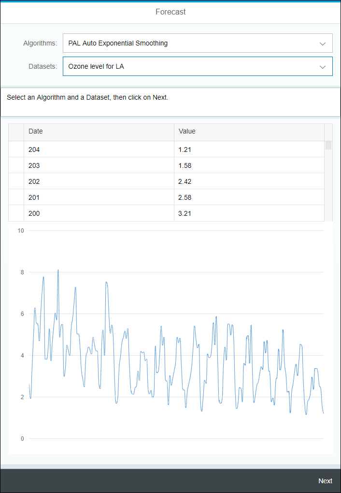

## Prerequisites
 - [Use Machine Learning to Build a Forecasting application using the XS advanced development model](https://developers.sap.com/group.hxe-aa-forecast.html)

## Prerequisites
 - **Proficiency:** Beginner

## Details
### You will learn
- How to use inheritance in controller
- How use JSON models
- Create and use Formatters
- Use the SAPUI5 Router
- Configure the Application Manifest
- Create and use Fragments (including Pop Over)
- How to use an XS OData service (sorting and filtering) in a table and a `VizFrame`

### Time to Complete
**10 Min**

[ACCORDION-BEGIN [Step 1: ](Open the Web IDE)]

Open the Web IDE, and login using the **`XSA_DEV`** credentials.

Switch to the ***Development*** perspective using the  icon.


As a reminder the default URL for the Web IDE is:

 - `https://hxehost:53075`

A link to the Web IDE can also be found on the ***XSA Controller page*** at:

- `https://hxehost:39030`

[DONE]
[ACCORDION-END]

[ACCORDION-BEGIN [Step 1: ](Create JSON Model)]

In order to drive some of the UI elements, you will define a JSON model. This model will hold the display list for the algorithm and dataset selection.

In the left side panel, expand the **`forecast/html/resources/webapp/model/algorithms/pal`** tree node.

Right click on the **`apl`** folder node from the tree, and select **New > File**.

Enter **`auto_smooting.json`** as the file name, then click on **OK**.

This is the full path of the created file:

```
forecast/html/resources/webapp/model/algorithms/pal/auto_smooting.json
```

Paste the following content:

```JavaScript
{
	"key": "auto_smoothing",
	"library": "pal",
	"label": "PAL Auto Smoothing",
	"service": {
		"url": "/xsjs/pal/auto_smoothing.xsjs",
		"method": "POST",
		"params": {
			"ACCURACYMEASURE": {
				"label": "Search strategy",
				"description": "The search strategy for optimal ARMA model",
				"default": 1,
				"values": [{
					"key": "MSE",
					"label": "Mean Square Error"
				}, {
					"key": "MAPE",
					"label": "Mean Absolute Percentage Error"
				}]
			},
			"TRAININGRATIO": {
				"label": "Training Ratio",
				"default": "0.75",
				"step": 0.1,
				"min": 0,
				"max": 1,
				"description": "The ratio of training data to the whole time series. Assuming the size of time series is N, and the training ratio is r, the first N*r time series is used to train, whereas only the latter N*(1-r) one is used to test"
			},
			"SEASONALITYCRITERION": {
				"label": "Seasonal criterion",
				"default": "0.5",
				"step": 0.1,
				"min": 0,
				"max": 1,
				"description": "The criterion of the auto-correlation coefficient for accepting seasonality, in the range of (0, 1). The larger it is, the less probable a time series is regarded to be seasonal."
			},
			"FORECASTNUM": {
				"label": "Number of forecast",
				"default": "20",
				"step": 1,
				"min": 1,
				"max": 100,
				"description": "Number of points to forecast"
			}
		}
	},
	"default_payload": {
		"DATASETNAME": null,
		"ACCURACYMEASURE": "MAPE",
		"TRAININGRATIO": 0.75,
		"SEASONALITYCRITERION": 0.5,
		"FORECASTNUM": 20
	}
}
```

Save the file using the  icon from the menu.

[DONE]
[ACCORDION-END]


[ACCORDION-BEGIN [Step 1: ](Edit the Application Descriptor)]

The descriptor file (`manifest.json`) for applications, components, and libraries is inspired by the Web Application Manifest concept introduced by the W3C.

The descriptor provides a central, machine-readable and easy-to-access location for storing metadata associated with an application, an application component, or a library.

It includes the definition of OData data sources and models used by SAPUI5 applications.

Open the **`manifest.json`** file located in the **`forecast/html/resources/webapp`** folder.

Extend the **`"models"`** section with the following element:

```JSON
"pal_auto_smooting": {
	"type": "sap.ui.model.json.JSONModel",
	"preload": true,
	"uri": "model/algorithms/pal/auto_smooting.json"
}
```

In the **`"routing"`** section, extend the **`"routes"`** array with the following element:

```JSON
{
	"name": "auto_smooting",
	"pattern": "auto_smooting",
	"target": "auto_smooting"
}
```

and extend the **`"targets"`** element and add the following element:

```JSON
"auto_smooting": {
	"clearAggregation": true,
	"viewName": "algorithms.pal.auto_smooting"
}
```

Save the file using the  icon from the menu.

[DONE]
[ACCORDION-END]

[ACCORDION-BEGIN [Step 1: ](Create the controller)]

Expand the **`forecast/html/resources/webapp/controller/algorithms/pal`** folder.

Create a new file **`auto_smooting.controller.js`**.

This is the full path of the created file:

```
forecast/html/resources/webapp/controller/algorithms/pal/auto_smooting.controller.js
```

Paste the following content:

```js
sap.ui.define([
	"forecast/html/base/algorithms/Controller"
], function(Controller) {
	"use strict";
	return Controller.extend("forecast.html.controller.algorithms.pal.auto_smooting", {
		forcedSelectedAlgorithm: "auto_smooting",
		onPressExecute: function(oEvent) {
			Controller.prototype.onPressExecute.apply(this, oEvent);
				this.setVizProperties("result_fit_viz_frame", "result_fit_popover");			
		}
	});
});
```

Save the file using the  icon from the menu.

[DONE]
[ACCORDION-END]

[ACCORDION-BEGIN [Step 1: ](Create the Fragments)]

Expand the **`forecast/html/resources/webapp/fragment/algorithms/pal`** folder.

Create a new file **`auto_smooting_parameters.fragment.xml`**.

This is the full path of the created file:

```
forecast/html/resources/webapp/fragment/algorithms/pal/auto_smooting_parameters.fragment.xml
```

Paste the following content:

```xml
<core:FragmentDefinition xmlns="sap.m" xmlns:core="sap.ui.core" xmlns:ui="sap.ui">
	<ui:layout.form.Form editable="true">
		<ui:layout>
			<ui:layout.form.ResponsiveGridLayout columnsL="1" columnsM="1"/>
		</ui:layout>
		<ui:formContainers>
			<ui:layout.form.FormContainer>
				<ui:formElements>
					<ui:layout.form.FormElement label="{pal_auto_smoothing>/service/params/ACCURACYMEASURE/label}">
						<ui:fields>
							<Select selectedKey="{payload>/ACCURACYMEASURE}" items="{pal_auto_smoothing>/service/params/ACCURACYMEASURE/values}"
								tooltip="{pal_auto_smoothing>/service/params/ACCURACYMEASURE/description}">
								<items>
									<ui:core.ListItem text="{pal_auto_smoothing>label}" key="{pal_auto_smoothing>key}"/>
								</items>
							</Select>
						</ui:fields>
					</ui:layout.form.FormElement>
					<ui:layout.form.FormElement label="{pal_auto_smoothing>/service/params/TRAININGRATIO/label}">
						<ui:fields>
							<Slider progress="true" value="{payload>/TRAININGRATIO}" step="{pal_auto_smoothing>/service/params/TRAININGRATIO/step}"
								min="{pal_auto_smoothing>/service/params/TRAININGRATIO/min}" max="{pal_auto_smoothing>/service/params/TRAININGRATIO/max}"
								enableTickmarks="true" inputsAsTooltips="true" tooltip="{pal_auto_smoothing>/service/params/TRAININGRATIO/description}"/>
							<Input type="Number" value="{payload>/TRAININGRATIO}" enabled="false"/>
						</ui:fields>
					</ui:layout.form.FormElement>
					<ui:layout.form.FormElement label="{pal_auto_smoothing>/service/params/SEASONALITYCRITERION/label}">
						<ui:fields>
							<Slider progress="true" value="{payload>/SEASONALITYCRITERION}" step="{pal_auto_smoothing>/service/params/SEASONALITYCRITERION/step}"
								min="{pal_auto_smoothing>/service/params/SEASONALITYCRITERION/min}" max="{pal_auto_smoothing>/service/params/SEASONALITYCRITERION/max}"
								enableTickmarks="true" inputsAsTooltips="true" tooltip="{SEASONALITYCRITERION>/service/params/SEASONALITYCRITERION/description}"/>
							<Input type="Number" value="{payload>/SEASONALITYCRITERION}" enabled="false"/></ui:fields>
					</ui:layout.form.FormElement>
					<ui:layout.form.FormElement label="{pal_auto_smoothing>/service/params/FORECASTNUM/label}">
						<ui:fields>
							<Slider progress="true" value="{payload>/FORECASTNUM}" step="{pal_auto_smoothing>/service/params/FORECASTNUM/step}"
								min="{pal_auto_smoothing>/service/params/FORECASTNUM/min}" max="{pal_auto_smoothing>/service/params/FORECASTNUM/max}"
								enableTickmarks="true" inputsAsTooltips="true" tooltip="{FORECASTNUM>/service/params/FORECASTNUM/description}"/>
							<Input type="Number" value="{payload>/FORECASTNUM}" enabled="false"/></ui:fields>
					</ui:layout.form.FormElement>
				</ui:formElements>
			</ui:layout.form.FormContainer>
		</ui:formContainers>
	</ui:layout.form.Form>
</core:FragmentDefinition>
```

Save the file using the  icon from the menu.

Create a new file **`auto_smooting_results.fragment.xml`**.

This is the full path of the created file:

```
forecast/html/resources/webapp/fragment/algorithms/pal/auto_smooting_results.fragment.xml
```

Paste the following content:

```xml
<core:FragmentDefinition xmlns="sap.m" xmlns:core="sap.ui.core" xmlns:ui="sap.ui" xmlns:viz="sap.viz">
	<IconTabBar>
		<items>
			<IconTabFilter text="Results">
				<viz:ui5.controls.Popover id="result_popover"/>
				<viz:ui5.controls.VizFrame width="100%" id="result_viz_frame" uiConfig="{applicationSet:'fiori'}" vizType='timeseries_line'>
					<viz:dataset>
						<viz:ui5.data.FlattenedDataset data="{path : 'results>/tables/OUTPUT'}">
							<viz:dimensions>
								<viz:ui5.data.DimensionDefinition name="Date" value="{path : 'results>signal_time'}" dataType="date"/>
							</viz:dimensions>
							<viz:measures>
								<viz:ui5.data.MeasureDefinition name="Original Value" value="{path : 'results>signal_value'}"/>
								<viz:ui5.data.MeasureDefinition name="Forecast" value="{path : 'results>forecast'}"/>
								<viz:ui5.data.MeasureDefinition name="Lower Limit 1" value="{path : 'results>lowerlimit_1'}"/>
								<viz:ui5.data.MeasureDefinition name="Upper Limit 1" value="{path : 'results>upperlimit_1'}"/>
								<viz:ui5.data.MeasureDefinition name="Lower Limit 2" value="{path : 'results>lowerlimit_2'}"/>
								<viz:ui5.data.MeasureDefinition name="Upper Limit 2" value="{path : 'results>upperlimit_2'}"/>
							</viz:measures>
						</viz:ui5.data.FlattenedDataset>
					</viz:dataset>
					<viz:feeds>
						<viz:ui5.controls.common.feeds.FeedItem uid="valueAxis" type="Measure" values="Original Value"/>
						<viz:ui5.controls.common.feeds.FeedItem uid="valueAxis" type="Measure" values="Forecast"/>
				    	<viz:ui5.controls.common.feeds.FeedItem uid="valueAxis" type="Measure" values="Lower Limit 1"/>
						<viz:ui5.controls.common.feeds.FeedItem uid="valueAxis" type="Measure" values="Upper Limit 1"/>
						<viz:ui5.controls.common.feeds.FeedItem uid="valueAxis" type="Measure" values="Lower Limit 2"/>
						<viz:ui5.controls.common.feeds.FeedItem uid="valueAxis" type="Measure" values="Upper Limit 2"/>
						<viz:ui5.controls.common.feeds.FeedItem uid="timeAxis" type="Dimension" values="Date"/>
					</viz:feeds>
				</viz:ui5.controls.VizFrame>
				<ui:table.Table enableBusyIndicator="true" selectionMode="None" width="100%"
					rows="{path : 'results>/tables/OUTPUT', sorter: { path: 'signal_time', descending: true} }">
					<ui:columns>
						<ui:table.Column sortProperty="signal_time" filterProperty="signal_time">
							<Label text="Date"/>
							<ui:template>
								<Text text="{path : 'results>signal_time'}"/>
							</ui:template>
						</ui:table.Column>
						<ui:table.Column sortProperty="signal_value" filterProperty="signal_value">
							<Label text="Original Value"/>
							<ui:template>
								<Text text="{path : 'results>signal_value', formatter : '.formatter.formatNumber'}"/>
							</ui:template>
						</ui:table.Column>
						<ui:table.Column sortProperty="forecast" filterProperty="forecast">
							<Label text="Forecast"/>
							<ui:template>
								<Text text="{path : 'results>forecast', formatter : '.formatter.formatNumber'}"/>
							</ui:template>
						</ui:table.Column>
						<ui:table.Column sortProperty="standard_error" filterProperty="standard_error">
							<Label text="Standard Error"/>
							<ui:template>
								<Text text="{path : 'results>standard_error', formatter : '.formatter.formatNumber'}"/>
							</ui:template>
						</ui:table.Column>
						<ui:table.Column sortProperty="lowerlimit_1" filterProperty="lowerlimit_1">
							<Label text="Lower Limit 1"/>
							<ui:template>
								<Text text="{path : 'results>lowerlimit_1', formatter : '.formatter.formatNumber'}"/>
							</ui:template>
						</ui:table.Column>
						<ui:table.Column sortProperty="upperlimit_1" filterProperty="upperlimit_1">
							<Label text="Upper Limit 1"/>
							<ui:template>
								<Text text="{path : 'results>upperlimit_1', formatter : '.formatter.formatNumber'}"/>
							</ui:template>
						</ui:table.Column>
						<ui:table.Column sortProperty="lowerlimit_2" filterProperty="lowerlimit_2">
							<Label text="Lower Limit 2"/>
							<ui:template>
								<Text text="{path : 'results>lowerlimit_2', formatter : '.formatter.formatNumber'}"/>
							</ui:template>
						</ui:table.Column>
						<ui:table.Column sortProperty="upperlimit_1" filterProperty="upperlimit_2">
							<Label text="Upper Limit 2"/>
							<ui:template>
								<Text text="{path : 'results>upperlimit_2', formatter : '.formatter.formatNumber'}"/>
							</ui:template>
						</ui:table.Column>
					</ui:columns>
				</ui:table.Table>
			</IconTabFilter>
			<IconTabFilter text="Statistics">
				<ui:table.Table enableBusyIndicator="true" selectionMode="None" width="100%" rows="{path : 'results>/tables/STATISTIC'}">
					<ui:columns>
						<ui:table.Column sortProperty="stat_name" filterProperty="stat_name">
							<Label text="Statistics name"/>
							<ui:template>
								<Text text="{path : 'results>stat_name'}"/>
							</ui:template>
						</ui:table.Column>
						<ui:table.Column sortProperty="stat_value" filterProperty="stat_value">
							<Label text="Statistics Value"/>
							<ui:template>
								<Text text="{path : 'results>stat_value'}"/>
							</ui:template>
						</ui:table.Column>
					</ui:columns>
				</ui:table.Table>
			</IconTabFilter>
		</items>
	</IconTabBar>
</core:FragmentDefinition>
```

Save the file using the  icon from the menu.

[DONE]
[ACCORDION-END]

[ACCORDION-BEGIN [Step 1: ](Create the View)]

Expand the **`forecast/html/resources/webapp/view/algorithms/pal`** folder.

Create a new file **`auto_smooting.view.xml`**.

This is the full path of the created file:

```
forecast/html/resources/webapp/view/algorithms/pal/auto_smooting.view.xml
```

Paste the following content:

```xml
<mvc:View xmlns:html="http://www.w3.org/1999/xhtml" xmlns:mvc="sap.ui.core.mvc" xmlns="sap.m" xmlns:ui="sap.ui"
 controllerName="forecast.html.controller.algorithms.pal.auto_smoothing"
	displayBlock="true">
	<App id="idAppControl">
		<Page showHeader="true" showNavButton="true" navButtonPress="onNavHome" title="Forecast - PAL Auto Smoothing">
			<content>
				<ui:core.Fragment fragmentName="forecast.html.fragment.display_list" type="XML"/>
				<IconTabBar expandable="false" visible="{config>/enableSelectDataset}" id="tab">
					<items>
						<IconTabFilter key="params" text="Set The Algorithm Execution Parameters">
							<ui:core.Fragment fragmentName="forecast.html.fragment.algorithms.pal.auto_smoothing_parameters" type="XML"/>
							<Button text="Execute" press="onPressExecute"/>
						</IconTabFilter>
						<IconTabFilter key="result" text="Results" visible="{= !!${results>/hasResult} }">
							<ui:core.Fragment fragmentName="forecast.html.fragment.algorithms.pal.auto_smoothing_results" type="XML"/>
						</IconTabFilter>
					</items>
				</IconTabBar>
			</content>
			<footer>
				<Bar>
					<contentLeft>
						<Button text="Back" press="onNavHome"/>
					</contentLeft>
				</Bar>
			</footer>
		</Page>
	</App>
</mvc:View>
```

Save the file using the  icon from the menu.

[DONE]
[ACCORDION-END]

[ACCORDION-BEGIN [Step 1: ](Run the application)]

Select the **`html`** module, then click on the execute icon  from the menu bar.

Once the application is started, the application will open in a new tab/window or you can click on the application URL:


This will open a web page with the following content:


[DONE]
[ACCORDION-END]

[ACCORDION-BEGIN [Step 1: ](Validate your results)]

Select **PAL Auto Smoothing Algorithm**, then pick the **Ozone level for LA** dataset.

Click on **Next**.



Leave the parameters with their default values and click on **Execute**.


The **Results** tab will be activated.

Et Voilà!


Provide an answer to the question below then click on **Validate**.

[VALIDATE_1]
[ACCORDION-END]

[ACCORDION-BEGIN [Step 1: ](Commit your changes)]

On the icon bar located on the right side of the Web IDE, click on the **Git Pane** icon .

Click on **Stage All**, enter a commit comment, then click on **Commit and Push > origin master**.

[DONE]
[ACCORDION-END]
