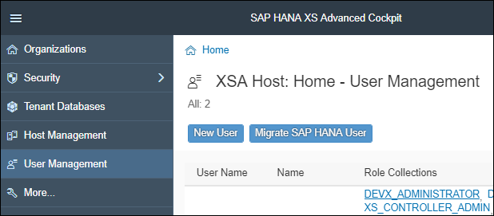
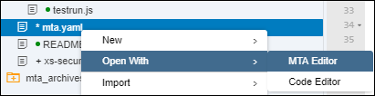
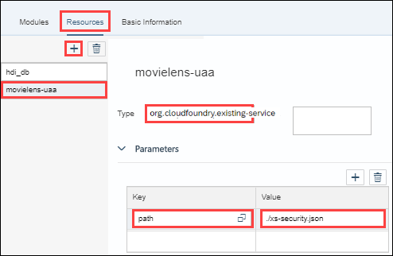
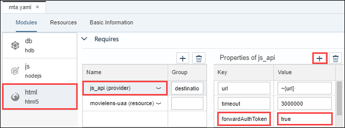

## Prerequisites
 - [Use Machine Learning to Build a Forecasting application using the XS advanced development model](https://developers.sap.com/group.hxe-aa-forecast.html)

## Prerequisites
 - **Proficiency:** Beginner

## Details
### You will learn
- How to create a XSUAA service with its security descriptor
- How to configure users and role in the XSA Administration Cockpit
- How to add the required security configuration to your MTA project

For more details, check the [Maintaining Application Security in XS Advanced](https://help.sap.com/viewer/4505d0bdaf4948449b7f7379d24d0f0d/latest/en-US/35d910ee7c7a445a950b6aad989a5a26.html) documentation.

### Time to Complete
**10 Min**

[ACCORDION-BEGIN [Step 1: ](Open the SAP HANA XS Advanced Cockpit)]

Open the SAP HANA XS Advanced Cockpit, and login using the **`XSA_ADMIN`** credentials.


As a reminder the default URL for the SAP HANA XS Advanced Cockpit is:

 - `https://hxehost:51036/cockpit`

A link to the SAP HANA XS Advanced Cockpit can also be found on the ***XSA Controller page*** at:

- `https://hxehost:39030`

[DONE]
[ACCORDION-END]

[ACCORDION-BEGIN [Step 1: ](Create a new user)]

You will now create a new user that will be used to connect to your application.

On the left side, select **User Management** then click on the **New User** Button.



Enter the following details and click on **Save**.

Property      | value
--------------|-------------------
User Name     | **FORECAST**
Email         | FORECAST
Password      | `Welcome18`


> ### **Note:** You will be prompted to change the FORECAST user password upon the first successful login attempt.
> You can also login at `https://hxehost:39032/uaa-security` to change the password using a new ***incognito/private mode*** browser session.

[DONE]
[ACCORDION-END]

[ACCORDION-BEGIN [Step 1: ](Configure the XSA UAA service)]

First, you will be adding a XSA UAA service to your development space with an Application Security Descriptor.

The Application Security Descriptor defines the details of the authentication methods and authorization types to use for access to your application.

Here is a basic Application Security Descriptor that you will be using, as you won't need to define multiple scope and role templates in the end.

```
{
  "xsappname": "forecast",
  "scopes": [{
    "name": "$XSAPPNAME.USER",
    "description": "Forecast User Application Scope"
  }],
  "role-templates": [{
    "name": "ForecastUser",
    "description" : "Forecast User Role Template",
    "scope-references": ["$XSAPPNAME.USER"]
  }]
}
```
> ### **Note:** In order to complete this steps, you will be using the XS CLI client which is locally installed with your SAP HANA 2.0, express edition instance.
>
However, you may prefer to run commands remotely (from your local desktop for example).
>
To do so, you can complete the [XS CLI Client installation](https://developers.sap.com/tutorials/hxe-ua-install-xs-xli-client.html)

Execute the following series of XS CLI command:

#### Login to the `HANAExpress` organization and `development` space:

```shell
xs login -o HANAExpress -s development -u XSA_ADMIN
```

#### Create the XSUAA service instance:

```shell
xs create-service xsuaa space forecast-uaa -c '{"xsappname": "forecast", "scopes": [{ "name": "$XSAPPNAME.USER", "description": "Forecast User Application Scope" }], "role-templates": [{ "name": "ForecastUser", "description" : "Forecast User Role Template", "scope-references": ["$XSAPPNAME.USER"]}]}'
```

[DONE]
[ACCORDION-END]

[ACCORDION-BEGIN [Step 1: ](Create and Assign the Role)]

Once the XSUAA service is created, you can proceed with the role collection creation, configuration and assignment to the ***FORECAST*** user.

Execute the following series of XS CLI command:

#### Create a role collection:

```shell
xs create-role-collection FORECAST_USER 'Forecast Application User Role Collection'
```

#### Add the `Forecast` User role the role collection:

```shell
xs update-role-collection FORECAST_USER --add-role ForecastUser --app forecast -s development -t ForecastUser
```

#### Assign the `Forecast` User role the FORECAST user:

```shell
xs assign-role-collection FORECAST_USER FORECAST
```

[DONE]
[ACCORDION-END]

[ACCORDION-BEGIN [Step 1: ](Open the Web IDE)]

Open the Web IDE, and login using the **`XSA_DEV`** credentials.

Switch to the ***Development*** perspective using the  icon.


As a reminder the default URL for the Web IDE is:

- `https://hxehost:53075`

A link to the Web IDE can also be found on the ***XSA Controller page*** at:

- `https://hxehost:39030`

[DONE]
[ACCORDION-END]

[ACCORDION-BEGIN [Step 1: ](Create the Application Security Descriptor)]

The Application Security Descriptor defines the details of the authentication methods and authorization types to use for access to your application.

The descriptor file is name ***`xs-security.json`***.

The ***`xs-security.json`*** file uses JSON notation to define the security options for an application; the information in the application-security file is used at application-deployment time, for example, for authentication and authorization.

Applications can perform scope checks (functional authorization checks with Boolean result) and checks on attribute values (instance-based authorization checks).

Expand the **`forecast`** folder.

Create a new file **`xs-security.json`**.

This is the full path of the created file:

```
forecast/xs-security.json
```

Paste the following content:

```JSON
{
  "xsappname": "forecast",
  "scopes": [{
    "name": "$XSAPPNAME.USER",
    "description": "Forecast User Application Scope"
  }],
  "role-templates": [{
    "name": "user",
    "description" : "Forecast User Role Template",
    "scope-references": ["$XSAPPNAME.USER"]
  }]
}
```
Save the file using the  icon from the menu.

As your application will be basic, you won't need to define multiple scope and role templates.

For more details, check the [The Application Security Descriptor](https://help.sap.com/viewer/4505d0bdaf4948449b7f7379d24d0f0d/latest/en-US/3bfb120045694e21bfadb1344a693d1f.html) documentation.

[DONE]
[ACCORDION-END]

[ACCORDION-BEGIN [Step 1: ](Add the XSUAA service as a Resource)]

In order to leverage the XSUAA service in your modules, you first need to add it as a resource in your project using the ***`mta.yaml`*** file.

Expand the **`forecast`** folder and open the **`mta.yaml`** file with the ***MTA Editor*** using a the right contextual menu and the **Open with** option.



Switch to the **Resources** tab.

Use the  icon to add a new entry.

Enter the name of the XSUAA service **`forecast-uaa`** and select **`com.sap.xs.uaa-space`** as type.

Add the following parameter:

Key      | Value
---------|------------
path     | `./xs-security.json`




Save the file using the  icon from the menu.

This will result in the addition of the following content in the **`mta.yaml`** under the ***resources*** section:

```
  - name: forecast-uaa
    type: com.sap.xs.uaa-space
    parameters:
      path: ./xs-security.json
```

[DONE]
[ACCORDION-END]

[ACCORDION-BEGIN [Step 1: ](Add Module dependencies to XSUAA)]

Now, that the XSUAA service is defined as a resource in your project, you can now add the dependency in your Node.js and HTML5 modules.

Open the **`mta.yaml`** file with the ***MTA Editor***.

Switch to the **Modules** tab.

Select the **`js`** Node.js module, and locate the **Requires** section.

Use the  icon to add a new entry.

Select the **`forecast-uaa (resource)`** entry from the drop down list.


Save the file using the  icon from the menu.

Select the **`html`** HTML5 module, and locate the **Requires** section.

Use the  icon to add a new entry.

Select the **`forecast-uaa (resource)`** entry from the drop down list.


Save the file using the  icon from the menu.

This will result in the addition of the following content in the **`mta.yaml`** under the ***requires*** section for each module:

```
- name: forecast-uaa
```

[DONE]
[ACCORDION-END]

[ACCORDION-BEGIN [Step 1: ](Enable Destination Auth Token Forwarding)]

In your application, the **`html`** module use the **`js`** module via the **`js_api` (provider)** use as a destination.

Open the **`mta.yaml`** file with the ***MTA Editor***.

Select the **`html`** HTML5 module, and locate the **Requires** section.

Select the **`js_api` (provider)** entry.

Use the  icon for the **Properties of `js_api`** to add a new entry.

Enter the following:

Key                | Value
-------------------|-------------------
`forwardAuthToken` | true



Save the file using the  icon from the menu.

This will result in the following update in the **`mta.yaml`** under the ***`js_api`*** section for the ***html*** module:

```
- name: js_api
  properties:
    name: forecast_api
    url: '~{url}'
    timeout: 3000000
    forwardAuthToken: true
  group: destinations
```

[DONE]
[ACCORDION-END]

[ACCORDION-BEGIN [Step 1: ](Enable Node.js Module Authentication)]

By default, the authentication is disabled in your **`js`** module.

Expand the **`forecast\js`** folder.

Open the **`server.js`** file.

Comment the **anonymous** attribute in the **options** like this:

```
var options = {
  // anonymous : true, // remove to authenticate calls
  redirectUrl : "/index.xsjs"
};
```

Save the file using the  icon from the menu.

[DONE]
[ACCORDION-END]

[ACCORDION-BEGIN [Step 1: ](Validate your Node.js Module configuration)]

Right click on the **`js`** folder and select **Build**.


The console should display at the end the following message:

```
(Builder) Build of /forecast/js completed successfully.
```

Right click on the **`js`** folder and select **Run > Run as > Node.js Application** or click on the execute icon  from the menu bar.

Once the application is started, click on the application URL:


Provide an answer to the question below then click on **Validate**.

[VALIDATE_1]
[ACCORDION-END]

[ACCORDION-BEGIN [Step 1: ](Enable HTML5 Module Authentication)]

Just like with the **`js`** module, the authentication is disabled in your **`html`** module.

Expand the **`forecast\html`** folder.

Open the **`xs-app.json`** file.

Replace the current file content with the following code:

```
{
  "welcomeFile": "webapp/index.html",
  "authenticationMethod": "route",
  "routes": [{
    "source": "/xsjs/(.*)(.xsjs)",
    "destination": "forecast_api",
    "csrfProtection": true,
    "authenticationType": "xsuaa",
    "scope": "$XSAPPNAME.USER"
  }, {
    "source": "/xsodata/(.*)(.xsodata)",
    "destination": "forecast_api",
    "csrfProtection": true,
    "authenticationType": "xsuaa",
    "scope": "$XSAPPNAME.USER"
  }, {
    "source": "^/(.*)$",
    "localDir": "resources",
    "scope": "$XSAPPNAME.USER"
  }]
}
```

The following modifications were applied:

 - the **`authenticationMethod`** is now set to **route** instead of **none** to force request to be authenticated
 - the **`authenticationType`** is now set to **`xsuaa`** instead of **none** to enable the XSUAA service use
 - an additional rout for all request is added to require the **`$XSAPPNAME.USER`** scope to be required for any application requests

Save the file using the  icon from the menu.

[DONE]
[ACCORDION-END]

[ACCORDION-BEGIN [Step 1: ](Validate your HTML5 Module configuration)]

Right click on the **`html`** folder and select **Build**.


The console should display at the end the following message:

```
(Builder) Build of /forecast/html completed successfully.
```

Right click on the **`html`** folder and select **Run > Run as > Web Application** or click on the execute icon  from the menu bar.

Once the application is started, click on the application URL.


Provide an answer to the question below then click on **Validate**.

[VALIDATE_2]
[ACCORDION-END]

[ACCORDION-BEGIN [Step 1: ](Run the application)]

Right click on the HTML5 Module application URL and use the **Open link in incognito/private window** mode from your browser.


You should now be able to get to the login page.


Use the **MOVILENS** user created earlier

You will be prompted to change its password on the first successful login.

Et Voilà!


[DONE]
[ACCORDION-END]

[ACCORDION-BEGIN [Step 1: ](Commit your changes)]

On the icon bar located on the right side of the Web IDE, click on the **Git Pane** icon .

Click on **Stage All**, enter a commit comment, then click on **Commit and Push > origin master**.

[DONE]
[ACCORDION-END]
