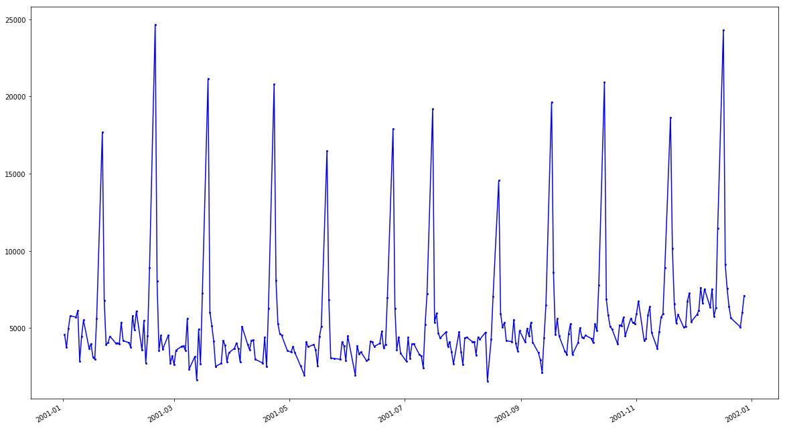
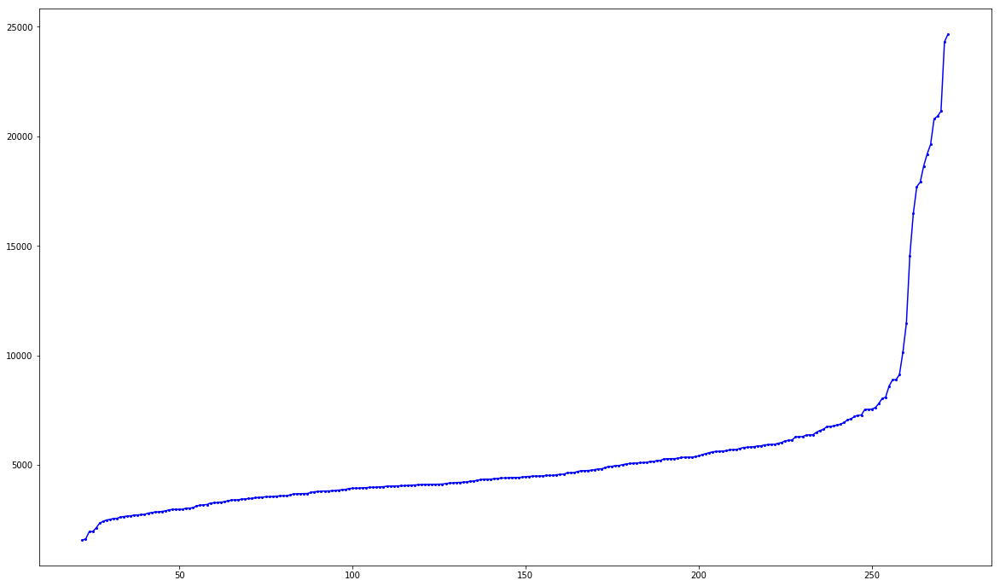
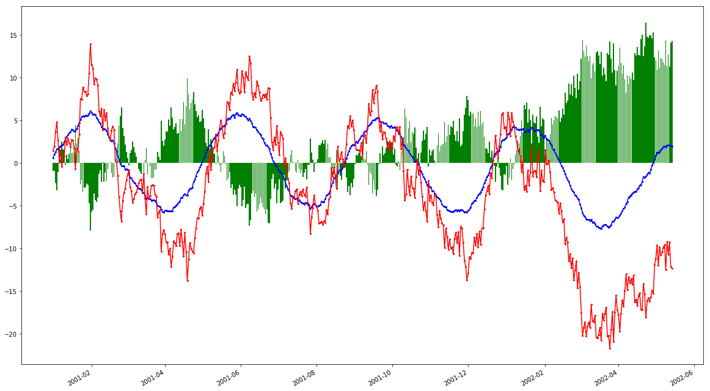

## Prerequisites
 - [Use Machine Learning to Build a Time Series model using SQL](https://developers.sap.com/group.hxe-aa-forecast-sql.html)

## Details
### You will learn
- Understand the basics about Time Series analysis
- Which statistics can help you better understand the structure of the dataset
- Based on the statistical assessment, identify what algorithm options are available

[ACCORDION-BEGIN [Info: ](Time series analysis)]

Most of the content for this steps has been extracted from the Wikipedia article on [**Time series**](https://en.wikipedia.org/wiki/Time_series)
First, here is quick definition of a time series:

>  *A time series is a series of indexed data points using a time order.
  Most commonly, a time series is a sequence taken at successive equally spaced points in time.*

Time series are used in statistics, signal processing, pattern recognition, econometrics, mathematical finance, weather forecasting, earthquake prediction, electroencephalography, control engineering, astronomy, communications engineering, and largely in any domain of applied science and engineering which involves temporal measurements.

Time series analysis comprises methods for analyzing time series data in order to extract meaningful statistics and other characteristics of the data.

Time series forecasting is the use of a model to predict future values based on previously observed values.

Time series data have usually a natural temporal ordering.

In addition, time series models will often make use of the natural one-way ordering of time so that values for a given period will be expressed as deriving in some way from past values, rather than from future values (see time reversibility).

Time series analysis can be applied to real-value, continuous data, discrete numeric data, or discrete symbolic data (i.e. sequences of characters, such as letters and words in the English language).

Time series are very frequently plotted via line charts.

[DONE]
[ACCORDION-END]

[ACCORDION-BEGIN [Info: ](The dataset structure)]

#### **Cash Flows**

The Cash Flows file (`CashFlows.txt`) presents daily measures of cash flows from January 2, 1998 to September, 30 1998. Each observation is characterized by 25 variables described in the following table.

| Variable                                                                        | Description                                                        | Example of values
:---------------------------------------------------------------------------------|--------------------------------------------------------------------|--------------------------
| Date                                                                            | Day, month and year of the readings                                | A date
| <nobr>`Cash`</nobr>                                                             | Cash flow                                                          | A numerical value with n decimals
| <nobr>`BeforeLastMonday`</nobr> <br><nobr>`LastMonday`</nobr> <br><nobr>`BeforeLastTuesday`</nobr> <br><nobr>`LastTuesday`</nobr> <br><nobr>`BeforeLastWednesday`</nobr> <br><nobr>`LastWednesday`</nobr> <br><nobr>`BeforeLastThursday`</nobr> <br><nobr>`LastThursday`</nobr> <br><nobr>`BeforeLastFriday`</nobr> <br><nobr>`LastFriday`</nobr> | Boolean variables that indicate if the information is true or false   | 1 if the information is true.
| <nobr>`Last5WDays`</nobr><br><nobr>`Last4WDays`</nobr>                         | Boolean variables that indicate if the date is in the 5 or 4 last working days of the month | 1 if the information is true.
| <nobr>`LastWMonth`</nobr><br><nobr>`BeforeLastWMonth`</nobr>                   | Boolean variables that indicate if the information is true or false | 1 if the information is true.
| <nobr>`WorkingDaysIndices`</nobr><br><nobr>`ReverseWorkingDaysIndices`</nobr>  | Indices or reverse indices of the working days | An integer value
| <nobr>`MondayMonthInd`</nobr><br><nobr>`TuesdayMonthInd`</nobr><br><nobr>`WednesdayMonthInd`</nobr><br><nobr>`ThursdayMonthInd`</nobr><br><nobr>`FridayMonthInd`</nobr> | Indices of the week days in the month | An integer value
| <nobr>`Last5WDaysInd`</nobr><br><nobr>`Last4WDaysInd`</nobr>                   | Indices of the 5 or 4 last working days of the month | An integer value

#### **Los Angeles Ozone**

The Los Angeles Ozone file (`R_ozone-la.txt`) presents monthly averages of hourly ozone (O3) readings in downtown Los Angeles from 1955 to 1972.

Each observation is characterized by 2 variables described in the following table:

| Variable        | Description                                  | Example of values
:-----------------|----------------------------------------------|--------------------------
| `Time`          | Month and year of the readings               | A date
| `R_ozone-la`    | Average of the hourly readings for the month | A numerical value

#### **"Lag 1 And Cycles"** & **"Trend And Cyclic"** with and without White Noise (`Wn`)

These files can be used to observe and analyze the impact of specific signal phenomenon.  

Each observation is characterized by 2 variables described in the following table:

| Variable    | Description               | Example of values
:-------------|---------------------------|--------------------------
| `TIME`      | The date of the readings  | A date
| `Signal`    | the signal value          | A numerical value


[DONE]
[ACCORDION-END]

[ACCORDION-BEGIN [Step 1: ](Check the row counts)]

Connect to the **HXE** tenant using the **`ML_USER`** user credentials and execute the following SQL statement to check the number of rows:

```SQL
select 'cashflow'                 as "TABLE", count(1) as "COUNT" FROM forecast_cashflow
union all
select 'ozone'                    as "TABLE", count(1) as "COUNT" FROM forecast_ozone
union all
select 'lag_1_and_cycles'         as "TABLE", count(1) as "COUNT" FROM forecast_lag_1_and_cycles
union all
select 'lag_1_and_cycles_and_wn'  as "TABLE", count(1) as "COUNT" FROM forecast_lag_1_and_cycles_and_wn
union all
select 'trend_and_cyclic'         as "TABLE", count(1) as "COUNT" FROM forecast_trend_and_cyclic
union all
select 'trend_and_cyclic_and_wn'  as "TABLE", count(1) as "COUNT" FROM forecast_trend_and_cyclic_and_wn
union all
select 'trend_and_cyclic_and_4wn' as "TABLE", count(1) as "COUNT" FROM forecast_trend_and_cyclic_and_4wn
```

The result should be:

**Table name**                 | **Row count**
------------------------------:|-----------
**`cashflow`**                 | 272
**`ozone`**                    | 204
**`lag_1_and_cycles`**         | 499
**`lag_1_and_cycles_and_wn`**  | 499
**`trend_and_cyclic`**         | 500
**`trend_and_cyclic_and_wn`**  | 500
**`trend_and_cyclic_and_4wn`** | 500

[DONE]
[ACCORDION-END]

[ACCORDION-BEGIN [Step 2: ](Cash Flow)]

As stated earlier, the **Cash Flow** dataset presents daily measures of cash flows from January 2, 1998 to September, 30 1998. Each observation is characterized by 25 variables described in the following table.

### **Visualize the data**

Let's have a look at the data using the following SQL:

```SQL
select cashdate, cash from forecast_cashflow order by cashdate asc;
```

And here is the result in a graph:



As you can visually notice, the signal includes:

 - steep **peaks**
 - a repeating pattern but with irregular gaps/intervals
 - the signal trend tends to slightly decline then rise at the end

Also, you can notice that the **peaks** happens at certain intervals, and the data include some kind of ***trend*** that is slightly going down then rising.

### **Dates & intervals**

As the cash flow value is provided for certain dates, let's have a look at statistics using the following SQL:

```sql
select 'max' as indicator, to_varchar(max(cashdate)) as value
from   forecast_cashflow union all
select 'min'             , to_varchar(min(cashdate))
from   forecast_cashflow union all
select 'delta days'      , to_varchar(days_between(min(cashdate), max(cashdate)))
from   forecast_cashflow union all
select 'count'           , to_varchar(count(1))
from   forecast_cashflow
```

**indicator** | **value**
-------------:|-----------
max           | 2002-01-31
min           | 2001-01-02
delta days    | 394
count         | 271

As you can notice, you have 272 data points spread across 394 days. This implies that data is not available on a daily basis.
This may have an impact on the way some algorithms work.

Now let's check the interval distribution using the following SQL:

```sql
select   interval, count(1) as count
from (
    select   days_between (lag(cashdate) over (order by cashdate asc), cashdate) as interval
    from     forecast_cashflow
    order by cashdate asc
)
where    interval is not null
group by interval;
```

The result should be:

**interval**  | **count**
-------------:|-----------
1             | 211
3             | 52
4             | 2
2             | 4
5             | 1
6             | 1

Most data points are provided on a daily basis when others have a:

 - 2 days interval most likely caused by a bank holiday during the week
 - 3 days interval most likely because of weekends
 - 4, 5 or 6 days interval most likely because of a bank holiday next to a weekend or other special events

### **Generic statistics**

Now, let's have a look at some generic statistical elements using the following SQL:

```sql
select 'max' as indicator , round(max(cash)) as value    from forecast_cashflow union all
select 'min'              , round(min(cash))             from forecast_cashflow union all
select 'delta min/max'    , round(max(cash) - min(cash)) from forecast_cashflow union all
select 'avg'              , round(avg(cash))             from forecast_cashflow union all
select 'median'           , round(median(cash))          from forecast_cashflow union all
select 'stddev'           , round(stddev(cash))          from forecast_cashflow
```

The result should be:

**indicator**        | **value**
--------------------:|-----------
**`max`**            | 24659
**`min`**            | 1579
**`delta min/max`**  | 23079
**`avg`**            | 5361
**`median`**         | 4434
**`stddev`**         | 3594

As you can notice the average and median values are not in the same range of values which may imply a skewed data distribution.

Here is a graph which can help you visualize the cash flow value in ascending order:



As you can notice, at the end of the curve, a small set of data point have really high values compared to the rest.

### **Data Distribution**

Now let's have a look at the data distribution using the NTILE function that will partition the dataset into a number of groups based on the value order.

This usually helps finding issues with the first and/or the last groups (outliers).

The following SQL will partition the data into 10 groups and get the same generic statistics as before but for each group:

```sql
with data as (
    select ntile(10) over (order by cash asc) as tile, cash
    from   forecast_cashflow
    where  cash is not null
)
select tile
    , round(max(cash))                     as max
    , round(min(cash))                     as min
    , round(max(cash) - min(cash))         as "delta min/max"
    , round(avg(cash))                     as avg
    , round(median(cash))                  as median
    , round(abs(avg(cash) - median(cash))) as "delta avg/median"
    , round(stddev(cash))                  as stddev
from     data
group by tile
```

The result should be:

| tile | max     | min     | delta  | `avg`   | median  | delta | `stddev`
|-----:|--------:|--------:|-------:|--------:|--------:|------:|--------
| 1    | 2957    | 1580    | 1378   | 2535    | 2665    | 130   | 382
| 2    | 3513    | 2976    | 538    | 3248    | 3281    | 33    | 183
| 3    | 3874    | 3521    | 353    | 3695    | 3695    | 0     | 114
| 4    | 4116    | 3888    | 228    | 4023    | 4039    | 16    | 65
| 5    | 4435    | 4123    | 312    | 4281    | 4269    | 12    | 110
| 6    | 4832    | 4438    | 394    | 4611    | 4577    | 33    | 127
| 7    | 5364    | 4879    | 485    | 5147    | 5125    | 22    | 144
| 8    | 5953    | 5365    | 588    | 5701    | 5703    | 2     | 179
| 9    | 7284    | 5995    | 1288   | 6600    | 6577    | 24    | 404
| 10   | 24659   | 7542    | 17117  | 13891   | 11464   | 2427  | 6059

As you can notice the first and last groups both have the delta between min and max but also between average and median higher than any other groups.

The last groups most likely represent all the **peaks** that you saw earlier.

Provide an answer to the question below then click on **Validate**.

[VALIDATE_1]
[ACCORDION-END]

[ACCORDION-BEGIN [Step 2: ](Ozone)]

As stated earlier, the **Los Angeles Ozone** dataset presents monthly averages of hourly ozone (O3) readings in downtown Los Angeles from 1955 to 1972.

Each observation is characterized by 2 variables, a time and an average of the hourly ozone readings for the month.

### **Visualize the data**

Let's have a look at the data using the following SQL:

```SQL
select time, reading from forecast_ozone order by time asc;
```

And here is the result in a graph:


As you can visually notice, the data includes:
 - an irregular sine pattern
 - the oldest data range looks larger than the later data points
 - the signal trend tends to slightly decline

### **Dates & intervals**

As the ozone reading value is provided for a certain date, let's have a look at date values using the following SQL:

```sql
select 'max' as indicator, to_varchar(max(time)) as value
from   forecast_ozone union all
select 'min'             , to_varchar(min(time))
from   forecast_ozone union all
select 'delta days'      , to_varchar(days_between(min(time), max(time)))
from   forecast_ozone union all
select 'count'           , to_varchar(count(1))
from   forecast_ozone
```

**indicator** | **value**
-------------:|-----------
max           | 1971-12-28
min           | 1955-01-28
delta months  | 203
count         | 204

As you can notice, you have 204 data points spread across 16 years. This implies that data is available on a monthly basis.

Now let's check the date value interval distribution using the following SQL:

```sql
select   interval, count(1) as count
from (
    select   days_between (lag(time) over (order by time asc), time) as interval
    from     forecast_ozone
    order by time asc
)
where    interval is not null
group by interval
```

The result should be:

**interval**  | **count**
-------------:|-----------
31            | 118
28            | 13
30            | 68
29            | 4

The fact that every month don't have the same duration may impact certain algorithms leveraging the date information in the model.

### **Generic statistics**

Now, let's have a look at some additional statistical elements using the following SQL:

```sql
select 'max' as indicator , round(max(reading)) as value       from forecast_ozone union all
select 'min'              , round(min(reading))                from forecast_ozone union all
select 'delta min/max'    , round(max(reading) - min(reading)) from forecast_ozone union all
select 'avg'              , round(avg(reading))                from forecast_ozone union all
select 'median'           , round(median(reading))             from forecast_ozone union all
select 'stddev'           , round(stddev(reading))             from forecast_ozone
```

The result should be:

**indicator**        | **value**
--------------------:|-----------
**`max`**            | 8.13
**`min`**            | 1.17
**`delta min/max`**  | 6.96
**`avg`**            | 3.72
**`median`**         | 3.67
**`stddev`**         | 1.41

As you can notice the average and median values are in the same range of values.

Here is a graph which can help you visualize the ozone reading value in ascending order:


### **Data Distribution**

Now let's have a look at the data distribution using the NTILE function.

The following SQL will partition the data into 10 groups and get the same generic statistics as before but for each group:

```sql
with data as (
    select ntile(10) over (order by reading asc) as tile, reading
    from   forecast_ozone
    where  reading is not null
)
select tile
    , round(max(reading), 2)                        as max
    , round(min(reading), 2)                        as min
    , round(max(reading) - min(reading), 2)         as "delta min/max"
    , round(avg(reading), 2)                        as avg
    , round(median(reading), 2)                     as median
    , round(abs(avg(reading) - median(reading)), 2) as "delta avg/median"
    , round(stddev(reading), 2)                     as stddev
from     data
group by tile
```

The result should be:

| tile | max     | min     | delta  | `avg`   | median  | delta | `stddev`
|-----:|--------:|--------:|--------:|--------:|--------:|--------:|--------
| 1    | 1.92    | 1.17    | 0.75    | 1.62    | 1.71    | 0.09    | 0.23
| 2    | 2.42    | 1.94    | 0.48    | 2.2     | 2.25    | 0.05    | 0.15
| 3    | 2.81    | 2.42    | 0.39    | 2.59    | 2.58    | 0.01    | 0.13
| 4    | 3.29    | 2.81    | 0.48    | 3.05    | 3.06    | 0.01    | 0.15
| 5    | 3.71    | 3.31    | 0.4     | 3.48    | 3.44    | 0.04    | 0.13
| 6    | 4.13    | 3.71    | 0.42    | 3.9     | 3.86    | 0.04    | 0.15
| 7    | 4.5     | 4.17    | 0.33    | 4.35    | 4.35    | 0       | 0.12
| 8    | 4.88    | 4.52    | 0.36    | 4.73    | 4.76    | 0.03    | 0.13
| 9    | 5.48    | 4.88    | 0.6     | 5.22    | 5.27    | 0.05    | 0.2
| 10   | 8.13    | 5.5     | 2.63    | 6.33    | 6       | 0.33    | 0.88

As you can notice, the last group have both the delta between min and max but also between average and median higher than any other groups.

The last groups most likely represent some peaks that you saw earlier in the graph.

Provide an answer to the question below then click on **Validate**.

[VALIDATE_2]
[ACCORDION-END]

[ACCORDION-BEGIN [Step 4: ](Lag 1 and Cycles)]

As stated earlier, the **Lag 1 And Cycles** with or without White Noise has been built to analyze certain phenomenon in the data.

Each observation is characterized by 2 variables, a time and a signal value.

In this step, you will analyze the data with and without White Noise at the same time.

### **Visualize the data**

Let's have a look at the data using the following SQL:

```SQL
select
    l1cnn.time, l1cnn.signal as signal , l1cwn.signal as signal_wn, l1cnn.signal - l1cwn.signal as delta
from
     forecast_lag_1_and_cycles        l1cnn
join forecast_lag_1_and_cycles_and_wn l1cwn
on l1cnn.time = l1cwn.time
```

And here is the result in a graph:



As you can visually notice:

 - the data set without white noise (in blue) is following a sine wave with some small irregularities at the end
 - the data set with white noise (in red) tend to follow a sine wave too but with mush stronger irregularities
 - the delta (in green) represent the White Noise between the two data

### **Dates & intervals**

As the reading value is provided for certain dates, let's have a look at date values using the following SQL:

```sql
select 'max' as indicator, to_varchar(max(time)) as value
from   forecast_lag_1_and_cycles union all
select 'min'             , to_varchar(min(time))
from   forecast_lag_1_and_cycles union all
select 'delta days'      , to_varchar(days_between(min(time), max(time)))
from   forecast_lag_1_and_cycles union all
select 'count'           , to_varchar(count(1))
from   forecast_lag_1_and_cycles
```

**indicator** | **value**
-------------:|-----------
max           | 2002-05-14
min           | 2001-01-01
delta days    | 498
count         | 499

As you can notice, you have 499 data points spread across 498 days. This implies that data is available on a daily basis.

The same analysis is applicable to the dataset with white noise.

### **Generic statistics**

Now, let's have a look at some additional statistical elements using the following SQL:

```sql
with data as (
  select l1cnn.signal as value_nn, l1cwn.signal  as value_wn
  from forecast_lag_1_and_cycles l1cnn join forecast_lag_1_and_cycles_and_wn l1cwn on l1cnn.time = l1cwn.time
)
select 'max' as indicator , round(max(value_nn), 2) as value_nn        
                          , round(max(value_wn), 2) as value_wn     from data union all
select 'min'              , round(min(value_nn), 2)
                          , round(min(value_wn), 2)                 from data union all
select 'delta min/max'    , round(max(value_nn) - min(value_nn), 2)
                          , round(max(value_wn) - min(value_wn), 2) from data union all
select 'avg'              , round(avg(value_nn), 2)
                          , round(avg(value_wn), 2)                 from data union all
select 'median'           , round(median(value_nn), 2)
                          , round(median(value_wn), 2)              from data union all
select 'stddev'           , round(stddev(value_nn), 2)
                          , round(stddev(value_wn), 2)              from data
```

The result should be:

**indicator**        | **value without White Noise** | **value with White Noise**
--------------------:|------------------------------:|------------------
**`max`**            | 6.08                          | 13.95
**`min`**            | -7.73                         | -21.68
**`delta min/max`**  | 13.8                          | 35.63
**`avg`**            | -0.41                         | -3.22
**`median`**         | -0.3                          | -2.91
**`stddev`**         | 3.93                          | 7.87

As you can notice the average and median values are in the same range of values for both datasets.

Here is a graph that can help you visualize the signal values in ascending order:


### **Data Distribution**

Now let's have a look at the data distribution using the NTILE function.

The following SQL will partition the data into 10 groups and get the same generic statistics as before but for each group:

```sql
with data as (
    select ntile(10) over (order by signal asc) as tile, signal
    from   forecast_lag_1_and_cycles
    where  signal is not null
)
select tile
    , round(max(signal), 2)                       as max
    , round(min(signal), 2)                       as min
    , round(max(signal) - min(signal), 2)         as "delta min/max"
    , round(avg(signal), 2)                       as avg
    , round(median(signal), 2)                    as median
    , round(abs(avg(signal) - median(signal)), 2) as "delta avg/median"
    , round(stddev(signal), 2)                    as stddev
from     data
group by tile
```

The result should be:

| tile | max      | min      | delta   | `avg`    | median   | delta   | `stddev`
|-----:|---------:|---------:|--------:|---------:|---------:|--------:|--------
| 1    | -5.59    | -7.73    | 2.14    | -6.44    | -6.39    | 0.05    | 0.73
| 2    | -4.57    | -5.58    | 1.01    | -5.07    | -5.04    | 0.03    | 0.31
| 3    | -3.55    | -4.54    | 0.99    | -4.07    | -4.07    | 0.01    | 0.3
| 4    | -1.94    | -3.52    | 1.58    | -2.81    | -2.87    | 0.06    | 0.46
| 5    | -0.3     | -1.84    | 1.54    | -1.07    | -1.08    | 0.01    | 0.49
| 6    | 1.51     | -0.28    | 1.79    | 0.67     | 0.71     | 0.04    | 0.55
| 7    | 2.7      | 1.55     | 1.15    | 2.08     | 2.07     | 0.01    | 0.33
| 8    | 3.81     | 2.75     | 1.06    | 3.31     | 3.31     | 0       | 0.35
| 9    | 4.65     | 3.84     | 0.81    | 4.14     | 4.12     | 0.02    | 0.24
| 10    | 6.08    | 4.66     | 1.42    | 5.33     | 5.34     | 0.01    | 0.36

As you can notice, the deltas between the average and median are in the same range of value across all the tiles.

Now let's do it for the data set with white noise.

```sql
with data as (
    select ntile(10) over (order by signal asc) as tile, signal
    from   forecast_lag_1_and_cycles_and_wn
    where  signal is not null
)
select tile
    , round(max(signal), 2)                       as max
    , round(min(signal), 2)                       as min
    , round(max(signal) - min(signal), 2)         as "delta min/max"
    , round(avg(signal), 2)                       as avg
    , round(median(signal), 2)                    as median
    , round(abs(avg(signal) - median(signal)), 2) as "delta avg/median"
    , round(stddev(signal), 2)                    as stddev
from     data
group by tile
```

Provide an answer to the question below then click on **Validate**.

[VALIDATE_3]
[ACCORDION-END]

[ACCORDION-BEGIN [Step 4: ](Trend and Cyclic)]

As stated earlier, just like the **Lag 1 And Cycles**, **Trend and Cyclic** has been built to analyze certain phenomenon in the data.

Each observation is characterized by 2 variables, a time and a signal value.

In this step, you will analyze the data with and without White Noise at the same time.

### **Visualize the data**

Let's have a look at the data using the following SQL:

```SQL
select
    tcnn.time
    , tcnn.signal  as signal
    , tcwn.signal  as signal_wn
    , tc4n.signal  as signal_4n
    , tcnn.signal - tcwn.signal as delta_wn
    , tcnn.signal - tc4n.signal as delta_4n
from
     forecast_trend_and_cyclic         tcnn
join forecast_trend_and_cyclic_and_wn  tcwn on tcnn.time = tcwn.time
join forecast_trend_and_cyclic_and_4wn tc4n on tcnn.time = tc4n.time
```

And here is the result in a graph:


As you can visually notice:

 - the data set without white noise (in blue) is following a sine wave
 - the data set with white noise (in red) tend to follow a sine wave too but with some irregularities
 - the data set with 4 time white noise (in yellow) tend to follow a sine wave too but with stronger irregularities
 - they all have a positive (increasing) trend

### **Dates & intervals**

As the ozone reading value is provided for a certain date, let's have a look at date values using the following SQL:

```sql
select 'max' as indicator, to_varchar(max(time)) as value
from   forecast_trend_and_cyclic union all
select 'min'             , to_varchar(min(time))
from   forecast_trend_and_cyclic union all
select 'delta days'      , to_varchar(days_between(min(time), max(time)))
from   forecast_trend_and_cyclic union all
select 'count'           , to_varchar(count(1))
from   forecast_trend_and_cyclic
```

**indicator** | **value**
-------------:|-----------
max           | 2002-05-15
min           | 2001-01-01
delta days    | 499
count         | 500

As you can notice, you have 500 data points spread across 499 days. This implies that data is available on a daily basis.

The same analysis is applicable to the dataset with white noise.

### **Generic statistics**

Now, let's have a look at some additional statistical elements using the following SQL:

```sql
with data as (
  select l1cnn.signal as value_nn, l1cwn.signal  as value_wn
  from forecast_lag_1_and_cycles l1cnn join forecast_lag_1_and_cycles_and_wn l1cwn on l1cnn.time = l1cwn.time
)
select 'max' as indicator , round(max(value_nn), 2) as value_nn        
                          , round(max(value_wn), 2) as value_wn     from data union all
select 'min'              , round(min(value_nn), 2)
                          , round(min(value_wn), 2)                 from data union all
select 'delta min/max'    , round(max(value_nn) - min(value_nn), 2)
                          , round(max(value_wn) - min(value_wn), 2) from data union all
select 'avg'              , round(avg(value_nn), 2)
                          , round(avg(value_wn), 2)                 from data union all
select 'median'           , round(median(value_nn), 2)
                          , round(median(value_wn), 2)              from data union all
select 'stddev'           , round(stddev(value_nn), 2)
                          , round(stddev(value_wn), 2)              from data
```

The result should be:

**indicator**        | **value without White Noise** | **value with White Noise** | **value with 4 x White Noise**
--------------------:|------------------------------:|---------------------------:|------------------------------
**`max`**            | 159.84                        | 161.12                     | 167.49
**`min`**            | 0.83                          | -0.54                      | -3.28
**`delta min/max`**  | 159.01                        | 161.66                     | 170.76
**`avg`**            | 75.47                         | 75.48                      | 75.5
**`median`**         | 81.76                         | 80.61                      | 78.96
**`stddev`**         | 43.21                         | 43.33                      | 43.78

As you can notice the average and median values are all in the same range of values for each datasets.

Here is a graph which can help you visualize the signal values in ascending order:


### **Data Distribution**

Now let's have a look at the data distribution using the NTILE function.

The following SQL will partition the data into 8 groups and get the same generic statistics as before but for each group:

```sql
with data as (
    select ntile(8) over (order by signal asc) as tile, signal
    from   forecast_trend_and_cyclic
    where  signal is not null
)
select tile
    , round(max(signal), 2)                       as max
    , round(min(signal), 2)                       as min
    , round(max(signal) - min(signal), 2)         as "delta min/max"
    , round(avg(signal), 2)                       as avg
    , round(median(signal), 2)                    as median
    , round(abs(avg(signal) - median(signal)), 2) as "delta avg/median"
    , round(stddev(signal), 2)                    as stddev
from     data
group by tile
```

The reason you are using 8 tiles here is because the signal has 4 waves. Each wave is made of a declining and rising part, so 8 parts in total. And our goal here is to assess if these parts are more or less with the same *shape*.

The result should be:

| tile | max      | min      | delta   | `avg`    | median   | delta   | `stddev`
|-----:|---------:|---------:|--------:|---------:|---------:|--------:|--------
| 1    | 18.14    | 0.83     | 17.31   | 13.69    | 15.33    | 1.64    | 4.56
| 2    | 41.71    | 18.27    | 23.43   | 24.68    | 20.52    | 4.17    | 7.06
| 3    | 54.4     | 42.49    | 11.91   | 51.03    | 51.35    | 0.32    | 2.73
| 4    | 82.79    | 54.55    | 28.24   | 63.37    | 58.84    | 4.53    | 9.25
| 5    | 90.61    | 83.45    | 7.16    | 87.7     | 87.51    | 0.19    | 1.69
| 6    | 121.59   | 90.64    | 30.95   | 101.74   | 98.68    | 3.05    | 10.63
| 7    | 126.5    | 121.6    | 4.9     | 123.78   | 123.61   | 0.16    | 1.62
| 8    | 159.84   | 126.64   | 33.2    | 140.18   | 138.62   | 1.56    | 11.66

As you can notice, the deltas between the average and median are either really small or large. The small values correspond to slowly rising phases whereas the larger values relates to steeper phases of the curve.

Now let's do it for the data set with white noise.

```sql
with data as (
    select ntile(8) over (order by signal asc) as tile, signal
    from   forecast_trend_and_cyclic_and_wn
    where  signal is not null
)
select tile
    , round(max(signal), 2)                       as max
    , round(min(signal), 2)                       as min
    , round(max(signal) - min(signal), 2)         as "delta min/max"
    , round(avg(signal), 2)                       as avg
    , round(median(signal), 2)                    as median
    , round(abs(avg(signal) - median(signal)), 2) as "delta avg/median"
    , round(stddev(signal), 2)                    as stddev
from     data
group by tile
```

Provide an answer to the question below then click on **Validate**.

[VALIDATE_4]
[ACCORDION-END]

Based on this series of elements, you have found out that these datasets :

- may include some peaks or deeps that might be **outliers** data
- looking at peaks or the overall graph, you can easily notice the presence of **seasonal** or **cyclic** effect
- a **trend** in the data can easily be spotted in a graph compared to raw data

These findings can drive the way you will use one algorithm or another.

Off course this analysis is not complete, but is provided here to help you understand the importance of this activity.

> ### **Note** If you are using Jupyter Notebook, you can download the following notebooks to run most of the SQL statement listed in the tutorial:
>
- [CashFlow](https://raw.githubusercontent.com/SAPDocuments/Tutorials/master/tutorials/hxe-aa-forecast-sql-03/hxe-aa-forecast-sql-03-CashFlow.ipynb)
- [Ozone](https://raw.githubusercontent.com/SAPDocuments/Tutorials/master/tutorials/hxe-aa-forecast-sql-03/hxe-aa-forecast-sql-03-Ozone.ipynb)
- [Lag 1 And Cycles](https://raw.githubusercontent.com/SAPDocuments/Tutorials/master/tutorials/hxe-aa-forecast-sql-03/hxe-aa-forecast-sql-03-Lag1AndCycles.ipynb)
- [Trend And Cyclic](https://raw.githubusercontent.com/SAPDocuments/Tutorials/master/tutorials/hxe-aa-forecast-sql-03/hxe-aa-forecast-sql-03-TrendAndCyclic.ipynb)
