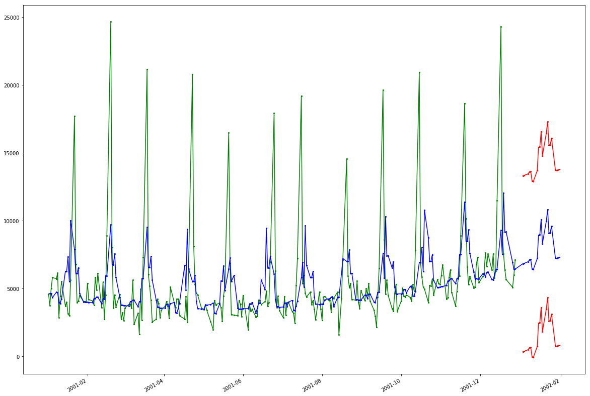
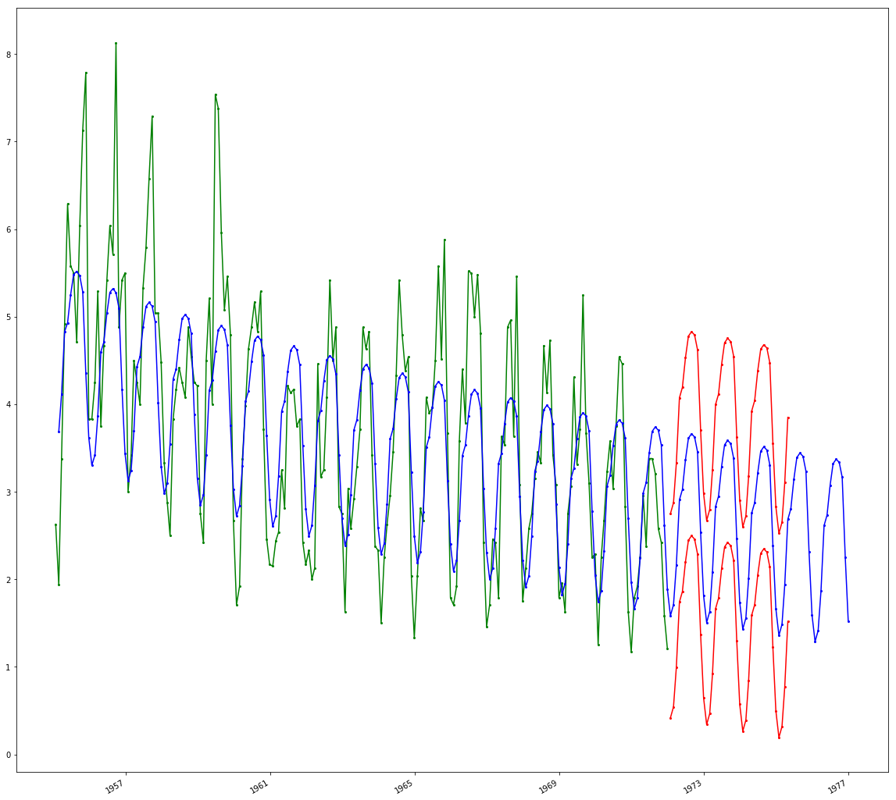

## Details
### You will learn

- Understand the basics about the SAP HANA Automated Predictive Library
- How to call SAP HANA Automated Predictive Library functions from SQL
- Identify which algorithm options are available for recommendation engines

[ACCORDION-BEGIN [Info: ](SAP HANA Automated Predictive Library)]

The ***SAP HANA Automated Predictive Library*** (APL) is an ***Application Function Library*** (AFL) which lets you use the data mining capabilities of the ***SAP Predictive Analytics*** automated analytics engine on your SAP HANA stored data.

With the APL, you can create the following types of models to answer your business questions:

- Classification/Regression models
- Clustering models
- Time series analysis models
- Recommendation models
- Social network analysis models

For more details about the SAP HANA APL function, check the online <a href="https://help.sap.com/viewer/cb31bd99d09747089754a0ba75067ed2/latest/en-US/59b79cbb6beb4607875fa3fe116a8eef.html" target="new">documentation</a>.

[DONE]
[ACCORDION-END]

[ACCORDION-BEGIN [Info: ](Calling APL functions)]

In order to use any ***SAP HANA APL*** functions, ultimately an AFL wrapper must be created and then invoked.

For more details, you can check the [AFL Language Procedures](https://help.sap.com/viewer/4505d0bdaf4948449b7f7379d24d0f0d/latest/en-US/7f630904dfe045beb114a6c25896649f.html) documentation.

Creating and invoking the AFL wrapper is performed by executing ***SAP HANA `SQLScript`***.

Other database objects also need to be created, such as table types or signature table.

There are two techniques for calling APL functions, the ***direct technique*** and the ***procedure technique***.

### **The direct technique**:

This technique consists of explicitly generating an AFL wrapper for the APL function to be executed.

The generation of this AFL wrapper requires the explicit creation of table types, signature table, input and output tables, etc.

This is all supposed to be done by the APL consumer, through SQL DDL & DML statements.

Once the AFL wrapper is generated, it can be invoked through a call statement. This "direct technique" is always available.

However, the ***SAP HANA APL*** installation package includes a script where you can import pre-defined table types (used in the code below) which helps reduce the code size.

Here is a quick code example with the direct technique:

```
-- --------------------------------------------------------------------------
-- Create the table type for the dataset
-- --------------------------------------------------------------------------
drop type training_dataset_t;
create type training_dataset_t as table ( .... );

-- --------------------------------------------------------------------------
-- Create the AFL wrapper corresponding to the target APL function
-- --------------------------------------------------------------------------
drop table create_model_signature;
create column table create_model_signature  like procedure_signature_t;

-- the signature is defined in the APL API documentation
insert into create_model_signature values (1, 'MYSCHEMA','FUNCTION_HEADER_T'  , 'IN');
insert into create_model_signature values (2, 'MYSCHEMA','OPERATION_CONFIG_T' , 'IN');
insert into create_model_signature values (3, 'MYSCHEMA','TRAINING_DATASET_T' , 'IN');
insert into create_model_signature values (4, 'MYSCHEMA','MODEL_BIN_OID_T'    , 'OUT');
insert into create_model_signature values (5, 'MYSCHEMA','VARIABLE_DESC_OID_T', 'OUT');

call sys.afllang_wrapper_procedure_drop('MYSCHEMA','APLWRAPPER_CREATE_MODEL');
call sys.afllang_wrapper_procedure_create('APL_AREA','CREATE_MODEL','MYSCHEMA', 'APLWRAPPER_CREATE_MODEL', create_model_signature);

-- --------------------------------------------------------------------------
-- Create the input/output tables used as arguments for the APL function
-- --------------------------------------------------------------------------
drop table function_header;
create column table function_header like function_header_t;
insert into function_header values ('key', 'value');

drop table operation_config;
create column table operation_config like operation_config_t;
insert into operation_config values ('key', 'value');

drop table trained_model;
create column table trained_model like model_bin_oid_t;

drop table variable_desc;
create column table variable_desc like variable_desc_oid_t;

-- --------------------------------------------------------------------------
-- Execute the APL function using its AFL wrapper and the actual input/output tables
-- --------------------------------------------------------------------------
call aplwrapper_create_model(function_header, operation_config, myschema.training_dataset, trained_model, variable_desc) with overview;
```

### **The procedure technique**:

This technique is not only much simpler than the direct technique, but it's also more efficient and scalable.

Instead of having to deal with the life cycle of the AFL wrappers and all its companion database objects on a per-call basis, the APL user can directly call APL specific stored procedures which take care of all the AFL details.

These APL stored procedures are part of the `HCO_PA_APL` delivery unit which is automatically deployed when installing **SAP HANA APL**.

Here is a quick code example with the procedure technique:

```
SET SESSION 'APL_CACHE_SCHEMA' = 'APL_CACHE';

-- --------------------------------------------------------------------------
-- Create the input/output tables used as arguments for the APL function
-- --------------------------------------------------------------------------
DROP TABLE FUNCTION_HEADER;
CREATE COLUMN TABLE FUNCTION_HEADER LIKE "SAP_PA_APL"."sap.pa.apl.base::BASE.T.FUNCTION_HEADER";
INSERT INTO FUNCTION_HEADER values ('key', 'value');

DROP TABLE OPERATION_CONFIG;
CREATE COLUMN TABLE OPERATION_CONFIG LIKE "SAP_PA_APL"."sap.pa.apl.base::BASE.T.OPERATION_CONFIG_DETAILED";
INSERT INTO OPERATION_CONFIG values ('key', 'value');

DROP TABLE TRAINED_MODEL;
CREATE COLUMN TABLE TRAINED_MODEL LIKE "SAP_PA_APL"."sap.pa.apl.base::BASE.T.MODEL_BIN_OID";

DROP TABLE VARIABLE_DESC;
CREATE COLUMN TABLE VARIABLE_DESC LIKE  "SAP_PA_APL"."sap.pa.apl.base::BASE.T.VARIABLE_DESC_OID";

-- --------------------------------------------------------------------------
-- Execute the APL function using its AFL wrapper and the actual input/output tables
-- --------------------------------------------------------------------------
call "SAP_PA_APL"."sap.pa.apl.base::CREATE_MODEL"(FUNCTION_HEADER, OPERATION_CONFIG, 'MYSCHEMA','TRAINING_DATASET', TRAINED_MODEL, VARIABLE_DESC) with overview;
```

You will use the **procedure technique** in this tutorial.

[DONE]
[ACCORDION-END]

[ACCORDION-BEGIN [Info: ](Time Series analysis with SAP HANA APL)]

As stated previously, the ***SAP HANA Automated Predictive Library*** (APL) uses the data mining capabilities provided by the ***SAP Predictive Analytics*** automated analytics engine.

SAP HANA APL provides a ***Forecast*** function that can address Time Series analysis scenarios.

This algorithm will apply and combine several techniques to your data in order to find the best model. Here is are the techniques used:

 - The default technique of the **SAP Predictive Analytics** Automated Analytics engine
 - The exponential smoothing technique
 - The linear regressions technique

For more information please refer to the online <a href="https://help.sap.com/viewer/cb31bd99d09747089754a0ba75067ed2/latest/en-US/6fd6134bd3974edf8392cc540df47d72.html" target="new">documentation</a>.

[DONE]
[ACCORDION-END]

[ACCORDION-BEGIN [Info: ](SAP HANA APL Forecast function)]

The **SAP HANA APL** function that you will be using is:

- <a href="https://help.sap.com/viewer/cb31bd99d09747089754a0ba75067ed2/latest/en-US/34ec8a14b4a442a29351bb26bb082e6e.html" target="new"><b>Forecast</b></a>

The ***Forecast*** function provides multiple configuration options like:

Name                          | Description
-----------------------------|-----------------------------
**Time Point Column Name**   | Name of the column in the dataset that contains the time points of the time series
**Horizon**                  | Number of forecast time points
**Last Training Time Point** | Value in the time point column which represents the last point in time for the training dataset
**Cutting Strategy**         | The Cutting Strategy defines how a training set is cut under three subsets (training, validation and testing datasets) when needed. Depending on the model (model type, number of targets ...) not all Cutting Strategies can be used. See Automated Analytics documentation for details. ( **optional**)
**Apply Extra Mode**         | Includes error bars with the forecast values. The error bar columns are `kts_1_lowerlimit_95%` and `kts_1_upperlimit_95%`
**Forecast Method**          | Uses a forecast method different from the default Automated Analytics time-series algorithm ( **optional**)
**Forecast Fallback Method** | Sets the method that will be used if the one specified with **Forecast Method** fails, for example when there are too few data points ( **optional**)
**Smoothing Cycle Length**   | Sets the cycle/seasonal length to be used for the smoothing instead of the cycle length candidates automatically determined by the Automated Analytics engine based on the time granularity, for example: month -> 4 (quarterly) or 12 (yearly). ( **optional**)
**Force Positive Forecast**  | Activates a mode where the negative forecasts are ignored, that is, replaced with zero.
**Forecast Max Cyclic**      | Length of the longest cycle the model will try to detect. Controls the way that the model analyzes the periodicities in the signal. Also limited by the size of the training dataset. You can disable the cyclic analysis by setting this parameter to 0. ( **optional**)
**Forecast Max Lags**        | Defines the maximum dependency of the signal on its own past values. Controls the way that the model analyzes the random fluctuations in the signal. You can set this parameter to 0 to disable the fluctuations analysis. ( **optional**)

[DONE]
[ACCORDION-END]

[ACCORDION-BEGIN [Pre-requisite: ](Install SAP HANA APL package)]

If not done yet, you will need to complete the [SAP HANA Automated Predictive Library installation for SAP HANA, express edition](https://www.sap.com/developer/tutorials/hxe-ua-apl-binary.html).

The installation will trigger a restart of your SAP HANA instance, so make sure to save your current work before.

Once the SAP HANA Automated Predictive Library installation is completed, you will need to wait a few minutes for all services to be back online and proceed with the next step.

[DONE]
[ACCORDION-END]

[ACCORDION-BEGIN [Step 1: ](Select, install and configure a SQL query tool)]

As you will mostly execute SQL commands during this tutorial, you will need to setup a SQL query tool for SAP HANA, express edition.

The following tutorial group describes a series of option you can pick one from (you don't need to setup all of them, but one is enough):

 - [Select, install and configure a SQL query tool for SAP HANA, express edition](https://www.sap.com/developer/groups/mlb-hxe-tools-sql.html).

Off course you can use any tool of your choice!

[DONE]
[ACCORDION-END]

[ACCORDION-BEGIN [Step 2: ](Forecast with Cash Flow)]

As stated previously, the Cash Flow data set includes more than just a date and signal to be forecasted. An additional 23 attributes are also available to help build a better model.

With the SAP APL Forecast function, you will first build a model with only the date and cash flow column, and then with the full dataset (using extra predictors). This will allow you to notice the benefit of using such extra predictors when the algorithm permits.

In this execution, input data will be processed from dedicated views (`apl_cashflow_input_data` & `apl_cashflow_input_data_extra_pred`) and the result generated in separate tables (`apl_cashflow_result` & `apl_cashflow_result_extra_pred`).

The provided data includes a series of entries where the cash flow value is not set but with extra predictors available, 21 rows in total.

therefore, you will try to forecast the next 21 data points using the Horizon configuration parameter

Connect to the **HXE** tenant using the **`ML_USER`** user credentials and execute the following series of SQL statements.

### **Clean previous results**

```SQL
-- --------------------------------------------------------------------------
-- Cleanup SAPL objects
-- --------------------------------------------------------------------------
call sap_pa_apl."sap.pa.apl.base::CLEANUP"(1,?);
-- --------------------------------------------------------------------------
-- Drop function in/out tables, helper tables and views
-- --------------------------------------------------------------------------
drop table apl_cashflow_function_header;
drop table apl_cashflow_operation_config;
drop table apl_cashflow_variable_desc;
drop table apl_cashflow_variable_roles;
drop table apl_cashflow_operation_log;
drop table apl_cashflow_summary;
drop table apl_cashflow_indicators;
drop table apl_cashflow_result;
drop table apl_cashflow_result_extra_pred;
drop view  apl_cashflow_input_data;
drop view  apl_cashflow_input_data_extra_pred;
```

> ### **Note**
>You may receive a series of errors and warnings in the console log while running the above code. They should all be related to the drop statements at the beginning which are intended to help you re-run the script if needed.

### **Create input and output table structures**

```SQL
-- --------------------------------------------------------------------------
-- Create generic tables
-- --------------------------------------------------------------------------
create column table apl_cashflow_function_header   like sap_pa_apl."sap.pa.apl.base::BASE.T.FUNCTION_HEADER";
create column table apl_cashflow_operation_config  like sap_pa_apl."sap.pa.apl.base::BASE.T.OPERATION_CONFIG_DETAILED";
create column table apl_cashflow_variable_desc     like sap_pa_apl."sap.pa.apl.base::BASE.T.VARIABLE_DESC_OID";
create column table apl_cashflow_variable_roles    like sap_pa_apl."sap.pa.apl.base::BASE.T.VARIABLE_ROLES_WITH_COMPOSITES_OID";
create column table apl_cashflow_operation_log     like sap_pa_apl."sap.pa.apl.base::BASE.T.OPERATION_LOG";
create column table apl_cashflow_summary           like sap_pa_apl."sap.pa.apl.base::BASE.T.SUMMARY";
create column table apl_cashflow_indicators        like sap_pa_apl."sap.pa.apl.base::BASE.T.INDICATORS";
-- --------------------------------------------------------------------------
-- Create input view and result table
-- --------------------------------------------------------------------------
create view apl_cashflow_input_data            as select cashdate, cash from forecast_cashflow order by cashdate asc;
create view apl_cashflow_input_data_extra_pred as select *              from forecast_cashflow order by cashdate asc;

create column table apl_cashflow_result (
   cashdate daydate
  ,cash     double
  ,kts_1    double
  ,"kts_1_lowerlimit_95%" double
  ,"kts_1_upperlimit_95%" double    
);
create column table apl_cashflow_result_extra_pred  like apl_cashflow_result;
```

### **Set the algorithm parameters**

```SQL
-- --------------------------------------------------------------------------
-- Configuration
-- --------------------------------------------------------------------------
truncate table apl_cashflow_function_header;
insert into apl_cashflow_function_header values ('Oid', '#1');
insert into apl_cashflow_function_header values ('LogLevel', '8');

truncate table apl_cashflow_operation_config;
insert into apl_cashflow_operation_config values ('APL/TimePointColumnName'   , 'CASHDATE'                 , null);
insert into apl_cashflow_operation_config values ('APL/ApplyExtraMode'        , 'Forecasts and Error Bars' , null);
insert into apl_cashflow_operation_config values ('APL/LastTrainingTimePoint' , '2001-12-28', null);
insert into apl_cashflow_operation_config values ('APL/Horizon'               , '21'        , null);

truncate table apl_cashflow_variable_desc;
insert into apl_cashflow_variable_desc values (0, 'CASHDATE' , 'datetime' , 'continuous', 1, 1, null, null, null, null);
insert into apl_cashflow_variable_desc values (1, 'CASH'     , 'number'   , 'continuous', 0, 0, null, null, null, null);

truncate table apl_cashflow_variable_roles;
insert into apl_cashflow_variable_roles values ('CASHDATE'  , 'input' , NULL, NULL, '#1');
insert into apl_cashflow_variable_roles values ('CASH'      , 'target', NULL, NULL, '#1');

select * from apl_cashflow_operation_config;
```

### **Run the algorithm with "No Extra Predictors"**

```SQL
-- --------------------------------------------------------------------------
-- Clean result tables
-- --------------------------------------------------------------------------
truncate table apl_cashflow_result;
truncate table apl_cashflow_operation_log;
truncate table apl_cashflow_summary;
truncate table apl_cashflow_indicators;
-- --------------------------------------------------------------------------
-- Execute the APL function to train the model with the dataset
-- --------------------------------------------------------------------------
call sap_pa_apl."sap.pa.apl.base::FORECAST" (
    apl_cashflow_function_header
  , apl_cashflow_operation_config
  , apl_cashflow_variable_desc
  , apl_cashflow_variable_roles
  , current_schema, 'APL_CASHFLOW_INPUT_DATA'
  , current_schema, 'APL_CASHFLOW_RESULT'
  , apl_cashflow_operation_log
  , apl_cashflow_summary
  , apl_cashflow_indicators
) with overview;
```

#### **Check the logs, indicators, summary and results**

##### **The operation log**

When performing an APL operation, especially training or applying a model, the Automated Analytics engine produces status/warning/error messages.

These messages are returned from an APL function through an output database table.

```sql
select * from apl_cashflow_operation_log;
```

If you look at the output you will find interesting about the overall modeling process :

 - **Automated model learning**

 Using the following SQL, you can see that the process is actually creating multiple models:

```SQL
select * from apl_cashflow_operation_log where message like 'Model%' or message like 'The model %';
```

 - **Outlier detection**

 Using the following SQL, you can see that an outlier detection process is applied at various steps

```SQL
select * from apl_cashflow_operation_log where message like '%outlier%';
```

 - **Final Model selection**

 At the end of the process, you will get details about the selected model, its performance, and components (trend, fluctuation, cycles, etc.)

```
The final model is (Sum(Regression[CASH][CASHDATE,SquareTime,SquareRootTime],Sum(dayOfMonth(NotSmoothed)))).
The final model maximal horizon is (21), its complexity is (4).
The final model Minimum Pearson (P2) over the horizon is (0.16883962105749536), its cumulative mean square error is (69473.283402336485).
Other performance indicators for the final model are: L1=(39846.556124256829) and MAPE=(5.3496095143430846).
Fit performance on validation: P2=0.16883962105749536 L2=3308.2515905874502
Last forecast(=21) performance on validation: \tP2=0.16883962105749536 L2=3308.2515905874502
Chosen model is (Polynomial)
Chosen trend is (Polynom( CASHDATE))
Chosen periodicity is (dayOfMonth(NotSmoothed))
No modeled fluctuations
Time series learning phase finished
Learning time: 2 seconds
Total elapsed time: 2 seconds.
Checking internal state.
Beginning of applying model. Please wait...
Total elapsed time: 0 seconds.
```

#### **The summary**

When training or applying a model, debriefing information related to the operation is produced which  is known as the summary.

This information includes a set of indicators, provided as string pairs { KEY, VALUE }.

The details are also provided as part of the operation logs.

```sql
select * from apl_cashflow_summary;
```

One of the interesting information here is the **`ModelTimeSeriesMAPE`** which inform you about the overall prediction performance.

With the current setting the value is around **0.25**.

#### **The indicators**

When training, testing or querying a model, it's possible to retrieve variable indicators (i.e. variable statistics).

For each variable, a collection of indicators may be retrieved. These indicators are described using the following attributes: { variable name, indicator name, indicator value, indicator detail (when applicable) }.

```sql
select * from apl_cashflow_indicators;
```

With the Forecast algorithm, you can get the following indicators:

 - Time Series components (Trends, Cycles & Fluctuations)
 - The MAPE (Mean Absolute Percentage Error) for each forecasted values
 - A set of statistical information about the signal

More importantly, using the following SQL, you will be able to check the Time Series components detected for you models:  

```sql
select oid, key, max(to_nvarchar(value)) as value
from apl_cashflow_indicators
where key in ('Trend', 'Fluctuations', 'Cycles', 'MAPE')
group by oid, key
order by key;
```

#### **The results**

From this model, you can now check the result which are stored in the **`apl_cashflow_result`** table using the following SQL:

```SQL
select
      c.cashdate
    , c.cash
    , kts_1                  as forecast
    , "kts_1_lowerlimit_95%" as lower_limit
    , "kts_1_upperlimit_95%" as upper_limit
from
     forecast_cashflow c
join apl_cashflow_result f
on   c.cashdate = f.cashdate
order by c.cashdate asc;
```

You can notice that:

 - The forecast ( **`kts_1`** value) is provided for almost all data points in the training set (where cash is not null).
 However, this is not always the case. A forecast ( **`kts_1`** value) is provided only for data points that are finally used during the training as all input data points are not always used in the final model.
 - The error bar (**`kts_1_lowerlimit_95%`** and **`kts_1_upperlimit_95%`**) are only provided for the actual predictions

Here is a graphical representation of the results:



Where you have:

 - the training data set (green)
 - the forecasted values (blue)
 - the error bar (red)

The above graph was generated using the following Python code:

```python
forecast = %sql select \
      c.cashdate \
    , c.cash \
    , kts_1                  as forecast \
    , "kts_1_lowerlimit_95%" as lower_limit \
    , "kts_1_upperlimit_95%" as upper_limit \
from \
     forecast_cashflow c \
join apl_cashflow_result f \
on   c.cashdate = f.cashdate \
order by c.cashdate asc;

cashdate         = matplotlib.dates.date2num(forecast.cashdate)

fig, ax = plt.subplots()
ax.plot(cashdate, forecast.cash       , 'ro-', markersize=2, color='green')
ax.plot(cashdate, forecast.forecast   , 'ro-', markersize=2, color='blue')
ax.plot(cashdate, forecast.lower_limit, 'ro-', markersize=2, color='red')
ax.plot(cashdate, forecast.upper_limit, 'ro-', markersize=2, color='red')
ax.xaxis_date()

fig.autofmt_xdate()
fig.set_size_inches(20, 15)
plt.show()
```

Now let's run the same algorithm but the **"Extra Predictors"**

### **Run the algorithm  with "Extra Predictors"**

In order to best use the extra predictor, you will add the variable description which is not mandatory (but will definitely improves the accuracy if done properly).
If you don't provide the variable description, it will be guess based on data sample that will be extracted at the beginning of the modeling process.

```sql
truncate table apl_cashflow_function_header;
insert into apl_cashflow_function_header values ('Oid', '#2');
insert into apl_cashflow_function_header values ('LogLevel', '8');

truncate table apl_cashflow_variable_desc;
insert into apl_cashflow_variable_desc values ( 0, 'CASHDATE'                  , 'datetime', 'continuous', 1, 1, null, null, null, null);  
insert into apl_cashflow_variable_desc values ( 1, 'WORKINGDAYSINDICES'        , 'number'  , 'continuous', 0, 0, null, null, null, null);  
insert into apl_cashflow_variable_desc values ( 2, 'REVERSEWORKINGDAYSINDICES' , 'number'  , 'continuous', 0, 0, null, null, null, null);  
insert into apl_cashflow_variable_desc values ( 3, 'MONDAYMONTHIND'            , 'number'  , 'ordinal'   , 0, 0, null, null, null, null);  
insert into apl_cashflow_variable_desc values ( 4, 'TUESDAYMONTHIND'           , 'number'  , 'ordinal'   , 0, 0, null, null, null, null);  
insert into apl_cashflow_variable_desc values ( 5, 'WEDNESDAYMONTHIND'         , 'number'  , 'ordinal'   , 0, 0, null, null, null, null);  
insert into apl_cashflow_variable_desc values ( 6, 'THURSDAYMONTHIND'          , 'number'  , 'ordinal'   , 0, 0, null, null, null, null);  
insert into apl_cashflow_variable_desc values ( 7, 'FRIDAYMONTHIND'            , 'number'  , 'ordinal'   , 0, 0, null, null, null, null);  
insert into apl_cashflow_variable_desc values ( 8, 'BEFORELASTMONDAY'          , 'number'  , 'nominal'   , 0, 0, null, null, null, null);  
insert into apl_cashflow_variable_desc values ( 9, 'LASTMONDAY'                , 'number'  , 'nominal'   , 0, 0, null, null, null, null);  
insert into apl_cashflow_variable_desc values ( 10, 'BEFORELASTTUESDAY'        , 'number'  , 'nominal'   , 0, 0, null, null, null, null);  
insert into apl_cashflow_variable_desc values ( 11, 'LASTTUESDAY'              , 'number'  , 'nominal'   , 0, 0, null, null, null, null);  
insert into apl_cashflow_variable_desc values ( 12, 'BEFORELASTWEDNESDAY'      , 'number'  , 'nominal'   , 0, 0, null, null, null, null);  
insert into apl_cashflow_variable_desc values ( 13, 'LASTWEDNESDAY'            , 'number'  , 'nominal'   , 0, 0, null, null, null, null);  
insert into apl_cashflow_variable_desc values ( 14, 'BEFORELASTTHURSDAY'       , 'number'  , 'nominal'   , 0, 0, null, null, null, null);  
insert into apl_cashflow_variable_desc values ( 15, 'LASTTHURSDAY'             , 'number'  , 'nominal'   , 0, 0, null, null, null, null);  
insert into apl_cashflow_variable_desc values ( 16, 'BEFORELASTFRIDAY'         , 'number'  , 'nominal'   , 0, 0, null, null, null, null);  
insert into apl_cashflow_variable_desc values ( 17, 'LASTFRIDAY'               , 'number'  , 'nominal'   , 0, 0, null, null, null, null);  
insert into apl_cashflow_variable_desc values ( 18, 'LAST5WDAYSIND'            , 'number'  , 'ordinal'   , 0, 0, null, null, null, null);  
insert into apl_cashflow_variable_desc values ( 19, 'LAST5WDAYS'               , 'number'  , 'nominal'   , 0, 0, null, null, null, null);  
insert into apl_cashflow_variable_desc values ( 20, 'LAST4WDAYSIND'            , 'number'  , 'ordinal'   , 0, 0, null, null, null, null);  
insert into apl_cashflow_variable_desc values ( 21, 'LAST4WDAYS'               , 'number'  , 'nominal'   , 0, 0, null, null, null, null);  
insert into apl_cashflow_variable_desc values ( 22, 'LASTWMONTH'               , 'number'  , 'nominal'   , 0, 0, null, null, null, null);  
insert into apl_cashflow_variable_desc values ( 23, 'BEFORELASTWMONTH'         , 'number'  , 'nominal'   , 0, 0, null, null, null, null);  
insert into apl_cashflow_variable_desc values ( 24, 'CASH'                     , 'number'  , 'continuous', 0, 0, null, null, null, null);  

TRUNCATE TABLE "APL_CASHFLOW_RESULT";
-- --------------------------------------------------------------------------
-- Execute the APL function to train the model with the dataset
-- --------------------------------------------------------------------------
call sap_pa_apl."sap.pa.apl.base::FORECAST" (
    apl_cashflow_function_header
  , apl_cashflow_operation_config
  , apl_cashflow_variable_desc
  , apl_cashflow_variable_roles
  , current_schema, 'APL_CASHFLOW_INPUT_DATA_EXTRA_PRED'
  , current_schema, 'APL_CASHFLOW_RESULT_EXTRA_PRED'
  , apl_cashflow_operation_log
  , apl_cashflow_summary
  , apl_cashflow_indicators
) with overview;
```

#### **Check the logs, indicators, summary and results and compare**

For this second execution, all logs, indicators and summary are stored under the **OID** **`#2`**.

##### **The operation log**

You can get the operation log using the following SQL:

```sql
select * from apl_cashflow_operation_log where oid = '#2';
```

If you look at the output you will find interesting about the overall modeling process :

 - **Automated model learning**

 Using the following SQL, you can see that the process is actually creating multiple models:

```SQL
select * from apl_cashflow_operation_log where  oid = '#2' and (message like 'Model%' or message like 'The model %');
```

 - **Outlier detection**

 Using the following SQL, you can see that an outlier detection process is applied at various steps

```SQL
select * from apl_cashflow_operation_log where oid = '#2' and message like '%outlier%';
```

 - **Final Model selection**

 At the end of the process, you will get details about the selected model, its performance, and components (trend, fluctuation, cycles, etc.)

```
The final model is (Sum(Regression[CASH][CASHDATE,SquareTime,SquareRootTime],Sum(PeriodicExtrasPred_MONDAYMONTHIND))).
The final model maximal horizon is (21), its complexity is (4).
The final model Minimum Pearson (P2) over the horizon is (0.86845683391848461), its cumulative mean square error is (27846.104104407703).
Other performance indicators for the final model are: L1=(19597.302290488449) and MAPE=(2.9348005580143428).
Fit performance on validation: P2=0.86845683391848461 L2=1326.0049573527481
Last forecast(=21) performance on validation: \tP2=0.86845683391848461 L2=1326.0049573527481
Chosen model is (Polynomial)
Chosen trend is (Polynom( CASHDATE))
Chosen periodicity is (PeriodicExtrasPred_MONDAYMONTHIND)
No modeled fluctuations
Time series learning phase finished
Learning time: 7 seconds
Total elapsed time: 7 seconds.
Checking internal state.
Beginning of applying model. Please wait...
Total elapsed time: 0 seconds.

```

#### **The summary**

```sql
select * from apl_cashflow_summary where oid = '#2';
```

With the current setting, the value of the **`ModelTimeSeriesMAPE`** is around **0.14** which is almost half of the one from the previous execution.

#### **The indicators**

```sql
select * from apl_cashflow_indicators where oid = '#2';
```

More importantly, using the following SQL, you will be able to check the differences in the Time Series components detected for both models:  

```sql
select oid, key, max(to_nvarchar(value)) as value
from apl_cashflow_indicators
where key in ('Trend', 'Fluctuations', 'Cycles', 'MAPE')
group by oid, key
order by key;
```

The result should be:

OID  | key          | value
-----|--------------|---------------
1    | Cycles       | `dayOfMonth(NotSmoothed)`
2    | Cycles       | `PeriodicExtrasPred_MONDAYMONTHIND`
1    | Fluctuations | None
2    | Fluctuations | None
1    | MAPE         | 0.25474331020681362
2    | MAPE         | 0.13975240752449256
1    | Trend        | `Polynom(CASHDATE)`
2    | Trend        | `Polynom(CASHDATE)`

#### **The results**

From this model, you can now check the result which are stored in the **`apl_cashflow_result_extra_pred`** table using the following SQL:

```SQL
select
      c.cashdate
    , c.cash
    , kts_1                  as forecast
    , "kts_1_lowerlimit_95%" as lower_limit
    , "kts_1_upperlimit_95%" as upper_limit
from
     forecast_cashflow c
join apl_cashflow_result_extra_pred f
on   c.cashdate = f.cashdate
order by c.cashdate asc;
```

Here is a graphical representation of the results:


Provide an answer to the question below then click on **Validate**.

[VALIDATE_1]
[ACCORDION-END]

[ACCORDION-BEGIN [Step 2: ](Forecast with Ozone)]

As stated previously, the Los Angeles Ozone data presents monthly averages of hourly ozone (O3) readings in downtown Los Angeles from 1955 to 1972.

The provided data are available on a monthly basis over a period of 17 years.

In this example, you will try to forecast the next 5 years (or 60 months) using the Horizon configuration parameter.

Connect to the **HXE** tenant using the **`ML_USER`** user credentials and execute the following series of SQL statements.

### **Clean previous results**

```SQL
-- --------------------------------------------------------------------------
-- Cleanup SAPL objects
-- --------------------------------------------------------------------------
call sap_pa_apl."sap.pa.apl.base::CLEANUP"(1,?);
-- --------------------------------------------------------------------------
-- Drop function in/out tables, helper tables and views
-- --------------------------------------------------------------------------
drop table apl_ozone_function_header;
drop table apl_ozone_operation_config;
drop table apl_ozone_variable_desc;
drop table apl_ozone_variable_roles;
drop table apl_ozone_operation_log;
drop table apl_ozone_summary;
drop table apl_ozone_indicators;
drop table apl_ozone_result;
```

> ### **Note**
>You may receive a series of errors and warnings in the console log while running the above code. They should all be related to the drop statements at the beginning which are intended to help you re-run the script if needed.

### **Create input and output table structures**

```SQL
-- --------------------------------------------------------------------------
-- Create generic tables
-- --------------------------------------------------------------------------
create column table apl_ozone_function_header   like sap_pa_apl."sap.pa.apl.base::BASE.T.FUNCTION_HEADER";
create column table apl_ozone_operation_config  like sap_pa_apl."sap.pa.apl.base::BASE.T.OPERATION_CONFIG_DETAILED";
create column table apl_ozone_variable_desc     like sap_pa_apl."sap.pa.apl.base::BASE.T.VARIABLE_DESC_OID";
create column table apl_ozone_variable_roles    like sap_pa_apl."sap.pa.apl.base::BASE.T.VARIABLE_ROLES_WITH_COMPOSITES_OID";
create column table apl_ozone_operation_log     like sap_pa_apl."sap.pa.apl.base::BASE.T.OPERATION_LOG";
create column table apl_ozone_summary           like sap_pa_apl."sap.pa.apl.base::BASE.T.SUMMARY";
create column table apl_ozone_indicators        like sap_pa_apl."sap.pa.apl.base::BASE.T.INDICATORS";
-- --------------------------------------------------------------------------
-- Create result table
-- --------------------------------------------------------------------------
create column table apl_ozone_result (
   time    daydate
  ,reading double
  ,kts_1   double
  ,"kts_1_lowerlimit_95%" double
  ,"kts_1_upperlimit_95%" double    
);
```

### **Set the algorithm parameters**

```SQL
-- --------------------------------------------------------------------------
-- Configuration
-- --------------------------------------------------------------------------
truncate table apl_ozone_function_header;
insert into apl_ozone_function_header values ('Oid', '#1');
insert into apl_ozone_function_header values ('LogLevel', '8');

truncate table apl_ozone_operation_config;
insert into apl_ozone_operation_config values ('APL/TimePointColumnName'   , 'TIME'                     , null);
insert into apl_ozone_operation_config values ('APL/ApplyExtraMode'        , 'Forecasts and Error Bars' , null);
insert into apl_ozone_operation_config values ('APL/LastTrainingTimePoint' , '1971-12-28', null);
insert into apl_ozone_operation_config values ('APL/Horizon'               , '60'        , null);

truncate table apl_ozone_variable_desc;
insert into apl_ozone_variable_desc values (0, 'TIME'    , 'datetime' , 'continuous', 1, 1, null, null, null, null);
insert into apl_ozone_variable_desc values (1, 'READING' , 'number'   , 'continuous', 0, 0, null, null, null, null);

truncate table apl_ozone_variable_roles;
insert into apl_ozone_variable_roles values ('TIME'    , 'input' , NULL, NULL, '#1');
insert into apl_ozone_variable_roles values ('READING' , 'target', NULL, NULL, '#1');

select * from apl_ozone_operation_config;
```

### **Run the algorithm**

```SQL
-- --------------------------------------------------------------------------
-- Clean result tables
-- --------------------------------------------------------------------------
truncate table apl_ozone_result;
truncate table apl_ozone_operation_log;
truncate table apl_ozone_summary;
truncate table apl_ozone_indicators;
-- --------------------------------------------------------------------------
-- Execute the APL function to train the model with the minimal dataset
-- --------------------------------------------------------------------------
call sap_pa_apl."sap.pa.apl.base::FORECAST" (
    apl_ozone_function_header
  , apl_ozone_operation_config
  , apl_ozone_variable_desc
  , apl_ozone_variable_roles
  , current_schema, 'FORECAST_OZONE'
  , current_schema, 'APL_OZONE_RESULT'
  , apl_ozone_operation_log
  , apl_ozone_summary
  , apl_ozone_indicators
) with overview;
```

#### **Check the logs, indicators, summary and results**

##### **The operation log**

When performing an APL operation, especially training or applying a model, the Automated Analytics engine produces status/warning/error messages.

These messages are returned from an APL function through an output database table.

```sql
select * from apl_ozone_operation_log;
```

If you look at the output you will find interesting about the overall modeling process :

 - **Automated model learning**

 Using the following SQL, you can see that the process is actually creating multiple models:

```SQL
select * from apl_ozone_operation_log where message like 'Model%' or message like 'The model %';
```

 - **Outlier detection**

 Using the following SQL, you can see that an outlier detection process is applied at various steps

```SQL
select * from apl_ozone_operation_log where message like '%outlier%';
```

 - **Final Model selection**

 At the end of the process, you will get details about the selected model, its performance, and components (trend, fluctuation, cycles, etc.)

```
The final model is (Sum(Regression[READING][TIME,SquareTime,SquareRootTime],Sum(12))).
The final model maximal horizon is (40), its complexity is (4).
The final model Minimum Pearson (P2) over the horizon is (0.67011382539015796), its cumulative mean square error is (23.792513356764712).
Other performance indicators for the final model are: L1=(18.68302265007349) and MAPE=(7.3088322498195986).
Fit performance on validation: P2=0.67011382539015796 L2=0.59481283391911766
Last forecast(=40) performance on validation: \tP2=0.67011382539015796 L2=0.59481283391911766
The maximal confident horizon of the final model is 40. This is less than the requested horizon of 60.
Chosen model is (Polynomial)
Chosen trend is (Polynom( TIME))
Chosen periodicity is (12)
No modeled fluctuations
Time series learning phase finished
Learning time: 5 seconds
Total elapsed time: 5 seconds.
Checking internal state.
Beginning of applying model. Please wait...
Total elapsed time: 0 sec
```

As you can notice the model computed the maximum horizon (40), which implies that the accuracy above this horizon is not guaranteed.

#### **The summary**

```sql
select * from apl_ozone_summary;
```

One of the interesting indicator is the **`ModelTimeSeriesMAPE`** which inform you about the overall prediction performance.

With the current setting the value is around **0.18**.

#### **The indicators**

```sql
select * from apl_ozone_indicators;
```

With the Forecast algorithm, you can get the following indicators:

 - Time Series components (Trends, Cycles & Fluctuations)
 - The MAPE (Mean Absolute Percentage Error) for each forecasted values
 - A set of statistical information about the signal

Using the following SQL, you will be able to check the Time Series components detected for you models:  

```sql
select oid, key, max(to_nvarchar(value)) as value
from apl_ozone_indicators
where key in ('Trend', 'Fluctuations', 'Cycles', 'MAPE')
group by oid, key
order by key;
```

#### **The results**

From this model, you can now check the result which are stored in the **`apl_cashflow_result`** table using the following SQL:

```SQL
select
      f.time
    , c.reading
    , kts_1                  as forecast
    , "kts_1_lowerlimit_95%" as lower_limit
    , "kts_1_upperlimit_95%" as upper_limit
from
     apl_ozone_result f
left outer join forecast_ozone c
on   c.time = f.time
order by f.time asc;
```

Here is a graphical representation of the results:



Where you have:

 - the training data set (green)
 - the forecasted values (blue)
 - the error bar (red)

You can notice that the error bar is only available till the forecast has reached the maximum horizon.

The above graph was generated using the following Python code:

```python
forecast = %sql select \
      f.time \
    , c.reading \
    , kts_1                  as forecast \
    , "kts_1_lowerlimit_95%" as lower_limit \
    , "kts_1_upperlimit_95%" as upper_limit \
from \
     apl_ozone_result f \
left outer join forecast_ozone c \
on   c.time = f.time \
order by f.time asc;

time         = matplotlib.dates.date2num(forecast.time)

fig, ax = plt.subplots()
ax.plot(time, forecast.reading    , 'ro-', markersize=2, color='green')
ax.plot(time, forecast.forecast   , 'ro-', markersize=2, color='blue')
ax.plot(time, forecast.lower_limit, 'ro-', markersize=2, color='red')
ax.plot(time, forecast.upper_limit, 'ro-', markersize=2, color='red')
ax.xaxis_date()

fig.autofmt_xdate()
fig.set_size_inches(20, 20)
plt.show()
```

Provide an answer to the question below then click on **Validate**.

[VALIDATE_2]
[ACCORDION-END]

> ### **Note** If you are using Jupyter Notebook, you can download the following notebooks to run most of the SQL statement listed in the tutorial:
>
- [CashFlow](https://raw.githubusercontent.com/SAPDocuments/Tutorials/master/tutorials/hxe-aa-forecast-sql-04/hxe-aa-forecast-sql-04-CashFlow.ipynb)
- [Ozone](https://raw.githubusercontent.com/SAPDocuments/Tutorials/master/tutorials/hxe-aa-forecast-sql-04/hxe-aa-forecast-sql-04-Ozone.ipynb)
- [Lag 1 And Cycles](https://raw.githubusercontent.com/SAPDocuments/Tutorials/master/tutorials/hxe-aa-forecast-sql-04/hxe-aa-forecast-sql-04-Lag1AndCycles.ipynb)
- [Trend And Cyclic](https://raw.githubusercontent.com/SAPDocuments/Tutorials/master/tutorials/hxe-aa-forecast-sql-04/hxe-aa-forecast-sql-04-TrendAndCyclic.ipynb)

For the purpose of this tutorial series we will not play further with the algorithm, its parameters or the data. However you are more than welcome to do so considering the resources currently made available to you on the SAP Cloud Platform.
