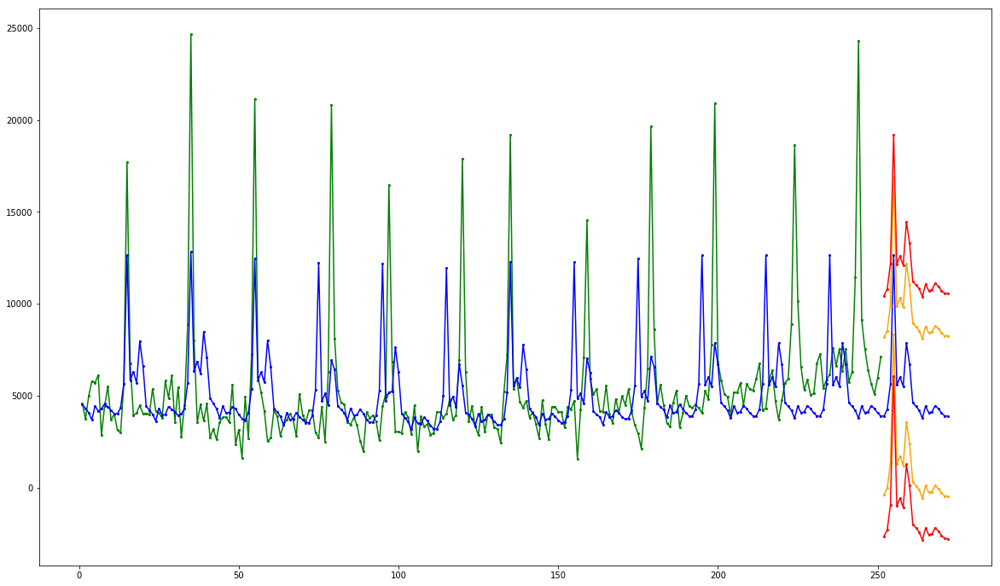

## Prerequisites
 - [Use Machine Learning to Build a Time Series model using SQL](https://developers.sap.com/group.hxe-aa-forecast-sql.html)

## Details
### You will learn
- Understand the basics about the SAP HANA Predictive Analytics Library
- How to call SAP HANA Predictive Analytics Library functions from SQL
- Identify which algorithm options are available for recommendation engines

[ACCORDION-BEGIN [Info: ](SAP HANA Predictive Analytics Library)]

The ***SAP HANA Predictive Analytics Library*** (PAL) is an ***Application Function Library*** (AFL) which defines a set of functions that can be called from within ***SAP HANA SQL Script*** (an extension of SQL) to perform analytic algorithms.

The Predictive Analysis Library (PAL) defines functions that can be called from within ***SQL Script*** procedures to perform analytic algorithms and includes classic and universal predictive analysis algorithms in the following data-mining categories:

- Clustering
- Classification
- Regression
- Association
- Time Series
- Preprocessing
- Statistics
- Social Network Analysis
- Miscellaneous

With over 90 algorithm functions across the above data-mining categories, the ***SAP HANA Predictive Analytics Library*** has been built and enhanced upon on the following goals:

- provide the required algorithms for SAP HANA applications features
- provide the most commonly used algorithms based on market surveys
- provide a set of algorithms generally available in other database or processing platforms

For more details about the PAL function, check the online <a href="https://help.sap.com/viewer/2cfbc5cf2bc14f028cfbe2a2bba60a50/latest/en-US/f652a8186a144e929a1ade7a3cb7abe8.html" target="new">documentation</a>..

[DONE]
[ACCORDION-END]

[ACCORDION-BEGIN [Info: ](Calling PAL functions)]

In order to use an ***SAP HANA PAL*** function in SAP HANA, ultimately an AFL wrapper must be created and then invoked.

Creating and invoking the AFL wrapper is performed by executing ***SAP HANA `SQLScript`***.

Other database objects also need to be created, such as table types or signature table.

Just like with the SAP HANA APL, there are two techniques for calling PAL functions, the ***direct technique*** and the ***procedure technique***.

### **The direct technique**:

This technique consists of explicitly generating an AFL wrapper for the PAL function to be executed.

The generation of this AFL wrapper requires the explicit creation of table types, signature table, input and output tables, etc.

This is all supposed to be done by the PAL consumer, through SQL DDL & DML statements.

Once the AFL wrapper is generated, it can be invoked through a call statement. This "direct technique" is always available.

Here is a quick code example with the direct technique:

```
-- --------------------------------------------------------------------------
-- Create the table type for the dataset, parameters etc...
-- --------------------------------------------------------------------------
drop type training_dataset_t;
create type training_dataset_t as table ( .... );

drop type parameter_t;
create type parameter_t as table ( .... );

-- --------------------------------------------------------------------------
-- Create the AFL wrapper corresponding to the target APL function
-- --------------------------------------------------------------------------
drop table create_model_signature;
create column table create_model_signature  like procedure_signature_t;

-- the signature is defined in the APL API documentation
insert into create_model_signature values (1, 'MYSCHEMA','TRAINING_DATASET_T'  , 'IN');
insert into create_model_signature values (2, 'MYSCHEMA','PARAMETER_T' , 'IN');
<other in and output signature elements>

call sys.afllang_wrapper_procedure_drop('MYSCHEMA','APLWRAPPER_CREATE_MODEL');
call sys.afllang_wrapper_procedure_create('AFLPAL','<PAL function name>','MYSCHEMA', 'APLWRAPPER_FUNCTION', create_model_signature);

-- --------------------------------------------------------------------------
-- Create the input/output tables used as arguments for the APL function
-- --------------------------------------------------------------------------
drop table parameter;
create column table parameter like parameter_t;
insert into parameter values ('key', 'value');

-- --------------------------------------------------------------------------
-- Execute the APL function using its AFL wrapper and the actual input/output tables
-- --------------------------------------------------------------------------
call aplwrapper_function(training_dataset, parameter, [other signature elements]) with overview;
```

For more information please refer to the online <a href="https://help.sap.com/viewer/2cfbc5cf2bc14f028cfbe2a2bba60a50/1.0.12/en-US" target="new">documentation</a>..

### **The procedure technique**:

This technique is not only much simpler than the direct technique, but it's also more efficient and scalable.

Instead of having to deal with the life cycle of the AFL wrappers and all its companion database objects on a per-call basis, the PAL user can directly call PAL specific stored procedures which take care of all the AFL details.

These PAL stored procedures are part of the default installation and available under the **``**.

Here is a quick code example with the procedure technique:

```
-- --------------------------------------------------------------------------
-- Create the AFL wrapper corresponding to the target PAL function
-- --------------------------------------------------------------------------
drop table pal_parameter_tbl;
create table pal_parameter_tbl (
	param_name  varchar(100),
	int_value integer,
	double_value double,
	string_value varchar (100)
);

insert into pal_parameter_tbl values ('MIN_SUPPORT', null, 0.1, null);
insert into pal_parameter_tbl values ('MIN_CONFIDENCE', null, 0.3, null);
insert into pal_parameter_tbl values ('MIN_LIFT', null, 1.1, null);
insert into pal_parameter_tbl values ('MAX_CONSEQUENT', 1, null, null);
insert into pal_parameter_tbl values ('PMML_EXPORT', 1, null, null);

drop table pal_apriori_trans_tbl;
create column table pal_apriori_trans_tbl (
	customer integer,
	item varchar(20)
);

insert into pal_apriori_trans_tbl values (<customer>, <item>);

-- --------------------------------------------------------------------------
-- Execute the PAL function using its AFL wrapper and the actual input/output tables
-- --------------------------------------------------------------------------
call _sys_afl.pal_apriori(pal_apriori_trans_tbl, pal_parameter_tbl, ?, ?); with overview;
```

We will use the **procedure technique** in this tutorial.


[DONE]
[ACCORDION-END]

[ACCORDION-BEGIN [Info: ](Time Series with SAP HANA PAL)]

As stated above, the ***SAP HANA Predictive Analytics Library*** (PAL) delivers over a hundred of ***best in class industry standard*** algorithms.

There are multiple Time Series algorithms that can be used in PAL, but here are the one you will be looking at:

 - **ARIMA** (Auto Regressive Integrated Moving Average)
 - **Auto ARIMA**: identifies the orders of an ARIMA model
 - **Single Exponential Smoothing**: suitable to model the time series without a trend and a seasonal component.
 - **Double Exponential Smoothing**: suitable to model the time series with a trend but without a seasonal component.
 - **Triple Exponential Smoothing**: suitable to model the time series containing a trend and a seasonal component.
 - **Auto Exponential Smoothing**: calculate optimal parameters for Single, Double and Triple Exponential Smoothing functions

However, before selecting one, you will need to address the existence of a trend, a seasonal component or white noise which can be achieved using the **Seasonality Test** function.

[DONE]
[ACCORDION-END]

[ACCORDION-BEGIN [Step 2: ](Create configuration table and input data views)]

In order to proceed whit the next steps, you will first need to create a series of tables and views that will be reused over the rest of the tutorial.

Connect to the **HXE** tenant using the **`ML_USER`** user credentials and execute the following series of SQL statements.

### **Drop previous tables and views**

```sql
-- --------------------------------------------------------------------------
-- Drop configuration tables and input data views
-- --------------------------------------------------------------------------
drop table pal_operation_config;

drop view  pal_input_data_cashflow;
drop view  pal_input_data_ozone;
```
> ### **Note**
>You may receive a series of errors and warnings in the console log while running the above code. They should all be related to the drop statements at the beginning which are intended to help you re-run the script if needed.

### **Create reusable tables and views**

```sql
-- --------------------------------------------------------------------------
-- Create input view
-- --------------------------------------------------------------------------
create view pal_input_data_cashflow as select to_int(rank() over (order by cashdate asc)) as time, cash as signal    from   forecast_cashflow where cash is not null order  by 1 asc;
create view pal_input_data_ozone    as select to_int(rank() over (order by time asc))     as time, reading as signal from   forecast_ozone                    order by 1 asc;

-- --------------------------------------------------------------------------
-- Create the config and output tables
-- --------------------------------------------------------------------------
create column table pal_operation_config (
    param_name   varchar(100),
    int_value    integer,
    double_value double,
    string_value varchar(100)
);
```

[DONE]
[ACCORDION-END]

[ACCORDION-BEGIN [Step 2: ](Seasonality Test)]

The [Seasonality Test](https://help.sap.com/viewer/2cfbc5cf2bc14f028cfbe2a2bba60a50/latest/en-US/d990dc754e714d95a30721aa1dc3f2f0.html] function tests whether a time series has a seasonality or not. If it does, the corresponding additive or multiplicative seasonality model is identified, and the series is decomposed into three components: seasonal, trend, and random.

Using this function you will be able to determine which Time Series algorithm could be applied.

Connect to the **HXE** tenant using the **`ML_USER`** user credentials and execute the following series of SQL statements.

### **Drop previous tables and views**

```sql
-- --------------------------------------------------------------------------
-- Drop function output tables
-- --------------------------------------------------------------------------
drop table pal_seasonality_statistics_template;
drop table pal_seasonality_statistics_cashflow;
drop table pal_seasonality_statistics_ozone;

drop table pal_seasonality_decomposed_template;
drop table pal_seasonality_decomposed_cashflow;
drop table pal_seasonality_decomposed_ozone;
```
> ### **Note**
>You may receive a series of errors and warnings in the console log while running the above code. They should all be related to the drop statements at the beginning which are intended to help you re-run the script if needed.

### **Create input and output table structures**

```sql
-- --------------------------------------------------------------------------
-- Create algorithm specific tables
-- --------------------------------------------------------------------------
create column table pal_seasonality_decomposed_template (
    timestamp integer
  , seasonal  double
  , trend     double
  , random    double
);
create column table pal_seasonality_decomposed_cashflow like pal_seasonality_decomposed_template;
create column table pal_seasonality_decomposed_ozone    like pal_seasonality_decomposed_cashflow;

create column table pal_seasonality_statistics_template (
    stat_name  varchar(100),
    stat_value varchar(100)
);
create column table pal_seasonality_statistics_cashflow like pal_seasonality_statistics_template;
create column table pal_seasonality_statistics_ozone    like pal_seasonality_statistics_template;
```

### **Seasonality Test on Cash flow**

You can now test the Cash Flow with the seasonality test function using the following SQL:

```sql
truncate table pal_seasonality_statistics_cashflow;
truncate table pal_seasonality_decomposed_cashflow;
call _sys_afl.pal_seasonality_test(
    pal_input_data_cashflow
  , pal_operation_config
  , pal_seasonality_statistics_cashflow
  , pal_seasonality_decomposed_cashflow
) with overview;
```

#### **Results**

The output results will provide you a series of statistical indicator about the test and the decomposed signal.

##### **The statistics**

The output statistics will provide you the following details:

**Key**  | **Description**
---------|-------------
type     | The decomposition model (additive or multiplicative)
period   | The length of seasonality cycle
ACF      | The auto correlation factor

```sql
select * from pal_seasonality_statistics_cashflow;
```

The result should be:

| Key    | Value
|--------|-------------
| type   | additive
| period | 20
| ACF    | 0.340072

##### **The decomposed signal**

The decomposed signal will provide you value of the seasonal, the trend and the random component.

```sql
select * from pal_seasonality_statistics_cashflow;
```

Here is a graphical representation of the results:


Where you have:

 - the seasonal component (green)
 - the trend component (blue)
 - the random component (orange)

##### **Conclusion**

As the test demonstrated that the data embeds a seasonal component some algorithm like Single and Double Smooth Exponential will not provide good results.

A few interesting information can be extracted here:

 - the seasonal cycle length is 20
 - the decomposition is additive

In some situation, you might be tempted to separately model the decomposed trend and random and add it back manual to the seasonal component in order to produce your forecast, but some algorithms can achieve that for you.

### **Seasonality Test on Ozone**

```sql
truncate table pal_seasonality_statistics_ozone;
truncate table pal_seasonality_decomposed_ozone;
call _sys_afl.pal_seasonality_test(
    pal_input_data_ozone
  , pal_operation_config
  , pal_seasonality_statistics_ozone
  , pal_seasonality_decomposed_ozone
) with overview;
```

#### **Results**

##### **The statistics**

```sql
select * from pal_seasonality_statistics_ozone;
```

##### **The decomposed signal**

```sql
select * from pal_seasonality_decomposed_ozone;
```

Here is a graphical representation of the results:


Where you have:

 - the seasonal component (green)
 - the trend component (blue)
 - the random component (orange)

##### **Conclusion**

A few interesting information can be extracted here:

 - the seasonal cycle length is 12
 - the decomposition is multiplicative

Provide an answer to the question below then click on **Validate**.

[VALIDATE_1]
[ACCORDION-END]

[ACCORDION-BEGIN [Step 2: ](Exponential Smoothing algorithms)]

The SAP HANA PAL library includes 4 exponential smoothing algorithms:

  - **Single Exponential Smoothing**: suitable to model the time series without a trend and without a seasonal component.
  - **Double Exponential Smoothing**: suitable to model the time series with a trend but without a seasonal component.
  - **Triple Exponential Smoothing**: suitable to model the time series containing a trend and a seasonal component.
  - **Auto Exponential Smoothing**: calculate optimal parameters for Single, Double and Triple Exponential Smoothing functions

As you saw in the Seasonality Test, all the datasets includes a seasonal component. Therefore you should not use the Single and Double Exponential Smoothing.

Using the **Triple Exponential Smoothing** would require a lot of manual tuning. Therefore for the purpose of this tutorial you will focus on the **Auto Exponential Smoothing**.

The **Auto Exponential Smoothing** (previously know as ***Forecast Smoothing***) can be used to calculate optimal parameters of a set of smoothing functions in PAL, including Single Exponential Smoothing, Double Exponential Smoothing, and Triple Exponential Smoothing.

This function also outputs the forecasting results based on these optimal parameters.

The optimization is computed by the exploration of the parameter space which includes all possible parameter combinations. The quality assessment is done by comparing historic and forecast values. In PAL, MSE (mean squared error) or MAPE (mean absolute percentage error) is used to evaluate the quality of the parameters.

For more details, you can check the [Auto Exponential Smoothing documentation](https://help.sap.com/viewer/2cfbc5cf2bc14f028cfbe2a2bba60a50/latest/en-US/60471b0920104ca3a112dd54d74774ad.html)

Connect to the **HXE** tenant using the **`ML_USER`** user credentials and execute the following series of SQL statements.

### **Clean previous results**

```SQL
-- --------------------------------------------------------------------------
-- Drop function output tables
-- --------------------------------------------------------------------------
drop table pal_auto_expsmooth_statistics_cashflow;
drop table pal_auto_expsmooth_statistics_ozone;

drop table pal_auto_expsmooth_forecast_template;
drop table pal_auto_expsmooth_forecast_cashflow;
drop table pal_auto_expsmooth_forecast_ozone;
```

> ### **Note**
>You may receive a series of errors and warnings in the console log while running the above code. They should all be related to the drop statements at the beginning which are intended to help you re-run the script if needed.

### **Create input and output table structures**

```SQL
-- --------------------------------------------------------------------------
-- Create algorithm specific tables
-- --------------------------------------------------------------------------
create column table pal_auto_expsmooth_forecast_template (
    timestamp integer
  , forecast  double
  , pi1_lower double
  , pi1_upper double
  , pi2_lower double
  , pi2_upper double
);
create column table pal_auto_expsmooth_forecast_cashflow like pal_auto_expsmooth_forecast_template;
create column table pal_auto_expsmooth_forecast_ozone    like pal_auto_expsmooth_forecast_template;

create column table pal_auto_expsmooth_statistics_template (
    stat_name  varchar(100),
    stat_value varchar(100)
);
create column table pal_auto_expsmooth_statistics_cashflow like pal_auto_expsmooth_statistics_template;
create column table pal_auto_expsmooth_statistics_ozone    like pal_auto_expsmooth_statistics_template;
```

### **Auto Exponential Smoothing on Cash flow**

#### **Set the algorithm parameters**

In order to be consistent with other algorithm execution, you will request the same number of forecast (21), the training ratio (75%), as well as using the same performance metric (MAPE).

The other parameter were set based on the Seasonality test run previously where you have found that
```SQL
-- --------------------------------------------------------------------------
-- Configuration
-- --------------------------------------------------------------------------
truncate table pal_operation_config;

insert into pal_operation_config values ('FORECAST_NUM'          , 21        , null, null);
insert into pal_operation_config values ('ACCURACY_MEASURE'      , null      , null, 'MAPE');
insert into pal_operation_config values ('TRAINING_RATIO'        , null      , 0.75, null);

insert into pal_operation_config values ('MODELSELECTION'        , 1         , null, null);
insert into pal_operation_config values ('SEASONALITY_CRITERION' , null      , 0.0000001   , null);
insert into pal_operation_config values ('CYCLE'                 , 20        , null, null);
insert into pal_operation_config values ('SEASONAL'              , 1         , null, null);

select * from pal_operation_config;
```

#### **Run the algorithm**

```SQL
-- --------------------------------------------------------------------------
-- Clean result tables
-- --------------------------------------------------------------------------
truncate table pal_auto_expsmooth_forecast_cashflow;
truncate table pal_auto_expsmooth_statistics_cashflow;
-- --------------------------------------------------------------------------
-- Execute the PAL function to train the model
-- --------------------------------------------------------------------------
call _sys_afl.pal_auto_expsmooth (
    pal_input_data_cashflow
  , pal_operation_config
  , pal_auto_expsmooth_forecast_cashflow
  , pal_auto_expsmooth_statistics_cashflow
) with overview;
```

#### **Check the statistics and results**

##### **The statistics**

When running the PAL Auto Exponential Smoothing function, a series of statistics will be generated to highlight the optimal configuration found for the different smoothing algorithms.

```sql
select * from pal_auto_expsmooth_statistics_cashflow;
```
The result should be:

```
| Key                     | Value
|-------------------------|-------------
| FORECAST_MODEL_NAME     | TESM
| MAPE                    | 0.357851
| NUMBER_OF_ITERATIONS    | 130
| ALPHA                   | 0.0476559
| BETA                    | 0
| GAMMA                   | 1.47453e-10
| CYCLE                   | 20
| SEASONAL                | Additive
| DAMPED                  | false
| NUMBER_OF_TRAINING      | 188
| NUMBER_OF_TESTING       | 63
| TEST_MSE                | 20189169.69838637
```

Compared to the SAP HANA APL Forecast function, the MAPE without extra predictors was 0.254743 and 0.139752 with extra predictors.

##### **The forecast**

The forecasted value are generated along with a lower & upper limit at 80 and 95% (configurable options).
```sql
select * from pal_auto_expsmooth_forecast_cashflow;
```

Here is a graphical representation of the results:



Where you have:

 - the training data set (green)
 - the forecasted values (blue)
 - the error bar (red)

### **Auto Exponential Smoothing on Ozone**

#### **Set the algorithm parameters**

In order to be consistent with other algorithm execution, you will request the same number of forecast (60), the training ratio (75%), as well as using the same performance metric (MAPE).

The other parameter were set based on the Seasonality test run previously where you have found that
```SQL
-- --------------------------------------------------------------------------
-- Configuration
-- --------------------------------------------------------------------------
truncate table pal_operation_config;
insert into pal_operation_config values ('FORECAST_NUM'          , 60        , null, null);
insert into pal_operation_config values ('ACCURACY_MEASURE'      , null      , null, 'MAPE');
insert into pal_operation_config values ('TRAINING_RATIO'        , null      , 0.75, null);

insert into pal_operation_config values ('MODELSELECTION'        , 1         , null, null);
insert into pal_operation_config values ('SEASONALITY_CRITERION' , null      , 0.0001   , null);
insert into pal_operation_config values ('CYCLE'                 , 12        , null, null);
insert into pal_operation_config values ('SEASONAL'              , 0         , null, null);

select * from pal_operation_config;
```

#### **Run the algorithm**

```SQL
-- --------------------------------------------------------------------------
-- Clean result tables
-- --------------------------------------------------------------------------
truncate table pal_auto_expsmooth_forecast_ozone;
truncate table pal_auto_expsmooth_statistics_ozone;
-- --------------------------------------------------------------------------
-- Execute the PAL function to train the model
-- --------------------------------------------------------------------------
call _sys_afl.pal_auto_expsmooth (
    pal_input_data_ozone
  , pal_operation_config
  , pal_auto_expsmooth_forecast_ozone
  , pal_auto_expsmooth_statistics_ozone
) with overview;
```

#### **Check the statistics and results**

##### **The statistics**

When running the PAL Auto Exponential Smoothing function, a series of statistics will be generated to highlight the optimal configuration found for the different smoothing algorithms.

```sql
select * from pal_auto_expsmooth_statistics_ozone;
```
The result should be:

```
| Key                     | Value
|-------------------------|-------------
| FORECAST_MODEL_NAME     | TESM
| MAPE                    | 0.201699
| NUMBER_OF_ITERATIONS    | 1.00003e+06
| ALPHA                   | 0.157763
| BETA                    | 1.19151e-05
| GAMMA                   | 0.524804
| PHI                     | 0.459764
| CYCLE                   | 12
| SEASONAL                | Multiplicative
| DAMPED                  | true
| NUMBER_OF_TRAINING      | 153
| NUMBER_OF_TESTING       | 51
| TEST_MSE                | 0.504537913010603
```

Compared to the SAP HANA APL Forecast function, the MAPE was 0.182721.

##### **The forecast**

```sql
select * from pal_auto_expsmooth_forecast_ozone;
```

Here is a graphical representation of the results:


Where you have:

 - the training data set (green)
 - the forecasted values (blue)
 - the error bar (red)

Provide an answer to the question below then click on **Validate**.

[VALIDATE_2]
[ACCORDION-END]

[ACCORDION-BEGIN [Step 2: ](ARIMA algorithm)]

The SAP HANA PAL library provides the ARIMA algorithm.

Although the ARIMA model is useful and powerful in time series analysis, it is somehow difficult to choose appropriate orders.

In PAL, the **Auto ARIMA** function identifies the orders of an ARIMA model.

Therefore for the purpose of this tutorial you will focus on the **Auto ARIMA**.

However with **Auto ARIMA**, there is no real way to control the train & test dataset. The only option would be manually split and feed the Auto ARIMA algorithm with one part and test on the other.

Computing the same performance metric (MAPE) will also be manual.

For more details, you can check the [ARIMA ](https://help.sap.com/viewer/2cfbc5cf2bc14f028cfbe2a2bba60a50/latest/en-US/dbd52a1329b04121a9fbef205a2b0d3b.html) and [Auto ARIMA ](https://help.sap.com/viewer/2cfbc5cf2bc14f028cfbe2a2bba60a50/latest/en-US/9f2574e9ad4b4536aa4ddcc8d0d35a78.html) documentation

Connect to the **HXE** tenant using the **`ML_USER`** user credentials and execute the following series of SQL statements.

### **Clean previous results**

```SQL
-- --------------------------------------------------------------------------
-- Drop function output tables
-- --------------------------------------------------------------------------
drop table pal_auto_arima_model_template;
drop table pal_auto_arima_model_cashflow;
drop table pal_auto_arima_model_ozone;

drop table pal_auto_arima_fit_template;
drop table pal_auto_arima_fit_cashflow;
drop table pal_auto_arima_fit_ozone;

drop table pal_arima_forecast_template;
drop table pal_arima_forecast_cashflow;
drop table pal_arima_forecast_ozone;
```

> ### **Note**
>You may receive a series of errors and warnings in the console log while running the above code. They should all be related to the drop statements at the beginning which are intended to help you re-run the script if needed.

### **Create input and output table structures**

```SQL
-- --------------------------------------------------------------------------
-- Create Auto ARIMA algorithm specific tables
-- --------------------------------------------------------------------------
create column table pal_auto_arima_model_template (
    key   nvarchar(100)
  , value nvarchar(5000)
);
create column table pal_auto_arima_model_cashflow            like pal_auto_arima_model_template;
create column table pal_auto_arima_model_ozone               like pal_auto_arima_model_template;

create column table pal_auto_arima_fit_template (
      time      integer
    , fitted    double
    , residuals double
);
create column table pal_auto_arima_fit_cashflow            like pal_auto_arima_fit_template;
create column table pal_auto_arima_fit_ozone               like pal_auto_arima_fit_template;

-- --------------------------------------------------------------------------
-- Create ARIMA algorithm specific tables
-- --------------------------------------------------------------------------
create column table pal_arima_forecast_template (
      time     integer
    , forecast double
    , se       double
    , lo80     double
    , hi80     double
    , lo95     double
    , hi95     double
);
create column table pal_arima_forecast_cashflow            like pal_arima_forecast_template;
create column table pal_arima_forecast_ozone               like pal_arima_forecast_template;
```

### **Set the Auto ARIMA algorithm parameters**

```SQL
-- --------------------------------------------------------------------------
-- Configuration
-- --------------------------------------------------------------------------
truncate table pal_operation_config;
insert into pal_operation_config values ('SEARCH_STRATEGY', 1, null, null);

select * from pal_operation_config;
```

### **Auto ARIMA on Cash flow**

#### **Run the Auto ARIMA training function**

```SQL
-- --------------------------------------------------------------------------
-- Execute the PAL function to train the model
-- --------------------------------------------------------------------------
truncate table pal_auto_arima_model_cashflow;
truncate table pal_auto_arima_fit_cashflow;
call _sys_afl.pal_autoarima (
    pal_input_data_cashflow
  , pal_operation_config
  , pal_auto_arima_model_cashflow
  , pal_auto_arima_fit_cashflow
) with overview;
```

##### **The model**

When running the PAL Auto ARIMA function, the model found is defined as a series of key-value pairs that will feed the ARIMA forecast function.

```sql
select * from pal_auto_arima_model_cashflow;
```
The result should be:

```
| Key                   | Value
|-----------------------|-------------
| p                     | 0
| AR                    |
| d                     | 1
| q                     | 2
| MA                    | -0.651173;-0.328187
| s                     | 20
| P                     | 1
| SAR                   | 0.400031
| D                     | 0
| Q                     | 0
| SMA                   |
| sigma^2               | 9.63473e+06
| log-likelihood        | -2367.75
| AIC                   | 4743.51
| AICc                  | 4743.68
| BIC                   | 4757.6
| dy(n-p:n-1)_aux       |
| dy_aux                | 0
| dy_0                  | -835.924;1228.77;824.569;-92.2411;414.287;-326...
| y(n-d:n-1)_aux        | 0
| y(n-d:n-1)_0          | 7111.41
| epsilon(n-q:n-1)_aux  | 0
| epsilon(n-q:n-1)_0    | 244.833;386.941
```

For more details, you can check the [ARIMA documentation](From the <a href="https://help.sap.com/viewer/2cfbc5cf2bc14f028cfbe2a2bba60a50/latest/en-US/dbd52a1329b04121a9fbef205a2b0d3b.html) where you will find the definition of these parameters.

##### **The fitted and residual values**

In addition to the ARIMA model parameters, you will also get the fitted and residual values for the training data set.

```sql
select * from pal_auto_expsmooth_forecast_cashflow;
```

Even if the MAPE should be computed on the validation dataset, let's check how the algorithm performed overall:

```sql
select
    avg(abs(residuals/signal))
from
    pal_auto_arima_fit_ozone f
join pal_input_data_ozone d
on f.time = d.time;
```
The result should be around **0.315**.

#### **Run the ARIMA forecast function**

As the Auto ARIMA function determined the proper set of the parameters, you can now directly run the ARIMA forecast function.

```SQL
truncate table pal_arima_forecast_cashflow;
-- --------------------------------------------------------------------------
-- Configuration
-- --------------------------------------------------------------------------
truncate table pal_operation_config;
insert into pal_operation_config values ('FORECAST_LENGTH', 21, null, null);
-- --------------------------------------------------------------------------
-- Execute the PAL function to train the model
-- --------------------------------------------------------------------------
call _sys_afl.pal_arima_forecast (
    pal_input_data_empty
  , pal_auto_arima_model_cashflow
  , pal_operation_config
  , pal_arima_forecast_cashflow
) with overview;
```

##### **The forecast**

The forecast is provided along with the standard error, the high and low at 80% & 95%.

```sql
select * from pal_arima_forecast_cashflow;
```

Here is a graphical representation of the results:


Where you have:

 - the training data set (green)
 - the forecasted values (blue)
 - the error bar at 80% (orange) and at 95%(red)

### **Auto Exponential Smoothing on Ozone**

#### **Run the Auto ARIMA training function**

```SQL
-- --------------------------------------------------------------------------
-- Execute the PAL function to train the model
-- --------------------------------------------------------------------------
truncate table pal_auto_arima_model_ozone;
truncate table pal_auto_arima_fit_ozone;
call _sys_afl.pal_autoarima (
    pal_input_data_ozone
  , pal_operation_config
  , pal_auto_arima_model_ozone
  , pal_auto_arima_fit_ozone
) with overview;
```

##### **The model parameters**

When running the PAL Auto ARIMA function, the model found is defined as a series of key-value pairs that will feed the ARIMA forecast function.

```sql
select * from pal_auto_arima_model_ozone;
```
The result should be:

```
| Key                   | Value
|-----------------------|-------------
| p                     | 4
| AR                    | 0.36584;-0.00367872;0.0833048;0.0808473
| d                     | 1
| q                     | 1
| MA                    | -0.974464
| s                     | 12
| P                     | 2
| SAR                   | 0.866699;0.0915206
| D                     | 0
| Q                     | 1
| SMA                   | -0.664991
| sigma^2               | 0.610779
| log-likelihood        | -246.204
| AIC                   | 510.408
| AICc                  | 511.34
| BIC                   | 540.227
| dy(n-p:n-1)_aux       |
| dy_aux                | 0
| dy_0                  | -0.69;1.44;1.54;1.37;-0.71;-0.08;-0.79;1.33;1....
| y(n-d:n-1)_aux        | 0
| y(n-d:n-1)_0          | 1.21
| epsilon(n-q:n-1)_aux  | 0
| epsilon(n-q:n-1)_0    | -0.327569;0.412118;0.0124865;-0.0832049;0.2406...
```

For more details, you can check the [ARIMA documentation](From the <a href="https://help.sap.com/viewer/2cfbc5cf2bc14f028cfbe2a2bba60a50/latest/en-US/dbd52a1329b04121a9fbef205a2b0d3b.html) where you will find the definition of these parameters.

##### **The fitted and residual values**

In addition to the ARIMA model parameters, you will also get the fitted and residual values for the training data set.

```sql
select * from pal_auto_arima_fit_ozone;
```

Even if the MAPE should be computed on the validation dataset, let's check how the algorithm performed overall:

```sql
select
    avg(abs(residuals/signal))
from
    pal_auto_arima_fit_ozone f
join pal_input_data_ozone d
on f.time = d.time;
```
The result should be around **0.186**.

#### **Run the ARIMA forecast function**

As the Auto ARIMA function determined the proper set of the parameters, you can now directly run the ARIMA forecast function.

```SQL
-- --------------------------------------------------------------------------
-- Configuration
-- --------------------------------------------------------------------------
truncate table pal_operation_config;
insert into pal_operation_config values ('FORECAST_LENGTH', 60, null, null);
-- --------------------------------------------------------------------------
-- Execute the PAL function to train the model
-- --------------------------------------------------------------------------
truncate table pal_arima_forecast_ozone;
call _sys_afl.pal_arima_forecast (
    pal_input_data_empty
  , pal_auto_arima_model_ozone
  , pal_operation_config
  , pal_arima_forecast_ozone
) with overview;
```

##### **The forecast**

The forecast is provided along with the standard error, the high and low at 80% & 95%.

```sql
select * from pal_arima_forecast_ozone;
```

Here is a graphical representation of the results:


Where you have:

 - the training data set (green)
 - the forecasted values (blue)
 - the error bar at 80% (orange) and at 95%(red)

Provide an answer to the question below then click on **Validate**.

[VALIDATE_3]
[ACCORDION-END]

> ### **Note** If you are using Jupyter Notebook, you can download the following notebooks to run most of the SQL statement listed in the tutorial:
>
- [Seasonality Test](https://raw.githubusercontent.com/SAPDocuments/Tutorials/master/tutorials/hxe-aa-forecast-sql-05/hxe-aa-forecast-sql-05-SeasonalityTest.ipynb)
- [Auto Exponential Smoothing](https://raw.githubusercontent.com/SAPDocuments/Tutorials/master/tutorials/hxe-aa-forecast-sql-05/hxe-aa-forecast-sql-05-AutoExponentialSmoothing.ipynb)
- [Auto ARIMA](https://raw.githubusercontent.com/SAPDocuments/Tutorials/master/tutorials/hxe-aa-forecast-sql-05/hxe-aa-forecast-sql-05-AutoARIMA.ipynb)


For the purpose of this tutorial series we will not play further with the algorithm, its parameters or the data. However you are more than welcome to do so considering the resources currently made available to you on the SAP Cloud Platform.
