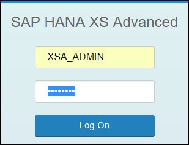
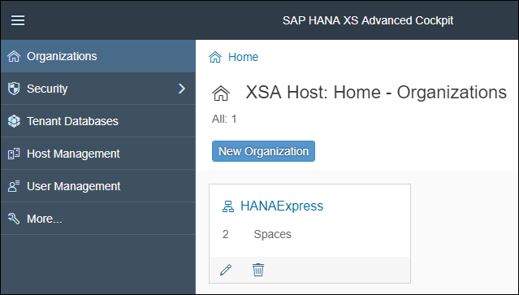
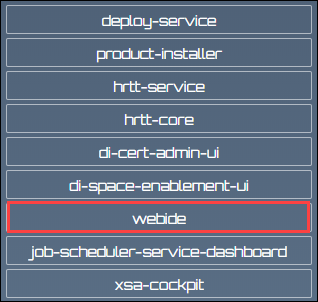
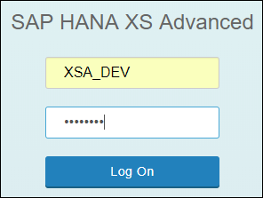
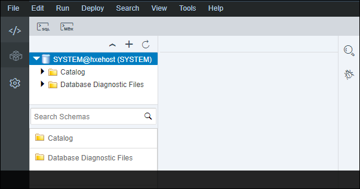
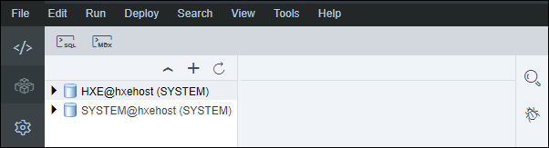
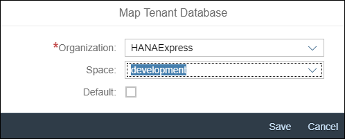

## Prerequisites
 - **Proficiency:** Beginner

## Details
### You will learn

- Which flavor and version of SAP HANA is needed to complete this tutorial series
- Complete required post-installation task
- Enable the builders for the development space
- Add a connection in the Database Explorer
- Enable the Script Server that allows the execution of `AFL`s

### Time to Complete
**20 Min**

[ACCORDION-BEGIN [Info: ](Which SAP HANA flavor and version?)]

In order to complete this tutorial series, you are recommended to use as a minimum version:

 - **SAP HANA, express edition 2.0 SPS03**

This version will allow you to complete all the steps thanks the availability of the SAP HANA Automated Predictive Library (APL).

As you may already know, SAP HANA, express edition comes in 2 different flavor, as we will leverage the SAP Web IDE to complete the execution of SQL and SAP HANA XSA development tasks, the one need here is:

 - **Server + XSA Applications**

You can check the [SAP HANA, express edition installation flowchart](https://www.sap.com/developer/topics/sap-hana-express.html#flowchart) to find all the installation detail.

If you haven't, you don't need to complete the installation of all optional packages as this will be described when needed.

[DONE]
[ACCORDION-END]

[ACCORDION-BEGIN [Step 1: ](Setup the XS CLI API endpoint and login)]

In order to complete the next steps, you will be using the XS CLI client which is locally installed with your SAP HANA 2.0, express edition instance.

However, you may prefer to run commands remotely (from your local desktop for example).

To do so, you can complete the [XS CLI Client installation](https://www.sap.com/developer/tutorials/hxe-ua-install-xs-xli-client.html)

Execute the following series of XS CLI commands.

#### Set the API endpoint:

```shell
xs api https://hxehost:39030
```

> ### **Note:** if you receive the following error when executing the previous command:
>&nbsp;
```
FAILED: SSL connection error (supposedly untrusted connection, check the certificates)
```
>As describe in the [XS CLI Client installation](https://www.sap.com/developer/tutorials/hxe-ua-install-xs-xli-client.html) tutorial, you will need to use the SSL certificate with the `cacert` command switch, and issue a command like this instead:
>&nbsp;
```shell
xs api https://hxehost:39030 -cacert <path>/default.root.crt.pem
```
Where the default path for the certificate on the server is:
>
 - `/hana/shared/HXE/xs/controller_data/controller/ssl-pub/router`
>

#### Login to your organization and space:

```shell
xs login -o HANAExpress -s SAP -u XSA_ADMIN
```

> ### **Note:**
>You will be prompted for the ***`XSA_ADMIN`*** password (which is initially set to the master password during the first boot initialization)
>&nbsp;
>You can get the list of organizations using the following command **`xs orgs`** and **`xs spaces`** to get the list of spaces.


[DONE]
[ACCORDION-END]

[ACCORDION-BEGIN [Step 2: ](Verify the builders deployment)]

On some installations, the builders are not deployed in the ***development*** space which will prevent you from successfully building and running your projects in the SAP Web IDE.

Before deploying the builder, you will need to start the `di-space-enablement-ui` application which is stopped be default.

#### Get the current status:

```shell
xs app di-space-enablement-ui
```

The output should look like this:

```
Showing status and information about "di-space-enablement-ui"
  name:              di-space-enablement-ui
  requested state:   STOPPED
  instances:         1
  memory:            16.0 MB
  disk:              <unlimited>
  buildpack:         ***************
  urls:              https://hxehost:51024
```

#### Start the `di-space-enablement-ui` app:

Run the following command if the ***requested state*** is ***`STOPPED`*** for the `di-space-enablement-ui` app.

```shell
xs start di-space-enablement-ui
```

The output should look like this:

```
Starting app "di-space-enablement-ui"...
 Starting instances with the default OS user
 1 of 1 instances running

Showing status and information about "di-space-enablement-ui"
  name:              di-space-enablement-ui
  requested state:   STARTED
  instances:         1
  memory:            16.0 MB
  disk:              <unlimited>
  buildpack:         ***************
  urls:              https://hxehost:51024

Instances of droplet 1 created at Apr 4, 2018 5:36:52 PM
index   created                  state     os user
----------------------------------------------------
0       Jun 4, 2018 1:35:36 PM   RUNNING   <not set>
```

#### Check the builder status:

You can now access the application ***`urls`*** displayed in the previous command output (i.e. from the output example: `https://hxehost:51024`).

Login using the **`XSA_ADMIN`** credentials for which the initial password is the master password.



Verify that the status for the ***development*** space is **Enabled**. If not click, on **Enable**.


#### Stop the `di-space-enablement-ui` app:

```shell
xs stop di-space-enablement-ui
```

Based on the outputs returned previously, provide an answer to the question below then click on **Validate**.

[VALIDATE_1]
[ACCORDION-END]

[ACCORDION-BEGIN [Step 3: ](Rescale processes)]

In order to ensure a smooth experience when your environment is limited in term of memory resources, you can execute the following commands.

To do so, you can stop certain services and scale some processes.

#### Stop services:

The following services can be stopped as you won't leverage them in this tutorial series.

```shell
xs stop sap-portal-static-resources

xs stop cockpit-telemetry-svc
```

#### Stop services:

The following services can be scaled up to ensure a better user experience during this tutorial series.

```shell
xs scale di-runner -m 512M
xs scale di-core -m 512M
```

#### Run the memory collector script:

The following script can be executed at any time to collected back unused process memory.

```shell
/usr/sap/HXE/home/bin/hxe_gc.sh
```

[DONE]
[ACCORDION-END]

[ACCORDION-BEGIN [Step 4: ](Create a XSA UAA service)]

You will be using the development space to complete this tutorial series, which doesn't have a XSA UAA (User Account and Authentication).

You can find more details about **Maintaining Application Security in XS Advanced** in the [documentation](https://help.sap.com/viewer/4505d0bdaf4948449b7f7379d24d0f0d/latest/en-US/35d910ee7c7a445a950b6aad989a5a26.html).

First, you will need to switch to the **development** space:

```shell
xs target -s development
```

Once completed, you can create the XSA UAA service named **`dev-uaa`**:

```shell
xs create-service xsuaa space dev-uaa
```

And finally, switch back to the **SAP** space:

```shell
xs target -s SAP
```

[DONE]
[ACCORDION-END]

[ACCORDION-BEGIN [Step 5: ](Access the XSA Controller page)]

You can now access the XSA Controller page at the following URL:

- `https://hxehost:39030`

The above URL assumes that you are using the default instance number **90**.

It is also recommended to register the host name in your host file and use it the URL.



Bookmark the page, as it will be referenced in later steps or tutorials.

[DONE]
[ACCORDION-END]

[ACCORDION-BEGIN [Step 6: ](Access the SAP HANA XS Advanced Cockpit)]

From the XSA Controller page, access the **SAP HANA XS Advanced Cockpit***.



Login using the **`XSA_ADMIN`** credentials for which the initial password is the master password (you may need to logout first).



Once logged in, you will get access to the SAP HANA XS Advanced Cockpit:


As a reminder the default URL for the SAP HANA XS Advanced Cockpit is:

 - `https://hxehost:51036`

[DONE]
[ACCORDION-END]

[ACCORDION-BEGIN [Step 7: ](Update the XSA tenant configuration)]

By default, the *SYSTEMDB* will be used when deploying or running your XSA application using HDI containers.

However, in order to leverage the SAP HANA AFL libraries, you will need to enable the *Script Server*, which is not possible on the *SYSTEMDB*.

Therefore, you will need to map the HXE tenant to your development space.

On the left side bar, click on **Tenant Databases**.


As you can notice, by default, the HXE tenant is not enabled for XSA and is not mapped for the development space.



Click on the **Enable** icon  for the **HXE** tenant.

Provide the SYSTEM user credentials for the HXE tenant (***Tenant Database***) and the SYSTEMDB (***Physical Database***).



Wait for the activation process to complete.

Click on the **Map** icon  for the **HXE** tenant.

Set the following details:

Property     | Value
-------------|---------------
Organization | `HANAExpress`
Space        | `development`



Click on **Save**.

Once completed, the configuration should look like this:


[DONE]
[ACCORDION-END]

[ACCORDION-BEGIN [Step 8: ](Access the Web IDE)]

From the XSA Controller page, access the ***Web IDE***.


Login using the **`XSA_DEV`** credentials for which the initial password is the master password (you may need to logout first).


Once logged in, you will get access to the Web IDE:


As a reminder the default URL for the Web IDE is:

 - `https://hxehost:53075`

[DONE]
[ACCORDION-END]

[ACCORDION-BEGIN [Step 9: ](Add the database connection)]

On the left side bar, click on the Database Explorer icon  icon.


#### Add the SYSTEMDB connection

If you don't have any database listed you will receive the following popup message:


Click on **Yes**.

If not, then use the ***Add a database to the Database Explorer*** icon .

Select **SAP HANA Database (Multitenant)** as ***Database Type***.

Enter the HXE host name and instance number (default value is 90).

Select **System Database**.

Enter the **SYSTEM** user name and password (which is initially set to the master password during the first boot initialization).

You can also check the ***Save user and password*** to avoid entering credentials in the future.


Click on **OK**.


#### Add the HXE tenant connection

Use the ***Add a database to the Database Explorer*** icon .

Select **SAP HANA Database (Multitenant)** as ***Database Type***.

Enter the HXE host name and instance number (default value is 90).

Select **Tenant Database**.

Enter the **SYSTEM** user name and password (which is initially set to the master password during the first boot initialization).

You can also check the ***Save user and password*** to avoid entering credentials in the future.

Click on **OK**.


[DONE]
[ACCORDION-END]

[ACCORDION-BEGIN [Step 10: ](Check the Script Server)]

The **Script Server** is an auxiliary service that is required to execute **Application Function Libraries** (**AFL**).

For example, this applies to the SAP HANA AFL component like the ***SAP HANA Predictive Analysis Library*** (PAL) and other similar libraries.

By default, the Script Server is not activated on the **HXE** tenant.

Select **HXE** tenant connection in the ***Database Explorer*** panel, then click on the **Open SQL Console** icon  (or press ***CTRL+ALT+C***).

Paste the following SQL statement in the console and click on the ***Run*** icon  icon:

```sql
SELECT SERVICE_NAME, PORT, ACTIVE_STATUS FROM SYS.M_SERVICES ORDER BY 1;
```

If no rows is returned for the `scriptserver`, then it means that the **Script Server** is not enabled on the **HXE** tenant.

To enable it, you will have to run the following SQL statement on the  **SYSTEMDB**.

Select **SYSTEMDB** connection in the ***Database Explorer*** panel, then click on the **Open SQL Console** icon  (or press ***CTRL+ALT+C***).

Paste the following SQL statement in the console and click on the ***Run*** icon  icon:

```sql
ALTER DATABASE HXE ADD 'scriptserver';
```

Now, you can now verify that the service is started using the first SQL statement.

The result should return a list of service names, their associated port numbers and their statuses including an entry for the `scriptserver`.

Provide an answer to the question below then click on **Validate**.

[VALIDATE_2]
[ACCORDION-END]
