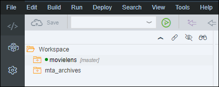
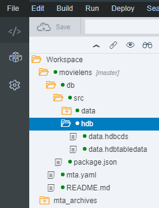
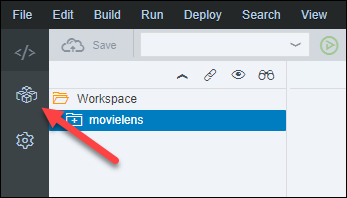
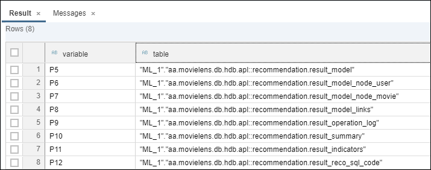

## Prerequisites
 - **Proficiency:** Beginner

## Details
### You will learn

- Understand the basics about the SAP HANA Automated Predictive Library
- How to call SAP HANA Automated Predictive Library functions from an XSA application using an HDI container
- Identify which algorithm options are available for recommendation engines
- How to use SAP HANA APL Recommendation algorithm from an XSA application using an HDI container

[ACCORDION-BEGIN [Info: ](SAP HANA Automated Predictive Library)]

The ***SAP HANA Automated Predictive Library*** (APL) is an ***Application Function Library*** (AFL) which lets you use the data mining capabilities of the ***SAP Predictive Analytics*** automated analytics engine on your SAP HANA stored data.

With the APL, you can create the following types of models to answer your business questions:

- Classification/Regression models
- Clustering models
- Time series analysis models
- Recommendation models
- Social network analysis models

For more details about the SAP HANA APL function, check the online <a href="https://help.sap.com/viewer/cb31bd99d09747089754a0ba75067ed2/latest/en-US/59b79cbb6beb4607875fa3fe116a8eef.html" target="new">documentation</a>.

[DONE]
[ACCORDION-END]

[ACCORDION-BEGIN [Info: ](Calling AFL functions from HDI containers)]

In order to use any ***SAP HANA APL*** functions, ultimately an AFL wrapper must be created and then invoked.

Creating and invoking the AFL wrapper is performed by executing ***SAP HANA `SQLScript`***.

Other database objects also need to be created, such as table types or signature table.

There are two techniques for calling APL functions, the ***direct technique*** and the ***procedure technique***.

However, since you are working in an **HDI container** with CDS artifacts, you will be creating an ***AFLLANG procedures*** artefacts to surface the APL functions and call them with table types or signature table defined using design time artifacts, like CDS Entities and others.

For more details, you can check the [AFL Language Procedures](https://help.sap.com/viewer/4505d0bdaf4948449b7f7379d24d0f0d/latest/en-US/7f630904dfe045beb114a6c25896649f.html) documentation.

[DONE]
[ACCORDION-END]

[ACCORDION-BEGIN [Info: ](Recommendation engines with SAP HANA APL)]

As stated previously, the ***SAP HANA Automated Predictive Library*** (APL) uses the data mining capabilities provided by the ***SAP Predictive Analytics*** automated analytics engine.

SAP HANA APL provides a ***Recommendation*** function that can address both the collaborative filtering and content-based filtering scenarios.

Using ***classical*** classification models is also a potential option but would require first a different dataset structure, but also building as many models as items (movies) to address the collaborative filtering scenario and an even larger number of models for the content-based filtering scenario (movie count square).

In the rating dataset, we have about 100,000 ratings with 671 distinct users and more than 9,000 distinct movies.

This is why the ***SAP HANA APL Recommendation*** algorithm is probably the most appropriate here.

This algorithm uses a ***link analysis*** approach to translate your transactional data in the form of a graph, made of nodes and links.

The nodes are the actors/items within a network (individuals, customers, products, organizations…). The links are the relations, or social interactions, between them (transactions, visits, clicks, calls).

These links can be directed or undirected depending on the type of relation, symmetric or not. So in its simplest form, a social network is a map of all the relevant links between the nodes being studied.

Social networks can be used to represent many kinds of networks: informational (web, blogs), communicational (phone calls, emails), social (social networking, illness), technological (power grid, roads, internet router), financial (transactions), etc.

For more information please refer to the online <a href="https://help.sap.com/viewer/cb31bd99d09747089754a0ba75067ed2/latest/en-US/2ee67eddf0fb47b3a593887fdfa555df.html" target="new">documentation</a>.

[DONE]
[ACCORDION-END]

[ACCORDION-BEGIN [Info: ](SAP HANA APL Recommendation function)]

The **SAP HANA APL** function that you will be using is:

- <a href="https://help.sap.com/viewer/cb31bd99d09747089754a0ba75067ed2/latest/en-US/0bc196486e4047c2a7671ccf529167b6.html" target="new"><b>Create Recommendation Model and Train</b></a>

The ***Recommendation*** function provides multiple configuration options like:

Name                            | Description
--------------------------------|------------------------------
**max top nodes**               | Prevent additional links to be loaded when a threshold is reached on a node
**best sellers**                | Identifies nodes with too many links and exclude them from the results unless explicitly requested
**minimum support**             | The minimum number of times a pair of items are linked to the same user to create a rule (default value is 2)
**minimum confidence**          | The minimum percentage of times a rule between 2 items (a movie being rated by 2 or more users) was found in the total set of transactions (default value is 5%)
**minimum predictive power**    | The minimum quality indicator for a candidate rules
**weight column**               | Allows to apply a strength in the transaction
**weight rule**                 | Either Support (the number of links found for each node) or the Independence Ratio (2 events are independent if the probability that both events occur equals the probability of event A times the probability of event B. 1 indicates completely independent events)

By default, the function will identify **mega-hubs** (using the 4 ***sigma*** rule), identify **best sellers**, and apply pre & post filters to address your needs.

> ### **Note**:
>In this scenario, we are not considering the rating notation itself (between 0.5 to 5) to build the output list, which would help a list of movies that both users rated the same way.
>&nbsp;
>To achieve that, we would need to transform the data structure, and use the movie as one node (entity type) and the user associated with the rating notation as the second node (entity type), then use the same algorithm.
>&nbsp;
>And finally instead of using the user as the entry point we would use the user and the rating notation as the entry point.
>&nbsp;
>If you want to try out this scenario, you can build a view where the user id and the rating are concatenated into one column that will be used as the second entity type.

[DONE]
[ACCORDION-END]

[ACCORDION-BEGIN [Pre-requisite: ](Install SAP HANA APL package)]

If not done yet, you will need to complete the [SAP HANA Automated Predictive Library installation for SAP HANA, express edition](https://www.sap.com/developer/tutorials/hxe-ua-apl-binary.html).

The installation will trigger a restart of your SAP HANA instance, so make sure to save your current work before.

Once the SAP HANA Automated Predictive Library installation is completed, you will need to wait a few minutes for all services to be back online and proceed with the next step.

Usually, you should add the **`APL_EXECUTE`** role to your user, however, this is not required when using an HDI container:

```
call _SYS_REPO.GRANT_ACTIVATED_ROLE ('sap.pa.apl.base.roles::APL_EXECUTE','ML_USER');
```

[DONE]
[ACCORDION-END]

[ACCORDION-BEGIN [Step 1: ](Open the Web IDE)]

Open the Web IDE, and login using the **`XSA_DEV`** credentials.

Switch to the ***Development*** perspective using the  icon.



As a reminder the default URL for the Web IDE is:

 - `https://hxehost:53075`

A link to the Web IDE can also be found on the ***XSA Controller page*** at:

- `https://hxehost:39030`

[DONE]
[ACCORDION-END]

[ACCORDION-BEGIN [Step 2: ](Create the CDS Entity & Table Type Artifacts)]

In order to execute the APL algorithm, a series of table types and entities will be required to process the AFL calls.

These table types maps the input and output table structure for the <a href="https://help.sap.com/viewer/cb31bd99d09747089754a0ba75067ed2/latest/en-US/0bc196486e4047c2a7671ccf529167b6.html" target="new"><b>Create Recommendation Model and Train</b></a> function signature.

Some of these table types are standard whereas some are bound to the ***`MovieLens`*** dataset structure.

In the left side panel, expand the **`movielens/db/src/hdb`** tree node.



Right click on the **`hdb`** folder and select **New > Folder**.

Enter **`apl`** as the folder name, then click on **OK**.

Right click on the **`apl`** folder node from the tree, and select **New > File**.

Enter **`recommendation.hdbcds`** as the file name, then click on **OK**.

This is the full path of the created file:

```
movielens/db/src/hdb/apl/recommendation.hdbcds
```

Paste the following content:

```JavaScript
namespace aa.movielens.db.hdb.apl;

context recommendation {
    entity function_header {
        KEY   : String(50);
        VALUE : String(255);
    };

    table type tt_function_header {
        KEY   : String(50);
        VALUE : String(255);
    };

    entity operation_config {
        KEY   : String(1000);
        VALUE : String(5000);
    };

    table type tt_operation_config {
        KEY   : String(1000);
        VALUE : String(5000);
    };

    entity variable_descs {
        RANK          : Integer;
        NAME          : String(255);
        STORAGE       : String(10);
        VALUETYPE     : String(10);
        KEYLEVEL      : Integer;
        ORDERLEVEL    : Integer;
        MISSINGSTRING : String(255);
        GROUPNAME     : String(255);
        DESCRIPTION   : String(255);
    };

    table type tt_variable_descs {
        RANK          : Integer;
        NAME          : String(255);
        STORAGE       : String(10);
        VALUETYPE     : String(10);
        KEYLEVEL      : Integer;
        ORDERLEVEL    : Integer;
        MISSINGSTRING : String(255);
        GROUPNAME     : String(255);
        DESCRIPTION   : String(255);
    };

    entity model {
        NAME       : String(255);
        VERSION    : Integer;
        ID         : Integer;
        PARENTID   : Integer;
        ENUMFLAG   : Integer;
        PARAMNAME  : String(255);
        PARAMTYPE  : String(255);
        PARAMVALUE : String(255);
    };

    table type tt_model {
        NAME       : String(255);
        VERSION    : Integer;
        ID         : Integer;
        PARENTID   : Integer;
        ENUMFLAG   : Integer;
        PARAMNAME  : String(255);
        PARAMTYPE  : String(255);
        PARAMVALUE : String(255);
    };

    entity operation_log {
        OID       : String(50);
        TIMESTAMP : UTCTimestamp;
        LEVEL     : Integer;
        ORIGIN    : String(50);
        MESSAGE   : LargeString;
    };

    table type tt_operation_log {
        OID       : String(50);
        TIMESTAMP : UTCTimestamp;
        LEVEL     : Integer;
        ORIGIN    : String(50);
        MESSAGE   : LargeString;
    };

    entity summary {
        OID   : String(50);
        KEY   : String(100);
        VALUE : String(200);
    };

    table type tt_summary {
        OID   : String(50);
        KEY   : String(100);
        VALUE : String(200);
    };

    entity indicators {
        OID      : String(50);
        VARIABLE : String(255);
        TARGET   : String(255);
        KEY      : String(100);
        VALUE    : LargeString;
        DETAIL   : LargeString;
    };

    table type tt_indicators {
        OID      : String(50);
        VARIABLE : String(255);
        TARGET   : String(255);
        KEY      : String(100);
        VALUE    : LargeString;
        DETAIL   : LargeString;
    };
    table type tt_movielens_dataset {
        USERID    : Integer;
        MOVIEID   : Integer;
        RATING    : Double;
        TIMESTAMP : Integer;
    };

    entity model_node_user {
        NODE : Integer; // must be of the same SQL type as the User column (userId from rating here)
    };

    table type tt_model_node_user {
        NODE : Integer; // must be of the same SQL type as the User column (USERID here)
    };

    entity model_node_movie {
        NODE : Integer; // must be of the same SQL type as the Item column (movieId from rating  here)
    };

    table type tt_model_node_movie {
        NODE : Integer; // must be of the same SQL type as the Item column (MOVIEID here)
    };

    entity model_links {
        GRAPH_NAME     : String(255);
        WEIGHT         : Double;
        KXNODEFIRST    : Integer; // must be of the same SQL type as the User column (userId from rating  here)
        KXNODESECOND   : Integer; // must be of the same SQL type as the Item column (movieId from rating  here)
        KXNODESECOND_2 : Integer; // must be of the same SQL type as the Item column (movieId from rating  here)
    };

    table type tt_model_links {
        GRAPH_NAME     : String(255);
        WEIGHT         : Double;
        KXNODEFIRST    : Integer;     // must be of the same SQL type as the User column (USERID here)
        KXNODESECOND   : Integer;     // must be of the same SQL type as the Item column (MOVIEID here)
        KXNODESECOND_2 : Integer;     // must be of the same SQL type as the Item column (MOVIEID here)
    };

    entity model_sql_code {
        OID   : String(50);
        KEY   : String(100);
        VALUE : LargeString;
    };

    table type tt_model_sql_code {
        OID   : String(50);
        KEY   : String(100);
        VALUE : LargeString;
    };

    table type tt_movielens_collaborative_result {
        USERID  : Integer;
        RANK    : Integer64;
        MOVIEID : Integer;
        SCORE   : Double;
        TITLE   : String(255);
        GENRES  : String(255);
        IMDBID  : Integer;
        TMDBID  : Integer;
    };
    table type tt_movielens_contentbased_result {
        MOVIEID       : Integer;
        RANK          : Integer64;
        SIMILAR_MOVIE : Integer;
        SCORE         : Double;
        TITLE         : String(255);
        GENRES        : String(255);
        IMDBID        : Integer;
        TMDBID        : Integer;
    };
};
```

Save the file using the  icon from the menu.

[DONE]
[ACCORDION-END]

[ACCORDION-BEGIN [Step 3: ](Create the AFLLANG Procedure Artifact)]

Once the CDS artifacts are created for the entities and table types, you can now surface the AFL function using an AFLLANG procedure.

In the left side panel, expand the **`movielens/db/src/hdb/apl`** tree node.

Right click on the **`apl`** folder and select **New > Folder**.

Enter **`afllang`** as the folder name, then click on **OK**.

Right click on the **`afllang`** folder node from the tree, and select **New > File**.

Enter **`recommendation.hdbafllangprocedure`** as the file name, then click on **OK**.

This is the full path of the created file:

```
movielens/db/src/hdb/apl/afllang/recommendation.hdbafllangprocedure
```

Paste the following content:

```JSON
{
  "area" : "APL_AREA",
  "function" : "CREATE_RECO_MODEL_AND_TRAIN",
  "parameters" : [
    {"direction" : "IN",  "type" : "aa.movielens.db.hdb.apl::recommendation.tt_function_header"},
    {"direction" : "IN",  "type" : "aa.movielens.db.hdb.apl::recommendation.tt_operation_config"},
    {"direction" : "IN",  "type" : "aa.movielens.db.hdb.apl::recommendation.tt_variable_descs"},
    {"direction" : "IN",  "type" : "aa.movielens.db.hdb.apl::recommendation.tt_movielens_dataset"},
    {"direction" : "OUT", "type" : "aa.movielens.db.hdb.apl::recommendation.tt_model"},
    {"direction" : "OUT", "type" : "aa.movielens.db.hdb.apl::recommendation.tt_model_node_user"},
    {"direction" : "OUT", "type" : "aa.movielens.db.hdb.apl::recommendation.tt_model_node_movie"},
    {"direction" : "OUT", "type" : "aa.movielens.db.hdb.apl::recommendation.tt_model_links"},
    {"direction" : "OUT", "type" : "aa.movielens.db.hdb.apl::recommendation.tt_operation_log"},
    {"direction" : "OUT", "type" : "aa.movielens.db.hdb.apl::recommendation.tt_summary"},
    {"direction" : "OUT", "type" : "aa.movielens.db.hdb.apl::recommendation.tt_indicators"},
    {"direction" : "OUT", "type" : "aa.movielens.db.hdb.apl::recommendation.tt_model_sql_code"}
  ]
}
```

Save the file using the  icon from the menu.

[DONE]
[ACCORDION-END]

[ACCORDION-BEGIN [Step 4: ](Create the HDB SQL View Artifacts)]

In order to get ***recommendation*** results, you will need to create a SQL view that will leverage the output generated by the model.

The SQL code below is actually generated by the APL function itself as text in the result operation log table (with some minor changes).

As a reminder, the model used the ***Support*** as a result weight/score metric, that will be transformed into a ***confidence*** metric in the result view.

The view will also limit to the 5 top recommendations.

These views will be later used to read the results from an HTML module via an OData service in your XSA project.

#### Collaborative filtering results

Right click on the **`apl`** folder and select **New > Folder**.

Enter **`views`** as the folder name, then click on **OK**.

Right click on the **`views`** folder node from the tree, and select **New > File**.

Enter **`recommendation_collaborative.hdbview`** as the file name, then click on **OK**.

This is the full path of the created file:

```
movielens/db/src/hdb/apl/views/recommendation_collaborative.hdbview
```

Paste the following content:

```SQL
view "aa.movielens.db.hdb.apl.views::recommendation_collaborative" as
select
  userid, rank, t1.movieid, score, title, genres, imdbid, tmdbid
from (
  select
      t1.userid
    , row_number() over(partition by t1.userid order by t1.score desc, t1.consequent desc ) as rank
    , t1.consequent as movieid
    , t1.score      as score
  from (
      select
          t1.userid, t1.consequent, max(t1.score)  as score
      from (
        select
            t1.userid
          , t1.consequent
          , t1.support / ( (coalesce (t2_1.count_antecedent,0) + coalesce (t2_2.count_antecedent,0) ) )  as score -- confidence calculation
        from (
            select
                t1.userid
              , t1.antecedent , t1.consequent
              , t1.support
            from (
              select
                  spacein.userid
                , rules.kxnodesecond   as antecedent
                , rules.kxnodesecond_2 as consequent
                , rules.weight         as support
              from "aa.movielens.db.hdb::data.ratings" spacein
              left outer join (select * from "aa.movielens.db.hdb.apl::recommendation.model_links" where graph_name = 'Transactions') products on (products.kxnodefirst  = spacein.userid)
              left outer join (select * from "aa.movielens.db.hdb.apl::recommendation.model_links" where graph_name = 'Item'        ) rules    on (products.kxnodesecond = rules.kxnodesecond)
              left outer join (select * from "aa.movielens.db.hdb.apl::recommendation.model_links" where graph_name = 'Transactions') notin    on (rules.kxnodesecond_2  = notin.kxnodesecond) and (notin.kxnodefirst = spacein.userid)
                where rules.kxnodesecond is not null  and notin.kxnodesecond is null
            ) t1
            union all
            select
                t1.userid
              , t1.antecedent , t1.consequent
              , t1.support
            from (
              select
                  spacein.userid
                , rules.kxnodesecond_2 as antecedent
                , rules.kxnodesecond   as consequent
                , rules.weight         as support
              from "aa.movielens.db.hdb::data.ratings" spacein
              left outer join (select * from "aa.movielens.db.hdb.apl::recommendation.model_links" where graph_name = 'Transactions') products on (products.kxnodefirst  = spacein.userid)
              left outer join (select * from "aa.movielens.db.hdb.apl::recommendation.model_links" where graph_name = 'Item'        ) rules    on (products.kxnodesecond = rules.kxnodesecond_2)
              left outer join (select * from "aa.movielens.db.hdb.apl::recommendation.model_links" where graph_name = 'Transactions') notin    on (rules.kxnodesecond    = notin.kxnodesecond) and (notin.kxnodefirst = spacein.userid)
              where rules.kxnodesecond_2 is not null and notin.kxnodesecond is null
            ) t1
        ) t1
        left outer join (select kxnodesecond   as antecedent, cast(count(*) as float) as count_antecedent from "aa.movielens.db.hdb.apl::recommendation.model_links" where graph_name ='Transactions' group by kxnodesecond  ) t2_1 on (t1.antecedent = t2_1.antecedent)
        left outer join (select kxnodesecond_2 as antecedent, cast(count(*) as float) as count_antecedent from "aa.movielens.db.hdb.apl::recommendation.model_links" where graph_name ='Transactions' group by kxnodesecond_2) t2_2 on (t1.antecedent = t2_2.antecedent)
      ) t1 group by t1.userid,  t1.consequent
  ) t1
) t1
left outer join "aa.movielens.db.hdb::data.movies" movies on movies.movieid = t1.movieid
left outer join "aa.movielens.db.hdb::data.links"  links  on links.movieid  = t1.movieid
where rank <= 5;
```

Save the file using the  icon from the menu.

As you can notice, the view use both the model generated links (**`aa.movielens.db.hdb.apl::recommendation.model_links`**) and the initial dataset (**`aa.movielens.db.hdb::data.ratings`**).

Off course, this model is for demonstration purpose and very specific to the initial purpose of this tutorial series, which is to give you a quick tour of the algorithm and may not be applicable as-is to other use cases or dataset.

#### Content-based filtering results

To address the content-based filtering scenario with the rating dataset, your goal is to provide a list of similar movies based on the number of users who rated the same movies together.

Here, you will assume that the rating action of a single movie by multiple users is a proof of similarity.

For this scenario, you won't actually need to build another model as the previous one already provides the links between movies based on user ratings.

Right click on the **`views`** folder node from the tree, and select **New > File**.

Enter **`recommendation_contentbased.hdbview`** as the file name, then click on **OK**.

This is the full path of the created file:

```
movielens/db/src/hdb/apl/views/recommendation_contentbased.hdbview
```

Paste the following content:

```SQL
view "aa.movielens.db.hdb.apl.views::recommendation_contentbased" as
select
  t1.movieid, rank, similar_movie, score, title, genres, imdbid, tmdbid
from (
  select
      t1.movieid
    , row_number() over(partition by t1.movieid order by t1.score desc, t1.consequent desc ) as rank
    , t1.consequent as similar_movie
    , t1.score
  from (
      select
          t1.movieid
        , t1.consequent
        , max(t1.score) as score
      from (
        select
            t1.movieid
          , t1.consequent
          , t1.support / (coalesce (t2_1.count_antecedent,0) + coalesce (t2_2.count_antecedent,0) ) as score
        from (
            select
                nodes.node as movieid
              , rules.kxnodesecond   as antecedent
              , rules.kxnodesecond_2 as consequent
              , rules.weight as support
            from
              "aa.movielens.db.hdb.apl::recommendation.model_node_movie" nodes
            left outer join (select * from "aa.movielens.db.hdb.apl::recommendation.model_links" where graph_name = 'Item' ) rules    on (nodes.node = rules.kxnodesecond)
              where rules.kxnodesecond_2 is not null
            union all
            select
                nodes.node as movieid
              , rules.kxnodesecond_2 as antecedent
              , rules.kxnodesecond   as consequent
              , rules.weight as support
            from
              "aa.movielens.db.hdb.apl::recommendation.model_node_movie" nodes
            left outer join (select * from "aa.movielens.db.hdb.apl::recommendation.model_links" where graph_name = 'Item' ) rules    on (nodes.node = rules.kxnodesecond_2)
            where rules.kxnodesecond is not null
        ) t1
        left outer join (select kxnodesecond   as antecedent, cast(count(*) as float) as count_antecedent from "aa.movielens.db.hdb.apl::recommendation.model_links" where graph_name ='Transactions' group by kxnodesecond  ) t2_1 on (t1.antecedent = t2_1.antecedent)
        left outer join (select kxnodesecond_2 as antecedent, cast(count(*) as float) as count_antecedent from "aa.movielens.db.hdb.apl::recommendation.model_links" where graph_name ='Transactions' group by kxnodesecond_2) t2_2 on (t1.antecedent = t2_2.antecedent)
      ) t1 group by t1.movieid, t1.consequent
  ) t1
) t1
left outer join "aa.movielens.db.hdb::data.movies" movies on movies.movieid = t1.similar_movie
left outer join "aa.movielens.db.hdb::data.links"  links  on links.movieid  = t1.similar_movie
where rank <= 5;
```

Save the file using the  icon from the menu.

[DONE]
[ACCORDION-END]

[ACCORDION-BEGIN [Step 5: ](Build the SAP HANA Database Module)]

Right click on the **`db`** folder and select **Build**.


The console should display at the end the following message:

```
(Builder) Build of /movielens/db completed successfully.
```

[DONE]
[ACCORDION-END]

[ACCORDION-BEGIN [Step 6: ](Run Recommendation APL function as SQL)]

When executed, the following code will generate a ***Recommendation*** model linking `userId` & `moveId` from the `ratings` CDS Entity.

The results will be stored in the **`"aa.movielens.db.hdb.apl::recommendation.model_links"`** table.

Switch to the ***Database Explorer*** perspective using the  icon.



Select **HDI Container** created previously with a name starting with ***`XSA_DEV`***.

Open a new **SQL Console** using the  icon.

Paste the following content in the console, and use the execute icon  from the menu.

```SQL
-- Insert operation parameters
truncate table "aa.movielens.db.hdb.apl::recommendation.function_header";
insert into "aa.movielens.db.hdb.apl::recommendation.function_header" values ('Oid', '#42');
insert into "aa.movielens.db.hdb.apl::recommendation.function_header" values ('LogLevel', '8');

truncate table "aa.movielens.db.hdb.apl::recommendation.operation_config";
insert into "aa.movielens.db.hdb.apl::recommendation.operation_config" values ('APL/ModelType'  , 'recommendation');
insert into "aa.movielens.db.hdb.apl::recommendation.operation_config" values ('APL/User'       , 'USERID'        ); -- mandatory
insert into "aa.movielens.db.hdb.apl::recommendation.operation_config" values ('APL/Item'       , 'MOVIEID'       ); -- mandatory
insert into "aa.movielens.db.hdb.apl::recommendation.operation_config" values ('APL/RuleWeight' , 'Support'       );

-- Clear other tables content
truncate table "aa.movielens.db.hdb.apl::recommendation.variable_descs";
truncate table "aa.movielens.db.hdb.apl::recommendation.operation_log";
truncate table "aa.movielens.db.hdb.apl::recommendation.summary";
truncate table "aa.movielens.db.hdb.apl::recommendation.indicators";

truncate table "aa.movielens.db.hdb.apl::recommendation.model";
truncate table "aa.movielens.db.hdb.apl::recommendation.model_node_user";
truncate table "aa.movielens.db.hdb.apl::recommendation.model_node_movie";
truncate table "aa.movielens.db.hdb.apl::recommendation.model_links";
truncate table "aa.movielens.db.hdb.apl::recommendation.model_sql_code";

call "aa.movielens.db.hdb.apl.afllang::recommendation"(
  "aa.movielens.db.hdb.apl::recommendation.function_header",
  "aa.movielens.db.hdb.apl::recommendation.operation_config",
  "aa.movielens.db.hdb.apl::recommendation.variable_descs",
  "aa.movielens.db.hdb::data.ratings",
  "aa.movielens.db.hdb.apl::recommendation.model",
  "aa.movielens.db.hdb.apl::recommendation.model_node_user",
  "aa.movielens.db.hdb.apl::recommendation.model_node_movie",
  "aa.movielens.db.hdb.apl::recommendation.model_links",
  "aa.movielens.db.hdb.apl::recommendation.operation_log",
  "aa.movielens.db.hdb.apl::recommendation.summary",
  "aa.movielens.db.hdb.apl::recommendation.indicators",
  "aa.movielens.db.hdb.apl::recommendation.model_sql_code"
) with overview;
```

For every function calls, a series of logs and summary data will be provided along with the results as displayed in the result pane:



- The operation log:

When performing an APL operation, especially training or applying a model, the Automated Analytics engine produces status/warning/error messages.

These messages are returned from an APL function through an output database table.

```sql
select * from "aa.movielens.db.hdb.apl::recommendation.operation_log";
```

- The summary:

When training or applying a model, debriefing information related to the operation is produced.

This is known as the summary. This information is a set of indicators, provided as string pairs { KEY, VALUE }.

```sql
select * from "aa.movielens.db.hdb.apl::recommendation.summary";
```

- The indicators:

When training, testing or querying a model, it's possible to retrieve variable indicators (i.e. variable statistics).

For each variable, a collection of indicators may be retrieved. These indicators are described using the following attributes: { variable name, indicator name, indicator value, indicator detail (when applicable) }.

Indicators are returned from an APL function through an output database table. The output table contains estimator indicators for regression models, to help plotting the regression curve.

Even if this output is not applicable for a recommendation mode, here is the SQL to check the output:

```sql
select * from "aa.movielens.db.hdb.apl::recommendation.indicators";
```

- The operation result log:

When performing some of the APL operation, a result might be returned in the operation result table. In the recommendation scenario, the returned result is the SQL to extract results from the links table.

```sql
select * from "aa.movielens.db.hdb.apl::recommendation.reco_sql_code";
```

[DONE]
[ACCORDION-END]

[ACCORDION-BEGIN [Step 7: ](Validate the collaborative filtering results)]

Let's verify how many users will actually get recommendations using the following SQL:

```SQL
select reco_count, count(1) as user_count
from (
  select userid, max(rank) as reco_count
  from "aa.movielens.db.hdb.apl.views::recommendation_collaborative"
  group by userid
) group by reco_count order by 1 desc;
```

Let's verify how many distinct movies will actually get recommended to a user (part of the top 5 scores) using the following SQL:

```SQL
select
    count(1) as movie_count
  , count(1) * 100 / (select count(1) as cnt from "aa.movielens.db.hdb::data.movies") as movie_ratio
from (
  select movieid
  from "aa.movielens.db.hdb.apl.views::recommendation_collaborative"
  group by movieid
);
```

Let's verify how many distinct movies will potentially get recommended to a user (not just the top 5 scores) using the following SQL:

```SQL
select
    count(1) as movie_count
  , count(1) * 100 / (select count(1) as cnt from "aa.movielens.db.hdb::data.movies") as movie_ratio
from (
    select movieid
    from (
      select kxnodesecond   as movieid from "aa.movielens.db.hdb.apl::recommendation.model_links" where graph_name = 'Item' group by  kxnodesecond
      union all
      select kxnodesecond_2 as movieid from "aa.movielens.db.hdb.apl::recommendation.model_links" where graph_name = 'Item' group by  kxnodesecond_2
    ) group by movieid
);
```

Based on the last result, you can conclude that:

 - all 671 users will receive the requested 5 recommendations
 - only about 2% of the movies (181 out of the 9,125) are in the top 5 lists
 - only about 13% of the movies (1176 out of the 9,125) will get potentially recommended

Provide an answer to the question below then click on **Validate**.

[VALIDATE_1]
[ACCORDION-END]

[ACCORDION-BEGIN [Step 8: ](Validate the content-based filtering results)]

Let's verify how many movies will actually get recommendations using the following SQL:

```SQL
select reco_count, count(1) as movie_count
from (
  select movieid, max(rank) as reco_count
  from "aa.movielens.db.hdb.apl.views::recommendation_contentbased"
  group by movieid
) group by reco_count;
```

Let's verify how many distinct movies will actually get recommended to a user (part of the top 5 scores) using the following SQL:

```SQL
select
    count(1) as movie_count
  , count(1) * 100 / (select count(1) as cnt from "aa.movielens.db.hdb::data.movies" ) as movie_ratio
from (
  select movieid
  from "aa.movielens.db.hdb.apl.views::recommendation_contentbased"
  group by movieid
);
```

Only 1050 movies will receive the requested 5 recommendations out of the 1176 movies that will receive at least one recommendations.

Let's verify how many rating does the movies with no recommendation have using the following SQL:

```SQL
select rating_count, count(1) as movie_count
from (
  select ratings.movieid, count(1) as rating_count
  from "aa.movielens.db.hdb::data.ratings" ratings
  left outer join (
    select movieid
    from (
      select movieid
      from (
        select kxnodesecond   as movieid from "aa.movielens.db.hdb.apl::recommendation.model_links" where graph_name = 'Item' group by  kxnodesecond
        union all
        select kxnodesecond_2 as movieid from "aa.movielens.db.hdb.apl::recommendation.model_links" where graph_name = 'Item' group by  kxnodesecond_2
      ) group by movieid
    )
  ) t1 on (ratings.movieid = t1.movieid)
  where t1.movieid is null
  group by ratings.movieid
) group by rating_count;
```

As you can see, the movies with no recommendations have all less than 24 ratings, and this list include the 3063 movies with only one rating and the 1202 with only 2 ratings.

Provide an answer to the question below then click on **Validate**.

[VALIDATE_2]
[ACCORDION-END]

[ACCORDION-BEGIN [Step 9: ](Commit your changes)]

On the icon bar located on the right side of the Web IDE, click on the **Git Pane** icon .

Click on **Stage All**, enter a commit comment, then click on **Commit and Push > origin master**.

[DONE]
[ACCORDION-END]
